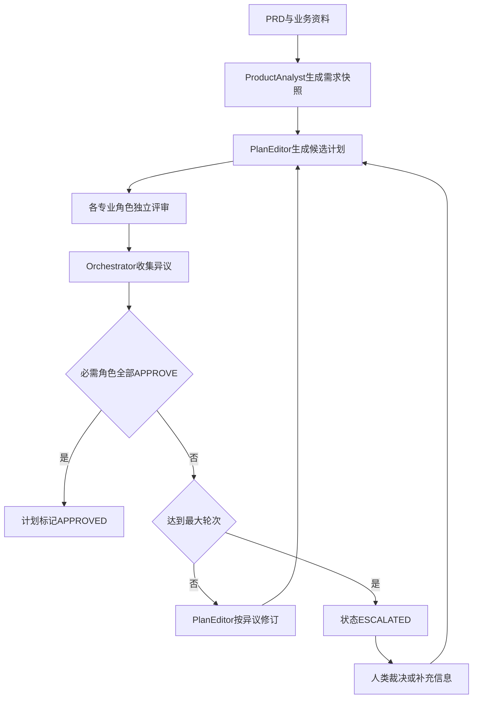
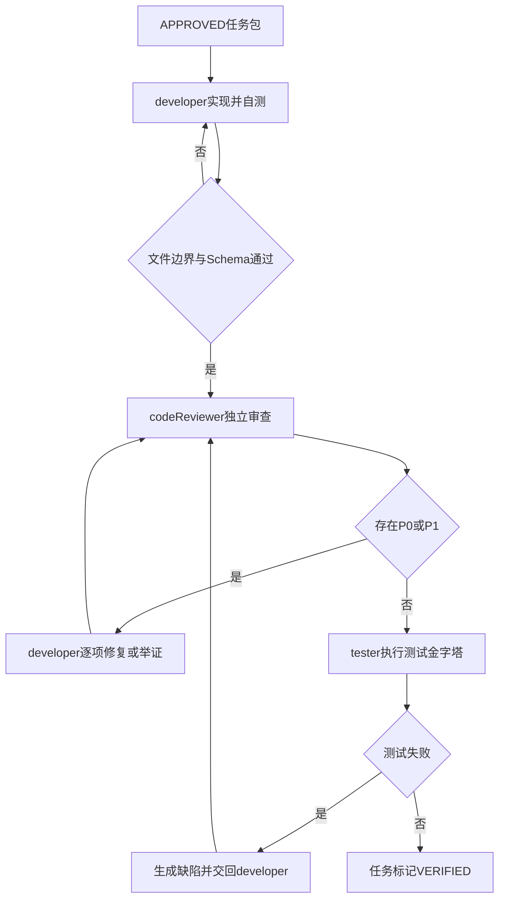

# AI 驱动的软件工程架构

> 状态：架构规范草案
>
> 范围：工具中立，可映射到 Cursor、Claude Code、Codex 或其他支持多 Agent 的运行时
>
> 原始设想：保留于 [`base_design.md`](./base_design.md)，本文是在其基础上的结构化增强版

## 1. 目标与原则

本架构的目标不是让一个 AI 完成整个项目，而是建立一条可追踪、可并行、可审计、可回滚的软件交付流水线。

核心原则：

1. **文档是协作协议**：Agent 之间只通过版本化制品交接，不依赖隐含聊天上下文。
2. **角色职责单一**：分析、规划、开发、审查、测试与学习由不同角色负责。
3. **规划先于编码**：规划委员会全员通过后，任务才可进入开发。
4. **并行必须可证明安全**：只有依赖满足、写集无冲突的任务才能并行。
5. **开发与审查相互独立**：`developer` 不得兼任自己的 `codeReviewer`。
6. **所有结论可追踪**：需求、决策、任务、代码、审查、测试和发布均使用稳定 ID 关联。
7. **失败先记录，后晋升知识**：单次失败不能直接污染规则库。
8. **人类拥有最终决策权**：Agent 无法达成一致时必须升级，不得伪造共识。

## 2. 总体分层

```text
project/
├── product/
│   ├── prd/
│   ├── requirements/
│   ├── business-rules/
│   ├── user-stories/
│   ├── changelog/
│   └── glossary.md
├── design/
│   ├── prototype/
│   ├── ui-spec/
│   ├── components/
│   ├── tokens/
│   ├── assets/
│   └── decisions/
├── planning/
│   ├── proposals/
│   ├── reviews/
│   ├── approved/
│   ├── tasks/
│   ├── dependency-graphs/
│   ├── api-design/
│   └── database/
├── frontend/
│   ├── src/
│   └── docs/
├── backend/
│   ├── src/
│   └── docs/
├── tests/
│   ├── unit/
│   ├── integration/
│   ├── e2e/
│   ├── fixtures/
│   ├── reports/
│   └── traceability/
├── ai/
│   ├── agents/
│   ├── orchestrator/
│   ├── schemas/
│   ├── prompts/
│   ├── skills/
│   ├── rules/
│   │   ├── global/
│   │   ├── organization/
│   │   └── project/
│   ├── memory/
│   │   ├── task/
│   │   ├── incidents/
│   │   └── reviews/
│   ├── evaluations/
│   ├── registry/
│   └── audit/
├── learning/
│   ├── candidates/
│   ├── promoted/
│   ├── rejected/
│   └── retired/
└── docs/
    ├── architecture/
    ├── standards/
    └── operations/
```

各层责任：

- `product/`：定义做什么、为什么做及业务约束。
- `design/`：定义交互、视觉、组件和关键设计决策。
- `planning/`：把需求转成经过共识审查的可执行任务 DAG。
- `frontend/`、`backend/`：实现及各自的架构说明。
- `tests/`：测试代码、报告以及需求覆盖证据。
- `ai/`：Agent 契约、调度协议、规则、技能、版本和审计。
- `learning/`：从失败与成功中筛选可复用知识。

## 3. 统一制品链与追踪性

### 3.1 制品链

```text
PRD
  → Requirement
  → Design Decision
  → Approved Plan
  → Task DAG
  → Code Change
  → Code Review
  → Test Evidence
  → Release
  → Learning Candidate
```

每个下游制品必须引用直接上游 ID；上游制品也要记录下游链接，以支持双向追踪。

### 3.2 ID 规范

| 制品 | 格式 | 示例 |
|---|---|---|
| 需求 | `REQ-{MODULE}-{NNN}` | `REQ-USER-001` |
| 架构决策 | `ADR-{NNN}` | `ADR-012` |
| 计划 | `PLAN-{MODULE}-{VERSION}` | `PLAN-USER-1.2` |
| 任务 | `TASK-{MODULE}-{NNN}` | `TASK-USER-004` |
| 接口 | `API-{MODULE}-{NNN}` | `API-USER-002` |
| 测试 | `TEST-{LEVEL}-{NNN}` | `TEST-E2E-031` |
| 缺陷 | `BUG-{NNN}` | `BUG-184` |
| 学习候选 | `LEARN-{NNN}` | `LEARN-027` |
| 规则 | `RULE-{SCOPE}-{NNN}` | `RULE-PROJECT-008` |

ID 创建后不可复用。需求被取消时标记 `CANCELLED`，不得删除后把编号分配给其他需求。

### 3.3 状态模型

```text
DRAFT → IN_REVIEW → APPROVED → IN_PROGRESS → VERIFIED → RELEASED
                    ↘ REJECTED
                    ↘ ESCALATED
```

- `APPROVED`：所有必需角色明确通过。
- `VERIFIED`：实现、审查和测试证据齐全。
- `ESCALATED`：存在无法由 Agent 消解的异议或权限阻塞，等待人类决定。

### 3.4 追踪矩阵

`tests/traceability/{release}.md` 至少记录：

| REQ | ADR/设计 | PLAN | TASK | 代码变更 | Review | 单元 | 集成 | E2E | 状态 |
|---|---|---|---|---|---|---|---|---|---|
| REQ-USER-001 | ADR-012 | PLAN-USER-1.2 | TASK-USER-004 | CHG-231 | REV-231 | TEST-UNIT-041 | TEST-INT-018 | TEST-E2E-031 | VERIFIED |

发布门禁必须检查 P0 需求是否全部达到 `VERIFIED`。代码注释只在业务规则难以从代码表达时引用 REQ，避免在每一行机械添加编号。

## 4. Agent Contract

所有角色均使用统一契约，具体运行时可将其映射为 subagent、worker、独立会话或独立模型调用。

```yaml
agentContract:
  role: solutionArchitect
  version: 1.0.0
  objective: 评估方案的系统边界与架构一致性
  inputs:
    required: [requirementSnapshot, proposal, repositoryContext]
    optional: [existingADRs]
  outputs:
    schema: planning-review@1
    path: planning/reviews/
  permissions:
    read: [product/**, design/**, planning/**, frontend/docs/**, backend/docs/**]
    write: [planning/reviews/architecture/**]
  prohibited:
    - 修改源码
    - 代表其他角色批准
    - 删除未解决异议
  completion:
    - 输出 APPROVE、REQUEST_CHANGES 或 BLOCK
    - 每个异议包含证据、严重级别和关闭条件
```

每个角色必须明确：

- 唯一目标；
- 固定输入及其 Schema；
- 固定输出及其 Schema；
- 允许读写范围；
- 决策权；
- 禁止事项；
- 完成条件；
- 超时或无法判断时的升级方式。

同一 Agent 实例不得在同一任务中同时承担互相制衡的角色。若运行时资源有限，也必须使用隔离上下文分别执行，并保留独立输出。

## 5. 编排器职责

`Orchestrator` 是状态机与调度器，不是“万能专家”。

允许：

- 校验输入 Schema 和制品版本；
- 创建执行上下文与角色实例；
- 收集独立评审结果；
- 维护异议、状态、轮次和审计日志；
- 根据 DAG 和读写集调度并行任务；
- 执行质量门禁；
- 在达到条件时暂停、重试或升级。

禁止：

- 替 Product Analyst 解释业务；
- 替 Architect、QA 或 Security 给出批准；
- 修改专业角色的评审结论；
- 为了推进流程把 `REQUEST_CHANGES` 改成 `APPROVE`；
- 在任务边界不完整时直接启动开发。

## 6. 规划委员会

### 6.1 角色边界

| 角色 | 核心职责 | 主要输出 | 不负责 |
|---|---|---|---|
| Product Analyst | 解析 PRD、业务规则、优先级和范围 | 需求快照、REQ、验收目标 | 技术选型 |
| Solution Architect | 系统边界、模块关系、非功能与 ADR | 架构意见、ADR 草案 | 修改需求含义 |
| UX/UI Planner | 用户旅程、交互状态、组件与可访问性 | UI/UX 设计约束 | 后端实现 |
| API/Data Designer | API 契约、数据模型、兼容与迁移 | API/Schema 设计 | 页面表现 |
| QA Strategist | 可测试性、测试分层、验收映射 | 测试策略和覆盖要求 | 代替开发修复 |
| Security/Operations | 安全、隐私、可观测性、部署与回滚 | 风险和运行约束 | 无证据否决业务 |
| Parallel Planner | DAG、文件边界、读写集与合并顺序 | 任务包、并行波次 | 改写专业设计 |
| Plan Editor | 汇总有效意见并修订计划 | 新版候选计划 | 自行关闭异议 |

小型项目可以省略不适用的专业角色，但必须在计划元数据中记录原因。Product Analyst、Solution Architect、QA Strategist、Parallel Planner 不可省略。

### 6.2 需求快照

规划开始前，Product Analyst 必须产生不可变的本轮需求快照：

```yaml
snapshotId: SNAP-USER-003
sourcePrd: product/prd/user-management-v1.1.md
businessGoal: 管理组织内用户及其角色
requirements:
  - id: REQ-USER-001
    description: 管理员可新增用户
    priority: P0
    acceptance:
      - 保存成功后列表出现新用户
constraints:
  - 用户只能属于一个组织
outOfScope:
  - 跨组织调岗
openQuestions: []
changeFromPrevious: []
```

后续所有评审必须引用同一个 `snapshotId`。需求变化时创建新快照和新计划版本，而不是悄悄修改旧结论。

## 7. 多角色对抗与全员共识

“全员认同”必须是每个角色独立、可审计的明确批准，而不是同一个 Agent 在一段文本中模拟多人同意。

### 7.1 评审结果

每个规划角色只能输出：

- `APPROVE`：本角色责任范围内无阻塞问题；
- `REQUEST_CHANGES`：存在可修复问题，列明关闭条件；
- `BLOCK`：前提缺失、需求冲突或风险不可接受；
- `ABSTAIN`：确认该领域不适用，并说明原因。

`ABSTAIN` 需 Orchestrator 验证角色确实不适用；它不等同于默认批准。

### 7.2 共识循环



规则：

1. 默认最多 5 轮，可在项目规则中调整。
2. 评审角色先独立输出，再查看汇总，降低从众偏差。
3. 异议使用稳定 ID，例如 `ISSUE-PLAN-023`。
4. 只有异议提出者能确认该异议已关闭；Orchestrator 不能代关。
5. 文字风格、无证据偏好不得无限阻塞；异议必须关联 REQ、约束、风险或工程证据。
6. 达到轮次上限仍未全员批准时进入 `ESCALATED`，禁止自动开发。

### 7.3 计划批准门禁

计划进入 `APPROVED` 前必须同时满足：

- 所有 P0/P1 REQ 都有验收标准；
- API、数据和 UI 之间的契约无未决冲突；
- 每个任务都有依赖、文件边界、读写集和测试范围；
- DAG 无环；
- 并行任务写集无交集；
- 安全、迁移、部署和回滚风险已处理或明确接受；
- 所有必需角色输出 `APPROVE`。

## 8. 可并行任务 DAG

### 8.1 任务包

```yaml
taskId: TASK-USER-004
planId: PLAN-USER-1.2
requirements: [REQ-USER-001]
objective: 实现新增用户后端接口
dependsOn: [TASK-USER-001]
readSet:
  - planning/api-design/user.yaml
  - backend/src/auth/**
writeSet:
  - backend/src/user/**
  - backend/tests/user/**
allowModify:
  - backend/src/user/**
  - backend/tests/user/**
denyModify:
  - frontend/**
  - backend/src/auth/**
contracts:
  - API-USER-002
acceptance:
  - 管理员可创建合法用户
  - 重复邮箱返回明确冲突错误
tests:
  unit: required
  integration: required
  e2e: covered-by:TASK-USER-009
deliverables:
  - source
  - tests
  - reviewReport
mergeAfter: [TASK-USER-001]
```

### 8.2 并行判定

任务 A 与任务 B 只有同时满足以下条件时才可并行：

1. 二者所有前置依赖均已达到要求状态；
2. `writeSet(A) ∩ writeSet(B) = ∅`；
3. A 不写 B 的 `readSet` 中尚未稳定的制品，反之亦然；
4. 不修改同一全局注册表、路由、迁移序列或共享配置；
5. 接口契约已批准并冻结到相同版本；
6. 每个任务都有独立测试与审查边界。

路径无交集并不必然安全。若两个任务通过数据库迁移顺序、公共 API 或共享状态产生语义冲突，仍须串行。

### 8.3 调度流程

```mermaid
flowchart TD
    approvedPlan[APPROVED计划] --> validate[校验DAG与任务包]
    validate --> ready[计算Ready任务集合]
    ready --> conflict{读写集或语义冲突}
    conflict -->|有| serialize[调整为串行或拆分共享任务]
    serialize --> ready
    conflict -->|无| dispatch[并行派发到隔离Worker]
    dispatch --> taskA[开发单元A]
    dispatch --> taskB[开发单元B]
    dispatch --> taskC[开发单元C]
    taskA --> integration[IntegrationReviewer合并审查]
    taskB --> integration
    taskC --> integration
    integration --> nextWave{存在后续波次}
    nextWave -->|是| ready
    nextWave -->|否| releaseGate[进入发布门禁]
```



### 8.4 隔离与冲突防护

- 每个并行任务使用独立工作区、分支或等价隔离环境。
- Worker 只能修改 `allowModify` 范围。
- 出现未声明文件修改时立即标记 `SCOPE_VIOLATION`。
- 公共契约由独立前置任务拥有，消费者只能读取批准版本。
- 合并顺序由 `mergeAfter` 和 DAG 决定，不以 Worker 完成速度决定。
- 并行束完成后必须由 Integration Reviewer 检查跨任务行为。

## 9. 编码对抗单元

每个任务至少包含两个独立角色：`developer` 与 `codeReviewer`。测试可由独立 `tester` 执行；高风险任务应增加 Security Reviewer 或 Migration Reviewer。

### 9.1 developer

职责：

- 仅按批准的任务包和契约实现；
- 修改允许范围内的代码和测试；
- 对每个变更声明对应 REQ；
- 逐项回应审查问题；
- 不能自行将任务标记为通过。

禁止：

- 越过 `denyModify` 或未声明文件边界；
- 擅自扩展需求；
- 修改审查报告掩盖问题；
- 兼任当前任务的 codeReviewer。

### 9.2 codeReviewer

职责：

- 独立读取需求、计划、任务包和 diff；
- 检查正确性、范围、架构、安全、可维护性和测试覆盖；
- 给出带证据的问题清单；
- 在修复后复审；
- 只在 P0/P1 清零时批准。

禁止：

- 直接修改被审代码；
- 因个人风格偏好阻塞合并；
- 在未读取任务包与测试结果时批准；
- 代替 tester 宣称测试通过。

### 9.3 问题级别

| 级别 | 含义 | 门禁 |
|---|---|---|
| P0 | 安全、数据损坏、核心功能错误、严重范围越界 | 必须修复 |
| P1 | 重要逻辑、需求遗漏、回归、必要测试缺失 | 必须修复 |
| P2 | 可维护性或非阻塞体验问题 | 记录后可延期 |
| P3 | 风格与微优化建议 | 可选 |

### 9.4 对抗闭环



审查循环默认最多 5 轮。超过轮次仍有 P0/P1 时进入 `ESCALATED`，由技术负责人决定拆分任务、调整计划或人工处理。

## 10. 测试与交付门禁

测试按成本从低到高执行：

1. 静态检查、格式和类型检查；
2. 单元测试；
3. 组件或服务集成测试；
4. 契约测试；
5. E2E；
6. 性能、安全、迁移与回滚测试（按风险启用）。

任务完成条件：

- P0/P1 审查问题为零；
- 所有必需测试实际执行并通过；
- 测试证据引用对应 REQ；
- 实现与批准的接口、数据和设计契约一致；
- 文档及追踪矩阵已同步；
- 无范围越界或未解决合并冲突。

“环境阻塞”不等于通过。无法执行测试时状态必须是 `BLOCKED`，并记录环境、命令、错误与解除条件。

发布门禁额外检查：

- 计划内全部 P0 REQ 为 `VERIFIED`；
- 并行任务已完成集成审查；
- 数据迁移、回滚和兼容方案可执行；
- 已知 P2/P3 风险有责任人和处理版本；
- 审计日志完整。

## 11. 知识库分层

### 11.1 四层上下文

| 层级 | 内容 | 示例 | 维护者 |
|---|---|---|---|
| Global | 与组织和项目无关的通用安全及工程底线 | 不提交密钥 | 平台治理者 |
| Organization | 公司技术栈、合规与编码标准 | API 错误结构 | 架构委员会 |
| Project | 当前项目架构、目录、领域规则 | 用户只能属于一个组织 | 项目团队 |
| Task/Session | 当前任务临时上下文与发现 | TASK-USER-004 的调试记录 | 当前 Worker |

优先级采用“越具体越优先”，但低层不能覆盖高层安全、合规等不可覆盖规则：

```text
Task > Project > Organization > Global
```

发生冲突时：

1. 标记冲突来源与版本；
2. 若涉及不可覆盖规则，立即阻塞；
3. 其他冲突由规则所有者裁决；
4. 裁决结果形成 ADR 或规则新版本，禁止仅在聊天中解决。

### 11.2 上下文装载

Agent 不应读取全部知识。Orchestrator 根据角色、任务 REQ、路径和技术栈检索最小必要上下文：

- 必读：适用的 Global、Organization 规则；
- 按项目加载：匹配模块与路径的 Project 规则；
- 按任务加载：任务包、相关 memory 和已批准契约；
- 禁止加载：无关模块的长历史、已退休规则、未经批准的学习候选。

每次运行记录实际装载的规则 ID 和版本，便于复现。

## 12. 学习机制与价值评估

### 12.1 学习流程

```text
事件或失败
  → memory 原始记录
  → 去重与聚类
  → 学习价值评分
  → 候选 Rule / Skill / Prompt 修订
  → 离线评测
  → 人工审批
  → 分层发布
  → 监控效果
  → 保留、回滚或退休
```

### 12.2 评分模型

每个维度 0 至 5 分：

- `frequency`：同类事件重复频率；
- `impact`：对正确性、安全、效率的影响；
- `confidence`：根因证据可信度；
- `generality`：跨任务或跨项目复用程度；
- `freshness`：对当前技术栈和模型的时效性；
- `risk`：错误推广的副作用。

建议分数：

```text
value = frequency + impact + confidence + generality + freshness - risk
```

晋升条件建议：

- 至少出现 3 次独立同类事件，或单次 P0 安全事件；
- `confidence >= 4`；
- 总分达到项目阈值；
- 已有规则无法覆盖；
- 通过反例和回归评测；
- 获得对应层级所有者批准。

未达阈值的内容只保留在 `memory`。禁止失败一次就自动生成全局 Rule。

### 12.3 生命周期

- `CANDIDATE`：待评估；
- `EVALUATING`：正在离线评测；
- `APPROVED`：允许发布；
- `ACTIVE`：被运行时加载；
- `DEPRECATED`：仍兼容但不再推荐；
- `RETIRED`：停止加载；
- `ROLLED_BACK`：因效果下降撤回。

规则和 Skill 必须有所有者、创建证据、适用范围、过期复查日期和回滚版本。

## 13. Prompt 与 Skill 版本化

### 13.1 注册信息

```yaml
id: skill.plan-review
version: 2.1.0
status: active
owner: ai-platform
inputSchema: planning-proposal@2
outputSchema: planning-review@1
compatibleModels:
  - family: generic-reasoning-model
    constraints: supports-structured-output
compatibleRuntimes:
  - subagent
  - isolated-worker
evaluations:
  suite: evals/plan-review-v3
  passRate: 0.94
  evaluatedAt: 2026-07-23
changes:
  - 增加并行写集冲突检查
rollbackTo: 2.0.3
```

### 13.2 语义版本

- Major：输入输出 Schema、职责或行为不兼容；
- Minor：向后兼容的新能力；
- Patch：措辞、示例或无行为破坏的修正。

任何 Agent 执行记录都必须保存：

- Prompt/Skill ID 与版本；
- 输入输出 Schema 版本；
- 模型和运行时标识；
- 加载的规则 ID 与版本；
- 评测或门禁结果。

新版本先通过固定评测集和影子运行，再灰度发布。效果下降时按注册表 `rollbackTo` 回滚，不直接覆盖旧版本。

## 14. 审计、失败与恢复

审计事件至少包含：

```yaml
eventId: EVT-000231
timestamp: 2026-07-23T16:00:00+08:00
actorRole: codeReviewer
actorInstance: worker-review-17
artifactId: TASK-USER-004
action: REQUEST_CHANGES
inputVersions:
  plan: PLAN-USER-1.2
  skill: skill.code-review@3.0.1
result:
  findings: [REV-231-P1-01]
```

必须审计：

- 计划每轮修订与各角色投票；
- 异议创建、修改和关闭；
- 任务派发、文件边界和越界事件；
- developer/reviewer 每轮结论；
- 测试命令、退出状态和报告；
- 知识候选晋升、驳回、发布与回滚。

恢复策略：

- 输入缺失：`BLOCKED`，请求明确资料；
- Schema 不兼容：停止交接，执行迁移或回滚版本；
- 计划长期不一致：`ESCALATED`，由人类裁决；
- 并行写冲突：停止相关任务，回滚到隔离分支并重新排程；
- 测试不稳定：标记 flaky，不能当作成功忽略；
- Agent 超时：可由同角色新实例接管，但必须读取已落盘制品，不依赖旧会话记忆。

## 15. 关键制品模板

### 15.1 规划评审

```yaml
reviewId: REVIEW-PLAN-018
planId: PLAN-USER-1.2
role: qaStrategist
round: 2
decision: REQUEST_CHANGES
issues:
  - id: ISSUE-PLAN-023
    severity: P1
    requirement: REQ-USER-001
    evidence: 验收标准未覆盖重复邮箱
    closeWhen: 增加冲突场景的接口与集成测试
approvedSections:
  - 用户新增主流程
```

### 15.2 代码审查

```yaml
reviewId: REV-231
taskId: TASK-USER-004
reviewerRole: codeReviewer
round: 2
requirementsChecked: [REQ-USER-001]
findings:
  - id: REV-231-P1-01
    severity: P1
    location: backend/src/user/service.ts:createUser
    description: 并发请求下邮箱唯一性检查存在竞态
    closeWhen: 使用数据库唯一约束并映射冲突错误
decision: REQUEST_CHANGES
```

### 15.3 测试证据

```yaml
evidenceId: TESTRUN-441
taskId: TASK-USER-004
requirements: [REQ-USER-001]
commands:
  - command: test user service
    exitCode: 0
reports:
  - backend/tests/reports/user-service.xml
result: PASS
```

## 16. 最小落地路线

### 阶段 1：制品与追踪

- 建立 REQ、PLAN、TASK、REVIEW、TEST ID；
- 创建需求快照、任务包和追踪矩阵模板；
- 先以人工方式执行状态门禁；
- 验收：任一 P0 REQ 可追踪到代码、审查和测试。

### 阶段 2：规划委员会

- 定义核心角色 Contract；
- 实现独立评审、异议清单和最多 5 轮共识循环；
- 验收：未全员批准的计划无法进入开发。

### 阶段 3：并行开发

- 生成 DAG、读写集和并行波次；
- 为 Worker 提供隔离工作区和路径边界；
- 增加 Integration Reviewer；
- 验收：并行任务无未声明写冲突，合并顺序可复现。

### 阶段 4：编码对抗与测试门禁

- 强制 developer/codeReviewer 隔离；
- 将 P0/P1、真实测试结果和任务状态关联；
- 验收：任何未清零 P0/P1 或未执行必需测试的任务不能完成。

### 阶段 5：学习与版本治理

- 建立 memory、评分、评测、审批和退休机制；
- 建立 Prompt/Skill 注册表与回滚流程；
- 验收：新规则可说明来源、效果、适用范围及回滚版本。

## 17. 架构完成定义

只有同时满足以下条件，才可以认为该 AI 开发平台具备可持续运行能力：

1. 任一发布需求都能追踪到设计、任务、代码、审查和测试；
2. 每个 Agent 角色都有可机器校验的输入、输出、权限和退出条件；
3. 规划只有在必需角色全员明确批准后才能开发；
4. 无法达成共识时会升级给人类，而不是无限循环或伪造认同；
5. 并行开发由 DAG、读写集和隔离环境约束；
6. 每个任务都完成 developer 与独立 codeReviewer 对抗；
7. P0/P1 和必需测试是自动化硬门禁；
8. 知识按层装载，冲突和来源可审计；
9. Rule、Prompt、Skill 都经过评测、版本化并可回滚；
10. 原始事件、决策和执行证据足以复现一次交付。

---

## 附录：原始设计

以下内容原样保留，独立基线文件见 [`base_design.md`](./base_design.md)。

```
project
│
├── product/                  # 产品层
│   ├── prd/
│   │    v1.0.md
│   │    v1.1.md
│   │
│   ├── changelog/
│   │
│   └── glossary.md           # 业务术语
│
├── design/                   # UI设计层
│   │
│   ├── ui-spec/
│   │
│   ├── prototype/
│   │
│   ├── components/
│   │
│   └── design-token/
│
├── planning/                 # AI规划层
│   │
│   ├── task/
│   │
│   ├── coding-plan/
│   │
│   ├── api-design/
│   │
│   ├── database/
│   │
│   └── dependency-graph/
│
├── frontend/
│
├── backend/
│
├── e2e/
│
├── ai/
│   ├── skills/
│   ├── rules/
│   ├── prompts/
│   ├── templates/
│   ├── agents/
│   └── memory/
│
└── docs/
```

---

# 第一层 Product  


这一层唯一职责：

> 告诉 AI 我想做什么。

建议不仅仅放 PRD。

例如

```

```

```
product
    prd/
        user.md

        role.md

        permission.md

    changelog/

    glossary.md

    business-rule.md

    user-story.md
```

例如：

```

```

```
business-rule.md

权限规则：

超级管理员

可以管理全部组织

组织管理员

只能管理自己组织

普通员工

没有管理权限
```

AI非常喜欢这种结构化文档。

比全部塞PRD里效果好很多。

---

# 第二层 Design

这里不要只放UI。

应该放

```

```

```
design

    prototype/

    ui-spec/

    components/

    tokens/

    assets/
```

例如：

```

```

```
Button

Primary

Danger

Success

Hover

Disabled
```

AI以后生成页面的时候不用猜。

---

# 第三层 Planning

这是整个AI开发最重要的一层。

也是很多团队没有的。

例如

```

```

```
planning

    coding-plan/

    api-design/

    database/

    task/

    dependency/

```

例如 AI解析PRD后生成

```

```

```
Task-001

实现用户管理

依赖：

登录

组织

接口：

GET /users

POST /users

数据库：

User

Role
```

再继续拆

```

```

```
Task001

↓

Frontend

Backend

Test

Review
```

Agent就可以并发。

---

# Coding Plan

我建议不是一个文档。

而是一堆。

例如

```

```

```
coding-plan

    epic-user/

        overview.md

        FE-001.md

        FE-002.md

        BE-001.md

        TEST-001.md
```

每个Agent拿一个。

---

# API Design

例如

```

```

```
GET

/users

返回

{
 list:[]
}
```

AI开发Frontend的时候不用再猜接口。

---

# Database

```

```

```
User

id

name

role

dept

```

AI写SQL直接看这里。

---

# Dependency

AI其实最怕

不知道先做什么。

所以

```

```

```
graph.md

Login

↓

Permission

↓

User

↓

Role

↓

Menu
```

Agent知道依赖。

---

# Frontend

这里建议增加

```

```

```
frontend

    src/

    docs/

        architecture/

        coding-standard/

        route/

        state/

        api/

```

例如

```

```

```
state

所有Pinia Store说明
```

以后Agent不用分析代码。

---

# Backend

同理

```

```

```
backend

    docs/

        architecture/

        dto/

        service/

        entity/
```

---

# Test

你的结构已经很好。

我建议再加两层。

```

```

```
e2e

    tests

    pages

    fixtures

    utils

    data

    reports

    snapshots

    docs

        testcase/

        coverage/

```

---

testcase不是代码。

而是

```

```

```
新增用户

步骤

登录

点击新增

输入

保存

预期

成功
```

AI再生成Playwright。

---

# AI目录

我建议不要叫config。

建议直接

```

```

```
ai
```

因为未来东西会越来越多。

例如

```

```

```
ai

    agents/

    skills/

    rules/

    prompts/

    templates/

    memory/

    logs/

```

---

## rules

例如

```

```

```
vue.rule

所有组件必须script setup

必须使用Composition API

不能使用Options API

```

---

## skills

例如

```

```

```
generate-crud.skill

输入

PRD

输出

CRUD页面
```

或者

```

```

```
write-playwright.skill

输入

TestCase

输出

Playwright
```

---

## prompt

例如

```

```

```
frontend.prompt

你是高级Vue工程师

...
```

---

## memory

这是很多人没有想到的。

Agent需要记忆。

例如

```

```

```
memory

bug-history/

coding-history/

review/

```

例如

```

```

```
Bug-001

原因：

Select组件异步加载

经验：

所有Select等待接口返回

```

以后Agent开发到Select

直接读取。

---

# 学习机制

这是我觉得最值得做的一部分。

建议增加

```

```

```
learning/

```

例如

```

```

```
learning

    failed-tests/

    root-cause/

    generated-rules/

    generated-skills/

```

工作流

```

```

```
Playwright失败

↓

AI读取Report

↓

定位代码

↓

分析失败原因

↓

总结经验

↓

生成Rule

↓

下次开发自动引用
```

例如

失败

```

```

```
Locator Timeout
```

AI总结

```

```

```
Rule-018

所有Dialog

必须等待动画结束

禁止立即点击
```

以后自动加入rule。

---

再比如

```

```

```
连续5次

都是Table滚动失败

```

AI总结

```

```

```
Skill

TableScroll.skill
```

以后所有项目都会用。

---

# 完整工作流（推荐）

```

```

```
PRD
        │
        ▼
AI解析业务
        │
        ▼
生成任务(Task)
        │
        ├──────────────┐
        ▼              ▼
生成API        生成UI
        │              │
        └──────┬───────┘
               ▼
      Frontend Agent
               │
               ▼
      Backend Agent
               │
               ▼
       自动Code Review
               │
               ▼
     AI生成Test Case
               │
               ▼
 AI生成Playwright脚本
               │
               ▼
        自动执行E2E
               │
      ┌────────┴─────────┐
      ▼                  ▼
    成功              失败
      │                  │
      ▼                  ▼
   Merge        Root Cause Analysis
                          │
                          ▼
              Rule / Skill Generator
                          │
                          ▼
                  更新 ai/rules
                  更新 ai/skills
                          │
                          ▼
                  下一轮开发引用
```

## 可以进一步优化的几个关键点

如果目标是打造一个长期可演进的 AI 开发平台，而不仅是一个项目模板，我建议增加以下能力：

1. **需求可追踪性（Traceability）**：为每条 PRD 需求分配唯一 ID（如 `REQ-001`），并在设计、开发任务、代码注释、测试用例中引用该 ID。这样可以快速回答“这个需求是否已经实现并覆盖测试”。 
2. **Agent 明确职责边界**：不要让一个 Agent 完成所有事情，而是拆分为 Product Analyst、UI Planner、Frontend Developer、Backend Developer、Code Reviewer、Test Generator、Root Cause Analyzer 等角色，每个角色只消费固定格式的输入并输出固定格式的文档。 
3. **知识库分层**：将 `ai/rules` 区分为全局规则（所有项目通用）、团队规则（公司规范）和项目规则（当前项目特有），避免项目越来越大后规则互相污染。 
4. **自动评估学习价值**：不是所有失败都值得生成 Rule。建议增加一个筛选流程，例如同类问题重复出现 3 次以上才提升为 Rule，否则仅记录到 `memory` 中，避免规则库膨胀。 
5. **版本化 Prompt 与 Skill**：随着模型升级，同一个 Skill 的 Prompt 也会演进。建议每个 Skill 和 Prompt 都带版本号，并记录适用模型、更新时间和效果说明，方便回滚和持续优化。 

整体来看，你的设想已经不仅仅是“AI 辅助编码”，而是一个**AI 驱动的软件工程平台（AI Software Engineering Platform）**。如果把文档规范、Agent 通信协议、知识沉淀机制设计好，后续无论接入 Cursor、Claude Code、Codex 还是其他 Agent，都可以复用同一套工程体系。