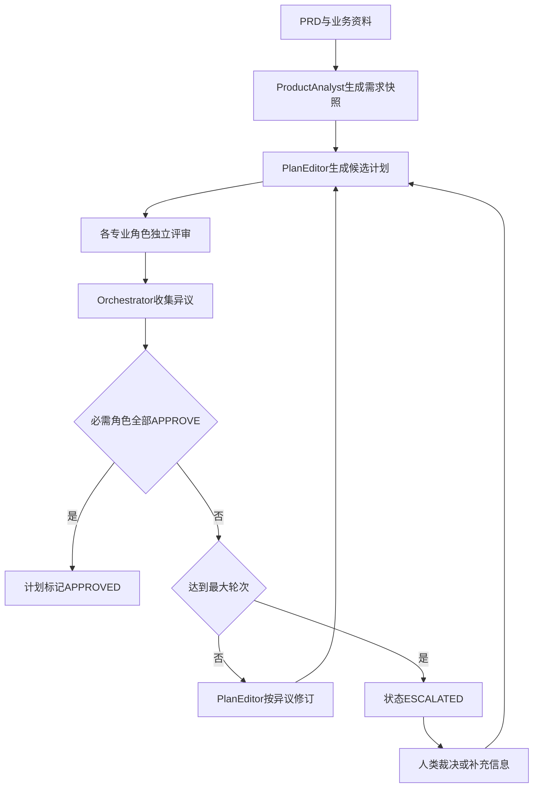
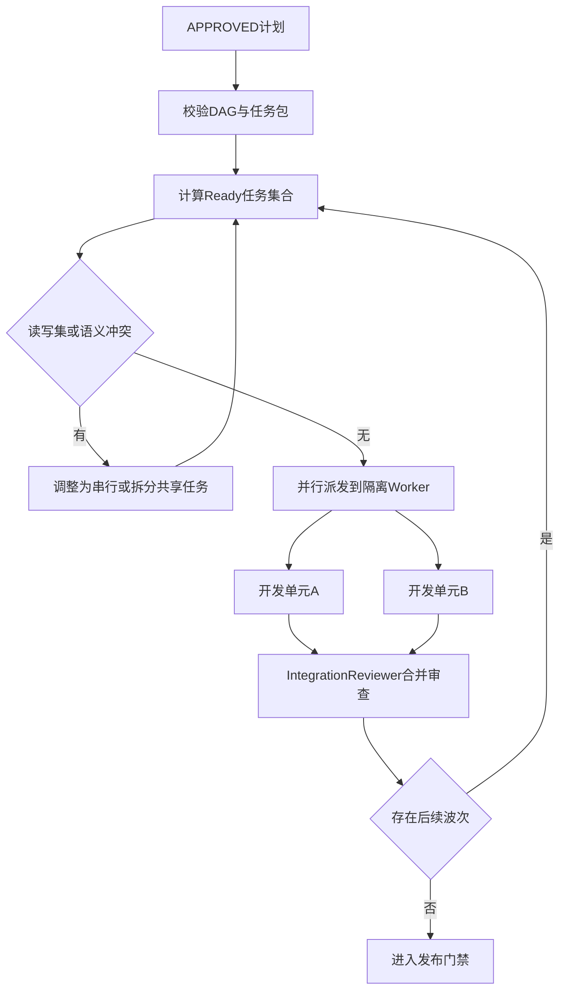
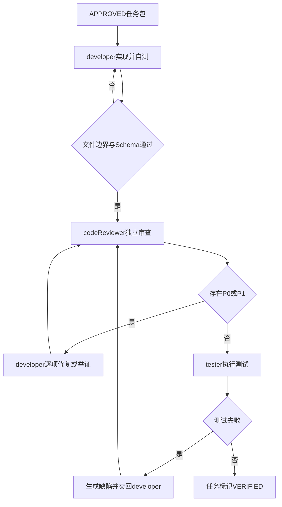

# AI-SEP 架构说明

> **文档定位**：本仓库架构的**单一入口说明**。读完本文即可理解 AI-SEP 的创建背景、原理、目录结构、工作流与日常用法。  
> **权威规范**：架构细节以仓库根目录 [`design.md`](../design.md) 为准；本文是对架构规范的结构化展开，不替代契约原文。  
> **版本对齐**：工作流 `ai-software-delivery@1.0.0`；活样例为 **WSC / 接入端工作台（Workspace Console）**；Run `RUN-WSC-001` 已于 2026-07-30 **COMPLETED**。  
> **命名说明**：口语「console 项目」即本样例；权威代号仍是 **`projectId: WSC`**，产品中文名「接入端工作台」，英文别名 Workspace Console——**没有**改名为独立 `console` 代号。  
> **读者**：产品、研发、测试、架构、项目管理、以及需要接入本流水线的 Agent 操作者。

---

## 目录

1. [一句话理解 AI-SEP](#1-一句话理解-ai-sep)
2. [创建背景：要解决什么问题](#2-创建背景要解决什么问题)
3. [是什么 / 不是什么](#3-是什么--不是什么)
4. [八条核心原则](#4-八条核心原则)
5. [总体架构与分层](#5-总体架构与分层)
6. [完整目录结构设计](#6-完整目录结构设计)
7. [关键概念词典](#7-关键概念词典)
8. [角色体系与职责边界](#8-角色体系与职责边界)
9. [制品链、ID 与状态机](#9-制品链id-与状态机)
10. [工作流全流程详解](#10-工作流全流程详解)
11. [规划共识机制](#11-规划共识机制)
12. [可并行任务 DAG](#12-可并行任务-dag)
13. [编码对抗单元](#13-编码对抗单元)
14. [测试、发布与人类门禁](#14-测试发布与人类门禁)
15. [Rule / Skill / Policy 个性化模型](#15-rule--skill--policy-个性化模型)
16. [Run 控制面：状态、事件与恢复](#16-run-控制面状态事件与恢复)
17. [学习与知识晋升](#17-学习与知识晋升)
18. [从模板到项目：实例化路径](#18-从模板到项目实例化路径)
19. [日常操作手册](#19-日常操作手册)
20. [Console（WSC）试点实操样例](#20-consolewsc-试点实操样例)
21. [反模式与红线](#21-反模式与红线)
22. [落地路线与完成定义](#22-落地路线与完成定义)
23. [自检清单](#23-自检清单)
24. [附录：关键文件速查](#24-附录关键文件速查)

---

## 1. 一句话理解 AI-SEP

**AI-SEP（AI Software Engineering Pipeline）** 是一套**工具中立**的多 Agent 软件交付架构：用**版本化文档制品**做协作协议，用**状态机控制面**做调度与审计，用**角色隔离**做分析 / 规划 / 开发 / 审查 / 测试的制衡，让「从 PRD 到可验证交付」可追踪、可并行、可恢复、可回滚。

它不是「一个全能自动写代码的机器人」，而是：

```text
协作协议 + 目录骨架 + 角色契约 + 规则/技能/策略模板 + 启动/恢复协议
```

下游项目填好 Rule / Skill / Policy 后，再接入 Cursor、Claude Code、Codex 或其他多 Agent 运行时。

---

## 2. 创建背景：要解决什么问题

### 2.1 常见多 Agent 用法的痛点

| 痛点 | 典型表现 | 后果 |
|---|---|---|
| 单会话「换帽子」 | 同一聊天里先开发后自审 | 结论不可审计，制衡失效 |
| 进度只在聊天里 | 关会话后无人知道做到哪 | 无法恢复，重复劳动或漏步 |
| 规范绑死项目/IDE | 规则写在某个工具私有配置 | 无法复制到其他仓库/运行时 |
| 失败即写全局规则 | 一次踩坑就改「全公司红线」 | 知识库污染、误伤其他任务 |
| 未共识就编码 | PRD 一到就开工 | 返工、范围漂移、契约冲突 |
| 并行无法证明安全 | 「看起来路径不同」就并行 | 写冲突、合并地狱、行为回归 |

### 2.2 设计动机

架构规范 [`design.md`](../design.md) 明确了：

- Agent Contract（输入/输出/权限/禁止项）
- 规划委员会与全员共识循环
- 读写集可证明的并行 DAG
- developer ↔ codeReviewer 对抗
- 知识分层与学习晋升门禁
- 工作流控制面（Run / state / events / resume）
- 分层目录（`product` / `design` / `planning` / `ai` / `learning`）与「文档驱动」协作

**创建目标**：不是让一个 AI「完成整个项目」，而是建立一条**可追踪、可并行、可审计、可回滚**的软件交付流水线，并让同一套骨架能被不同项目实例化。

### 2.3 设计立场

1. **文档是真相源，聊天是交互通道**  
2. **Orchestrator 是调度器，不是万能专家**  
3. **人类拥有最终决策权**（无法共识则 `ESCALATED`）  
4. **Adapter 只翻译协议，不另起状态机，不承载业务规则**  
5. **个性化改 Rule/Skill/Policy，不改 agents 骨架**

---

## 3. 是什么 / 不是什么

### 3.1 是

| 能力 | 落盘位置 |
|---|---|
| 多 Agent 角色契约 | `ai/agents/` |
| 规则分层与 Skill 模板 | `ai/rules/`、`ai/skills/` |
| 工作流定义与策略 | `ai/workflow/` |
| 制品 Schema 与 Markdown 模板 | `ai/schemas/` |
| 实例化清单与跨职能分工 | `PROJECT-CUSTOMIZATION*.md` |
| 启动与恢复协议 | `ai/workflow/start.md`、`resume.md` |
| 可复制的目录与协作约定 | 本仓库整体 |

### 3.2 不是

- 「复制即生产」的通用业务成品（下游仍须按自己的 PRD 实例化）
- 已填好的**全量**公司合规规则（Org CODING/SECURITY/RELEASE 等可试点豁免）
- 已绑定单一 IDE 的插件（`ai/adapters/` 为占位，后置实现）
- 无人值守从 PRD 到生产的全自动系统（V1 允许人工门禁与半自动调度）

> **本仓特例**：同仓已落地 WSC（接入端工作台 / Workspace Console）业务树，并完成半自动全流程闭环。阅读时应区分「模板通用能力」与「本仓活样例已跑通」。

### 3.3 本仓库当前能力边界（务必讲清）

| 能力 | 状态 |
|---|---|
| 阅读架构、理解角色边界 | 可用 |
| 按清单填写 Rule / Skill / Policy | 可用 |
| **WSC 半自动全流程（PRD→发布）** | **已跑通**（`RUN-WSC-001` = `COMPLETED`） |
| 半自动按 start/resume 推进 Run | 协议可用；COMPLETED Run 无需再 resume 推进 |
| CLI / Cursor Adapter 一键启动 | **未实装** |
| 假设未实例化即可自动跑通任意新项目 | **不可用** |

判定依据：[`PROJECT-CUSTOMIZATION.md`](../PROJECT-CUSTOMIZATION.md) **§0 完成判定**（WSC 为试点部分完成 + 豁免声明）。未勾选完成前，不得假设 Orchestrator 可无人值守跑通任意新项目。

---

## 4. 八条核心原则

记忆口诀：**「文档交接、角色单一、先规划后编码、并行可证、审开分离、ID 可追、失败先记、人有终裁」**。

1. **文档是协作协议** — Agent 只通过版本化制品交接，不以聊天为权威源。  
2. **角色职责单一** — 分析、规划、开发、审查、测试分离。  
3. **规划先于编码** — 必需角色明确批准后才能开发。  
4. **并行必须可证明安全** — 依赖满足且写集无冲突（含语义冲突）。  
5. **开发与审查相互独立** — 同一任务 `developer` ≠ `codeReviewer`。  
6. **结论可追踪** — REQ / PLAN / TASK / REVIEW / TEST 等稳定 ID。  
7. **失败先记录，后晋升知识** — 禁止单次失败直接晋升全局 Rule。  
8. **人类拥有最终决策权** — 无法共识则 `ESCALATED`，不得伪造批准。

---

## 5. 总体架构与分层

### 5.1 控制面 vs 业务面

```text
┌─────────────────────────────────────────────────────────┐
│ 产品 / 设计 / 规划制品（版本化，业务真相）                  │
│ product/  design/  planning/  contracts/  …               │
└───────────────────────────↑ 交接 ─────────────────────────┘
                            │
┌───────────────────────────┴─────────────────────────────┐
│ 用户 ↔ 唯一主会话 orchestrator（控制面）                   │
│   · 读 definition.yaml + policies.yaml                   │
│   · 维护 ai/runs/*/state.yaml + events.jsonl             │
│   · 调度隔离 subagent/worker                             │
│         └── 装载 ai/agents/{role}.md                     │
│             + context-map 指定的 Rule / Skill              │
└─────────────────────────────────────────────────────────┘
                            │
┌───────────────────────────┴─────────────────────────────┐
│ 实现与验证（业务面）                                       │
│ frontend/  backend/  tests/  ops/                        │
└─────────────────────────────────────────────────────────┘
```

### 5.2 七层职责

| 层 | 路径 | 唯一职责（一句话） |
|---|---|---|
| 产品 | `product/` | 做什么、为什么、业务约束与术语 |
| 设计 | `design/` | 决策、交互与视觉约定 |
| 规划 | `planning/` | 把需求变成共识后的可执行任务 DAG |
| 实现 | `frontend/`、`backend/` | 源码 |
| 验证 | `tests/` | 测试与追踪证据 |
| AI 控制面 | `ai/` | 角色、规则、技能、工作流、运行状态 |
| 学习 | `learning/` | 从失败中筛选可复用知识（需审批） |

### 5.3 默认运行模型

```text
用户 ↔ 唯一主会话（orchestrator）
         │
         ├── subagent → productAnalyst
         ├── subagent → solutionArchitect / qaStrategist / …
         ├── subagent → developer
         ├── subagent → codeReviewer   ← 必须另一实例
         └── subagent → tester / integrationReviewer / …
```

映射规则（必须记住）：

1. 主会话**只**扮演 `orchestrator`。  
2. 专业角色**一律隔离执行**，结论必须落盘。  
3. 交接靠制品路径与 Schema，不靠长聊天摘要。  
4. 制衡角色不得同实例（尤其是 developer / codeReviewer）。  
5. 可证明安全才并行。  
6. 用户不手动切角色；常态只需说「继续」。

---

## 6. 完整目录结构设计

### 6.1 仓库顶层（实例化后的完整形态）

```text
AI-SEP/   （或下游业务仓库根）
├── README.md                              # 模板导读
├── design.md                              # ★ 架构真理源
├── PROJECT-CUSTOMIZATION.md               # 实例化勾选清单
├── PROJECT-CUSTOMIZATION-ASSIGNMENTS.md   # 人工分工（RACI）
├── customization-templates/               # 按职能对照填写草稿
│
├── product/                               # 产品层
│   ├── prd/                               # PRD 原文
│   ├── requirements/                      # 需求快照 SNAP-*
│   ├── business-rules/                    # 业务规则索引
│   ├── user-stories/                      # （可选）
│   ├── changelog/                         # （可选）
│   └── glossary.md                        # 术语表
│
├── design/                                # 设计层
│   ├── decisions/                         # ADR / DEC-*
│   ├── prototype/  ui-spec/  components/   # （按项目需要）
│   └── tokens/  assets/
│
├── planning/                              # 规划层
│   ├── proposals/                         # 候选计划 PLAN-*
│   ├── reviews/                           # round-N 独立评审
│   ├── approved/                          # 门禁后正式计划
│   ├── tasks/                             # TASK / DEV / REV / TESTRUN
│   ├── dependency-graphs/                 # （可选）DAG 图
│   ├── api-design/  database/             # （可选，或迁至 contracts/）
│
├── contracts/                             # 冻结契约（WSC：wsc-contracts@1.1.0）
│   ├── openapi/ rbac/ chain/ errors/ overview/ ui/ security/ …
│
├── frontend/                              # 前端实现（Vue3 业务模块已落地）
├── backend/                               # 后端实现（Spring Boot 业务模块已落地）
├── tests/                                 # contracts 检查 + e2e（Playwright）
├── ops/                                   # runbook + 发布证据（evidence/release/）
│
├── ai/                                    # ★ Agent 控制与知识面（见下节）
├── learning/                              # 知识晋升候选树（多为占位）
├── docs/                                  # 含本说明文档
└── temp/                                  # 本地试验，★ 非权威制品（含 PRD 源稿等）
```

> **注意**：纯模板态可不预置业务代码树；**本仓已是「模板 + WSC 活样例」同仓**（根包名 `wsc-monorepo`）。`temp/` 永远不是正式制品源——例如 `temp/product/prd/接入端工作台-v1.0.md` 仅为源稿，权威 PRD 在 `product/prd/wsc-v1.0.md`。

### 6.2 `ai/` 控制面详解

```text
ai/
├── agents/                 # 角色契约（稳定，一般不改）
│   ├── orchestrator.md
│   ├── product-analyst.md
│   ├── developer.md
│   ├── code-reviewer.md
│   ├── human-owners.md
│   └── …
├── rules/
│   ├── global/             # 平台底线（如密钥、共识）
│   ├── organization/       # 公司级：技术栈、编码、安全、发布
│   └── project/            # 本项目：layout、domain、owners、modules、context-map
├── skills/<role>/          # 可执行做法：SKILL.md + TEMPLATE/EXAMPLE
├── schemas/                # JSON Schema + Markdown 制品模板
├── workflow/
│   ├── definition.yaml     # 节点骨架与转换
│   ├── policies.yaml       # ★ 项目个性化主文件
│   ├── start.md            # 启动协议
│   └── resume.md           # 恢复协议
├── adapters/               # Cursor / CLI / CI 映射（占位）
├── runs/                   # 每次交付的 Run 状态（执行产生）
│   └── RUN-{PROJECT}-{NNN}/
│       ├── manifest.yaml
│       ├── state.yaml      # ★ 当前节点权威状态
│       ├── events.jsonl    # ★ 只追加审计流
│       ├── approvals.yaml  # 人类批准（WSC 发布已实装）
│       └── （预留）leases/ checkpoints/ …
└── memory/                 # 任务级失败与发现（晋升前）
```

### 6.3 `planning/` 制品树（运行后典型形态）

```text
planning/
├── proposals/
│   ├── PLAN-WSC-1.0.md          # 首轮候选
│   └── PLAN-WSC-1.1.md          # 修订候选
├── reviews/
│   ├── round-1/ … round-2/      # 规划委员会独立评审 + SUMMARY
│   └── integration/             # 并行束集成审查（如 REV-WSC-INTEGRATION-001）
├── approved/
│   └── PLAN-WSC-1.1.md          # 共识后正式计划
└── tasks/
    ├── TASK-WSC-00N.md          # 任务包
    ├── DEV-TASK-WSC-00N.md      # 开发交付说明
    ├── REV-TASK-WSC-00N.md      # 代码审查
    ├── TESTRUN-TASK-WSC-00N.md  # 单任务测试证据
    ├── TESTRUN-WSC-E2E-P0.md    # W5 跨模块 E2E
    └── TESTRUN-WSC-RELEASE-GATES.md  # 发布门禁证据
```

### 6.4 目录设计原则（为什么这样分）

| 原则 | 说明 |
|---|---|
| 产品与实现分离 | `product/` 不混源码；改需求不等于改代码 |
| 规划与执行分离 | `planning/` 存共识与任务边界；实现落在 frontend/backend |
| 控制面与业务面分离 | `ai/` 管「怎么协作」；业务规则可进 rules，但 Adapter 不写业务 |
| 契约显式冻结 | `contracts/`（或 planning 下契约目录）供多任务只读消费 |
| 运行态可丢会话 | `ai/runs/` 存权威进度，新会话可 resume |
| 试验区隔离 | `temp/` 不进制品链，防止污染追踪 |

---

## 7. 关键概念词典

| 概念 | 含义 | 典型 ID / 路径 |
|---|---|---|
| **RUN** | 围绕某 PRD 的一次交付执行实例 | `RUN-WSC-001` → `ai/runs/RUN-WSC-001/` |
| **PRD** | 产品需求文档（输入点火） | `product/prd/*.md` |
| **SNAP** | 本轮不可变需求快照 | `SNAP-WSC-001` |
| **PLAN** | 候选/批准执行计划 | `PLAN-WSC-1.1` |
| **TASK** | 可调度工作单元（含依赖、读写集、验收） | `TASK-WSC-002` |
| **REQ** | 可追踪需求条目 | `REQ-RBAC-001` |
| **ADR/DEC** | 架构/设计决策 | `DEC-WSC-001` |
| **Wave** | 并行波次 | W1 → W2 → W3 |
| **Role / Agent** | `ai/agents/{role}.md` 契约；运行时映射为 worker | — |
| **Orchestrator** | 状态机与调度器；不做专业代批 | 主会话 |
| **Rule** | 红线/约束（做什么/不做什么） | `RULE-GLOBAL-SECRETS` |
| **Skill** | 步骤/命令/清单（怎么做） | `skill.backend-developer` |
| **Policy** | 门禁、角色启用、升级路由、学习阈值 | `policies.yaml` |
| **state.yaml** | 当前节点权威状态 | `ai/runs/*/state.yaml` |
| **events.jsonl** | 只追加的审计事件流 | 同目录 |
| **ESCALATED** | 升级人类裁决 | 旁路状态 |
| **BLOCKED** | 环境/输入阻塞 | 旁路状态 |
| **SCOPE_VIOLATION** | Worker 改了未声明文件 | 立即标记 |

---

## 8. 角色体系与职责边界

### 8.1 编排层

| 角色 | 允许 | 禁止 |
|---|---|---|
| **orchestrator** | 校验 Schema、调度、收集评审、维护状态与事件、门禁、升级 | 替专业角色解释业务/给批准；改投票；伪造 APPROVE；边界不全时开开发 |

### 8.2 规划委员会（核心不可省略）

| 角色 | 核心职责 | 主要输出 | 不负责 |
|---|---|---|---|
| productAnalyst | 解析 PRD、优先级、范围 | SNAP、REQ、验收 | 技术选型 |
| solutionArchitect | 边界、NFR、模块关系 | 架构意见、ADR 草案 | 改写需求含义 |
| qaStrategist | 可测性、测试分层、覆盖 | 测试策略 | 代替开发修 bug |
| parallelPlanner | DAG、读写集、波次 | 任务包、并行计划 | 改写专业设计 |
| planEditor | 汇总异议、修订计划 | 新版候选 PLAN | 自行关闭异议 |

### 8.3 规划可选（省略须在 policies 写 `omitReason`）

| 角色 | 何时需要 |
|---|---|
| uxUiPlanner | 有显著 UI/交互/可访问性 |
| apiDataDesigner | 有多服务契约、数据模型、兼容迁移 |
| securityOperations | 有安全/隐私/部署回滚约束需前置 |

### 8.4 实现与验证

| 角色 | 时机 | 硬约束 |
|---|---|---|
| developer | 每个实现任务 | 只改 `allowModify`；不自审 |
| codeReviewer | 每个实现任务 | **与 developer 不同实例**；不直接改被审代码 |
| tester | P0/P1 清零后 | 真实执行命令；环境阻塞 ≠ PASS |
| integrationReviewer | 并行束完成后 | 查跨任务行为与契约一致性 |
| securityReviewer | `riskTriggers` 命中 | 如 auth-model-change、handles-pii |
| migrationReviewer | schema-migration / data-backfill | 查迁移与回滚 |

### 8.5 人类身份

见 `ai/agents/human-owners.md` 与 `ai/rules/project/owners.yaml`：

| 身份 | 典型职责 |
|---|---|
| productOwner | 需求裁决、规划轮次耗尽升级 |
| techLead | 审查轮次耗尽、架构冲突 |
| securityOperationsOwner | 残留安全风险 |
| maintainer | 发布门禁最终批准 |

小团队可一人多身份，但**每次批准必须注明当时身份**。

### 8.6 契约共性（每个 Agent 都必须具备）

1. 唯一目标  
2. 固定输入及其 Schema  
3. 固定输出及其 Schema  
4. 允许读写范围  
5. 决策权  
6. 禁止事项  
7. 完成条件  
8. 超时或无法判断时的升级方式  

**个性化不要改** `ai/agents/*.md` 骨架；差异写入 Rule / Skill / Policy。

---

## 9. 制品链、ID 与状态机

### 9.1 制品链

```text
PRD
  → Requirement Snapshot（SNAP）
  → Design Decision（ADR/DEC）
  → Approved Plan（PLAN）
  → Task DAG（TASK）
  → Code Change
  → Code Review（REV）
  → Test Evidence（TESTRUN）
  → Release
  → Learning Candidate（LEARN）
```

每个下游制品必须引用直接上游 ID；上游也记录下游链接，支持双向追踪。

### 9.2 ID 规范

| 制品 | 格式 | 示例 |
|---|---|---|
| 需求 | `REQ-{MODULE}-{NNN}` | `REQ-USER-001` |
| 架构决策 | `ADR-{NNN}` / `DEC-{PROJECT}-{NNN}` | `DEC-WSC-004` |
| 计划 | `PLAN-{MODULE}-{VERSION}` | `PLAN-WSC-1.1` |
| 任务 | `TASK-{MODULE}-{NNN}` | `TASK-WSC-004` |
| 接口 | `API-{MODULE}-{NNN}` | `API-USER-002` |
| 测试 | `TEST-{LEVEL}-{NNN}` | `TEST-E2E-031` |
| 缺陷 | `BUG-{NNN}` | `BUG-184` |
| 学习候选 | `LEARN-{NNN}` | `LEARN-027` |
| 规则 | `RULE-{SCOPE}-{TOPIC}` | `RULE-ORG-STACK` |
| Run | `RUN-{PROJECT}-{NNN}` | `RUN-WSC-001` |
| 快照 | `SNAP-{PROJECT}-{NNN}` | `SNAP-WSC-001` |

**ID 创建后不可复用。** 需求取消标记 `CANCELLED`，不得删号重用。

MODULE 码表由项目维护，例如 WSC：`SHELL` / `RBAC` / `OVW` / `CAT` / `CHAIN`（见 `ai/rules/project/modules.yaml`）。

### 9.3 制品状态模型

```text
DRAFT → IN_REVIEW → APPROVED → IN_PROGRESS → VERIFIED → RELEASED
                    ↘ REJECTED
                    ↘ ESCALATED
```

- `APPROVED`：所有必需角色明确通过  
- `VERIFIED`：实现、审查和测试证据齐全  
- `ESCALATED`：Agent 无法消解，等人类  

发布门禁要求计划内 P0 REQ 全部 `VERIFIED`。

---

## 10. 工作流全流程详解

### 10.1 状态机节点（definition.yaml）

```text
CREATED
  → PRD_ANALYSIS          # productAnalyst → 需求快照
  → REQUIREMENT_REVIEW    # 人类 productOwner 确认快照（或约定确认）
  → PLAN_DRAFT            # planEditor → 候选计划
  → PLAN_REVIEW           # 规划委员会独立评审（最多 maxRounds）
  → PLAN_APPROVED         # parallelPlanner 固化 DAG / 任务包
  → TASK_DISPATCH         # orchestrator 按波次派发
  → DEVELOPMENT           # developer
  → CODE_REVIEW           # codeReviewer（P0/P1 清零）
  → TESTING               # tester
  → INTEGRATION           # 并行束完成后 integrationReviewer
  → RELEASE_REVIEW        # 发布门禁 + 人类 maintainer
  → COMPLETED
```

任一节点还可进入旁路：`BLOCKED` / `PAUSED` / `ESCALATED` / `CANCELLED` / `FAILED`。

### 10.2 节点与角色对照表

| 节点 | 主要角色 | 通过条件（摘要） | 下一节点 |
|---|---|---|---|
| PRD_ANALYSIS | productAnalyst | SNAP 落盘且可校验 | REQUIREMENT_REVIEW |
| REQUIREMENT_REVIEW | productOwner（人） | 快照确认 | PLAN_DRAFT |
| PLAN_DRAFT | planEditor | 候选 PLAN 落盘 | PLAN_REVIEW |
| PLAN_REVIEW | planningCommittee | 必需角色全部 APPROVE | PLAN_APPROVED；超轮次 → ESCALATED |
| PLAN_APPROVED | parallelPlanner | DAG/任务包完整 | TASK_DISPATCH |
| TASK_DISPATCH | orchestrator | Ready 集合可调度 | DEVELOPMENT |
| DEVELOPMENT | developer | 范围与交付物齐全 | CODE_REVIEW |
| CODE_REVIEW | codeReviewer | 无 P0/P1 | TESTING；超轮次 → ESCALATED |
| TESTING | tester | 必需测试 PASS | INTEGRATION（或下一任务） |
| INTEGRATION | integrationReviewer | 并行束无跨任务问题 | RELEASE_REVIEW / 下一波 |
| RELEASE_REVIEW | maintainer 等 | 发布门禁全过 | COMPLETED |

说明：`DEVELOPMENT → CODE_REVIEW → TESTING` 会**按任务循环**；整波次任务都 VERIFIED 后才进 INTEGRATION / 下一波派发。具体调度以 `state.yaml.nextAction` 为准。

### 10.3 端到端时序（流程叙事）

1. **点火**：用户提供 PRD 路径，创建 Run。  
2. **分析**：productAnalyst 产出不可变 SNAP。  
3. **确认**：人类确认快照范围（开放问题关闭或接受）。  
4. **起草**：planEditor 产出候选 PLAN（含任务草案）。  
5. **对抗评审**：各专业角色独立写 `APPROVE|REQUEST_CHANGES|BLOCK|ABSTAIN`。  
6. **修订循环**：有异议 → planEditor 修订 → 再评；异议**谁提谁关**。  
7. **批准**：全员通过 → parallelPlanner 固化任务包与波次 → 正式 PLAN 进 `approved/`。  
8. **派发**：orchestrator 计算 Ready 集，按波次派 developer。  
9. **对抗实现**：developer → codeReviewer →（修复循环）→ tester。  
10. **集成**：并行束完成后 integrationReviewer。  
11. **发布**：P0 全 VERIFIED + 集成通过 + maintainer 批准。  
12. **学习**：失败进 memory；达阈值后候选晋升（另流程）。

---

## 11. 规划共识机制

### 11.1 为什么要「全员明确批准」

「全员认同」必须是每个角色**独立、可审计**的明确批准，而不是同一个 Agent 在一段文本里模拟多人同意。这是 Global Consensus 规则的核心。

### 11.2 评审决策枚举（仅允许这四种）

| 决策 | 含义 |
|---|---|
| `APPROVE` | 本角色责任范围内无阻塞问题 |
| `REQUEST_CHANGES` | 存在可修复问题，列明关闭条件 |
| `BLOCK` | 前提缺失、需求冲突或风险不可接受 |
| `ABSTAIN` | 该领域不适用；须 Orchestrator 验证，≠ 默认批准 |

### 11.3 共识循环



规则要点：

1. 默认最多 **5** 轮（`policies.planningCommittee.maxRounds`）。  
2. 先独立输出，再看汇总，降低从众偏差。  
3. 异议用稳定 ID（如 `ISSUE-PLAN-023`），含证据、严重级别、`closeWhen`。  
4. **只有异议提出者能确认关闭**；Orchestrator 不得代关。  
5. 无证据偏好、纯风格争论不得无限阻塞。  
6. 超轮次 → `ESCALATED`，**禁止自动开发**。

### 11.4 计划批准门禁（进入 APPROVED 前必须同时满足）

- 所有 P0/P1 REQ 都有验收标准  
- API / 数据 / UI 契约无未决冲突  
- 每个任务有依赖、文件边界、读写集、测试范围  
- DAG 无环  
- 并行任务写集无交集（且无语义冲突）  
- 安全/迁移/部署/回滚已处理或明确接受  
- 所有必需角色输出 `APPROVE`

---

## 12. 可并行任务 DAG

### 12.1 任务包必备字段

任务包示例见 `planning/tasks/TASK-WSC-001.md`，核心字段：

| 字段 | 作用 |
|---|---|
| `taskId` / `planId` / `snapshotId` | 追踪 |
| `dependsOn` | 前置依赖 |
| `readSet` / `writeSet` | 并行安全判定 |
| `allowModify` / `denyModify` | Worker 文件边界 |
| `mergeAfter` | 合并顺序（不以完成速度决定） |
| `riskTags` | 触发额外审查角色 |
| `acceptance` / `tests` | 完成条件 |
| `frozenContracts` | 只读消费的契约版本 |
| `codeReviewerMustDiffer` | 强制审开分离 |

### 12.2 并行判定（六条同时满足）

任务 A 与 B 可并行，当且仅当：

1. 二者所有前置依赖已达要求状态  
2. `writeSet(A) ∩ writeSet(B) = ∅`  
3. A 不写 B 的 `readSet` 中尚未稳定的制品，反之亦然  
4. 不修改同一全局注册表、路由、迁移序列或共享配置  
5. 接口契约已批准并冻结到相同版本  
6. 每个任务有独立测试与审查边界  

**路径无交集 ≠ 一定安全。** 若通过 DB 迁移顺序、公共 API、共享状态产生语义冲突，仍须串行。

### 12.3 调度流程



### 12.4 隔离与越界

- 并行任务使用独立工作区 / 分支 / 等价隔离  
- Worker 只能改 `allowModify`  
- 未声明文件修改 → `SCOPE_VIOLATION`  
- 公共契约由独立前置任务拥有；消费者只读批准版本  
- 合并顺序由 `mergeAfter` + DAG 决定  

---

## 13. 编码对抗单元

### 13.1 闭环



审查循环默认最多 5 轮；仍有 P0/P1 → `ESCALATED`（通常升 techLead）。

### 13.2 问题级别门禁

| 级别 | 含义 | 门禁 |
|---|---|---|
| P0 | 安全、数据损坏、核心功能错误、严重越界 | 必须修复 |
| P1 | 重要逻辑、需求遗漏、回归、必要测试缺失 | 必须修复 |
| P2 | 可维护性/非阻塞体验 | 可记录延期 |
| P3 | 风格与微优化 | 可选 |

### 13.3 developer 禁止项（强调）

- 越过 `denyModify` 或未声明边界  
- 擅自扩展需求  
- 修改审查报告掩盖问题  
- 兼任当前任务的 codeReviewer  

### 13.4 codeReviewer 禁止项

- 直接修改被审代码  
- 因个人风格偏好阻塞合并  
- 未读任务包与测试结果就批准  
- 代替 tester 宣称测试通过  

---

## 14. 测试、发布与人类门禁

### 14.1 测试金字塔（成本从低到高）

1. 静态检查、格式、类型检查  
2. 单元测试  
3. 组件/服务集成测试  
4. 契约测试  
5. E2E  
6. 性能 / 安全 / 迁移 / 回滚（按风险启用）  

### 14.2 任务完成条件

- P0/P1 为零  
- 必需测试**实际执行**并通过  
- 测试证据引用对应 REQ  
- 实现与批准契约一致  
- 追踪信息已同步  
- 无范围越界或未解决合并冲突  

**环境阻塞 ≠ 通过。** 无法执行时状态必须是 `BLOCKED`，并记录环境、命令、错误与解除条件。

### 14.3 发布门禁（policies.release）

WSC（Console）策略与实装：

- `requireHumanApproval: true`（身份 `maintainer`）  
- `requireIntegrationReview: true`  
- `requireAllP0Verified: true`  
- **已落地证据**：集成审查 APPROVE → Flyway 空库 + 回滚演练 PASSED → `approvals.yaml` 中 `APPR-WSC-RELEASE-001`  

额外建议检查：迁移与回滚可执行、已知 P2/P3 有责任人、审计日志完整。

### 14.4 升级路由（policies.escalation）

| 触发 | 默认升级对象 |
|---|---|
| 规划轮次耗尽 | productOwner |
| 审查轮次耗尽 | techLead |
| 残留安全风险 | securityOperationsOwner |
| 发布门禁 | maintainer |

---

## 15. Rule / Skill / Policy 个性化模型

### 15.1 四层上下文

| 层级 | 内容 | 维护者 |
|---|---|---|
| Global | 通用安全与工程底线 | 平台治理者 |
| Organization | 公司技术栈、合规、编码标准 | 架构委员会 |
| Project | 本项目架构、目录、领域规则 | 项目团队 |
| Task/Session | 当前任务临时上下文 | 当前 Worker |

优先级：

```text
Task > Project > Organization > Global
```

**低层不能覆盖**标注为不可覆盖的安全/合规 Global/Org 规则。

### 15.2 三类个性化载体

| 类型 | 含义 | 典型路径 |
|---|---|---|
| **Rule** | 约束与红线 | `ai/rules/**` |
| **Skill** | 可执行做法（命令、清单） | `ai/skills/**/SKILL.md` |
| **Policy** | 门禁、角色启用、升级 | `ai/workflow/policies.yaml` |

另：Schema/模板决定制品形状；`owners.yaml` 决定人类身份。

### 15.3 装载机制（context-map）

`ai/rules/project/context-map.yaml` 按角色与路径装载最小必要上下文：

- `defaults.rules`：全局底线（如 SECRETS、CONSENSUS、STACK）  
- `byRole`：角色必装 Skill/Rule  
- `byPath`：如改 `frontend/**` 额外装 `skill.frontend-developer`  

Agent **不应**读取全部知识；无关模块长历史、已退休规则、未批准学习候选禁止装载。

### 15.4 Skill 状态

`draft` → `active` 后才应被运行时装载。技术栈未定时保持 `draft`，不要创建空壳并标 active。

### 15.5 为什么不改 agents 骨架

- 角色契约是跨项目稳定接口  
- 改骨架影响所有下游，需架构级评审  
- 项目差异应进入可版本化、可回滚的 Rule/Skill/Policy  

---

## 16. Run 控制面：状态、事件与恢复

### 16.1 为什么需要控制面

没有控制面时，`design.md` 只是规范——出现 PRD 也不会安全地自动执行。控制面解决：

- **启动**：不每次粘贴完整角色提示词  
- **记录**：进度与决策可审计  
- **恢复**：新会话不依赖聊天摘要  

### 16.2 Run 目录

```text
ai/runs/RUN-{PROJECT}-{NNN}/
├── manifest.yaml     # 元数据：PRD、workflow 版本、模式
├── state.yaml        # ★ 当前权威状态
├── events.jsonl      # ★ 只追加事件
├── approvals.yaml    # 人类批准落盘（发布门禁等；WSC 已用）
└── （设计预留）leases / checkpoints / tasks /
```

### 16.3 state.yaml（权威进度）

必须记录（不仅是百分比）：

- `currentNode` / `status` / `round`  
- `completedNodes`  
- `blockedBy`  
- `activeSnapshotId` / `activePlanId` / `activeTaskIds`  
- `taskGate`（各任务 developer/review/tester/verified 证据）  
- `nextAction`（推进中）或 `null`（已完成）  
- 发布阶段可含：`integrationReview` / `releaseEvidence` / `releaseApproval`  
- `updatedAt`  

**当前活样例（COMPLETED，2026-07-30）**：

```yaml
runId: RUN-WSC-001
currentNode: COMPLETED
status: COMPLETED
activeSnapshotId: SNAP-WSC-001
activePlanId: PLAN-WSC-1.1
nextAction: null
# taskGate：TASK-WSC-001..006 与 W5-P0-E2E 均 verified
# integrationReview / releaseEvidence / releaseApproval 均已填写
```

**历史中途快照（仅作对比，勿当作当前状态）**：曾一度停在 `DEVELOPMENT`，`nextAction` 为派发 W3 并行束 `TASK-003/004/006`。

### 16.4 events.jsonl

- 每行一个 JSON 事件  
- **只追加，禁止重写历史**  
- 覆盖：RUN_CREATED、DISPATCH、CONSENSUS、REVIEW、TASK_VERIFIED、HUMAN_DECISION、RUN_COMPLETED 等  

理想更新顺序（全自动实现时）：校验 stateVersion → 写临时制品 → Schema/Hash 校验 → 发布正式制品 → 追加事件 → CAS 更新 state → Checkpoint。版本冲突则停止并重读，禁止覆盖较新状态。

### 16.5 启动协议（start.md）

前置：§0 完成或明确试点豁免；PRD 可读；`projectId` 已替换。

步骤：

1. 创建 `runId`  
2. 写入 `manifest.yaml` + `state.yaml`（`currentNode: PRD_ANALYSIS`）  
3. 主会话仅 orchestrator  
4. 子角色装载 agents + context-map  
5. 专业结论全部落盘  

最小用户话术：

```text
启动交付流程。
PRD：product/prd/<file>.md
```

### 16.6 恢复协议（resume.md）

1. 查找未完成的 `ai/runs/*/state.yaml`（`status` ≠ `COMPLETED` / `CANCELLED`）  
2. 仅一个活动 Run → 自动选中；多个 → 只问 runId  
3. 校验 workflow 版本、租约、制品完整性（能力具备时）  
4. 读 `currentNode` / `blockedBy` / `nextAction`  
5. **不重复执行** `completedNodes`  
6. 从 `nextAction` 继续；恢复事件追加到 `events.jsonl`  

> **本仓现状**：`RUN-WSC-001` 已 `COMPLETED`，对其执行 resume **不会**再派发开发任务；应报告「已完成」并指向发布证据。新交付应 `start` 新 Run（新 PRD 或新版本）。

首条状态输出模板：

```text
已恢复 {runId}。
当前节点：{currentNode}，第 {round} 轮。
阻塞问题：{n} 个。
下一动作：{role}/{action}。
```

### 16.7 Worker 租约（设计能力；半自动可简化）

网络断开 ≠ Worker 已死。全自动实现时：

- Worker 只写临时输出；Orchestrator 发布正式制品  
- 租约有效禁止重复派发  
- 晚到结果与当前 stateVersion 不一致时只能归档  

WSC 试点为**半自动编排**（`manifest.mode: semi-automatic-pilot`），不依赖 Adapter 一键启动，但协议已预留。

---

## 17. 学习与知识晋升

### 17.1 流程

```text
事件或失败
  → ai/memory/ 原始记录
  → 去重与聚类
  → 学习价值评分
  → learning/candidates/ 候选 Rule/Skill
  → 离线评测
  → 人工审批
  → 分层发布（Global/Org/Project）
  → 监控效果
  → 保留 / 回滚 / 退休
```

### 17.2 评分与阈值（policies.learning）

维度（0–5）：frequency、impact、confidence、generality、freshness、risk  

```text
value = frequency + impact + confidence + generality + freshness - risk
```

晋升建议条件：

- 至少 3 次独立同类事件，或单次 P0 安全事件  
- `confidence >= 4`  
- 总分达项目阈值  
- 已有规则无法覆盖  
- 通过反例与回归评测  
- 对应层级所有者批准  

**禁止：失败一次就自动生成全局 Rule。**

### 17.3 生命周期

`CANDIDATE` → `EVALUATING` → `APPROVED` → `ACTIVE` → `DEPRECATED` / `RETIRED` / `ROLLED_BACK`

---

## 18. 从模板到项目：实例化路径

### 18.1 推荐步骤

1. 复制本仓库（或作为 monorepo 子树 / 模板生成）  
2. 指定协调人，打开 `PROJECT-CUSTOMIZATION.md`，按 `ASSIGNMENTS` 认领  
3. 填写 `owners.yaml`、`projectId`、Org/Project 规则、P0 Skill  
4. 裁剪 `policies.yaml`（省略角色须写 `omitReason`）  
5. 勾选 §0；将对应文件 `draft` → `active`  
6. 放入业务 PRD，按 `start.md` 半自动或 Adapter 启动 Run  

### 18.2 §0 完成判定（最小可跑条件）

全部勾选前，不得假设可自动跑通规划→开发：

1. 人类身份已点名  
2. Organization 规则至少有一份 ACTIVE（通常 STACK）  
3. Project 规则（layout + modules/glossary）已落盘  
4. policies 已按本项目裁剪  
5. P0 Skill：developer（+前端/后端按需）、code-review、tester 已填写  
6. Schema/模板可用；MODULE 码表就绪  
7. 至少一份可执行 PRD  

### 18.3 试点豁免（允许什么、不允许什么）

以 WSC 为例（见 PROJECT-CUSTOMIZATION）：

- **可豁免**：Org 全量精细规则、非 P0 Skill 全 active、Adapter 一键启动、无人值守  
- **不可豁免**：可读 PRD、owners、projectId、STACK 基线、layout/modules、P0 实现 Skill、Run 状态机、规划共识门禁  

---

## 19. 日常操作手册

### 19.1 用户常态交互

| 用户说 | Orchestrator 做什么 |
|---|---|
| 「启动交付流程。PRD：…」 | 建 Run，进入 PRD_ANALYSIS |
| 「继续」 | 读 nextAction，派发下一角色 |
| 「暂停」 | `PAUSED`，写清恢复条件 |
| 「取消」 | 有权限人类 → `CANCELLED` |
| 提供裁决（注明身份） | 写入审批/事件，解除 ESCALATED |

### 19.2 操作者（扮演 Orchestrator）检查单

每次派发前：

- [ ] 读 `state.yaml`，确认未重复执行 completedNodes  
- [ ] 输入制品路径存在且 ID 一致（同一 snapshotId）  
- [ ] 子实例装载正确 role 契约 + Skill/Rule  
- [ ] 输出路径与 Schema 明确  
- [ ] developer / codeReviewer 实例不同  
- [ ] 并行任务已做写集冲突检查  

每次子实例返回后：

- [ ] 结论已落盘（不是只在聊天里）  
- [ ] 决策枚举合法  
- [ ] 更新 `state.yaml`  
- [ ] 追加 `events.jsonl`  
- [ ] 写清下一 `nextAction`  

### 19.3 阻塞与升级处理

| 状态 | 含义 | 动作 |
|---|---|---|
| BLOCKED | 缺环境/输入 | 记录解除条件，不把失败当 PASS |
| ESCALATED | 超轮次或高风险分歧 | 明确人类身份与待裁决问题 |
| SCOPE_VIOLATION | 越界写文件 | 停止合并，回滚或重开任务边界 |
| FAILED | 不可自动恢复 | 记录，人类决定重试/取消 |

### 19.4 新会话接入

不要问「上次聊到哪」当权威；直接：

```text
请按 resume 协议恢复未完成 Run。
```

或指定：

```text
恢复 RUN-WSC-001。
```

> 若该 Run 已 `COMPLETED`（当前即是），应报告完成状态与证据路径，而不是再次派发 W3/开发任务。新版本交付请 `start` 新 Run。

---

## 20. Console（WSC）试点实操样例

本节帮助读者把「抽象协议」映射到「真实落盘」。  
口语中的 **console 项目** = **接入端工作台（Workspace Console）**；仓库与 ID 一律用 **`WSC`**。

### 20.1 产品与命名

| 说法 | 是否权威 | 说明 |
|---|---|---|
| **WSC** | 是（`projectId`） | Run / PLAN / TASK / MODULE 前缀 |
| **接入端工作台** | 是（中文产品名） | PRD 标题、UI 品牌文案 |
| **Workspace Console** | 是（英文别名） | `product/glossary.md`；PRD「原型依据」 |
| console | 口语别称 | **无**独立 `projectId: console`，未做 WSC→console 改名 |

### 20.2 试点概况（截至 Run 完成）

| 项 | 值 |
|---|---|
| 项目代号 | `WSC` |
| 产品名 | 接入端工作台（Workspace Console） |
| 权威 PRD | `product/prd/wsc-v1.0.md`（源稿在 `temp/`，非正式） |
| 需求快照 | `SNAP-WSC-001`（14 个 REQ） |
| Run | `ai/runs/RUN-WSC-001/` → **`status: COMPLETED`**（`updatedAt: 2026-07-30T11:41:44+08:00`） |
| 批准计划 | `PLAN-WSC-1.1`（Round1 未共识 → Round2 全员 APPROVE；6 TASK / 5 Wave） |
| 设计决策 | DEC-WSC-001..003 + **DEC-WSC-004（Java 17，非 21）** |
| 技术栈 | Vue 3.5 + TS + Vite 5 + Pinia + Ant Design Vue 4；Spring Boot 3.3.5 + **Java 17** + Flyway + PostgreSQL |
| 契约 | `contracts/`，冻结 **`wsc-contracts@1.1.0`** |
| MODULE | SHELL / RBAC / OVW / CAT / CHAIN |
| 模式 | 半自动；主会话 orchestrator；`isolation.mode: branch` |
| 发布批准 | `APPR-WSC-RELEASE-001`（identity=`maintainer`）→ `approvals.yaml` |

### 20.3 实测轨迹（全流程闭环）

```text
wsc-v1.0.md
  → SNAP-WSC-001
  → PLAN-WSC-1.0 Round1（未共识）
  → PLAN-WSC-1.1 Round2（全员 APPROVE）
  → W1 TASK-WSC-001 VERIFIED
       绿地工程 + 冻结 wsc-contracts@1.1.0
       （中途 JDK 阻塞 → DEC-WSC-004 改 Java 17 后复测 PASSED）
  → W2 TASK-WSC-002 VERIFIED
       会话鉴权 / RBAC / 壳层导航
  → W3 并行束 VERIFIED
       TASK-003 总览 ∥ TASK-004 目录浏览 ∥ TASK-006 上链适配
  → W4 TASK-WSC-005 VERIFIED
       详情 / 编辑 / 行业分类维护（DEC-001/003；与 chain Port 同事务）
  → W5 P0 Playwright E2E PASSED（6/6 scenarios）
       证据：planning/tasks/TESTRUN-WSC-E2E-P0.md
  → INTEGRATION APPROVE
       planning/reviews/integration/REV-WSC-INTEGRATION-001.md
  → RELEASE 技术门禁 PASSED
       Flyway 空库应用 + 回滚演练（备份恢复）
       证据：TESTRUN-WSC-RELEASE-GATES.md + ops/evidence/release/
  → maintainer「批准发布包」→ APPR-WSC-RELEASE-001
  → RUN-WSC-001 COMPLETED（2026-07-30）
```

| 波次 | 任务 | 内容摘要 | 状态 |
|---|---|---|---|
| W1 | TASK-WSC-001 | 脚手架 + 契约冻结 + Flyway 初版 + API client | VERIFIED |
| W2 | TASK-WSC-002 | Auth / Shell / RBAC / Security | VERIFIED |
| W3 | TASK-WSC-003 | 总览（指标/趋势/TOP/流） | VERIFIED |
| W3 | TASK-WSC-004 | 目录浏览/筛选/预览 | VERIFIED |
| W3 | TASK-WSC-006 | 模拟存证 + 上链页（ChainAttestationPort） | VERIFIED |
| W4 | TASK-WSC-005 | 详情/新增编辑/分类维护 | VERIFIED |
| W5 | W5-P0-E2E | 跨模块 P0 E2E（非实现 TASK） | PASSED |
| 后置 | 集成 + 发布 | Integration → Release gates → 人类批准 | 全部通过 |

**待办实现 TASK：无。** 本轮试点交付已闭环；新需求应开新 SNAP/PLAN/Run。

### 20.4 任务包如何约束实现（以 TASK-WSC-001 为例）

- **目标**：可构建前后端绿地 + 冻结契约；**禁止**实现业务 feature 模块（留给 002+）  
- **allowModify**：frontend/backend/contracts/tests/ops 等  
- **denyModify**：ai/rules、product、planning、密钥配置  
- **riskTags**：`schema-migration` → 触发 migration 相关审查关注  
- **codeReviewerMustDiffer: true**  
- **后继只读**：`contracts/**` 与 `frontend/src/api/**` 由 001 拥有，003/004/005/006 不得改契约

读者应能回答：为什么 W1 单独冻结契约？——因为后续并行任务需要**同一版本只读契约**，避免边开发边改契约导致不可证明并行。

W3 为何可并行 003∥004∥006？——写集按 feature 路径互斥，且共同只读已冻结契约；005 因与 004/006 语义/路径冲突故排在 W4。

### 20.5 前后端与流水线关系（已实现）

| 层 | 技术 / 路径 | 与流水线关系 |
|---|---|---|
| 前端 | `frontend/`：auth、shell、overview、catalog、chain | `skill.frontend-developer`；受任务 allowModify 约束 |
| 后端 | `backend/`：`com.wsc` 下 rbac/security/overview/catalog/chain | `skill.backend-developer`；Java 17（DEC-004） |
| 契约 | `contracts/` + `frontend/src/api/**` | 001 冻结；后继只读；`tests/contracts/check-contracts.mjs` |
| E2E | `tests/e2e`（Playwright） | W5 与发布门禁消费 |
| 运维 | `ops/runbooks/wsc-v1-rollback.md` + `ops/evidence/release/` | 发布门禁证据 |
| 控制面 | `ai/**` | 业务任务通常 denyModify；Run 状态与批准在此 |

### 20.6 走读建议（对着仓库打开）

1. `ai/runs/RUN-WSC-001/state.yaml` — 看 COMPLETED 与 `taskGate`  
2. `ai/runs/RUN-WSC-001/events.jsonl` — 从 RUN_CREATED 扫到完成  
3. `ai/runs/RUN-WSC-001/approvals.yaml` — 人类发布批准如何落盘  
4. `planning/approved/PLAN-WSC-1.1.md` — 波次与写集  
5. 任选 `planning/tasks/TASK-WSC-003.md` + DEV/REV/TESTRUN — 对抗闭环证据链  
6. `planning/reviews/integration/REV-WSC-INTEGRATION-001.md` — 并行束合并审查  
7. `frontend/src/features/` 与 `backend/src/main/java/` — 业务落点与 MODULE 对应  

### 20.7 试点仍未完成 / 勿过度承诺

- Adapter / CLI 一键 start·resume：**未实装**  
- Org 全量 CODING/SECURITY/RELEASE 规则：试点豁免  
- 多数 P1 Skill（含 integration-review）仍为 **draft**（集成审查明示未伪造冒烟清单）  
- Learning 晋升树：多为占位  
- 上链为**模拟**存证，非真实链 SDK  
- PRD 页眉元数据可能仍写 DRAFT——**以 SNAP/PLAN/Run 状态为准**，勿照抄过时页眉
## 21. 反模式与红线

### 21.1 十大红线（记忆口诀）

1. **聊天不是权威源** — 权威在 `state.yaml` + 版本化制品。  
2. **主会话不换帽子** — 专业结论必须隔离角色落盘。  
3. **无共识不编码** — 伪造 APPROVE 违反 Global Consensus。  
4. **同任务禁止自审** — developer ≠ codeReviewer。  
5. **并行看写集** — 不是看路径「像不像」。  
6. **异议谁提谁关** — Orchestrator 不得代关。  
7. **个性化不改 agents 骨架** — 改 Rule/Skill/Policy。  
8. **密钥永不入库** — `RULE-GLOBAL-SECRETS`。  
9. **`temp/` 不是正式制品**。  
10. **Adapter 只做协议翻译** — 不另起状态机，不写业务规则。  

### 21.2 常见反模式对照

| 反模式 | 正确做法 |
|---|---|
| 主会话写「全员 APPROVE」 | 各角色独立落盘评审 |
| 同一上下文先开发后自审 | 另起 codeReviewer 实例 |
| 每换角色让用户新开聊天粘贴历史 | 主会话调度 + 制品路径交接 |
| 一次失败写进 Global Rule | 先 memory，再 learning 晋升 |
| 环境挂了标测试 PASS | 标 BLOCKED + 解除条件 |
| 手改 events.jsonl 历史 | 只追加；纠错用新事件说明 |
| 未填 §0 就宣称自动跑通 | 先实例化再启动 |

---

## 22. 落地路线与完成定义

### 22.1 分阶段落地（design.md §16）

| 阶段 | 目标 | 验收 |
|---|---|---|
| 1 制品与追踪 | REQ/PLAN/TASK/REVIEW/TEST ID | P0 可追到代码/审查/测试 |
| 2 规划委员会 | 独立评审 + 共识循环 | 未全员批准不能开发 |
| 3 并行开发 | DAG + 读写集 + 集成审查 | 无未声明写冲突 |
| 4 编码对抗与测试门禁 | 审开分离 + 真实测试 | 未清零 P0/P1 不能完成 |
| 5 学习与版本治理 | memory→评分→审批→回滚 | 新规则可说明来源与回滚 |
| 6 工作流控制面 | state/events/start/resume/Adapter | 关聊天后可精确恢复 |

### 22.2 架构完成定义（十条摘要）

可持续运行至少同时满足：需求可全链路追踪；角色契约可校验；规划须明确批准；无法共识会升级；并行受 DAG/读写集约束；每任务有独立审查；P0/P1 与必需测试是硬门禁；知识分层可审计；Rule/Skill 可评测可回滚；新会话可从落盘状态恢复。

---

## 23. 自检清单

读完本文后，读者应能独立完成下列任务：

### 概念层

- [ ] 用自己的话解释 AI-SEP 是什么、不是什么  
- [ ] 背出八条核心原则中的至少六条，并能举反例  
- [ ] 画出「用户 ↔ orchestrator ↔ subagent」关系  

### 结构层

- [ ] 指出 `product/`、`planning/`、`ai/runs/`、`ai/agents/` 各自职责  
- [ ] 说明 Rule / Skill / Policy 的分工与优先级  
- [ ] 解释为什么不要改 `ai/agents/*.md` 做个性化  

### 流程层

- [ ] 按顺序说出主状态机节点  
- [ ] 描述规划共识循环与「谁提谁关」  
- [ ] 写出并行六条件中的至少四条  
- [ ] 描述 developer → codeReviewer → tester 闭环  

### 操作层

- [ ] 写出启动话术与恢复话术  
- [ ] 打开 `RUN-WSC-001/state.yaml`，解释为何 `nextAction: null` 且 status=COMPLETED  
- [ ] 打开一份 `TASK-*.md` 并指出 allowModify / writeSet  
- [ ] 说明 BLOCKED 与 ESCALATED 的区别；举出本仓 JDK 阻塞 → DEC-004 的例子  

### 实例层（Console / WSC）

- [ ] 说清 WSC / 接入端工作台 / Workspace Console / 「console」的命名关系  
- [ ] 叙述 RUN-WSC-001 从 PRD 到 COMPLETED 的波次轨迹（含 W3 并行与 W5 E2E）  
- [ ] 解释为何契约冻结任务要单独成 W1、为何 005 不能与 004/006 同波  
- [ ] 指出发布批准落在 `approvals.yaml`，且须注明 identity=maintainer  

---

## 24. 附录：关键文件速查

| 文档 / 路径 | 用途 |
|---|---|
| [`design.md`](../design.md) | 完整架构规范（真理源） |
| [`README.md`](../README.md) | 仓库入口与边界 |
| [`PROJECT-CUSTOMIZATION.md`](../PROJECT-CUSTOMIZATION.md) | 实例化勾选（含 WSC 试点豁免） |
| [`PROJECT-CUSTOMIZATION-ASSIGNMENTS.md`](../PROJECT-CUSTOMIZATION-ASSIGNMENTS.md) | 分工 RACI |
| [`ai/agents/README.md`](../ai/agents/README.md) | 角色总表 |
| [`ai/workflow/definition.yaml`](../ai/workflow/definition.yaml) | 状态机骨架 |
| [`ai/workflow/policies.yaml`](../ai/workflow/policies.yaml) | 项目策略（`projectId: WSC`） |
| [`ai/workflow/start.md`](../ai/workflow/start.md) | 启动协议 |
| [`ai/workflow/resume.md`](../ai/workflow/resume.md) | 恢复协议 |
| [`ai/rules/README.md`](../ai/rules/README.md) | 规则分层 |
| [`ai/skills/README.md`](../ai/skills/README.md) | Skill 约定 |
| [`ai/schemas/README.md`](../ai/schemas/README.md) | 制品 Schema |
| [`ai/runs/RUN-WSC-001/`](../ai/runs/RUN-WSC-001/) | **已完成** Run：state / events / approvals |
| [`learning/README.md`](../learning/README.md) | 晋升机制占位 |
| [`product/prd/wsc-v1.0.md`](../product/prd/wsc-v1.0.md) | Console 业务 PRD |
| [`product/glossary.md`](../product/glossary.md) | 术语（含 Workspace Console） |
| [`product/requirements/SNAP-WSC-001.md`](../product/requirements/SNAP-WSC-001.md) | 需求快照 |
| [`planning/approved/PLAN-WSC-1.1.md`](../planning/approved/PLAN-WSC-1.1.md) | 批准计划 |
| [`planning/reviews/integration/REV-WSC-INTEGRATION-001.md`](../planning/reviews/integration/REV-WSC-INTEGRATION-001.md) | 集成审查 |
| [`planning/tasks/TESTRUN-WSC-E2E-P0.md`](../planning/tasks/TESTRUN-WSC-E2E-P0.md) | P0 E2E 证据 |
| [`planning/tasks/TESTRUN-WSC-RELEASE-GATES.md`](../planning/tasks/TESTRUN-WSC-RELEASE-GATES.md) | 发布门禁证据 |
| [`contracts/VERSION`](../contracts/VERSION) | 契约版本（1.1.0） |
| [`ops/runbooks/wsc-v1-rollback.md`](../ops/runbooks/wsc-v1-rollback.md) | 回滚 runbook |

---

## 结语

AI-SEP 把多 Agent 交付从「聊天里碰运气」变成「**文档制品协议 + 状态机控制面**」。  
本仓库既是可复制模板，也是用 **WSC / 接入端工作台（Workspace Console）** 跑通半自动**全流程闭环**的活样例（`RUN-WSC-001` = COMPLETED）：

- **学规范** → 读 `design.md`  
- **学结构** → 读本手册第 5–6、15 章  
- **学运转** → 读 `ai/runs/RUN-WSC-001/` + `planning/`（含集成审查与发布证据）  
- **学上手** → 按第 18–19 章为**新项目**实例化并 `start` 新 Run  

建议阅读路径：**背景痛点 → 八原则 → 目录地图 → 角色 → 状态机走读 → 打开 COMPLETED 的 Run 与波次任务包 → 红线与自检**。

---

*文档维护：随 `design.md` / `definition.yaml` / `policies.yaml` 及活样例 Run 状态变更同步修订。上次按 Console（WSC）COMPLETED 状态更新：2026-07-30。若本文与真理源冲突，以 `design.md` 与 `ai/runs/*/state.yaml` 为准，并应回写修正本文。*
