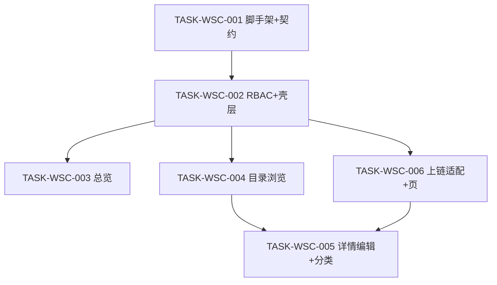

# 接入端工作台（WSC）V1.1 候选执行计划

```yaml
planId: PLAN-WSC-1.1
status: APPROVED
planType: APPROVED
snapshotId: SNAP-WSC-001
sourcePrd: product/prd/wsc-v1.0.md
basedOn: PLAN-WSC-1.0
round: 2
createdAt: 2026-07-28
approvedAt: 2026-07-28
taskCount: 6
waveCount: 5
requirementCount: 14
authorRoles: [planEditor]
approvalAuthority: planningCommittee-round-2
reviews:
  - planning/reviews/round-2/SUMMARY.md
```

> **批准声明**：Round 2 规划委员会（必需角色 5/5 + 可选角色 3/3）均已 `APPROVE`（见 `planning/reviews/round-2/`）。本文件为 Orchestrator 门禁发布的批准计划，可作为任务派发权威输入。候选稿仍保留于 `planning/proposals/PLAN-WSC-1.1.md`。

## 0. 相对 1.0 的修订说明

本版吸收 Round 1 全部有效异议。下表列出每条 ISSUE 与本计划修订位置；关闭须由原提出者在后续轮次确认 `closeWhen` 已满足。

| ISSUE id | severity | 本计划修订位置（如何满足 closeWhen） |
|---|---|---|
| ISSUE-SEC-R1-001 | P0 | §3.2 认证/会话模型；TASK-WSC-001/002 `acceptance`/`testScope`：V1 会话+角色变更后写 API 拒绝可测用例 |
| ISSUE-API-R1-001 | P0 | §3.1 契约表「版本化目录快照」；TASK-WSC-001 `acceptance`/`testScope`：schema+OpenAPI 按 versionId 可读完整快照，覆盖 REQ-CHAIN-001 |
| ISSUE-QA-R1-001 | P0 | §5.4 P0 Playwright E2E 清单；W5 `testScope`：场景步骤/命令/报告路径/独立 tester；§7.2 引用同一清单 |
| ISSUE-PA-R1-001 | medium | §2.2；TASK-WSC-001 OQ-004 schema/DTO；TASK-WSC-005 `acceptance`/`testScope`：「其他数据产品」无专属字段区 |
| ISSUE-PA-R1-002 | low | §7.7 NFR 发布勾选项；TASK-WSC-002/003/004 `acceptance` 含中文/反馈/桌面可用性；E2E 清单含 NFR 抽样 |
| ISSUE-SA-R1-001 | P1 | TASK-WSC-004/005 `writeSet`/`allowModify`/`denyModify` 拆为互斥子路径 `catalog/browse/**` ∥ `catalog/detail|editor|admin/**` |
| ISSUE-SA-R1-002 | P1 | §3.3 所有权矩阵增加 `frontend/src/api/**` = TASK-WSC-001 唯一写；后继只读 |
| ISSUE-SA-R1-003 | P2 | 从 TASK-WSC-005 移除 `schema-migration`；§3.4 增量迁移插入协议；005 仅消费 schema |
| ISSUE-QA-R1-002 | P1 | TASK-WSC-004 `testScope` 无结果空态；TASK-WSC-003 `testScope` 指标卡/最新流空库空态 |
| ISSUE-QA-R1-003 | P1 | TASK-WSC-005 `testScope`：新建 v1 四字段、编辑递增、失败无半成品；与 006 联测断言 |
| ISSUE-QA-R1-004 | P1 | §4.1 RBAC 矩阵表；TASK-WSC-002/005 `testScope` 三角色×三类写入口/API 必跑 |
| ISSUE-QA-R1-005 | P1 | TASK-WSC-005 `testScope`：DEC-WSC-003 一/二级挂载禁止删（原因可观测）、无挂载可删、非管理员不可达 |
| ISSUE-QA-R1-006 | P2 | §3.1 OVW 动态流契约；TASK-WSC-003 `testScope` seed/fixture 注入三类类型（不依赖未实现业务 API） |
| ISSUE-UX-R1-001 | P1 | §3.5 UI 状态矩阵；TASK-WSC-001/002/003/004/005/006 `acceptance`/`testScope`：loading/empty/error/success |
| ISSUE-UX-R1-002 | P1 | 同 PA-001：005+001 显式排除「其他数据产品」专属区；预览/详情同口径 |
| ISSUE-UX-R1-003 | P2 | §3.6 敏感标识展示约定；TASK-WSC-004/005/006 `acceptance` 复用截断+完整复制 |
| ISSUE-API-R1-002 | P1 | §3.1 OVW 动态流数据契约（类型枚举、最小字段、V1 供给方式）；003 引用 |
| ISSUE-API-R1-003 | P1 | §3.1 错误码目录最小集；001 冻结；002/005 `testScope` 引用同一码表 |
| ISSUE-API-R1-004 | P1 | §3.1 + 001：其他数据产品专属字段恒空/忽略或拒绝；与 005 对齐 |
| ISSUE-SEC-R1-002 | P1 | §3.7 敏感字段策略表；001 契约验收；005 `testScope` PII+日志脱敏 |
| ISSUE-SEC-R1-003 | P1 | §6.1 V1 最低审计事件集；映射 TASK-WSC-002/005 `acceptance`/`testScope` |
| ISSUE-SEC-R1-004 | P1 | §6 回滚口径改为备份恢复 / forward-fix；§7.6 runbook 路径 `ops/runbooks/wsc-v1-rollback.md` |

覆盖 ISSUE 数：**22**（P0×3 + 其余 19）。parallelPlanner / planEditor Round 1 无 ISSUE，DAG/005→004+006 约束保持。

## 1. 范围、假设与硬门禁

### 1.1 范围

- **In Scope**：Web 接入端工作台壳层与导航；三角色 RBAC；总览（指标、趋势、TOP、最新流、分布）；数据目录（浏览、筛选、预览、详情、新增/编辑、行业分类维护）；按产品查看上链版本与目录快照；模拟存证适配层（DEC-WSC-002）。
- **Out of Scope**（冻结自 SNAP）：数据登记完整业务流、交易订单履约、连接器管理（菜单占位）、真实区块链节点、移动端 App、多租户隔离、真实支付结算。

### 1.2 假设

- **绿地工程**：目标顶层目录为 `frontend/`、`backend/`、`contracts/`、`tests/`、`ops/`；本计划不假设已有业务源码。
- **需求权威**：全部实现必须引用 `SNAP-WSC-001`；需求变更须新建快照，不得静默改写快照或本计划已引用结论。
- **非阻塞开放问题**：`OQ-001`、`OQ-004` 保留但不阻塞实现（见 §2）；OQ-004 已下沉至契约与 TASK-WSC-005 验收。

### 1.3 技术栈硬门禁（RULE-ORG-STACK）

| 层 | 固定选型 |
|---|---|
| 前端 | Vue 3 + TypeScript + Vite + pnpm + Pinia + Vue Router 4 + Ant Design Vue |
| 后端 | Spring Boot 3.3.x + Java 17（DEC-WSC-004） |
| 数据 | PostgreSQL 16 + Flyway |
| 测试 | Vitest / JUnit 5 + Testcontainers / Playwright |
| 上链 | 可替换模拟存证适配层（DEC-WSC-002）；禁止业务层直连真实链 SDK |

禁止引入第二套 UI/状态/HTTP Client、第二套 Web 框架/ORM/迁移工具，除非 ADR 批准。

### 1.4 执行硬门禁

- `TASK-WSC-001` 为公共契约与脚手架的**唯一所有者**；后续任务只读契约制品，不得修改。
- 同一波次仅在依赖完成、契约冻结且 `writeSet` 无交集时并行。
- 任务完成 ≠ 开发自测通过。每个实现任务必须依次通过：**独立 developer → 独立 codeReviewer（actorInstance 不同）→ 独立 tester**；三者不得由同一实例兼任。
- 目录与模块写边界遵循 `RULE-PROJECT-LAYOUT` 与 `modules.yaml`（SHELL / RBAC / OVW / CAT / CHAIN）。
- Orchestrator scope check 按各任务 `writeSet` **字面路径**判定越界，触碰即 `SCOPE_VIOLATION`。

## 2. 已关闭决策索引与开放问题

### 2.1 已关闭决策（实现必须遵守）

| DEC | 主题 | 关闭 | 影响 REQ | 路径 |
|---|---|---|---|---|
| DEC-WSC-001 | 产品编码全局唯一与格式 `{DOMAIN}-{FEATURE}-{NNNN}` | OQ-002 | REQ-CAT-004、REQ-CAT-005 | `design/decisions/DEC-WSC-001.md` |
| DEC-WSC-002 | V1 上链采用模拟存证适配层；字段含 metadataHash / ownerDID / timestamp / certificate.owner | OQ-003 | REQ-CHAIN-001、REQ-CAT-005 | `design/decisions/DEC-WSC-002.md` |
| DEC-WSC-003 | 有挂载产品的行业分类禁止删除 | OQ-005 | REQ-CAT-006 | `design/decisions/DEC-WSC-003.md` |

### 2.2 非阻塞开放问题（不阻塞本计划实现）

| id | 处理口径 |
|---|---|
| OQ-001 | 数据登记 / 交易订单 / 连接器管理保持 Out of Scope；壳层点击提示「本版本未开放」 |
| OQ-004 | 「其他数据产品」V1 **仅基础信息**，**无**独立类型专属字段区；契约/UI/校验均不得要求第四套专属字段（见 §3.1、TASK-WSC-005） |

仍 blocking 的开放问题：**无**。本候选计划可进入独立评审，不因上述两项等待新 DEC。

## 3. 关键契约前置与唯一所有权

### 3.1 契约冻结内容（`wsc-contracts@1.1.0`）

`TASK-WSC-001` 一次性冻结以下契约：

| 契约类型 | 内容 |
|---|---|
| OpenAPI | REST 端点、DTO、错误码、统一响应包装、分页/筛选、认证与 403 语义 |
| RBAC 矩阵 | 管理员 / 提供方 / 普通用户 ×「维护行业分类」「新增产品」「编辑产品」及对应写 API（与 §4.1 一致） |
| Flyway 初版 schema | 行业分类、数据产品及类型专属字段、**上链版本记录 + 版本化目录快照**（不可变 JSON/列集，字段覆盖 REQ-CAT-004 分组或文档化子集；创建后可按 `versionId` 读取完整快照）、枚举约束、产品编码唯一索引 |
| 路由清单 | 前端路由与元信息（总览、目录、详情、编辑、上链信息、未开放占位） |
| 存证适配接口 | `ChainAttestationPort`：输入目录快照 → 输出 metadataHash / ownerDID / timestamp / certificate.owner；业务层仅依赖接口 |
| OVW 动态流数据契约 | 类型枚举至少含：`CATALOG_REGISTER`（目录登记）、`DATA_REGISTER`（数据登记）、`TRADE_ORDER`（交易订单）；最小字段：类型、主体、动作摘要、相对时间、上链记录标识；**V1 数据供给**：只读投影表或种子/fixture/模拟写入适配；**禁止**依赖未实现的登记/订单业务 API |
| 错误码目录（最小集） | `ERR_PRODUCT_CODE_FORMAT`（编码格式非法）、`ERR_PRODUCT_CODE_CONFLICT`（编码冲突）、`ERR_CATEGORY_HAS_PRODUCTS`（分类非空禁止删除，响应含原因与挂载数量）、`ERR_FORBIDDEN`（403 写拒绝）；统一响应包装字段与 OpenAPI 示例一致 |
| OQ-004 schema/DTO | 产品类型=`其他数据产品` 时：类型专属字段组不出现或恒为空；服务端忽略或拒绝多余专属字段载荷 |

### 3.2 V1 认证与会话模型（ISSUE-SEC-R1-001）

| 项 | V1 约定 |
|---|---|
| 机制 | 服务端会话（Session Cookie）或等价 JWT+服务端会话吊销表；契约 OpenAPI 标明鉴权方式与安全 scheme |
| 角色绑定 | 登录后会话携带当前角色；写 API 以服务端会话角色为准，禁止仅信前端 |
| 登出 | 立即失效会话/吊销令牌；后续写 API 返回未认证或 403 |
| 角色/权限变更 | 变更后须强制刷新或吊销旧会话；旧凭证调用写 API **必须拒绝**（可测） |
| 前端写入口 | 角色变更后立即按 §4.1 更新可见性；**不得**作为唯一防护 |

### 3.3 唯一所有权矩阵

| 共享制品 | 唯一写任务 | 其他任务权限 |
|---|---|---|
| `contracts/openapi/**` | TASK-WSC-001 | 只读 |
| `contracts/rbac/**` | TASK-WSC-001 | 只读 |
| `contracts/chain/**` | TASK-WSC-001 | 只读 |
| `contracts/errors/**`（错误码目录） | TASK-WSC-001 | 只读 |
| `contracts/overview/**`（OVW 动态流契约，可并入 openapi） | TASK-WSC-001 | 只读 |
| `backend/src/main/resources/db/migration/**` 初版 | TASK-WSC-001 | 只读；增量见 §3.4 |
| `frontend/src/router/**` 根路由清单 | TASK-WSC-001 | 只读；feature 内子路由扩展点除外须在任务声明 |
| `frontend/src/api/**`（OpenAPI 生成 client） | TASK-WSC-001 | 只读消费；禁止手改生成物；契约变更仅经 001 或串行契约任务重生 |
| 工程脚手架（根构建配置、前后端可启动骨架） | TASK-WSC-001 | 后续不得改动脚手架约定除非独立变更任务 |

后续模块通过预定义扩展点消费契约，**不得**直接编辑上述唯一所有制品。触碰即判定 `SCOPE_VIOLATION`。

### 3.4 增量迁移插入协议（ISSUE-SA-R1-003）

- 初版 Flyway **仅** TASK-WSC-001 可写。
- 若实现中发现 schema 不足：须经 Orchestrator 批准插入**独立串行**增量迁移任务（如 `TASK-WSC-00x-MIG`），独占 `**/db/migration/**`，不得与任何并行波次同跑；业务任务（含 005）**不得**改迁移目录。
- TASK-WSC-005 **不**携带 `schema-migration` 风险标签；其依赖「001 初版已覆盖 CAT/CHAIN 实体」或「已批准增量迁移 VERIFIED」。

### 3.5 主路径 UI 状态矩阵（ISSUE-UX-R1-001）

| 页面/操作 | loading | empty | error | success |
|---|---|---|---|---|
| 总览指标/趋势/流/分布 | 骨架或 spinner | 无数据占位文案 | 接口失败可重试提示 | — |
| 目录列表/筛选 | 列表 loading | 无结果明确空态文案 | 筛选失败提示 | — |
| 产品提交（新增/编辑） | 提交中禁用按钮 | — | 校验/业务错误码映射提示 | 成功反馈并进入目录/详情 |
| 分类维护保存 | 保存中 | — | 失败/禁止删除原因 | 成功反馈；索引刷新 |
| 上链列表/快照 | 加载中 | 无记录空态 | 加载失败 | — |
| 壳层未开放菜单 | — | — | — | 明确「本版本未开放」提示 |

TASK-WSC-001 路由/契约说明须引用本矩阵；各 feature 任务 acceptance 落实；testScope 至少含一条失败反馈与一条成功反馈断言。

### 3.6 敏感标识展示约定（ISSUE-UX-R1-003）

哈希、DID、供应商信用代码等：完整可读；UI 可截断展示并提供**完整复制**；CAT 预览/详情与 CHAIN 页复用同一展示组件约定。

### 3.7 敏感字段策略表（ISSUE-SEC-R1-002）

| 字段 | 存储 | API 响应 | 日志 |
|---|---|---|---|
| 涉及个人信息（布尔/标记） | 允许 | 按权限返回 | 可记标记值 |
| 供应商信用代码 | 允许 | 有权限可读；最小化列表字段 | **禁止明文** |
| ownerDID / metadataHash | 允许（上链版本/快照） | CHAIN/详情按 REQ 完整可读 | **禁止明文**或仅记截断指纹 |
| 产品概述等一般字段 | 允许 | 按契约 | 可记 |

001 契约验收须含本表；005 testScope 含 PII 读写与日志脱敏检查清单。

## 4. 任务包列表

> 每个实现任务完成后：独立 `developer` ≠ 独立 `codeReviewer`，再由独立 `tester` 执行 `testScope`；证据建议 `DEV-{taskId}` / `REV-{taskId}` / `TESTRUN-{taskId}`。审查与测试不另列 TASK，按波次门禁执行。

### 4.1 RBAC 可测矩阵（ISSUE-QA-R1-004）

| 角色 | 维护行业分类 UI | 分类写 API | 新增/编辑产品 UI | 产品写 API |
|---|---|---|---|---|
| 管理员 | 可见 | 200（合法请求） | 可见 | 200 |
| 提供方 | 不可见 | 403 `ERR_FORBIDDEN` | 可见 | 200 |
| 普通用户 | 不可见 | 403 | 不可见 | 403 |

TASK-WSC-002 与 TASK-WSC-005 tester 必跑本表（002 侧重壳层+安全过滤器；005 侧重分类/产品写路径落地后回归）。

### TASK-WSC-001 — 工程脚手架 + 契约冻结

- `requirements`: 全部 14 个 REQ（契约与工程底座覆盖；不作为功能主实现归属）
- `objective`: 创建可构建的前后端绿地工程，并一次性冻结 §3.1 全部契约（含版本化目录快照、OVW 流、错误码、OQ-004、认证 scheme）、生成 `frontend/src/api/**`、落盘 UI 状态矩阵引用与敏感字段表
- `dependsOn`: `[]`
- `readSet`: `product/requirements/SNAP-WSC-001.md`；`product/prd/wsc-v1.0.md`；`design/decisions/DEC-WSC-001.md`..`DEC-WSC-003.md`；`ai/rules/organization/RULE-ORG-STACK.md`；`ai/rules/project/RULE-PROJECT-LAYOUT.md`；`ai/rules/project/modules.yaml`
- `writeSet`: `frontend/`（脚手架与根配置）；`frontend/src/api/**`（生成 client）；`backend/`（脚手架与根配置）；`contracts/**`；`backend/src/main/resources/db/migration/**`（初版）；`frontend/src/router/**`（根清单）；`tests/`（测试框架配置，含 Playwright 脚手架）；`ops/runbooks/`（回滚 runbook 模板路径）
- `allowModify`: 仅 `writeSet` 内脚手架与契约；禁止实现业务 feature 模块
- `denyModify`: `ai/rules/**`；`product/**`；`planning/**`；`**/.env`；`**/application-local.yml`；`**/application-prod.yml`
- `acceptance`: 前后端可构建启动；OpenAPI/RBAC/Flyway/路由/存证接口/错误码/OVW 流动态契约齐备且无冲突；**版本化目录快照**可按 versionId 读取且字段覆盖 REQ-CAT-004 分组或文档化子集；OQ-004 专属字段口径写入 schema/OpenAPI；认证 security scheme 与 §3.2 一致；14 REQ 可映射到端点/页面/模型或测试约束；产品编码唯一与 DEC-WSC-001 一致；存证字段与 DEC-WSC-002 一致；`frontend/src/api/**` 由 OpenAPI 生成且版本可追踪；UI 状态矩阵（§3.5）与敏感字段表（§3.7）落入契约/说明制品
- `testScope`: OpenAPI lint；错误码目录与示例一致性；Flyway 空库应用；版本快照读写契约测试（创建后 get-by-versionId）；OQ-004 DTO 负例（多余专属字段忽略/拒绝）；前后端 build；契约-REQ 覆盖检查（含 REQ-CHAIN-001）；RBAC 矩阵制品存在性校验
- `riskTags`: `[schema-migration]`

### TASK-WSC-002 — RBAC 鉴权与工作台壳层

- `requirements`: `[REQ-RBAC-001, REQ-SHELL-001]`
- `objective`: 实现 §3.2 会话鉴权；三角色写入口/写 API 403；固定侧栏与未开放菜单；角色变更后写入口立即更新且旧会话写 API 拒绝；最低审计事件（登录失败、403）
- `dependsOn`: `[TASK-WSC-001]`
- `readSet`: `contracts/**`；`contracts/rbac/**`；`frontend/src/api/**`（只读）；根路由清单；SNAP-WSC-001
- `writeSet`: `frontend/src/features/auth/**`；`frontend/src/features/shell/**`；`frontend/src/layouts/**`；`backend/src/main/java/**/rbac/**`；`backend/src/main/java/**/security/**`；对应单元/集成测试目录
- `allowModify`: 仅 `writeSet`
- `denyModify`: `contracts/**`；`frontend/src/api/**`；`**/db/migration/**`；其他 feature（overview/catalog/chain）；`ai/**`；`product/**`
- `acceptance`: §4.1 三角色写入口可见性符合 SNAP；直接调用写 API 无权限返回 403/`ERR_FORBIDDEN`；登出与角色/权限变更后旧凭证写 API 拒绝；侧栏含「总览」「数据目录」；未开放菜单提示「本版本未开放」；企业信息可展示；中文界面；关键导航反馈明确；禁止仅靠前端隐藏；结构化安全日志含登录失败与 403（见 §6.1）
- `testScope`: §4.1 RBAC 矩阵必跑；403 负例；「权限撤销/变更后写 API 拒绝」集成用例；壳层占位交互；至少一条 error 反馈断言
- `riskTags`: `[]`

### TASK-WSC-003 — 总览 API 与 UI

- `requirements`: `[REQ-OVW-001, REQ-OVW-002, REQ-OVW-003, REQ-OVW-004, REQ-OVW-005]`
- `objective`: 实现总览核心指标、近 30 天趋势、TOP10、最新上链流（默认 10）、行业/地域分布；消费 §3.1 OVW 动态流契约
- `dependsOn`: `[TASK-WSC-002]`
- `readSet`: `contracts/openapi/**`（overview）；`contracts/overview/**`（若独立）；只读 schema；RBAC 只读；`frontend/src/api/**`（只读）；SNAP
- `writeSet`: `frontend/src/features/overview/**`；`backend/src/main/java/**/overview/**`；对应测试目录（含 fixture/seed）
- `allowModify`: 仅 `writeSet`
- `denyModify`: `contracts/**`；`frontend/src/api/**`；`**/db/migration/**`；auth/shell/catalog/chain feature
- `acceptance`: 指标含资产总数、活跃节点/企业、今日新增存证及最近更新时间；趋势空态与窗口缩放可读；TOP10 排序正确；最新流含三类类型字段且倒序；行业/地域口径与目录侧一致或有说明；§3.5 loading/empty/error 状态完备；中文与桌面分辨率可用；图表窗口变化可重绘
- `testScope`: overview API 集成；趋势图空态；**指标卡与最新流空库空态/占位断言**；口径 fixture：允许直接写入动态类型枚举（含 Out-of-Scope 类型文案），断言三类均展示且时间倒序，**禁止**依赖未实现登记/订单 API；至少一条接口失败 error 反馈断言
- `riskTags`: `[]`

### TASK-WSC-004 — 目录浏览、筛选与预览

- `requirements`: `[REQ-CAT-001, REQ-CAT-002, REQ-CAT-003]`
- `objective`: 实现左侧一级行业索引、中部二级下产品列表、右侧预览；多维筛选与关键词搜索；预览区进入详情/上链/编辑（按权限）入口
- `dependsOn`: `[TASK-WSC-002]`
- `readSet`: `contracts/openapi/**`（catalog 读接口）；只读 schema；RBAC 矩阵；枚举表；`frontend/src/api/**`（只读）
- `writeSet`: `frontend/src/features/catalog/browse/**`；`backend/src/main/java/**/catalog/browse/**`（列表/筛选/预览读路径）；对应测试目录
- `allowModify`: 仅 `writeSet` 所列 browse 路径；**不得**创建或填充 `catalog/detail/**`、`catalog/editor/**`、`catalog/admin/**` 及任何产品写/分类写实现
- `denyModify`: `contracts/**`；`frontend/src/api/**`；`**/db/migration/**`；`frontend/src/features/catalog/detail/**`；`frontend/src/features/catalog/editor/**`；`frontend/src/features/catalog/admin/**`；`backend/src/main/java/**/catalog/detail/**`；`backend/src/main/java/**/catalog/editor/**`；`backend/src/main/java/**/catalog/admin/**`；overview/chain/auth/shell
- `acceptance`: 三栏结构与列表字段符合 REQ-CAT-001；筛选组合与大小写不敏感搜索符合 REQ-CAT-002；无结果空态文案；预览三入口可达且普通用户无编辑按钮；预览区敏感标识按 §3.6；§3.5 loading/empty/error；中文与常见桌面分辨率可用
- `testScope`: catalog 查询集成；筛选组合；**筛选/搜索无结果空态**（文案或 testid）；预览权限可见性；至少一条筛选失败 error 反馈
- `riskTags`: `[]`

### TASK-WSC-005 — 产品详情/新增编辑与行业分类维护

- `requirements`: `[REQ-CAT-004, REQ-CAT-005, REQ-CAT-006]`
- `objective`: 实现产品详情只读分组；管理员/提供方新增编辑（DEC-WSC-001，提交后上架并调用存证适配产生版本）；管理员行业分类维护（DEC-WSC-003）；落实 OQ-004 与 PII/审计
- `dependsOn`: `[TASK-WSC-004, TASK-WSC-006]`
- `readSet`: catalog/chain 契约；错误码目录；DEC-WSC-001..003；`ChainAttestationPort` 实现（只读调用）；RBAC；SNAP；`frontend/src/api/**`（只读）
- `writeSet`: `frontend/src/features/catalog/detail/**`；`frontend/src/features/catalog/editor/**`；`frontend/src/features/catalog/admin/**`；`backend/src/main/java/**/catalog/detail/**`；`backend/src/main/java/**/catalog/editor/**`；`backend/src/main/java/**/catalog/admin/**`；对应测试目录
- `allowModify`: 仅 `writeSet`；通过依赖注入调用 chain 适配，**不得修改** `backend/.../chain/**`
- `denyModify`: `contracts/**`；`frontend/src/api/**`；`**/db/migration/**`（增量仅走 §3.4 独立任务）；`backend/.../chain/**`；`frontend/src/features/catalog/browse/**`；`backend/.../catalog/browse/**`；overview/auth/shell
- `acceptance`: 详情字段分组完整；编码格式/唯一性错误映射 `ERR_PRODUCT_CODE_*`；类型切换专属字段区（数据集/报告/接口）；**产品类型为「其他数据产品」时不展示、不校验类型专属字段区，仅基础信息**（预览/详情同口径）；标签回车增删；新建第 1 版上链、编辑版本递增；取消不落库；分类左右栏、待保存提示、非管理员不可进；有挂载产品删除返回 `ERR_CATEGORY_HAS_PRODUCTS` 且原因/数量可观测；敏感标识 §3.6；PII 按 §3.7；§3.5 success/error；产品提交/分类保存/删除拒绝写入审计事件（§6.1）
- `testScope`: 产品 CRUD；编码冲突码表；**新建 → version=1 且 metadataHash/ownerDID/timestamp/certificate.owner 齐全**；**编辑 → 版本严格递增且旧版本仍可读**；**适配失败 → 无产品半成品、无孤儿上链行**；OQ-004「其他数据产品」用例；DEC-WSC-003：挂载时删一/二级均失败且原因可观测、无挂载可删、非管理员不可达；§4.1 矩阵回归（分类写×提供方 403）；PII 读写与日志脱敏清单；成功反馈与失败反馈各至少一条
- `riskTags`: `[handles-pii]`

> 说明：`handles-pii` 因「涉及个人信息」及供应商信用代码等敏感标识。schema 变更走 §3.4，本任务不改迁移目录。

### TASK-WSC-006 — 上链信息页与模拟存证适配

- `requirements`: `[REQ-CHAIN-001]`（并为 REQ-CAT-005 提供可调用适配实现）
- `objective`: 实现可替换模拟存证适配层；按产品展示上链版本列表与选中版本目录快照（存证上链 + 权属证书字段完整可读）
- `dependsOn`: `[TASK-WSC-002]`
- `readSet`: `contracts/chain/**`；DEC-WSC-002；catalog 产品只读 API/模型（若需关联）；版本快照契约；RBAC；`frontend/src/api/**`（只读）
- `writeSet`: `frontend/src/features/chain/**`；`backend/src/main/java/**/chain/**`；对应测试目录
- `allowModify`: 仅 `writeSet`
- `denyModify`: `contracts/**`；`frontend/src/api/**`；`**/db/migration/**`；`backend/.../catalog/**`；overview/auth/shell
- `acceptance`: 适配输出含 metadataHash、ownerDID、timestamp、certificate.owner；业务层无真实链 SDK；列表默认最新优先；右侧快照完整（对齐 001 快照契约）；无记录空态；敏感标识 §3.6；§3.5 loading/empty/error
- `testScope`: 适配单元（可替换 mock）；上链列表/快照 API 集成（按 versionId 读快照）；CHAIN 页空态；敏感标识复制组件断言
- `riskTags`: `[]`

> 与 CAT 编辑同事务：产品提交由 TASK-WSC-005 编排；005 **依赖** 006 的适配实现已就绪。006 与 005 不得同波次并行。

## 5. 波次 / DAG

### 5.1 无环依赖图



拓扑序：`001 → 002 → {003, 004, 006} → 005`。所有边由早层指向晚层，**无环**。**TASK-WSC-005 仍 dependsOn `[TASK-WSC-004, TASK-WSC-006]`**。

### 5.2 并行波次

| 波次 | 可并行任务 | 启动条件 | 同波 writeSet 校验 |
|---|---|---|---|
| W1 | TASK-WSC-001 | SNAP-WSC-001 可读；DEC-WSC-001..003 已批准 | 单任务 |
| W2 | TASK-WSC-002 | 001 VERIFIED（契约冻结） | 单任务 |
| W3 | TASK-WSC-003、TASK-WSC-004、TASK-WSC-006 | 002 VERIFIED | `overview/**` ∥ `catalog/browse/**` ∥ `chain/**` 路径互斥，无交集 |
| W4 | TASK-WSC-005 | 004 与 006 均 VERIFIED | 单任务；写集为 `catalog/detail|editor|admin/**`，与已完成 004 的 browse 路径无并行冲突 |
| W5 | P0 E2E + 证据收敛（不另开实现 TASK） | 001..006 均完成独立 review+test | 仅允许 `tests/e2e/**`、报告类路径与缺陷回退；禁止改业务源码除非缺陷修复回退到对应任务 |

W3 建议合入序：`003 → 004 → 006`（可按完成先后调整，但不得与 005 并行合入）。

### 5.3 每任务审查/测试门禁（不另列 TASK）

1. `developer` 仅改 `allowModify`，提交 REQ→diff→测试声明。
2. 独立 `codeReviewer` 只读审；P0/P1 未关闭则 `REQUEST_CHANGES`。
3. 独立 `tester` 执行该任务 `testScope`；失败不得标通过。
4. Orchestrator 仅在 scope check、review、tests、交付物齐全后标 `VERIFIED`。

### 5.4 P0 Playwright E2E 清单（ISSUE-QA-R1-001）

| 项 | 约定 |
|---|---|
| 工具 | Playwright（RULE-ORG-STACK） |
| 负责波次 | W5；由**独立 tester** 执行（不得与对应功能 developer/codeReviewer 同一实例） |
| 场景步骤（对齐 SNAP 成功标准 / §7.2） | 1) 登录并切换/确认角色 → 2) 打开总览并核对核心指标可见 → 3) 进入数据目录，组合筛选/搜索 → 4) 打开产品详情 → 5) 打开上链信息并查看快照 → 6) 新增或编辑产品并确认产生链上版本 |
| 通过条件 | 上述步骤全部成功；P0 缺陷为 0；关键写路径 success 反馈可观测 |
| 失败条件 | 任一步骤失败、断言失败或阻塞缺陷 → **不得**标发布就绪 |
| 命令（建议） | `pnpm --filter frontend exec playwright test tests/e2e/p0-wsc.spec.ts`（以实现仓库脚本为准，须在报告中记录实际命令） |
| 报告路径 | `tests/e2e/reports/p0-wsc/`（HTML/JUnit 或等价）；证据 id 建议 `TESTRUN-WSC-E2E-P0` |
| NFR 抽样 | 界面中文；至少一次成功与一次失败反馈可观测（可与功能步骤合并断言） |

## 6. 风险与回滚

| 风险 | 标签 | 缓解 | 回滚 |
|---|---|---|---|
| Flyway 初版或增量迁移失败/损坏数据 | `schema-migration` | 001 唯一拥有初版；增量仅 §3.4 串行任务；先 staging 演练 | **备份恢复**和/或 **forward-fix** 迁移；禁止依赖不可靠的 down 脚本；演练证据见 §7.6 |
| 产品含「涉及个人信息」及信用代码等敏感展示 | `handles-pii` | §3.7 策略表；005 落库与 API 最小化；UI §3.6；日志脱敏 | 关闭相关字段展示开关或回退至只读版本 |
| 产品提交与存证同事务失败 | — | 005 依赖 006；适配失败则整单回滚，不产生半成品版本号 | 事务回滚；无孤儿上链记录 |
| 权限变更后旧会话仍可写 | — | §3.2 吊销/强制刷新；002 集成负例 | 紧急吊销全部会话 |
| 契约漂移 | — | 后继只读 contracts 与 `frontend/src/api/**`；CI openapi-diff | 拒绝合入；回退违规 diff |
| 范围蔓延（登记/订单/连接器） | — | 壳层占位；拒绝实现 Out of Scope API；OVW 流仅 fixture/投影 | 删除越界代码；保持菜单提示 |

### 6.1 V1 最低审计/日志事件集（ISSUE-SEC-R1-003）

| 事件 | 最低字段 | 归属任务 |
|---|---|---|
| 登录失败 | timestamp、主体标识（若有）、结果、原因码 | TASK-WSC-002 |
| 写 API 403 | timestamp、主体、角色、资源/动作、`ERR_FORBIDDEN` | TASK-WSC-002（过滤器）+ 005 回归 |
| 产品提交成功/失败 | timestamp、主体、产品编码、结果、错误码 | TASK-WSC-005 |
| 分类删除拒绝 | timestamp、主体、分类 id、挂载数量、`ERR_CATEGORY_HAS_PRODUCTS` | TASK-WSC-005 |

保留口径（V1）：结构化应用日志至少保留至 staging 验收结束；生产保留策略由运维负责人确认，不得在日志中明文输出 §3.7 禁止字段。

## 7. 发布门禁

进入 staging 验收 / 宣称 V1.0 可发布前，须同时满足：

1. **P0 REQ 全覆盖且对应任务 `VERIFIED`**：REQ-SHELL-001、REQ-RBAC-001、REQ-OVW-001、REQ-OVW-002、REQ-OVW-004、REQ-CAT-001..006、REQ-CHAIN-001（及本计划内 P1：REQ-OVW-003、REQ-OVW-005 亦须验收通过）。
2. **P0 缺陷为 0**；§5.4 E2E 清单在 staging 通过，报告落盘 `tests/e2e/reports/p0-wsc/`。
3. **契约与迁移**：`wsc-contracts@1.1.0` 无未决冲突；版本化目录快照契约可测；Flyway 可干净应用；回滚演练有证据（备份恢复或 forward-fix）。
4. **角色独立性**：每个实现任务留存 developer ≠ codeReviewer ≠ tester 证据；E2E 由独立 tester 执行。
5. **人类批准**：`maintainer`（或等价发布负责人）对发布包给出明确人类批准；**Plan Editor 不得伪造**任何角色的 `APPROVE`。
6. **运维 runbook**：`ops/runbooks/wsc-v1-rollback.md` 已写明备份/恢复或 forward-fix 步骤与证据落盘路径；staging 检查清单引用该文件（ISSUE-SEC-R1-004）。
7. **NFR 勾选**（ISSUE-PA-R1-002）：中文界面；关键写操作成功/失败反馈可观测；常见桌面分辨率下列表/筛选可用；图表窗口变化可重绘——由任务 acceptance 与 §5.4 NFR 抽样共同覆盖。
8. 本计划状态仍为 `IN_REVIEW` / `CANDIDATE`，直至规划委员会各必需角色独立批准且 Orchestrator 门禁通过后方可进入 `planning/approved/`。**Round 1 ISSUE 须由原提出者确认 closeWhen 后才可改 APPROVE；Plan Editor 不关闭 ISSUE。**

## 8. REQ 完整映射（主实现归属）

| 主任务 | REQ |
|---|---|
| TASK-WSC-002 | REQ-SHELL-001、REQ-RBAC-001 |
| TASK-WSC-003 | REQ-OVW-001、REQ-OVW-002、REQ-OVW-003、REQ-OVW-004、REQ-OVW-005 |
| TASK-WSC-004 | REQ-CAT-001、REQ-CAT-002、REQ-CAT-003 |
| TASK-WSC-005 | REQ-CAT-004、REQ-CAT-005、REQ-CAT-006 |
| TASK-WSC-006 | REQ-CHAIN-001 |

计数：`2 + 5 + 3 + 3 + 1 = 14`。每个 REQ 恰有一个主实现归属；TASK-WSC-001 提供契约与工程底座二级覆盖；REQ-CAT-005 对存证的运行时依赖由 TASK-WSC-006 提供，不改变主归属。

## 9. 计划自校验

```yaml
validation:
  referencedSnapshot: SNAP-WSC-001
  basedOn: PLAN-WSC-1.0
  status: IN_REVIEW
  planType: CANDIDATE
  revisionIssuesCovered: 22
  tasks:
    actual: 6
    result: PASS
  requirementCoverage:
    expected: 14
    mappedUnique: 14
    missing: []
    result: PASS
  dag:
    nodeCount: 6
    acyclic: true
    task005DependsOn: [TASK-WSC-004, TASK-WSC-006]
    result: PASS
  waves:
    count: 5
    sameWaveWriteSetIntersections: []
    w3Paths: [overview/**, catalog/browse/**, chain/**]
    result: PASS
  uniqueOwnership:
    contracts: TASK-WSC-001
    flywayInitial: TASK-WSC-001
    rootRoutes: TASK-WSC-001
    frontendApiClient: TASK-WSC-001
    result: PASS
  openQuestionsBlocking: []
  approval:
    granted: false
    reason: candidate-plan-awaiting-round-2-independent-reviews
    note: planEditor-must-not-close-ISSUEs-or-forge-APPROVE
```

## 10. 当前阻塞项（候选态）

- `BLOCKER-WSC-PLAN-001`：计划为 `CANDIDATE` / `IN_REVIEW`，必需规划角色尚未独立 `APPROVE`；**禁止**启动 developer 实现。
- `BLOCKER-WSC-PLAN-002`：绿地目录尚无可执行业务工程；属 TASK-WSC-001 预期工作，不得越过契约前置开工。
- `BLOCKER-WSC-PLAN-003`：Round 1 异议提出者尚未确认各 ISSUE `closeWhen`；本计划仅提供修订，不关闭 ISSUE。

（无需求侧 blocking OQ；DEC-WSC-001..003 已关闭。）
