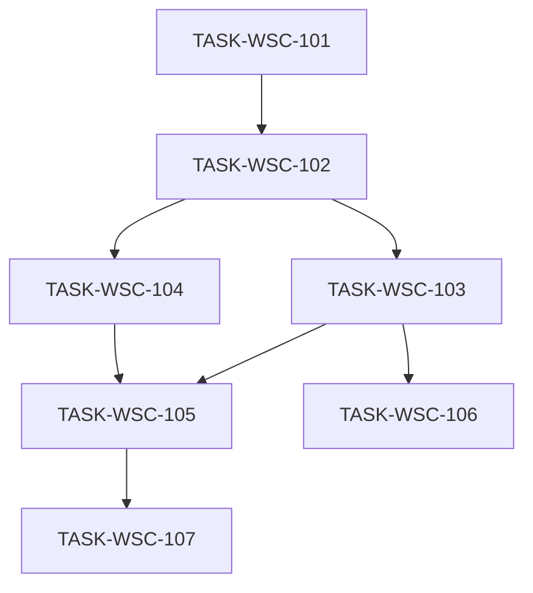

# 接入端工作台（WSC）V1.1 候选执行计划

```yaml
planId: PLAN-WSC-2.2
status: APPROVED
planType: APPROVED
snapshotId: SNAP-WSC-002
sourcePrd: product/prd/wsc-v1.1.md
runId: RUN-WSC-002
basedOn: PLAN-WSC-2.1
lineageFrom: PLAN-WSC-2.1
previousRun: RUN-WSC-001
round: 1
createdAt: 2026-07-30
taskCount: 7
waveCount: 5
requirementCount: 17
authorRoles: [planEditor]
```

> **批准声明**：Round 2 规划委员会（必需 5/5 + 可选 3/3）均已 `APPROVE`（见 `planning/reviews/wsc-2.2/round-2/`，隔离评审）。本文件为 Orchestrator 门禁发布的批准计划，可作为任务派发权威输入。候选稿保留于 `planning/proposals/PLAN-WSC-2.2.md`。

## 0. 相对 PLAN-WSC-2.1 的修订说明（Round 1 ISSUE）

下列 ISSUE 均来自 `planning/reviews/wsc-2.1/round-1/`。本表仅记录 planEditor 如何修订以满足各条 `closeWhen` 意图；**closeWhen 须原提出者在 Round 2 确认**，planEditor **不关闭**任何 ISSUE。

| ISSUE id | severity | 本文件修订位置 |
|---|---|---|
| ISSUE-SA-R1-001 | P1 | §5 全文内联 TASK-WSC-102..106 的 dependsOn/writeSet/denyModify/acceptance/testScope |
| ISSUE-PE-R1-002 | P1 | 同 SA-001；另内联 §1.3、§2、§4、§7、§8（禁止「同 2.0」） |
| ISSUE-PP-R1-001 | P1 | §5 任务包可调度字段完备；§6 可对单文件做并行写集 diff |
| ISSUE-PA-R1-003 | P1 | §3.2/§5 TASK-WSC-101：writeSet 显式纳入 overview 最小适配；denyModify 放开 overview |
| ISSUE-SA-R1-002 | P1 | 同 PA-003（方案 a：扩大 101，禁止新业务指标） |
| ISSUE-QA-R1-006 | P2 | 101 testScope：overview 只读 smoke（metrics + 最新流） |
| ISSUE-PE-R1-003 | P1 | §5.101：`migrateAllowlist` 字面 glob；删除 writeSet 内纯叙述条目 |
| ISSUE-SA-R1-003 | P1 | §5.101：旧树退役路径、`src/test/**`、骨架净新增 Java 白名单 |
| ISSUE-PA-R1-004 | P1 | §3.1 模板列最小集 + 三级分类列语义；107 testScope |
| ISSUE-QA-R1-003 | P1 | 107 testScope：partial-success fixture + required-field-missing；§6.1 E2E 引用 |
| ISSUE-QA-R1-005 | P2 | 107 testScope：报告字段白名单负例；临时文件清理可测手段 |
| ISSUE-API-R1-004 | P1 | §3.1 请求级 vs 行级错误语义；`ERR_IMPORT_ROW_INVALID` 仅为报告内原因码 |
| ISSUE-API-R1-005 | P2 | §3.5 错误报告 TTL + `ERR_IMPORT_REPORT_NOT_FOUND` |
| ISSUE-SEC-R1-002 | P1 | §3.5/107：报告下载鉴权+授权；testScope 负例 |
| ISSUE-UX-R1-001 | P2 | §3.4/107：导入结果四态可验收定义 |
| ISSUE-UX-R1-002 | P2 | §3.1/107：导入载体=目录页弹窗 |
| ISSUE-API-R1-003 | P1 | §3.1 Browse 分页写死 `page`/`pageSize`/`total` |
| ISSUE-QA-R1-004 | P1 | §6.1 E2E：命令、独立 tester、失败不得发布 |
| ISSUE-SEC-R1-001 | P1 | §3.3 会话模型继承 PLAN-WSC-1.1 §3.2；102 acceptance/testScope 负例 |
| ISSUE-PP-R1-002 | P2 | §6 显式声明 `104 ∥ 106` 写集互斥与合入约束 |
| ISSUE-PE-R1-004 | medium | frontmatter `round:1` + `lineageFrom`；本节与 §10 澄清谱系 vs 共识轮次 |

覆盖 ISSUE：**21**。关闭须原提出者在 Round 2 确认 `closeWhen`。

### 0.1 谱系与共识轮次（ISSUE-PE-R1-004）

| 概念 | 本计划取值 | 含义 |
|---|---|---|
| `lineageFrom` / `basedOn` | PLAN-WSC-2.1 | 相对上一候选的修订谱系 |
| `round` | 1 | **本 planId（2.2）** 待执行的共识轮次（即将进入 Round 2 独立评审） |
| §0 表 | 索引相对 2.1 的吸收修订 | **不**表示 ISSUE 已关闭，**不**代替本轮独立评审 |

### 0.2 相对 V1.0 / PLAN-WSC-1.1 定位

| 项 | 说明 |
|---|---|
| 基线 | `RUN-WSC-001` COMPLETED（`PLAN-WSC-1.1` + SNAP-WSC-001） |
| 本计划 | 产品 V1.1 **增量**；DEC-WSC-005 骨架为权威 |
| 需求权威 | 仅引用 `SNAP-WSC-002`；不得静默改写快照 |

## 1. 范围、假设与硬门禁

### 1.1 范围

- **In Scope**：SNAP-WSC-002 全部 17 REQ（含继承项的三级适配）。
- **Out of Scope**：数据登记/交易订单/连接器完整流；真实链；多租户；支付；导入模板全量类型专属列。

### 1.2 假设

- V1.0 前端/契约/行为可作为对照；**数据模型以三级分类为准**，允许破坏性 schema 迁移（须备份恢复演练）。
- OQ-V11-003：**目录维护条目 ≡ 数据产品**（同一可关联实体）；拆分须新 DEC。
- OQ-V11-004：导入默认**部分成功 + 错误报告**。
- 会话/鉴权：**V1.1 沿用 PLAN-WSC-1.1 §3.2**（见本计划 §3.3）。

### 1.3 技术栈硬门禁（RULE-ORG-STACK + DEC-WSC-005）

| 层 | 固定选型 |
|---|---|
| 前端 | Vue 3 + TypeScript + Vite + pnpm + Pinia + Vue Router 4 + Ant Design Vue |
| 后端 | Spring Boot **2.7.18** + Java 17；Maven 多模块 `backend/app/<service>/` |
| 数据 | **MySQL** + Flyway（`sql/init` + `sql/migration`） |
| 缓存 | Spring Data Redis |
| API 文档 | Knife4j / OpenAPI 3 |
| 测试 | Vitest / JUnit 5 + Testcontainers / Playwright |
| 上链 | 模拟存证适配层（DEC-WSC-002） |

禁止：多数据源；向遗留 `db/migration/` 追加新脚本；第二套 ORM/Web 框架。

### 1.4 执行硬门禁

- `TASK-WSC-101` 唯一拥有契约升级与骨架迁移初版；后继只读 `contracts/**` 与生成 `frontend/src/api/**`。
- 写路径以 `RULE-PROJECT-LAYOUT` 多模块 glob 为准（`backend/app/*/…`）。
- 每任务：独立 developer → codeReviewer → tester；Orchestrator 按各任务 `writeSet` / `migrateAllowlist` **字面路径**做 scope-check。
- developer ≠ codeReviewer ≠ tester。

## 2. 决策与开放问题

### 2.1 必须遵守的 DEC

| DEC | 本计划用法 |
|---|---|
| DEC-WSC-001 | 编码唯一；导入与编辑均适用 |
| DEC-WSC-002 | 导入成功行与编辑提交均产生存证版本 |
| DEC-WSC-003 | 三级任一节点有挂载则禁止删除 |
| DEC-WSC-004 | Java 17 |
| DEC-WSC-005 | 骨架、MySQL、Redis、sql 目录；迁后禁止与 V1.0 `db/migration` 混用无 sole authority |

### 2.2 开放问题处理口径

| id | 口径 |
|---|---|
| OQ-001 / OQ-004 | 同 V1.0；不阻塞；本版 Out of Scope / 仍仅基础信息 |
| OQ-V11-003 | 同一可关联条目；schema 单表/单聚合；§3.1 硬约束 |
| OQ-V11-004 | 部分成功 + 失败行错误报告；全有全无须新 DEC |

## 3. 契约升级与唯一所有权

### 3.1 契约冻结内容（`wsc-contracts@2.0.0`）

由 `TASK-WSC-101` 一次性冻结/升级：

| 契约 | 内容 |
|---|---|
| 资源模型 | **目录维护条目 ≡ 数据产品**（同一资源 id/编码）；OpenAPI 不得拆两套冲突实体 |
| OpenAPI | 三级分类 CRUD；目录维护关联（单条/批量）；产品/上链/总览适配三级路径；批量导入（见下） |
| 批量导入 API（同步） | `POST` 上传（multipart）；响应含 `successCount`/`failureCount`/`reportId`（`failureCount=0` 时 reportId 可空）；`GET` 模板；`GET` 错误报告（按 reportId）；**V1.1 不采用异步 job 轮询** |
| 导入模板列最小集（ISSUE-PA-R1-004） | 至少含：产品名称、产品编码、产品类型、**行业分类**、数据来源、更新频率、涉及个人信息、涉及公共数据、交付方式、计费方式、价格。**行业分类列语义**：须能解析到可挂载的**三级**节点（接受三级 id，或「空间/行业/子类」完整路径；仅二级标签而无三级 → 行级失败，原因含分类不匹配/缺三级） |
| 导入错误语义（ISSUE-API-R1-004） | **请求级**（整单拒绝、无部分写入）：文件 >10MB → `ERR_IMPORT_FILE_TOO_LARGE`；无法解析/非 xlsx\|csv → 格式类错误码（可继承/补充 FORMAT）。HTTP 为错误响应。**行级**失败只进入错误报告（行号+产品编码+原因码/文案）；文件已接受并处理完成后返回**成功 envelope** + `successCount`/`failureCount`/`reportId`（`failureCount>0` 时 reportId **必填**）。`ERR_IMPORT_ROW_INVALID` **仅作报告内原因码**，不作整单 HTTP envelope code |
| Browse 分页（ISSUE-API-R1-003） | **写死继承 V1.0**：查询 `page` + `pageSize`；响应 `items` + `page` + `pageSize` + `total`。滚动加载 = 筛选条件不变下递增 `page`。**禁止**本版改用 offset/limit 或仅以 `hasMore` 替代 `total`（除非另立 DEC） |
| 导入 UI 载体（ISSUE-UX-R1-002） | V1.1 采用**目录页弹窗**（对齐原型 `#import-modal`）；入口在目录「新增」菜单；关闭后回到目录浏览表面 |
| RBAC | 见 §4 |
| Flyway | `sql/init` + `sql/migration`；三级树；产品挂三级；禁止新脚本入 `db/migration/` |
| 错误码 | 继承 V1.0 最小集；新增至少：`ERR_IMPORT_FILE_TOO_LARGE`、`ERR_IMPORT_ROW_INVALID`（报告内）、`ERR_CATEGORY_LEAF_REQUIRED`、`ERR_MAINTENANCE_FORBIDDEN`、`ERR_IMPORT_REPORT_NOT_FOUND`（过期/未知 reportId） |
| 存证快照 | 含三级分类路径字段 |
| OVW | 既有 overview DTO/端点须在 101 内完成契约/查询适配并可编译启动；破坏性变更不得留给无写集任务 |

### 3.2 唯一所有权矩阵

| 共享制品 | 唯一写任务 | 其他任务 |
|---|---|---|
| `contracts/**` | TASK-WSC-101 | 只读 |
| `frontend/src/api/**` | TASK-WSC-101 | 只读 |
| `backend/app/*/src/main/resources/sql/**` 本轮迁移 | TASK-WSC-101 | 只读；增量见 §3.4 |
| 多模块父/子 POM 与启动脚手架 | TASK-WSC-101 | 后继不得推翻模块约定 |
| 根路由增量 | TASK-WSC-101 | feature 子路由按任务声明 |
| overview 最小适配（前后端） | TASK-WSC-101 | 仅 schema/契约对齐；禁止新业务指标；后继不得改 overview 除非缺陷回退到 101 |

### 3.3 V1.1 认证与会话模型（ISSUE-SEC-R1-001）

**显式继承** `planning/approved/PLAN-WSC-1.1.md` §3.2：

| 项 | 约定 |
|---|---|
| 机制 | 服务端会话（Session Cookie）或等价 JWT+服务端会话吊销表；OpenAPI 标明鉴权方式与安全 scheme |
| 角色绑定 | 登录后会话携带当前角色；写 API 以服务端会话角色为准，禁止仅信前端 |
| 登出 | 立即失效会话/吊销令牌；后续写 API 返回未认证或 403 |
| 角色/权限变更 | 变更后须强制刷新或吊销旧会话；旧凭证调用写 API **必须拒绝**（可测） |
| 前端写入口 | 角色变更后立即按 §4 更新可见性；**不得**作为唯一防护 |

### 3.4 增量迁移协议

- 初版/升级迁移仅 101；不足时 Orchestrator 插入串行 `TASK-WSC-10x-MIG`，独占 `sql/migration/**`。
- 业务任务不得改 `sql/**`。

### 3.5 导入安全、报告生命周期与敏感字段

| 项 | 约定 |
|---|---|
| 原始上传文件 | 仅临时存储；导入处理结束后删除或 TTL≤24h（staging 可更短） |
| 错误报告字段白名单 | 行号、产品编码、原因码/原因文案；**禁止**回显完整信用代码、ownerDID、明文哈希 |
| 错误报告 TTL（ISSUE-API-R1-005） | 与上传对齐，≤24h；过期或未知 `reportId` → `404` / `ERR_IMPORT_REPORT_NOT_FOUND` |
| 错误报告鉴权（ISSUE-SEC-R1-002） | 须已认证；仅**管理员或提供方**（具备导入权限的角色）可下载；匿名/普通用户 `GET` → 403 |
| 日志 | 不得记上传文件全文；敏感字段遵循 PLAN-WSC-1.1 精神 |

### 3.6 UI 状态矩阵（增量）

继承 PLAN-WSC-1.1 §3.5 主路径四态，并增加：

| 页面/操作 | loading | empty | error | success |
|---|---|---|---|---|
| 目录维护列表 | 列表 loading | 无条目/筛选空态 | 加载失败 | 单条/批量保存成功反馈 |
| 批量导入（提交中） | 上传/解析中（提交控件禁用） | — | 见下方四态 | 见下方四态 |

**导入结果四态（ISSUE-UX-R1-001）** — 可验收、禁止混淆：

| 态 | 判定 | UI 最低要求 |
|---|---|---|
| ① 全成功 | `successCount>0` 且 `failureCount=0` | 可关闭/可重传；无报告亦可 |
| ② 部分成功 | `successCount>0` 且 `failureCount>0` | **同时**可观测两计数 + 错误报告入口 + 可关闭/重传；**禁止**仅标「导入失败」而无成功计数 |
| ③ 全失败（行级） | `successCount=0` 且 `failureCount>0` | 失败计数 + 报告 + 可关闭/重传 |
| ④ 文件级拒绝 | 请求级错误（超限/非法格式） | 停留上传步或等价提示；映射 `ERR_IMPORT_FILE_TOO_LARGE` 等；**不**伪装成行级结果态 |

## 4. RBAC 可测矩阵

| 角色 | 三级分类维护 | 目录维护 | 新增/编辑 | 批量导入 | 对应写 API |
|---|---|---|---|---|---|
| 管理员 | 可见 | 可见 | 可见 | 可见 | 200（合法） |
| 提供方 | 不可见 | 不可见 | 可见 | 可见 | 分类/维护 403；产品写/导入 200 |
| 普通用户 | 不可见 | 不可见 | 不可见 | 不可见 | 全部写 403；错误报告 GET 403 |

TASK-WSC-102 侧重壳层+会话过滤器；103/106/107 侧重各写路径落地后回归。

## 5. 任务包列表

> 任务 ID 自 `TASK-WSC-101` 起，避免与 V1.0 `TASK-WSC-001..006` 冲突。本节全文内联，**禁止**外挂「同 2.0」。

### TASK-WSC-101 — data-chain 骨架迁移 + 契约升级 + OVW 最小适配

- `requirements`: 全部 17 REQ（底座覆盖；OVW 编译/契约适配；非功能主实现）
- `objective`: 将后端迁至 `backend/app/<service>/`（Boot 2.7.18 / MySQL / Redis / Flyway sql 布局）；冻结 `wsc-contracts@2.0.0`（含 §3.1 全部条目）；生成 client；空库 init→migration 可启动；文档化相对 V1.0 schema 迁移/重建策略；**overview 前后端最小适配至可编译启动**（仅 schema/契约对齐，禁止新业务指标）
- `dependsOn`: `[]`
- `readSet`: SNAP-WSC-002；DEC-WSC-001..005；RULE-ORG-STACK；RULE-PROJECT-LAYOUT；既有 `contracts/**`（只读对照）；PLAN-WSC-1.1 §3.2（会话 scheme 对照）
- `writeSet`（字面路径，纳入 scope-check）:
  - `backend/pom.xml`
  - `backend/app/*/pom.xml`
  - `backend/app/*/src/main/resources/**`（含 `sql/init/**`、`sql/migration/**`、`application*.yml` 样例）
  - `backend/app/*/src/main/java/**/WscApplication.java`（或等价启动类）
  - `backend/app/*/src/main/java/**/config/**`
  - `backend/app/*/src/main/java/**/common/**`
  - `backend/app/*/src/main/java/**/overview/**`（OVW 最小适配）
  - `backend/app/*/src/test/**`
  - `frontend/src/features/overview/**`（OVW 最小适配；仅契约/DTO 对齐所需）
  - `contracts/**`
  - `frontend/src/api/**`
  - `frontend/src/router/**`（根增量）
  - `ops/runbooks/**`
  - 前端根构建配置（若必须）：`frontend/package.json`、`frontend/vite.config.*`、`frontend/tsconfig*.json`、`frontend/pnpm-lock.yaml`（仅对齐骨架/client 生成所必需）
  - 测试框架配置（若必须）：`tests/e2e/playwright.config.ts`、`tests/e2e/**/*.ts` 脚手架（禁止实现业务断言冒充 VERIFIED）
- `migrateAllowlist`（字面路径，纳入 scope-check；ISSUE-PE-R1-003 / SA-R1-003）:
  | 操作 | 路径 glob |
  |---|---|
  | 迁出源（移动/改 package + 编译修复） | `backend/src/main/java/com/wsc/**` |
  | 迁入目标 | `backend/app/*/src/main/java/com/wsc/**` |
  | 旧扁平树退役（允许删除） | `backend/src/**` |
  | 旧迁移目录退役（禁止再作权威；允许删除或移入 archive 说明） | `backend/src/main/resources/db/migration/**` |
  | 骨架净新增 Java（白名单） | 仅 `writeSet` 已列之 `**/config/**`、`**/common/**`、`**/WscApplication.java`、`**/overview/**`；其他包须先列入本表并更新计划，**禁止**叙述性例外 |
- `allowModify`: 仅 `writeSet` ∪ `migrateAllowlist`；禁止实现 catalog/shell/auth/chain 业务页（overview 除外且仅最小适配）
- `denyModify`: `ai/rules/**`；`product/**`；`planning/**`；密钥类配置（`**/.env`、`**/application-local.yml`、`**/application-prod.yml`）；`frontend/src/features/catalog/**`；`frontend/src/features/shell/**`；`frontend/src/features/auth/**`；`frontend/src/features/chain/**`；向 `**/db/migration/**` **追加新版本脚本**
- `acceptance`:
  - `/health`、`/doc.html` 可达；空库走 `sql/init`→`sql/migration`
  - 契约含三级/维护/导入同步 DTO；Browse 字段名为 `page`/`pageSize`/`total`；维护条目≡产品
  - 导入：模板列最小集 + 三级分类列语义；请求级 vs 行级错误示例（整单拒绝 vs 部分成功 envelope）
  - overview 模块可编译启动；禁止新脚本入 `db/migration/`；迁移完成后旧扁平源码与 `db/migration` **不得再作为权威**
  - 17 REQ 可映射到端点或约束
- `testScope`:
  - 空库 init+migrate；OpenAPI lint；契约-REQ 覆盖；后端 package + 前端 build
  - overview 只读 smoke：至少 metrics + 最新流可达或空态友好（ISSUE-QA-R1-006）
- `riskTags`: `[schema-migration]`

### TASK-WSC-102 — 壳层与 RBAC 增量

- `requirements`: `[REQ-SHELL-001, REQ-RBAC-001]`
- `objective`: 实现/保持 §3.3 会话鉴权；管理员侧栏「目录维护」；占位菜单未开放；三角色写入口含批量导入可见性；写 API 403 对齐 §4；角色变更后目录维护与导入入口立即更新且旧会话写 API 拒绝
- `dependsOn`: `[TASK-WSC-101]`
- `readSet`: `contracts/**`；`frontend/src/api/**`（只读）；根路由清单；SNAP-WSC-002；本计划 §3.3/§4
- `writeSet`:
  - `frontend/src/features/shell/**`
  - `frontend/src/features/auth/**`
  - `frontend/src/layouts/**`
  - `backend/app/*/src/main/java/**/rbac/**`
  - `backend/app/*/src/main/java/**/security/**`
  - 对应单元/集成测试目录（与上述路径对称的 `**/src/test/**` 或 `frontend/**/__tests__/**`）
- `denyModify`: `contracts/**`；`frontend/src/api/**`；`**/sql/**`；`frontend/src/features/catalog/**`；`frontend/src/features/overview/**`；`frontend/src/features/chain/**`；`backend/app/*/src/main/java/**/catalog/**`；`backend/app/*/src/main/java/**/overview/**`；`backend/app/*/src/main/java/**/chain/**`
- `acceptance`:
  - §4 矩阵壳层侧通过
  - 角色切换后目录维护与导入入口立即更新
  - **沿用 §3.3**：登出或角色/权限变更后，分类维护/目录维护/导入等写 API **拒绝**（ISSUE-SEC-R1-001）
- `testScope`:
  - §4 矩阵（壳层+过滤器）；非管理员不可见目录维护
  - 至少一条「登出或角色变更后写 API 拒绝」可测用例（覆盖分类维护或目录维护或导入之一即可，建议覆盖导入写路径）
- `riskTags`: `[]`

### TASK-WSC-103 — 三级分类维护

- `requirements`: `[REQ-CAT-006]`
- `objective`: 空间/行业/子类维护弹窗与 API；待保存提示；有挂载禁止删（DEC-WSC-003）；至少保留一个三级
- `dependsOn`: `[TASK-WSC-102]`
- `writeSet`:
  - `frontend/src/features/catalog/admin/**`
  - `backend/app/*/src/main/java/**/catalog/admin/**`
  - 对应测试
- `denyModify`: `contracts/**`；`frontend/src/api/**`；`**/sql/**`；`frontend/src/features/catalog/browse/**`；`frontend/src/features/catalog/detail/**`；`frontend/src/features/catalog/editor/**`；`frontend/src/features/catalog/maintenance/**`；`frontend/src/features/catalog/import/**`；`backend/app/*/src/main/java/**/catalog/browse/**`；`backend/app/*/src/main/java/**/catalog/detail/**`；`backend/app/*/src/main/java/**/catalog/editor/**`；`backend/app/*/src/main/java/**/catalog/maintenance/**`；`backend/app/*/src/main/java/**/catalog/import/**`；`frontend/src/features/chain/**`；`frontend/src/features/overview/**`；`backend/app/*/src/main/java/**/chain/**`；`backend/app/*/src/main/java/**/overview/**`
- `acceptance`: 三级分栏增改；级联刷新；非管理员不可达；删挂载分类返回明确错误码；至少保留一个三级
- `testScope`: CRUD；禁止删除负例；非管理员 403；至少保留一个三级
- `riskTags`: `[]`

### TASK-WSC-104 — 目录浏览升级

- `requirements`: `[REQ-CAT-001, REQ-CAT-002, REQ-CAT-003]`
- `objective`: 顶部空间/行业标签；子类分组列表；预览与三级路径；筛选对齐三级；滚动加载更多（`page`/`pageSize`/`total`）
- `dependsOn`: `[TASK-WSC-102]`
- `writeSet`:
  - `frontend/src/features/catalog/browse/**`
  - `backend/app/*/src/main/java/**/catalog/browse/**`
  - 对应测试
- `denyModify`: `contracts/**`；`frontend/src/api/**`；`**/sql/**`；`frontend/src/features/catalog/admin/**`；`frontend/src/features/catalog/detail/**`；`frontend/src/features/catalog/editor/**`；`frontend/src/features/catalog/maintenance/**`；`frontend/src/features/catalog/import/**`；`backend/app/*/src/main/java/**/catalog/admin/**`；`backend/app/*/src/main/java/**/catalog/detail/**`；`backend/app/*/src/main/java/**/catalog/editor/**`；`backend/app/*/src/main/java/**/catalog/maintenance/**`；`backend/app/*/src/main/java/**/catalog/import/**`
- `acceptance`: 标签切换更新产品集；分节字段符合 SNAP；滚动加载有 loading 且保留滚动位置与筛选；分页契约字段为 `page`/`pageSize`/`total`
- `testScope`:
  - 标签切换；筛选空态；滚动加载；预览权限入口
  - **追加**：设置筛选 → load-more → 结果仍满足筛选；scroll 位置抽样保留
- `riskTags`: `[]`

### TASK-WSC-105 — 详情/编辑适配三级 + 上链快照路径

- `requirements`: `[REQ-CAT-004, REQ-CAT-005, REQ-CHAIN-001]`
- `objective`: 详情/编辑分类选择器为三级；提交仍产生存证版本；上链快照展示三级路径；回归 OQ-004/DEC-001/002
- `dependsOn`: `[TASK-WSC-103, TASK-WSC-104]`
- `writeSet`:
  - `frontend/src/features/catalog/detail/**`
  - `frontend/src/features/catalog/editor/**`
  - `frontend/src/features/chain/**`
  - `backend/app/*/src/main/java/**/catalog/detail/**`
  - `backend/app/*/src/main/java/**/catalog/editor/**`
  - `backend/app/*/src/main/java/**/chain/**`
  - 对应测试
- `denyModify`: `contracts/**`；`frontend/src/api/**`；`**/sql/**`；`frontend/src/features/catalog/browse/**`；`frontend/src/features/catalog/admin/**`；`frontend/src/features/catalog/maintenance/**`；`frontend/src/features/catalog/import/**`；`backend/app/*/src/main/java/**/catalog/browse/**`；`backend/app/*/src/main/java/**/catalog/admin/**`；`backend/app/*/src/main/java/**/catalog/maintenance/**`；`backend/app/*/src/main/java/**/catalog/import/**`；`frontend/src/features/overview/**`；`backend/app/*/src/main/java/**/overview/**`
- `acceptance`: 三级路径展示/选择；新建 v1 / 编辑递增；CHAIN 快照含三级；普通用户无编辑
- `testScope`: 编码冲突；版本递增；适配失败无半成品；快照按 versionId；§4 产品写矩阵回归
- `riskTags`: `[handles-pii]`

### TASK-WSC-106 — 目录维护（关联）

- `requirements`: `[REQ-CAT-007]`
- `objective`: 目录维护页：全部/已维护/待关联；一二三级筛选；分页（`page`/`pageSize`/`total`）；单条维护；批量关联
- `dependsOn`: `[TASK-WSC-103]`
- `writeSet`:
  - `frontend/src/features/catalog/maintenance/**`
  - `backend/app/*/src/main/java/**/catalog/maintenance/**`
  - 对应测试
- `denyModify`: `contracts/**`；`frontend/src/api/**`；`**/sql/**`；`frontend/src/features/catalog/browse/**`；`frontend/src/features/catalog/detail/**`；`frontend/src/features/catalog/editor/**`；`frontend/src/features/catalog/admin/**`；`frontend/src/features/catalog/import/**`；`backend/app/*/src/main/java/**/catalog/browse/**`；`backend/app/*/src/main/java/**/catalog/detail/**`；`backend/app/*/src/main/java/**/catalog/editor/**`；`backend/app/*/src/main/java/**/catalog/admin/**`；`backend/app/*/src/main/java/**/catalog/import/**`
- `acceptance`: 状态页签与筛选；单条保存/取消；批量栏数量与批量保存；提供方/普通用户不可达；分页字段同 Browse 约定
- `testScope`: 待关联→已维护；批量关联；非管理员 403；分页
- `riskTags`: `[]`

### TASK-WSC-107 — 批量导入产品

- `requirements`: `[REQ-CAT-008]`
- `objective`: xlsx/csv 导入（目录页弹窗）；模板下载；≤10MB；同步结果四态；错误报告；成功行可检索并上链
- `dependsOn`: `[TASK-WSC-105]`
- `writeSet`:
  - `frontend/src/features/catalog/import/**`
  - `backend/app/*/src/main/java/**/catalog/import/**`
  - 对应测试与 `tests/fixtures/import/**`
- `allowModify`: 仅 writeSet；通过 DI **只读调用**已有产品写入/存证端口（不得修改其实现目录）
- `denyModify`:
  - `frontend/src/features/catalog/browse/**`
  - `frontend/src/features/catalog/detail/**`
  - `frontend/src/features/catalog/editor/**`
  - `frontend/src/features/catalog/admin/**`
  - `frontend/src/features/catalog/maintenance/**`
  - `backend/app/*/src/main/java/**/catalog/browse/**`
  - `backend/app/*/src/main/java/**/catalog/detail/**`
  - `backend/app/*/src/main/java/**/catalog/editor/**`
  - `backend/app/*/src/main/java/**/catalog/admin/**`
  - `backend/app/*/src/main/java/**/catalog/maintenance/**`
  - `backend/app/*/src/main/java/**/chain/**`
  - `contracts/**`
  - `frontend/src/api/**`
  - `**/sql/**`
- `acceptance`:
  - §4 权限；目录页弹窗入口可达；关闭后回到目录浏览
  - ≤10MB；同步导入结果 DTO；§3.6 四态可区分
  - 部分成功：计数可观测 + 错误报告入口；临时文件清理；错误报告字段白名单
  - 报告下载：登录态 + 管理员/提供方；普通用户/未认证 403
  - 成功行可检索并上链
- `testScope`:
  - `tests/fixtures/import/` **至少**含：
    | fixture | 期望 |
    |---|---|
    | `full-success` | failureCount=0；可无 reportId |
    | `partial-success` | 同文件 ≥1 成功且 ≥1 失败；断言 successCount/failureCount；reportId 必填；报告可下载 |
    | `code-conflict` | 失败行含编码冲突 |
    | `category-mismatch` | 缺三级/错误三级 → 行级失败 |
    | `required-field-missing` | 必填缺失失败行（可并入 partial-success 的失败原因之一，但须可单独识别） |
    | `oversize` | 请求级拒绝；映射 `ERR_IMPORT_FILE_TOO_LARGE`；非行级结果态 |
  - 模板列齐全断言；CHAIN 字段；报告入口
  - 错误报告仅含白名单字段的负例/抽样断言（ISSUE-QA-R1-005）
  - 临时文件清理：自动化钩子/TTL 观测，或明确运维抽检证据路径（须在测试报告写明采用方式）
  - 未认证或普通用户 `GET` report → 403（ISSUE-SEC-R1-002）
  - 入口可达 + 结果态后关闭回到目录表面（ISSUE-UX-R1-002）
- `riskTags`: `[handles-pii]`

## 6. 波次 / DAG



| 波次 | 任务 | 启动条件 | 同波/跨波并行写集校验 |
|---|---|---|---|
| W1 | 101 | SNAP-WSC-002 APPROVED | 单任务 |
| W2 | 102 | 101 VERIFIED | 单任务 |
| W3 | 103 ∥ 104 | 102 VERIFIED | `catalog/admin/**` ∥ `catalog/browse/**` 无交集 |
| W4 | 105 ∥ 106 | **105**：103+104 VERIFIED；**106**：仅 103 VERIFIED 后可启动，**不得与 103 并行**；105∥106 当 writeSet 无交集（maintenance ∥ detail/editor/chain） | 见下 |
| W5 | 107；E2E | 105 VERIFIED 后 107；101..107 均 VERIFIED 后 E2E | E2E 仅 `tests/e2e/**` 与报告路径 |

**并行对显式清单（含 ISSUE-PP-R1-002）：**

| 并行对 | 条件 | writeSet 核心 | 合入约束 |
|---|---|---|---|
| 103 ∥ 104 | 同属 W3 | admin ∥ browse | 禁止单 PR 混写两任务路径 |
| 105 ∥ 106 | 同属 W4 | detail/editor/chain ∥ maintenance | 同上；建议先完成者先合 |
| **104 ∥ 106** | 106 可在 104 未完成时启动 | browse ∥ maintenance | **当且仅当** writeSet 无交集；禁止单 PR 混写两任务路径 |

### 6.1 E2E 清单（W5）（ISSUE-QA-R1-004）

| 项 | 约定 |
|---|---|
| 工具 | Playwright（RULE-ORG-STACK） |
| 负责 | 由**独立 tester** 执行（不得与对应功能 developer/codeReviewer 同一实例） |
| 命令（建议） | `pnpm exec playwright test --config=tests/e2e/playwright.config.ts`（以实现仓库脚本为准，须在报告中记录实际命令） |
| 报告路径 | `tests/e2e/reports/p0-wsc-v1.1/`（HTML/JUnit 或等价）；证据 id：`TESTRUN-WSC-E2E-V11` |
| 失败条件 | 任一步骤失败、断言失败或阻塞缺陷 → **不得**标发布就绪 |
| 通过条件 | 下表场景全部成功；P0 缺陷为 0 |

| # | 场景 | 对齐 REQ / 断言要点 |
|---|---|---|
| 1 | V1.0 P0 主路径回归 | 登录/角色；**OVW 核心指标可见**；目录筛选；详情；上链；新增/编辑产生版本 |
| 2 | 三级分类维护 | CAT-006 |
| 3 | 目录维护：待关联→已维护 | CAT-007 |
| 4 | 批量导入 | 使用 **partial-success**（或等价混行）fixture；断言 success/failure 计数与错误报告可下载；CAT-008 |
| 5 | 标签切换 + 滚动加载抽样 | CAT-001/002；筛选保留 |
| 6 | 上链快照三级路径 | CHAIN-001 |

### 6.2 每任务审查/测试门禁

1. `developer` 仅改 `allowModify`/`writeSet`，提交 REQ→diff→测试声明。
2. 独立 `codeReviewer` 只读审；P0/P1 未关闭则 `REQUEST_CHANGES`。
3. 独立 `tester` 执行该任务 `testScope`；失败不得标通过。
4. Orchestrator 仅在 scope-check、review、tests、交付物齐全后标 `VERIFIED`。

## 7. 风险与回滚

| 风险 | 缓解 | 回滚 |
|---|---|---|
| PG→MySQL / 扁平→多模块迁移失败 | 101 独占；staging 空库+备份演练；旧树退役条款 | 备份恢复；forward-fix |
| 三级模型破坏旧数据 | 迁移脚本或明确重建+种子；E2E 回归 | 恢复备份 |
| 导入部分成功争议 | 默认 OQ-V11-004；契约写明请求级/行级 | 停用导入入口 |
| 上传临时文件泄漏 | §3.5 删除/TTL | 紧急清理 staging |
| 错误报告 PII / IDOR | 字段白名单 + 鉴权授权 | 吊销 reportId；缩短 TTL |
| 权限变更后旧会话仍可写 | §3.3 吊销；102 负例 | 紧急吊销全部会话 |
| 契约漂移 | 后继只读 contracts/api | 拒合入 |
| 范围蔓延 | 占位菜单；拒 Out of Scope API | 删越界代码 |

## 8. 发布门禁（V1.1）

1. SNAP-WSC-002 下全部 P0 REQ 对应任务 VERIFIED；P1（OVW-003/005）回归通过。
2. P0 缺陷为 0；§6.1 E2E 通过（独立 tester；失败不得发布）。
3. `wsc-contracts@2.0.0` 无未决冲突；Flyway 空库可应用；MySQL 回滚演练有证据。
4. developer ≠ codeReviewer ≠ tester 证据齐全。
5. maintainer 人类发布批准（写入 `RUN-WSC-002/approvals.yaml`）。
6. 本计划经规划委员会必需角色 `APPROVE` 后由 Orchestrator 发布至 `planning/approved/`。

## 9. REQ 映射

| 主任务 | REQ |
|---|---|
| 102 | SHELL-001、RBAC-001（含 §3.3 会话） |
| 103 | CAT-006 |
| 104 | CAT-001、CAT-002、CAT-003 |
| 105 | CAT-004、CAT-005、CHAIN-001 |
| 106 | CAT-007 |
| 107 | CAT-008 |
| 101 | 底座 + OVW 最小适配/可编译 + overview smoke；E2E 覆盖 OVW-001..005 回归 |

## 10. 完成检查（候选计划）

- [x] 引用 SNAP-WSC-002 / RUN-WSC-002；`planId: PLAN-WSC-2.2`；`basedOn: PLAN-WSC-2.1`；`round: 1`（本 planId 共识轮次）+ `lineageFrom`
- [x] §0 映射本轮 21 条 ISSUE 修订位置；标明 closeWhen 待原提出者确认
- [x] 任务 101..107 全文内联 dependsOn、writeSet、denyModify、acceptance、testScope（无「同 2.0」）
- [x] 101 writeSet/migrateAllowlist 字面可检；OVW 写归属明确
- [x] DAG 无环；W3/W4 及 104∥106 并行写集互斥已声明
- [ ] Round 2 原提出者确认 closeWhen / APPROVE（**未关闭任何 ISSUE**）
