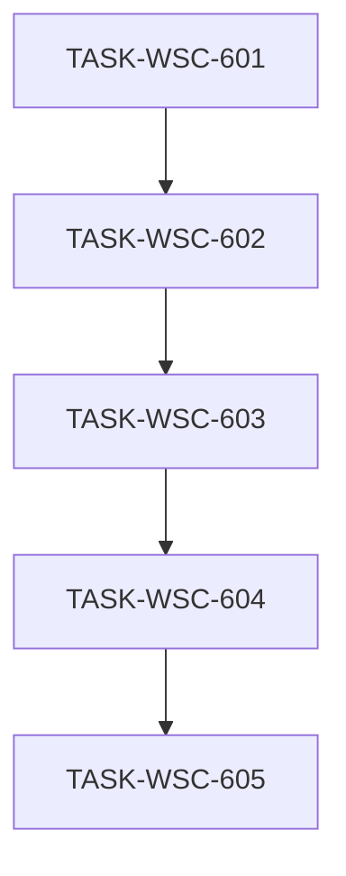

# 接入端工作台（WSC）V1.4 候选执行计划 — 座序图 / 用户管理 / 我的数据产品（R2 修订）

```yaml
planId: PLAN-WSC-5.2
status: APPROVED
planType: APPROVED
snapshotId: SNAP-WSC-005
sourcePrd: product/prd/wsc-v1.4-seatmap-users-mine.md
runId: RUN-WSC-008
basedOn: PLAN-WSC-5.1
lineageFrom: PLAN-WSC-5.1
previousRun: RUN-WSC-004
functionalBaseline:
  snapshotId: SNAP-WSC-004
  planId: PLAN-WSC-4.1
  contracts: wsc-contracts@2.1.0
uxBaseline:
  snapshotId: SNAP-WSC-003
  planId: PLAN-WSC-3.1
contractsTarget: wsc-contracts@2.2.0
round: 2
createdAt: 2026-08-05
taskCount: 5
waveCount: 5
requirementCount: 6
mappedIssueCount: 26
authorRoles: [planEditor]
actorInstance: plan-editor-wsc-008-r2
```

> **批准声明**：本文件为 `PLAN-WSC-5.2` **Round 2** 共识通过后的批准执行计划（`planType: APPROVED` / `status: APPROVED`）。门禁依据：`planning/reviews/wsc-5.2/round-2/` 隔离评审 8/8 `APPROVE`（必需 5/5）；由 Orchestrator 自候选稿复制发布，**未**改写专业结论。  
> **需求权威**：`snapshotId: SNAP-WSC-005`。SNAP 当前仍为 **`IN_REVIEW`**（伪造批准已作废）。productAnalyst R2 书面确认计划范围对齐 SNAP **正文**，但**不代批** SNAP 制品；派发前须人类确认；**生产 VERIFIED 发布**前须 SNAP 正式批准或等价人类门禁。  
> **协议修复**：主会话曾旁路落地部分 `frontend/**` / `backend/**` / `contracts/**` 改动。本计划以 SNAP 为验收权威；已存在改动须纳入对应任务 `acceptance` / `testScope` **对账验收**，**不得**假装从空树开始。

## 0. Round 1 ISSUE 修订映射（相对 PLAN-WSC-5.1）

> **关闭须原提出者在 Round 2 对本 planId（PLAN-WSC-5.2）确认**对应修订满足其 `closeWhen`。下表仅映射修订位置与吸收意图，**不**表示 ISSUE 已关闭。planEditor **不**关闭 ISSUE，**不**标 APPROVED。

| ISSUE id | sev | 本文件修订位置（吸收意图） |
|---|---|---|
| ISSUE-PA-001 | P1 | §8 + TASK-WSC-603 `acceptance`/`testScope`：`create_by` 空/缺失/非本人 → PROVIDER 编辑/更新/导入 **403**；自动化负例 |
| ISSUE-SA-R1-001 | P1 | §3.2 / §5：**方案 (A)** — L2 独立 `L2DistributionController`/`L2DistributionService` **604 独占**；603 `denyModify` 上述路径；删除同 Controller 方法级散文 |
| ISSUE-SA-R1-002 | P1 | §3.2 / §5：**方案 (A)** — 602 `denyModify` `RbacMatrix.java`/`WriteAuthorizationInterceptor.java`；仅写 PasswordHasher/AuthAuditLogger 等具名文件；603 **独占**矩阵与拦截器 |
| ISSUE-SA-R1-003 | P1 | TASK-WSC-602 `writeSet`：`model/**` 改为显式用户/会话 DTO 文件列表；`denyModify` 排除目录/总览/上链 model |
| ISSUE-SA-R1-004 | P2 | §3.2 / §5：**方案 (a)+(c)** — 壳层收口波次=603；CR 白名单：602 仅 `admin-users`/`role-readonly`；603 仅 `my-products`；603 acceptance「不得回退用户管理路由/菜单」 |
| ISSUE-QA-WSC5-R1-001 | P1 | 新增 **TASK-WSC-605** 串行独占 `tests/e2e/**`；§6.1 场景 1–7 **强制**；钉死 evidenceId/规格/命令/报告目录；删除「E2E 非强制」 |
| ISSUE-QA-WSC5-R1-002 | P1 | 各任务 `testScope` 增补「预落地 P0 对账自动化」勾选行 + 证据定位（测试类/spec/TESTRUN）；禁止仅 prose |
| ISSUE-QA-WSC5-R1-003 | P1 | 602/603 `testScope` 三角色×能力 **正例+负例** 单元格表（用户管理、切角色、产品写/导入、菜单结构不可达、公共目录无写） |
| ISSUE-QA-WSC5-R1-004 | P2 | 603 `testScope`：宿主迁移后 import 四态 Vitest/集成套件须绿；增改导仅我的产品可达 |
| ISSUE-QA-WSC5-R1-005 | P2 | 同 PA-001：603 `acceptance`/`testScope` 空归属负例 |
| ISSUE-PP-WSC5-R1-001 | P1 | 同 SA-002 方案 (A)：文件级互斥；删除「部分写矩阵」散文 |
| ISSUE-PP-WSC5-R1-002 | P1 | `CatalogBrowsePage.vue` **603 独占**；604 仅 `CirculationSeatMap.vue` + L2 后端独立文件；602 `denyModify` `useCanWrite.ts` |
| ISSUE-PE-WSC5-R1-001 | P1 | 604 `writeSet` 删除叙述性「必要 repository…」；仅字面路径；L2 查询经 `L2DistributionService`/`CatalogBrowseService` 既有只读调用，不扩写 repository |
| ISSUE-PE-WSC5-R1-002 | P1 | 同 SA-001/002：删除 602 security 条件散文与 603 browse 方法级 carve-out |
| ISSUE-PE-WSC5-R1-003 | medium | 同 QA-001：TASK-WSC-605 字面拥有 `tests/e2e/**`；§9.8 绑定 605 |
| ISSUE-UX-WSC5-R1-001 | P1 | §1.5 + 602 `acceptance`/`testScope`：只读角色唯一展示面；无 listbox；supersede REQ-UX-008 切换段 |
| ISSUE-UX-WSC5-R1-002 | P1 | §1.5 + 601 state-matrix + 603 `acceptance`/`testScope`：双表面页头/active/返回点；导入宿主→我的产品 |
| ISSUE-UX-WSC5-R1-003 | P1 | 604 `acceptance`/`testScope`：hover+leave、空态、loading、挂载位、无筛选 affordance |
| ISSUE-UX-WSC5-R1-004 | P2 | 602 `acceptance`：UsersAdminPage 令牌层次 / loading/empty/error |
| ISSUE-API-WSC5-R1-001 | P1 | §3.1 **硬冻结**（禁「建议」）：`POST /auth/session/role`→410+`ERR_ROLE_SWITCH_DISABLED`；废止 `LoginRequest.role`；601 acceptance/testScope |
| ISSUE-API-WSC5-R1-002 | P1 | §3.1 用户资源命名 schema / 软删 PUT `deleted` / 禁出 password·hash / 冲突与 404 码；601 acceptance |
| ISSUE-API-WSC5-R1-003 | P2 | §3.1/601：废止 ADMIN 可产品写 OpenAPI 叙述；state-matrix 导入宿主与版本头对齐 2.2.0 |
| ISSUE-SEC-WSC5-R1-001 | P1 | 602 `riskTags` 含 `auth-model-change`；§6.2 命中须独立 `securityReviewer`，未通过不得 VERIFIED |
| ISSUE-SEC-WSC5-R1-002 | P1 | 602（及条件 603）`riskTags` 含 `schema-migration`；§6.2 须独立 `migrationReviewer` |
| ISSUE-SEC-WSC5-R1-003 | P1 | 同 PA-001：603 空归属可测拒绝 |
| ISSUE-SEC-WSC5-R1-004 | P2 | 602 `acceptance`/`testScope`：用户 API 禁回显 password/hash；审计日志禁明文口令 |

**映射条数：26**（均已吸收进正文；无升级项）。**ISSUE 关闭权属原评审角色 Round 2 确认；本实例不关闭、不标 APPROVED。**

### 0.1 谱系与定位

| 概念 | 本计划取值 | 含义 |
|---|---|---|
| `planId` | PLAN-WSC-5.2 | V1.4 修订候选（吸收 5.1 Round 1 ISSUE 意图） |
| `round` | 2 | **本 planId（5.2）** 待进入的共识轮次（即将独立评审 Round 2） |
| `basedOn` / `lineageFrom` | PLAN-WSC-5.1 | 相对上一候选的修订谱系 |
| 功能基线 | PLAN-WSC-4.1 / SNAP-WSC-004 / `wsc-contracts@2.1.0` | OpenAPI 导入、四态、报告白名单、上链等**不削弱** |
| UX 基线 | PLAN-WSC-3.1 / SNAP-WSC-003 | 令牌/壳层/主路径质感**不回退** |
| 契约目标 | `wsc-contracts@2.2.0` | 由 TASK-WSC-601 **唯一**拥有升版与 `frontend/src/api/**` 生成 |
| 需求权威 | SNAP-WSC-005 | 修订 SHELL/RBAC；新增 CAT-009/USER-001/CAT-010；继承 CAT-001 |
| 仓布局 | `ai/rules/project/repos.yaml` | 前端 `frontend/`；后端 `backend/`；契约在控制面 `contracts/` |

本计划 **不** 改写 SNAP-WSC-001..004 正文结论；以增量任务承接 V1.4。

### 0.2 预落地对账（强制）

> 下列路径在计划起草时**可能已存在**于工作树（主会话旁路）。各任务 developer **必须**先 diff 对账：保留符合 SNAP 的实现并补齐缺口；偏离 SNAP 的改动须修正或开 ISSUE。验收以 SNAP + 本计划 acceptance 为准，**不以「代码已在」代替测试证据**。对账表中的 P0 行为必须由本任务 `testScope` 命名自动化用例证明（见各任务「预落地对账自动化」行）。

| 波次/任务 | 预落地迹象（非穷尽；以工作树为准） | 对账要求 |
|---|---|---|
| **601** | `contracts/VERSION`=`2.2.0`；`contracts/rbac/matrix.yaml`；`openapi` 含 `/admin/users`、`/catalog/l2-distribution`、`mine`；`req-coverage.md` V1.4 行 | 核对与 SNAP + §3.1 硬冻结一致；补齐 schema/错误码；**重新生成** `frontend/src/api/**`；不得静默再升版 |
| **602** | `V6__create_sys_user.sql`；`SysUserEntity` / `UserAccountService` / `AdminUserController`；`AuthController` 登录 hash + 切角色禁用；`UsersAdminPage.vue`；`authStore` | 真登录、ADMIN CRUD、软删、三角色种子；角色只读唯一展示面；PROVIDER/USER 用户管理 403；响应禁出 password/hash |
| **603** | `RbacMatrix` 产品写仅 PROVIDER；browse `mine` + `create_by`；`/my-products`；`useCanWrite`；公共目录去写 | 公共目录无增改导；我的产品仅 PROVIDER+本人；空归属 403；导入宿主迁至我的产品；预留座序图挂载点 |
| **604** | 可能残留同文件 `l2-distribution`；`CirculationSeatMap.vue` | **拆入** 604 独占 L2 类文件；Top5/比例/hover/leave/真实总数；仅公共目录挂载 |
| **605** | 可能缺少 V1.4 E2E 规格 | 新建/扩展规格覆盖 §6.1 强制七场景；落盘报告 |

**包结构约束（后端）**：实现须符合 `backend/CLAUDE.md` / `RULE-PROJECT-LAYOUT` **按类型分层**。若预落地仍含业务域顶层包残留，纳入对应任务写集内收敛；**禁止**新建域顶层包。L2 独立类文件仍落在 `controller/catalog/browse/` 与 `service/catalog/browse/` 包内（文件名互斥，非新建域顶层包）。

**控制面禁止**：任何实现任务 **denyModify** `ai/runs/**/state.yaml`、`ai/runs/**/events.jsonl`；禁止伪造 REV-\* / 全员 APPROVE。

### 0.3 已知缺口提示（对账时优先核验）

| 缺口 | 归属任务 | 说明 |
|---|---|---|
| `RoleSwitcher` 仍可能渲染可选菜单 | 602 | 权威验收面=只读角色标签；删除或永不挂载可切换控件 |
| `ERR_ROLE_SWITCH_DISABLED` / `LoginRequest.role` / AdminUser schema | 601 | §3.1 硬冻结；对账补齐 |
| 我的产品增改导路由仍挂 `/catalog/products/*` | 603 | 入口与返回表面须为我的产品 |
| L2 与 mine 同文件 | 604+603 | 604 抽出独立 L2 类；603 不改 L2 文件 |
| E2E / Vitest 覆盖不足 | 各任务 + **605** | P0 自动化+强制 E2E |
| SNAP `IN_REVIEW` | 门禁 | 见文首候选声明 |

## 1. 范围、假设与硬门禁

### 1.1 范围

**In Scope（SNAP-WSC-005 / PO 已锁定）**

| 面 | 内容 |
|---|---|
| 契约 | 升版 `wsc-contracts@2.2.0`：RBAC 矩阵；`mine`；`l2-distribution`；用户 CRUD 命名 schema；角色切换禁用硬语义 |
| 用户 | 持久化 `sys_user`；密码 hash 真登录；ADMIN CRUD；下线自由切角色（只读展示） |
| 我的数据产品 | 仅 PROVIDER；无座序图；承载增改导；`create_by` 隔离（含空归属拒绝）；公共目录取消增改导 |
| 管理员保留 | 分类维护 + 目录维护；**无**产品增改导 |
| 座序图 | AI-SEP Vue 公共目录；L2 Top5；比例座位；hover/leave；真实总数 |
| E2E | TASK-WSC-605 强制七场景证据包 |

**Out of Scope / 默认 deny**

- Downloads React 仓；座序图点击联动 L2 筛选
- OAuth / 密码重置邮件 / 多租户 / 公开注册
- 重做 UX 令牌体系或另起视觉主题
- 引入独立异步导入 Job；削弱 V1.3 导入四态/报告白名单
- 改写历史 SNAP 正文；实现任务写 Run `state.yaml` / `events.jsonl`
- 强制 Element Plus / 第二套 UI 框架习惯

### 1.2 假设（PO 已确认 / SNAP 收录）

| 项 | 口径 |
|---|---|
| `contractsTarget` | **`wsc-contracts@2.2.0`** |
| 前端座序图 | **AI-SEP Vue**（自 Downloads 视觉意图移植，非改 Downloads 仓） |
| 用户存贮 | **持久化 `sys_user`** |
| 导入入口 | **迁至「我的数据产品」**；仅 PROVIDER |
| ADMIN 保留 | 分类维护 + 目录维护；产品写 API **403** |
| 角色绑定 | 登录身份绑定角色；**禁止**任意会话角色切换 |
| `create_by` | 列表/编辑以当前 `userId` 为准；**空/缺失不可被 PROVIDER 冒领** |
| UX 不回退 | SNAP-WSC-003 / PLAN-WSC-3.1；REQ-UX-008 切换段由 REQ-SHELL-001 supersede |
| 导入四态 / OpenAPI | 继承 PLAN-WSC-4.1 |
| Blocking OQ | **无** |

### 1.3 技术栈硬门禁

| 层 | 固定选型 |
|---|---|
| 前端 | Vue 3 + TypeScript + Vite + pnpm + Pinia + Vue Router 4；**CSS-token-first**（PLAN-WSC-3.1）；Ant Design Vue 仅经既有替换清单 |
| 后端 | Spring Boot **2.7.18** + Java 17；`backend/app/data-chain-service/`；包按类型分层 |
| 数据 | MySQL + Flyway（`sql/init` + `sql/migration`）；禁止向 `db/migration/` 追加新脚本 |
| 缓存 | Spring Data Redis |
| 契约 | 目标 `wsc-contracts@2.2.0`；client 生成至 `frontend/src/api/**` |
| 测试 | JUnit 5 / Testcontainers；Vitest；Playwright |
| 多仓 | 按 `repos.yaml`：worker 写 `frontend` / `backend`；契约在控制面；state 仅控制面 Orchestrator |

禁止：静默改契约版本号；业务任务私改 `contracts/**` / `frontend/src/api/**`（除 601）；纯 CSS 替代鉴权。

### 1.4 执行硬门禁

- 每任务：独立 developer → codeReviewer → tester；Orchestrator 按各任务 `writeSet` **字面路径** scope-check（**禁止**方法级/片段级散文例外）。
- developer ≠ codeReviewer ≠ tester。
- 并行任务写集必须互斥；本计划波次为 **串行五波**（见 §6），无同波并行对。
- `TASK-WSC-601` **唯一**拥有契约升级与 `frontend/src/api/**` 生成；602..605 只读消费。
- 命中 `auth-model-change` → 独立 `securityReviewer`；命中 `schema-migration` → 独立 `migrationReviewer`；未通过不得 VERIFIED（§6.2）。
- 权限不可用纯 CSS 替代；三角色矩阵对齐 `contracts/rbac/matrix.yaml`。
- UX：增量控件消费既有令牌；**禁止**另起全局色板。
- 预落地 diff **必须**进入该任务 review 证据；对账 P0 须有自动化证据。

### 1.5 UX 不回退与本版冻结面（PLAN-WSC-3.1 + R1 UX）

| 约束 | 口径 |
|---|---|
| 令牌 | 沿用既有 CSS 变量；本版仅 scoped 增量 |
| 壳层/主路径 | 登录、侧栏、总览、目录、维护、详情/编辑布局层级不回退 |
| **角色只读（UX-001）** | 壳层 footer **唯一**角色展示为只读标签（企业卡层次内、消费侧栏令牌）；**无**下拉、**无** `aria-haspopup=listbox`、**无**选项菜单；删除或永不挂载可切换 `RoleSwitcher`；**禁止**仅 `disabled` 保留下拉观感。`REQ-UX-008` 中「可切换下拉」交互段由本版 `REQ-SHELL-001` **supersede**；只读质感仍须对齐壳层 |
| **双目录表面（UX-002）** | 菜单文案：「数据目录」「我的数据产品」。两表面页头标题与空态可区分。侧栏 active：`/my-products/**` **不**高亮「数据目录」，反之亦然。新增/编辑/导入成功或关闭后返回 **`/my-products`**。公共目录结构不可达增改导。`state-matrix` 导入宿主=我的产品→回我的产品 |
| **座序图（UX-003）** | 目录主路径内一块流通链可视化（页头/标签栏之下、列表之上或并列令牌内 card）；不引入第二套仪表盘语言；hover 熄灭+leave 恢复；空态/loading；无点击筛选 affordance |
| **用户管理页（UX-004）** | 页头+列表卡层次；loading/empty/error 可读；消费既有令牌；禁止无层次默认表堆砌 |
| 导入载体 | 迁至我的产品后，四态 UI / 报告白名单不回退 PLAN-WSC-4.1 |
| 报告白名单 | `rowNumber, productCode, reasonCode, reasonMessage`；禁止扩大 PII |

## 2. 决策与开放问题

### 2.1 必须遵守的 DEC

| DEC | 本计划用法 |
|---|---|
| DEC-WSC-001 | 产品编码唯一与格式（导入/新建不削弱） |
| DEC-WSC-002 | 成功写入产生存证版本（不削弱） |
| DEC-WSC-003 | 有挂载禁止删分类（继承） |
| DEC-WSC-004 | Java 17 |
| DEC-WSC-005 | data-chain 栈 / sql 布局 / 按类型分层 |

本版无新增 DEC；RBAC 重划以 SNAP + `matrix.yaml` 2.2.0 为准。

### 2.2 开放问题处理口径

| id | status | 本计划口径 |
|---|---|---|
| PO 座序图前端仓 | CLOSED | AI-SEP Vue |
| PO 用户持久化 | CLOSED | `sys_user` |
| PO 导入迁入我的产品 | CLOSED | PROVIDER only |
| PO ADMIN 保留项 | CLOSED | 分类 + 目录维护 |
| OQ-001 等历史 | 保留 / Out of Scope | 本版不展开 |
| Blocking OQ | **无** | 可调度（前提：SNAP 门禁满足） |

### 2.3 R1 写集互斥裁决（可机械 scope-check）

| 冲突面 | 选定方案 | 字面规则 |
|---|---|---|
| L2 vs mine 后端 | **SA-001 (A)** | 604 独占 `L2DistributionController.java`、`L2DistributionService.java`；603 deny 这两文件；603 可写 `CatalogBrowseController.java` / `CatalogBrowseService.java`（mine/去写相关，**不得**再含 l2-distribution 方法——预落地若同文件并存，603 须将 L2 方法迁出至 604 文件或删除后由 604 重建） |
| RbacMatrix | **SA-002 (A)** | 603 独占 `RbacMatrix.java`、`WriteAuthorizationInterceptor.java`；602 denyModify 二者 |
| CatalogBrowsePage | **PP-002** | 603 独占该页（mine、去写、预留 `showSeatMap` 挂载）；604 仅写 `CirculationSeatMap.vue` |
| useCanWrite | **PP-002** | 603 独占；602 denyModify |
| model DTO | **SA-003** | 602 仅显式用户/会话文件；603/604 各自字面列出所需 model |
| 壳层/路由 | **SA-004 (a)+(c)** | 见 §3.2 壳层白名单；603 收口 |

## 3. 契约升级与唯一所有权（`wsc-contracts@2.2.0`）

### 3.1 契约冻结内容（TASK-WSC-601 一次性 — 硬冻结，禁止「建议/若有」）

| 契约项 | 内容 |
|---|---|
| VERSION | `2.1.0` → **`2.2.0`**（若树中已是 2.2.0：对账确认内容完整，禁止再 bump） |
| RBAC | `contracts/rbac/matrix.yaml`：ADMIN 产品写/导入 **hidden + API 403**；PROVIDER 产品写/导入 + `myProductsUI`；USER 只读；`userManage*` 仅 ADMIN；注释含「登录绑定角色 / create_by 隔离 / 公共目录无写入口」 |
| Browse | `GET /catalog/products` 支持 `mine=true` → 仅 `create_by=当前用户` |
| 座序图 API | `GET /catalog/l2-distribution`：`totalProducts` + `items[]`（code/name/count），按产品数降序（消费方可取 Top5） |
| **会话切角色（硬）** | OpenAPI **必须**收录 `POST /auth/session/role` 为**始终禁用**操作；HTTP **410**；`code`=`ERR_ROLE_SWITCH_DISABLED`；example 齐全。同码写入 `errors/codes.yaml` 且进入 OpenAPI `ApiResponseError.code` enum。`LoginRequest` **不得**再接受客户端选择角色（**删除** `role` 属性；description 声明角色仅来自 `sys_user`） |
| **用户管理（硬）** | 路径：`GET/POST /admin/users`、`PUT /admin/users/{userId}`。命名响应 schema（如 `AdminUser`）必填：`userId`、`username`、`displayName`、`role`、`enterpriseName`、`deleted`（及必要审计字段）。Create：`username`+`password`+`role`（+可选 displayName）。Update：改角色/资料/软删。**软删权威形状：PUT `deleted: true`**（本版不采用 DELETE）。list/get/create/update **响应禁止**出现 `password` / `passwordHash`。错误码硬同步：非 ADMIN→`ERR_FORBIDDEN`；username 冲突→`ERR_USER_USERNAME_CONFLICT`（409）；用户不存在→`ERR_USER_NOT_FOUND`（404） |
| **叙述对齐（硬）** | 修订一切仍暗示 ADMIN 可产品写/导入的 OpenAPI summary/description，与 matrix「仅 PROVIDER」一致。`ui/state-matrix.md` 版本头=`2.2.0`；侧栏可见性 / 公共目录只读 / 我的产品写入口 / 角色只读展示；**导入宿主=我的数据产品→关闭/成功回我的产品** |
| 既有不回退 | 2.1.0 OpenAPI `typeSpecific`、导入四态、报告白名单、分类/维护错误码 |
| req-coverage | 更新 SHELL/RBAC/CAT-009/USER-001/CAT-010 映射行 |

### 3.2 唯一所有权矩阵

| 共享制品 | 唯一写任务 | 其他任务 |
|---|---|---|
| `contracts/**` | TASK-WSC-601 | 只读 |
| `frontend/src/api/**` | TASK-WSC-601 | 只读 |
| `sys_user` 迁移 / 安全登录 / 用户 API / RoleSwitcher 下线 | TASK-WSC-602 | 他任务只读消费会话 |
| `RbacMatrix.java` / `WriteAuthorizationInterceptor.java` | **TASK-WSC-603** | 602 denyModify |
| `useCanWrite.ts`（及 spec） | **TASK-WSC-603** | 602 denyModify |
| 我的产品 + 目录去写 + create_by + `CatalogBrowsePage.vue` | TASK-WSC-603 | 604 不得改该页 |
| `L2DistributionController.java` / `L2DistributionService.java` | **TASK-WSC-604** | 603 denyModify |
| `CirculationSeatMap.vue` | TASK-WSC-604 | 603 denyModify |
| `tests/e2e/**` | **TASK-WSC-605** | 601..604 denyModify |
| `frontend/src/styles/**` / theme | **无写任务** | 全任务只读 |
| `ai/runs/**/state.yaml` | **无写任务** | 全任务 denyModify |

**壳层/路由字面白名单（SA-004）**

| 文件 | 602 允许改动 | 603 允许改动 | 收口 |
|---|---|---|---|
| `WorkbenchLayout.vue` | 菜单键 `admin-users`（或等价）；角色只读区；**不得**改 my-products 菜单语义 | 菜单键 `my-products`；**不得删除/回退** 602 已合入的用户管理菜单与角色只读区 | **603** |
| `router/routes.ts` | 仅 `/admin/users`（及直接子路由） | 仅 `/my-products` 及我的产品写路径 props；**不得删除** `/admin/users` | **603** |

### 3.3 数据迁移协议

- `sys_user`：Flyway `sql/migration/V*__*.sql`（预落地多为 `V6__create_sys_user.sql`）；602 独占；触发 `schema-migration` → `migrationReviewer`。
- 产品 `create_by`：若物理列已在基线 schema 存在，603 **优先无破坏性**写入语义；仅当缺列/缺索引时 603 可独占追加一版 migration（建议文件名模式 `V*__*create_by*`），并在交付说明声明；触碰时同样要求 `schema-migration` + `migrationReviewer`。
- 禁止向 `db/migration/` 追加新脚本。
- 601/604/605 **denyModify** `**/sql/**`。

## 4. RBAC 可测矩阵（对齐 `contracts/rbac/matrix.yaml` 2.2.0）

| 能力 | ADMIN | PROVIDER | USER |
|---|---|---|---|
| 公共目录浏览 + 座序图 | 可见 | 可见 | 可见 |
| 分类维护 UI/API | 可见 / 200 | 隐藏 / 403 | 隐藏 / 403 |
| 目录维护 UI/API | 可见 / 200 | 隐藏 / 403 | 隐藏 / 403 |
| 产品增改 UI/API | **隐藏 / 403** | 可见 / 200（本人） | 隐藏 / 403 |
| 批量导入 UI/API | **隐藏 / 403** | 可见 / 200 | 隐藏 / 403 |
| 我的数据产品菜单 | 隐藏 | 可见 | 隐藏 |
| 用户管理 UI/API | 可见 / 200 | 隐藏 / 403 | 隐藏 / 403 |
| 会话切角色 | **禁用** | **禁用** | **禁用** |
| 导入报告 GET | 200（规则内） | 200（importer） | 403 |

前端隐藏 ≠ 授权（REQ-RBAC-001）。

## 5. 任务包列表

> 任务 ID：`TASK-WSC-601`..`605`。字段全文内联。路径以 `repos.yaml` 本地布局为准；后端 Java 根 = `backend/app/data-chain-service/src/main/java/com/shdata/datachain`。

### TASK-WSC-601 — 契约 2.2.0 + RBAC matrix + client 生成

- `requirements`: `[REQ-RBAC-001, REQ-SHELL-001, REQ-CAT-009, REQ-USER-001, REQ-CAT-010]`
- `objective`: 按 §3.1 **硬冻结**发布 `wsc-contracts@2.2.0`；生成/更新 `frontend/src/api/**`；更新 req-coverage / state-matrix；对账预落地契约 diff
- `dependsOn`: `[]`
- `readSet`:
  - `product/requirements/SNAP-WSC-005.md`
  - `product/prd/wsc-v1.4-seatmap-users-mine.md`
  - `planning/proposals/PLAN-WSC-5.2.md`（本文件 §1/§3/§4）
  - `planning/approved/PLAN-WSC-4.1.md`（不回退面，只读）
  - 既有 `contracts/**`
- `writeSet`:
  - `contracts/**`（含 `VERSION`=`2.2.0`、`openapi/**`、`rbac/matrix.yaml`、`errors/codes.yaml`、`ui/state-matrix.md`、`req-coverage.md` 及相关语义文档）
  - `frontend/src/api/**`
  - 前端根构建配置（**仅当** client 生成必需）：`frontend/package.json`、`frontend/pnpm-lock.yaml`（禁止借机大升级）
- `denyModify`:
  - `frontend/src/features/**`；`frontend/src/layouts/**`；`frontend/src/router/**`；`frontend/src/styles/**`；`frontend/src/theme/**`；`frontend/src/components/**`
  - `backend/**`；`**/sql/**`
  - `tests/e2e/**`
  - `product/**`；`planning/**`；`ai/rules/**`；`ai/runs/**/state.yaml`；`ai/runs/**/events.jsonl`
  - 密钥类配置；向 `**/db/migration/**` 追加脚本
- `acceptance`:
  - `contracts/VERSION` = `2.2.0`；OpenAPI info.version 一致
  - `rbac/matrix.yaml` 与 §4 / SNAP 角色表一致
  - OpenAPI 含：`/admin/users`（**命名 schema**，非裸 object）、`GET /catalog/l2-distribution`、`GET /catalog/products` 的 `mine`
  - `POST /auth/session/role`：410 + `ERR_ROLE_SWITCH_DISABLED`；codes.yaml + enum 硬同步；`LoginRequest` **无** `role`
  - 用户错误码：`ERR_USER_USERNAME_CONFLICT`、`ERR_USER_NOT_FOUND` 硬同步；响应 schema 禁 password/hash
  - soft-delete = PUT `deleted`
  - OpenAPI 叙述无「ADMIN 可产品写/导入」；state-matrix 导入宿主=我的产品、版本头 2.2.0
  - 2.1.0 导入/OpenAPI typeSpecific / 报告白名单**不回退**
  - `frontend/src/api/**` 生成后可 typecheck
  - 预落地契约 diff 已对账；偏差已修正或列入交付说明 + ISSUE
- `testScope`:
  - 契约 lint / OpenAPI 校验
  - matrix 与文档交叉检查清单（三角色 × 关键能力）
  - 可勾选：`ERR_ROLE_SWITCH_DISABLED` 出现在 codes.yaml + OpenAPI enum；`LoginRequest` schema 无 role；`AdminUser`（或等价）required 字段齐全
  - client 生成后 `pnpm` typecheck（api 包）
  - 回归：既有 2.1.0 关键 schema/错误码仍存在
  - **预落地对账自动化**：对账表 601 行 P0 行为由上述可命名检查证明；交付说明附证据定位（文件路径），禁止仅 prose「已对账」
- `riskTags`: `[contracts-bump, rbac-breaking, auth-model-change]`

### TASK-WSC-602 — sys_user + 真登录 + 用户管理前后端 + 下线切角色

- `requirements`: `[REQ-USER-001, REQ-SHELL-001, REQ-RBAC-001]`
- `objective`: 持久化 `sys_user`；密码 hash 真登录；ADMIN 用户 CRUD；侧栏「用户管理」仅 ADMIN；下线自由切角色（API 410 + UI 只读唯一展示面）；对账预落地安全/用户代码
- `dependsOn`: `[TASK-WSC-601]`
- `readSet`:
  - `frontend/src/api/**`（只读）
  - `contracts/**`（只读对照）
  - SNAP-WSC-005；本计划 §1.2 / §1.5 / §4 / §0.2
  - 既有 `backend/.../common/security/PasswordHasher.java`、`AuthAuditLogger.java`
  - `backend/.../controller/security/**`、`service/security/**`
  - `frontend/src/features/auth/**`、`frontend/src/features/shell/**`、`frontend/src/layouts/**`
- `writeSet`:
  - `backend/app/data-chain-service/src/main/resources/sql/migration/**`（`sys_user` 及种子；预落地 V6 对账）
  - `backend/.../entity/SysUserEntity.java`
  - `backend/.../repository/SysUserRepository.java`
  - `backend/.../controller/security/**`
  - `backend/.../service/security/**`
  - `backend/.../common/security/PasswordHasher.java`
  - `backend/.../common/security/AuthAuditLogger.java`
  - `backend/.../model/LoginRequest.java`
  - `backend/.../model/SessionPrincipal.java`
  - `backend/.../model/Role.java`
  - `backend/.../model/SwitchRoleRequest.java`
  - `backend/.../model/AdminUser*.java`（若新增用户 DTO，仅 `AdminUser` 前缀命名文件）
  - `backend/.../config/SecurityWebConfig.java`
  - `backend/app/data-chain-service/src/test/java/**/security/**`（登录/用户/切角色；**不含**产品写矩阵测——归 603）
  - `frontend/src/features/auth/api/**`
  - `frontend/src/features/auth/store/**`
  - `frontend/src/features/auth/views/**`
  - `frontend/src/features/users/**`
  - `frontend/src/features/shell/components/RoleSwitcher.vue`
  - `frontend/src/features/shell/components/RoleSwitcher.spec.ts`
  - `frontend/src/layouts/WorkbenchLayout.vue`（仅 §3.2 白名单：`admin-users` + 角色只读）
  - `frontend/src/router/routes.ts`（仅 `/admin/users`）
  - 上述路径对应 colocated `*.spec.ts` / `__tests__/**`
- `denyModify`:
  - `contracts/**`；`frontend/src/api/**`
  - `backend/.../common/security/RbacMatrix.java`
  - `backend/.../common/security/WriteAuthorizationInterceptor.java`
  - `frontend/src/features/auth/composables/useCanWrite.ts`
  - `frontend/src/features/auth/composables/useCanWrite.spec.ts`
  - `frontend/src/features/catalog/**`
  - `frontend/src/features/overview/**`；`frontend/src/features/chain/**`；`frontend/src/features/portal/**`
  - `frontend/src/styles/**`；`frontend/src/theme/**`；`frontend/src/components/**`
  - `backend/.../controller/catalog/**`；`backend/.../service/catalog/**`
  - `backend/.../model/Catalog*.java`；`backend/.../model/Overview*.java`；`backend/.../model/Distribution*.java`；`backend/.../model/Stream*.java`；`backend/.../model/TopItem*.java`；`backend/.../model/Trend*.java`；`backend/.../model/DemoRequest.java`
  - `tests/e2e/**`
  - `product/**`；`planning/**`；`ai/runs/**/state.yaml`；`ai/runs/**/events.jsonl`
  - 向 `**/db/migration/**` 追加新脚本
- `acceptance`:
  - Flyway 可重复执行的 `sys_user`（username 唯一、role、password hash、软删、审计字段）；单向哈希（项目既有 bcrypt/argon2 族）
  - 登录：正确密码建会话；错误密码失败；会话角色 = 账号角色
  - `POST /auth/session/role` → **410** + `ERR_ROLE_SWITCH_DISABLED`；无成功切角色路径；**三角色会话均禁用**
  - 前端：壳层 footer **唯一**只读角色展示；无 listbox/chevron/选项菜单；可切换 `RoleSwitcher` 结构不可达（删除或永不挂载）
  - ADMIN：`/admin/users` 可列表/创建/改角色/软删（PUT `deleted`）；PROVIDER **与** USER：UI 不可达 + API **均** 403
  - 用户 API 响应**永不**含 `password`/`passwordHash`；`AuthAuditLogger`/应用日志**不**记录明文口令
  - UsersAdminPage：既有令牌内页头+列表卡；loading/empty/error 可读；非 ADMIN 结构不可达
  - 预置/种子可文档化演示（不得明文落盘生产密钥）
  - 预落地安全代码已对账；偏离 SNAP 已修
- `testScope`:
  - **§4 单元格表（本任务）**：

    | 能力 | ADMIN | PROVIDER | USER |
    |---|---|---|---|
    | 用户管理 API | 200 | **403** | **403** |
    | 用户管理 UI | 可达 | **结构不可达** | **结构不可达** |
    | `POST …/session/role` | **410+码** | **410+码** | **410+码** |
    | 角色区 UI | 只读无切换 | 只读无切换 | 只读无切换 |

  - 后端集成：登录成功/失败；切角色禁用；ADMIN CRUD；软删不可登录；响应无 password/hash；审计日志无明文口令（或审查清单勾选证据）
  - Vitest：authStore / RoleSwitcher（只读、无 listbox）/ UsersAdminPage 权限与空载态
  - **预落地对账自动化**：对账表 602 行 P0（真登录、切角色禁用、ADMIN CRUD、非 ADMIN 403、只读角色）须有命名测试类/spec；交付说明附证据定位
- `riskTags`: `[authn, auth-model-change, handles-pii, schema-migration, rbac-breaking]`

### TASK-WSC-603 — 我的数据产品 + 公共目录去写 + create_by 隔离 + RBAC 矩阵

- `requirements`: `[REQ-CAT-010, REQ-RBAC-001, REQ-SHELL-001, REQ-CAT-001]`
- `objective`: 「我的数据产品」（仅 PROVIDER；无座序图）；产品增改导仅从此入口；公共目录取消增改导；服务端产品写/导入仅 PROVIDER + `create_by` 本人隔离（**空归属拒绝**）；ADMIN 保留分类/目录维护且产品写 403；独占 RbacMatrix/拦截器；预留座序图挂载点；对账预落地 catalog/RBAC
- `dependsOn`: `[TASK-WSC-602]`
- `readSet`:
  - `frontend/src/api/**`（只读）
  - contracts matrix / OpenAPI（只读）
  - SNAP-WSC-005；本计划 §1.5 / §4 / §0.2 / §2.3
  - 既有 `frontend/src/features/catalog/**`
  - `backend/.../controller/catalog/**`、`service/catalog/**`、`repository/**`、产品 entity
  - `CirculationSeatMap.vue`（只读：确认挂载约定；本任务不改该文件）
- `writeSet`:
  - `frontend/src/features/catalog/browse/CatalogBrowsePage.vue`（mine/去写；预留 `showSeatMap` 挂载点供 604 组件；**禁止**实现座序图内部逻辑）
  - `frontend/src/features/catalog/browse/**`（除下表 deny 的 CirculationSeatMap）
  - `frontend/src/features/catalog/editor/**`
  - `frontend/src/features/catalog/import/**`
  - `frontend/src/features/catalog/detail/**`
  - `frontend/src/features/auth/composables/useCanWrite.ts`
  - `frontend/src/features/auth/composables/useCanWrite.spec.ts`
  - `frontend/src/layouts/WorkbenchLayout.vue`（仅 §3.2 白名单：`my-products`；不得回退用户管理/角色只读）
  - `frontend/src/router/routes.ts`（`/my-products` 及必要写路径 props；不得删除 `/admin/users`）
  - `backend/.../controller/catalog/browse/CatalogBrowseController.java`
  - `backend/.../service/catalog/browse/CatalogBrowseService.java`
  - `backend/.../controller/catalog/editor/**`
  - `backend/.../controller/catalog/productimport/**`
  - `backend/.../service/catalog/editor/**`
  - `backend/.../service/catalog/productimport/**`
  - `backend/.../repository/CatalogBrowseSeedStore.java`（及产品 create_by 相关 repository，字面列于交付说明）
  - `backend/.../entity/DataProductEntity.java`（若需）
  - `backend/.../model/CatalogProduct.java`；`backend/.../model/CatalogCategory.java`（若需）
  - `backend/.../common/security/RbacMatrix.java`
  - `backend/.../common/security/WriteAuthorizationInterceptor.java`
  - `backend/app/*/src/main/resources/sql/migration/**`（**仅当** §3.3 证明 create_by 缺列/索引；建议 `V*__*create_by*`）
  - `backend/app/*/src/test/java/**/catalog/**`；`**/rbac/**`（产品写矩阵 / create_by / mine）
  - 对应前端 `*.spec.ts`
- `denyModify`:
  - `contracts/**`；`frontend/src/api/**`
  - `frontend/src/features/catalog/browse/components/CirculationSeatMap.vue`
  - `backend/.../controller/catalog/browse/L2DistributionController.java`
  - `backend/.../service/catalog/browse/L2DistributionService.java`
  - `frontend/src/features/users/**`；`frontend/src/features/shell/components/RoleSwitcher.vue`
  - `frontend/src/features/overview/**`；`frontend/src/features/chain/**`
  - `frontend/src/styles/**`；`frontend/src/theme/**`；`frontend/src/components/**`
  - `backend/.../controller/security/**`；`backend/.../service/security/UserAccountService.java`
  - `backend/.../common/security/PasswordHasher.java`；`backend/.../common/security/AuthAuditLogger.java`
  - `backend/.../controller/catalog/admin/**`；`backend/.../service/catalog/admin/**`
  - `backend/.../controller/catalog/maintenance/**`；`backend/.../service/catalog/maintenance/**`
  - `tests/e2e/**`
  - `product/**`；`planning/**`；`ai/runs/**/state.yaml`；`ai/runs/**/events.jsonl`
- `acceptance`:
  - PROVIDER 可见「我的数据产品」；ADMIN/USER **结构不可达**
  - 我的产品：无座序图组件挂载（`showSeatMap=false`）；可新增/编辑/导入；列表仅 `create_by=本人`
  - **空归属**：`create_by` 为空/缺失/非当前用户时，PROVIDER 编辑/更新/导入归属 → **403**（或契约稳定拒绝码）；不可冒领
  - 公共目录：三角色均可浏览；**无**增改导入口（结构不可达）
  - 双表面：页头/空态可区分；侧栏 active 互斥；写路径与导入关闭/成功后回到 `/my-products`
  - ADMIN：产品写/导入 API **403**；分类/目录维护仍 200
  - PROVIDER：改他人产品 403；导入报告规则不回退
  - USER：全部产品写/导入 403
  - REQ-CAT-001 浏览不削弱
  - 导入四态 / OpenAPI 编辑相对 PLAN-WSC-4.1 **不回退**
  - `CatalogBrowsePage` 为公共模式预留 `showSeatMap` 挂载点（props/slot 约定写入交付说明，供 604 只读消费）
  - 壳层不得回退用户管理菜单与角色只读区
  - 预落地 catalog/RBAC diff 已对账；若 Controllers 曾含 L2 方法，已迁出至 604 独占文件
- `testScope`:
  - **§4 单元格表（本任务）**：

    | 能力 | ADMIN | PROVIDER | USER |
    |---|---|---|---|
    | 产品写 API | **403** | 本人 **200**；他人/空归属 **403** | **403** |
    | 导入 API | **403** | **200**（规则内） | **403** |
    | 我的产品菜单 | **不可达** | 可见 | **不可达** |
    | 公共目录增改导 | **结构不可达** | **结构不可达** | **结构不可达** |
    | 分类/目录维护 | **200** | 403 | 403 |

  - 后端：`mine=true` 过滤；空/异主 create_by 负例（对照本人 200 fixture）
  - Vitest：公共目录无写入口；我的产品入口/返回；`useCanWrite` 三角色；导入宿主；active 互斥
  - **导入四态回归**：宿主迁移后执行既有 import 四态相关自动化套件且通过；增改导仅从我的产品可达
  - **预落地对账自动化**：对账表 603 行 P0 须有命名测试；交付说明附证据定位
- `riskTags`: `[rbac-breaking, data-isolation, import-host-move, auth-model-change]`（若触碰 sql/migration 另加 `schema-migration`）

### TASK-WSC-604 — L2 distribution + CirculationSeatMap（公共目录）

- `requirements`: `[REQ-CAT-009, REQ-CAT-001]`
- `objective`: 实现 `GET /catalog/l2-distribution`（独立 L2 类文件）；Vue `CirculationSeatMap`：Top5、比例座位、hover/leave、空态/loading；仅挂公共数据目录；对账预落地座序图
- `dependsOn`: `[TASK-WSC-603]`
- `readSet`:
  - `frontend/src/api/**`（只读）
  - OpenAPI `l2-distribution`（只读）
  - SNAP-WSC-005；本计划 §0.2 / §1.5 / §2.3
  - `frontend/src/features/catalog/browse/CatalogBrowsePage.vue`（只读：消费 603 预留挂载约定）
  - 既有 overview distribution（只读对照，**禁止**把总览图当座序图真源）
- `writeSet`:
  - `frontend/src/features/catalog/browse/components/CirculationSeatMap.vue`
  - 对应座序图 `*.spec.ts`（与 CirculationSeatMap 同目录/同名前缀）
  - `backend/.../controller/catalog/browse/L2DistributionController.java`
  - `backend/.../service/catalog/browse/L2DistributionService.java`
  - `backend/.../model/DistributionSliceRecord.java`（若 L2 响应 DTO 需要）
  - `backend/app/*/src/test/java/**/catalog/browse/**L2*`（或 `**/*Distribution*` 测试类）
- `denyModify`:
  - `contracts/**`；`frontend/src/api/**`
  - `frontend/src/features/catalog/browse/CatalogBrowsePage.vue`
  - `frontend/src/features/catalog/editor/**`；`import/**`；`admin/**`；`maintenance/**`
  - `frontend/src/features/users/**`；`frontend/src/features/auth/**`；`frontend/src/features/shell/**`
  - `frontend/src/styles/**`；`frontend/src/theme/**`；`frontend/src/components/**`
  - `backend/.../controller/catalog/browse/CatalogBrowseController.java`
  - `backend/.../service/catalog/browse/CatalogBrowseService.java`
  - `backend/.../controller/security/**`；`service/security/**`
  - `backend/.../controller/catalog/editor/**`；`productimport/**`；`admin/**`；`maintenance/**`
  - `**/sql/**`
  - `tests/e2e/**`
  - `product/**`；`planning/**`；`ai/runs/**/state.yaml`；`ai/runs/**/events.jsonl`
- `acceptance`:
  - API：`totalProducts` = 真实产品总数（非 Top5 之和冒充）；`items` 按 count 降序
  - UI：L2 Top5；座位按占比；hover 某域时其它域熄灭/弱化（可测，如其它域 opacity 上限）；**mouseleave（或等价）恢复默认态**
  - `totalProducts=0` 或 items 空：可读空态，不崩布局
  - loading 与目录列表加载可并存，不破坏标签/列表层次
  - 挂载：仅 `/catalog`（公共，`showSeatMap=true`）；`/my-products` **不**显示；相对页头/标签的目录内 card 层次（§1.5）
  - 无点击筛选；cursor/role **不**冒充可点击筛选 affordance
  - 加载失败可读错误，不导致目录页崩溃
  - 预落地座序图已对账；L2 逻辑不在 CatalogBrowseController 内残留
- `testScope`:
  - 后端：distribution 计数与种子一致；总数断言；空目录安全
  - Vitest：Top5 截断；hover 熄灭 + leave 恢复；空态/loading；无筛选 affordance；mine 模式不渲染座序图（可测 `showSeatMap` 消费约定）
  - **预落地对账自动化**：对账表 604 行 P0 须有命名测试；交付说明附证据定位
- `riskTags`: `[visualization, perf-aggregation]`

### TASK-WSC-605 — V1.4 P0 E2E 证据包（串行）

- `requirements`: `[REQ-SHELL-001, REQ-RBAC-001, REQ-USER-001, REQ-CAT-009, REQ-CAT-010, REQ-CAT-001]`
- `objective`: 独占 Playwright E2E，强制覆盖 §6.1 场景 1–7；产出可审计证据包；**不改**业务 feature 源码
- `dependsOn`: `[TASK-WSC-604]`
- `readSet`:
  - SNAP-WSC-005；本计划 §6.1 / §9
  - 既有 `tests/e2e/**`（扩展基线）
  - 前端路由/testid 只读（必要时在交付说明列出选择器）
- `writeSet`:
  - `tests/e2e/specs/**`（新建或扩展 V1.4 规格；**须**声明实际文件名，建议 `p0-wsc-v1.4.spec.ts`）
  - `tests/e2e/package.json`（若增补 script，如 `test:p0-v14`）
  - `tests/e2e/playwright.config.ts`（**必须**将本轮报告目录调至 `tests/e2e/reports/p0-wsc-v1.4/`）
  - `tests/e2e/reports/p0-wsc-v1.4/**`
  - `tests/e2e` 下为本规格所必需的 helper/fixture（须在交付说明列出字面路径）
- `denyModify`:
  - `frontend/src/features/**`；`frontend/src/layouts/**`；`frontend/src/router/**`；`frontend/src/styles/**`；`frontend/src/theme/**`；`frontend/src/components/**`；`frontend/src/api/**`
  - `backend/**`；`contracts/**`；`**/sql/**`
  - `product/**`；`planning/**`；`ai/runs/**/state.yaml`；`ai/runs/**/events.jsonl`
  - 若 E2E 选择器失效需改生产 DOM → **禁止**本任务修改；Orchestrator 插入串行 hotfix 任务
- `acceptance`:
  - §6.1 场景 1–7 **全部强制通过**
  - `evidenceId: TESTRUN-WSC-E2E-V14` 写入报告
  - 报告落于 `tests/e2e/reports/p0-wsc-v1.4/`
  - 独立 tester；P0 缺陷为 0
- `testScope`:
  - 命令（机械）：在 `tests/e2e` 执行 `pnpm exec playwright test --config=playwright.config.ts`（或本任务新增等价 script，如 `pnpm run test:p0-v14`）；**实际命令必须写入测试报告**
  - 规格文件名写入报告
  - 七场景勾选表见 §6.1
- `riskTags`: `[e2e-gate, release-evidence]`

## 6. 波次 / DAG



| 波次 | 任务 | 启动条件 | 同波并行写集校验 |
|---|---|---|---|
| W1 | 601 | SNAP 门禁满足 + 本计划 APPROVED 后派发 | 单任务；独占 contracts / api |
| W2 | 602 | 601 VERIFIED | 单任务；sys_user + auth + users |
| W3 | 603 | 602 VERIFIED | 单任务；我的产品 + RBAC 矩阵 + 去写 |
| W4 | 604 | 603 VERIFIED | 单任务；L2 独立类 + CirculationSeatMap |
| W5 | 605 | 604 VERIFIED | 单任务；tests/e2e |

**并行写集互斥声明：**

| 并行对 | 条件 | 结论 |
|---|---|---|
| 任意 601..605 两两 | 本计划 | **禁止并行**（串行五波） |
| 601 与后继 | — | 601 VERIFIED 前不得启动 602+ |

DAG **无环**；无同波并行对。

### 6.1 P0 E2E 场景（**发布门禁强制**；TASK-WSC-605）

| # | 场景 | 要点 | 强制? |
|---|---|---|---|
| 1 | 真登录三角色 | 角色绑定；无自由切角色；只读角色展示 | **是** |
| 2 | ADMIN 用户管理 | CRUD 抽样；PROVIDER 与 USER 均不可达 | **是** |
| 3 | 公共目录只读写入口 | ADMIN/PROVIDER/USER 均无公共目录增改导 | **是** |
| 4 | 我的产品 | PROVIDER 增改导；列表本人；无座序图；返回仍在我的产品 | **是** |
| 5 | ADMIN 产品写 API | 403；分类/维护仍可用 | **是** |
| 6 | 座序图 | 公共目录可见 Top5 + 总数；hover；我的产品无图 | **是** |
| 7 | V1.3 回归抽样 | 导入四态/OpenAPI 编辑不回退 | **是** |

| 证据字段 | 值 |
|---|---|
| `evidenceId` | **`TESTRUN-WSC-E2E-V14`**（非建议） |
| 规格文件 | 建议 `tests/e2e/specs/p0-wsc-v1.4.spec.ts`；报告须声明实际文件名 |
| 命令 | `pnpm exec playwright test --config=playwright.config.ts`（或 `test:p0-v14`）；写入报告 |
| 报告落点 | **`tests/e2e/reports/p0-wsc-v1.4/`** |

### 6.2 每任务审查/测试门禁

1. `developer` 仅改 `writeSet`，提交 REQ→diff→**预落地对账说明（含自动化证据定位）**→测试声明。
2. 独立 `codeReviewer` 只读审：对照 SNAP-WSC-005 + 本计划；字面 scope-check；壳层白名单；P0/P1 未关闭则 `REQUEST_CHANGES`。
3. 独立 `tester` 执行该任务 `testScope`；失败不得标通过。
4. **policies 触发**：
   - 任务 `riskTags` 含 `auth-model-change`（及 policies 所列 securityReviewer 触发标签）→ 须独立 **`securityReviewer`** 审查（对照 authn/会话绑定/切角色禁用/三角色写矩阵）；P0/P1 未关闭前不得将该任务标 `VERIFIED`。
   - 任务 `riskTags` 含 `schema-migration` 或写集触碰 `**/sql/migration/**` → 须独立 **`migrationReviewer`**；未通过不得 `VERIFIED`。
5. Orchestrator 仅在字面 scope-check、review、tests、（若适用）security/migration review、交付物齐全后标 `VERIFIED`。

## 7. REQ 映射

| REQ | priority | change | 主任务 | 备注 |
|---|---|---|---|---|
| REQ-SHELL-001 | P0 | 修订 | **602**（切角色下线/用户菜单）+ **603**（我的产品菜单）+ **605** E2E | 菜单可见性；登录绑定；只读角色 |
| REQ-RBAC-001 | P0 | 修订 | **601**（matrix）+ **603**（RbacMatrix 实现）+ **605** | 产品写仅 PROVIDER；隐藏≠授权 |
| REQ-CAT-009 | P0 | 新增 | **601**（契约）+ **604**（实现）+ **605** | L2 Top5 + hover/leave + 真实总数 |
| REQ-USER-001 | P0 | 新增 | **601**（契约）+ **602**（实现）+ **605** | sys_user；hash 登录；ADMIN CRUD |
| REQ-CAT-010 | P0 | 新增 | **601**（mine）+ **603**（实现/空归属）+ **605** | 我的产品；去写；create_by |
| REQ-CAT-001 | P0 | 继承 | **603/604** 回归 + **605** | 公共目录只读浏览不削弱 |

覆盖：本快照 **6** 条 P0 REQ。

## 8. 风险与回滚

| 风险 | 缓解 | 回滚 |
|---|---|---|
| 契约 2.2.0 破坏旧客户端 | 601 钉死版本与硬冻结 schema/码 | 拒合入；回退 VERSION/DTO |
| 预落地与 SNAP 漂移 | §0.2 + 各任务对账自动化证据 | 按 SNAP 回退偏离 diff |
| create_by 空归属被冒领 | 603 acceptance/testScope **403 负例**（与 §8 一致） | 热修复隔离规则 |
| ADMIN 失去产品写习惯冲突 | PO 已锁定；矩阵可测 | 需新 SNAP/PO |
| 切角色 UI 残留 | 602 只读唯一展示面 | 删除下拉 |
| 座序图总数/占比错误 | 604 单测钉死 | 热修聚合 |
| 同文件双作者 | §2.3 文件级独占 | scope-check 拒收 |
| 迁移/密码 hash | `schema-migration` + migrationReviewer；响应禁 hash | 回滚 V6+；吊销会话 |
| 鉴权模型变更漏审 | `auth-model-change` + securityReviewer | 不得 VERIFIED |
| E2E 无主 | 605 独占 | 无证据不得发布 |
| SNAP 仍 IN_REVIEW | 文首门禁 | 等待正式批准或委员会确认 |

## 9. 发布门禁（V1.4 / RUN-WSC-008）

1. **SNAP-WSC-005** 已正式批准，**或**委员会对本 planId 评审中确认范围；其后本计划经必需角色独立 `APPROVE`，由 Orchestrator 发布至 `planning/approved/`。
2. 全部 P0 REQ（§7 六条）对应任务 **VERIFIED**（含 605）。
3. `wsc-contracts@2.2.0` 无未决冲突；matrix 与实现一致且可测；§3.1 硬冻结项齐全。
4. 真登录 + 用户管理 + 切角色下线有自动化证据；securityReviewer（602）通过。
5. 公共目录无增改导；我的产品 create_by 隔离（含空归属）；ADMIN 产品写 403；分类/维护保留。
6. 座序图：Top5、hover/leave、真实总数、仅公共目录 — 有测试证据。
7. V1.3 导入/OpenAPI 主路径无 P0 回退；UX 相对 3.1 无 P0 回退。
8. **§6.1 E2E 强制通过**：`evidenceId: TESTRUN-WSC-E2E-V14`；报告于 `tests/e2e/reports/p0-wsc-v1.4/`（TASK-WSC-605）；**P0 缺陷为 0**。
9. developer ≠ codeReviewer ≠ tester；各任务 writeSet 字面 scope-check 通过；预落地对账自动化证据齐全；适用 security/migration review 已通过。
10. maintainer 人类发布批准（写入 Run `approvals.yaml`，由 Orchestrator/人类操作——实现任务不得写 state）。

## 10. 完成检查（候选计划）

- [x] 引用 SNAP-WSC-005 / RUN-WSC-008；`planId: PLAN-WSC-5.2`；`status: DRAFT`；`planType: CANDIDATE`；`round: 2`；`basedOn: PLAN-WSC-5.1`；`actorInstance: plan-editor-wsc-008-r2`
- [x] §0 **R1 ISSUE 映射**节齐全（26 条）；声明 ISSUE 由原角色 Round 2 关闭；本实例不关闭、不标 APPROVED
- [x] 注明 SNAP 当前 `IN_REVIEW` 与派发门禁
- [x] §0.2 **预落地对账**节齐全；验收以 SNAP 为准
- [x] 写集互斥裁决 §2.3（禁方法级散文双写）
- [x] 任务 601..605 全文内联 dependsOn、readSet、writeSet、denyModify、acceptance、testScope、riskTags
- [x] DAG：W1=601 → W2=602 → W3=603 → W4=604 → W5=605；无环；无同波并行
- [x] REQ 映射六条 P0；风险与发布门禁；E2E 强制
- [ ] 对本 planId 的规划委员会独立评审 / APPROVE（**尚未发生**；本文件不伪造）
- [ ] Round 1 ISSUE 由原提出者确认 closeWhen（**尚未发生**；本文件不代关）

---

**planEditor decision（本实例）**：`PLAN-WSC-5.2` 已扩写为可调度的 **CANDIDATE / DRAFT** 候选执行计划（吸收 PLAN-WSC-5.1 Round 1 共 26 条 ISSUE 意图），**DRAFT 就绪可送 Round 2**。本实例 **不** 输出 APPROVE，**不** 将 status 标为 APPROVED，**不** 关闭任何 ISSUE。
