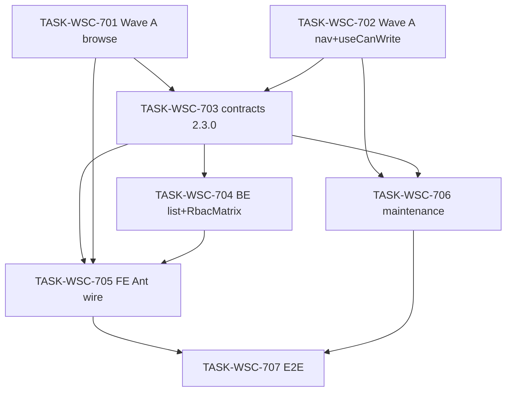

# 接入端工作台（WSC）V1.5 候选执行计划 — 目录浏览 / 导航收纳 / 目录维护 UX（R2 修订）

```yaml
planId: PLAN-WSC-6.2
status: APPROVED
planType: APPROVED
snapshotId: SNAP-WSC-006
sourcePrd: product/prd/wsc-v1.5-catalog-ux.md
runId: RUN-WSC-009
basedOn: PLAN-WSC-6.1
lineageFrom: PLAN-WSC-6.1
previousRun: RUN-WSC-008
functionalBaseline:
  snapshotId: SNAP-WSC-005
  planId: PLAN-WSC-5.2
  contracts: wsc-contracts@2.2.0
uxBaseline:
  snapshotId: SNAP-WSC-003
  planId: PLAN-WSC-3.1
contractsTarget: wsc-contracts@2.3.0
round: 2
createdAt: 2026-08-12
approvedAt: 2026-08-12
taskCount: 7
waveCount: 4
requirementCount: 4
mappedIssueCount: 15
authorRoles: [planEditor]
actorInstance: plan-editor-wsc-009-r2
```

> **批准声明**：本文件为 `PLAN-WSC-6.2` **Round 2** 共识通过后的批准执行计划（`planType: APPROVED` / `status: APPROVED`）。门禁依据：`planning/reviews/wsc-6.2/round-2/` 隔离评审 8/8 `APPROVE`（必需 5/5）；由 Orchestrator 自候选稿复制发布，**未**改写专业结论。  
> **需求权威**：`snapshotId: SNAP-WSC-006`（`status: APPROVED`，PO 2026-08-12）。  
> **PO 已锁定**：企业名检索字段=`supplierName`；未分类排序=`api-global-bottom`（无 `l3CategoryId` 殿后，次键 `updatedAt`）；波次 A/B/C。

## 0. Round 1 ISSUE 修订映射（相对 PLAN-WSC-6.1）

> **关闭须原提出者在 Round 2 对本 planId（PLAN-WSC-6.2）确认**对应修订满足其 `closeWhen`。下表仅映射修订位置与吸收意图，**不**表示 ISSUE 已关闭。planEditor **不**关闭 ISSUE，**不**标 APPROVED。

| ISSUE id | sev | 本文件修订位置（吸收意图） |
|---|---|---|
| ISSUE-SA-WSC6-R1-001 | P1 | TASK-WSC-704 `writeSet`：测试改为**显式文件列表**（`CatalogBrowseIntegrationTest` / 新建 `ListProductsFilterSortIntegrationTest` / 可选 `CreateByOwnershipIntegrationTest`）；`denyModify` **字面**加入 `L2DistributionServiceTest.java`、`L2DistributionIntegrationTest.java`；删除 `**/catalog/browse/**` 测试整树授权 |
| ISSUE-SA-WSC6-R1-002 | P2 | TASK-WSC-705：`writeSet` 字面 glob `frontend/src/features/catalog/browse/components/**`；`denyModify` 字面 `CirculationSeatMap.vue` + `CirculationSeatMap.spec.ts`；删除「交付说明再列」叙述项 |
| ISSUE-QA-WSC6-R1-001 | P1 | 704/705 `testScope` + §6.1 场景 3：`supplierName` vs `enterpriseName` 分叉负例；705 断言 query 键仅为 `supplierName`、无 `enterpriseName` |
| ISSUE-QA-WSC6-R1-002 | P1 | 704 `acceptance`/`testScope`：null/blank L3 同属未分类；同组 `updatedAt` desc；固定 pageSize 跨页边界夹具；705 禁止破坏性前端 sort 负例；§6.1 场景 4 勾选边界/次键 |
| ISSUE-QA-WSC6-R1-003 | P1 | §4.1 三角色正例+负例单元格表；702/`testScope` + §6.1 场景 2/8：菜单+深链结构不可达；707 强制跑 `test:p0-v14` RBAC 回归并引用证据 |
| ISSUE-QA-WSC6-R1-004 | P1 | 707 钉死命令 `pnpm --dir tests/e2e run test:p0-v15`；规格 `specs/p0-wsc-v1.5.spec.ts`；独立 `playwright.v15.config.ts`；**保留** `test:p0-v14` 与既有 v1.4 config；禁止冲掉 V1.4 证据门禁 |
| ISSUE-QA-WSC6-R1-005 | P2 | 701/705 `testScope` 双 mode（`/catalog` + `/my-products`）；§6.1 场景 1 与 3 抽样 mine 表面 |
| ISSUE-QA-WSC6-R1-006 | P2 | 701 `testScope`：可见文本「全部业务视图」「全部业务大类」 |
| ISSUE-PP-WSC6-R1-001 | P1 | **方案 (A)**：706 `dependsOn: [702, 703]`；§6 **禁止 703∥706**；统一 Wave B/C 调度口径；706 仅在 703 VERIFIED 后与 704/705 并行 |
| ISSUE-PE-WSC6-R1-001 | P1 | 同 SA-002：705/706 删除叙述性 writeSet；706 字面 glob `frontend/src/features/catalog/maintenance/components/**` |
| ISSUE-UX-WSC6-R1-001 | P1 | §1.5 冻结 Ant→token 最小映射集；705/706 `acceptance`/`testScope` 可勾选令牌/主题断言 |
| ISSUE-UX-WSC6-R1-002 | P1 | 706 `acceptance`/`testScope` + §6.1 #7：表头「本页全选」文案/aria；批量条本页范围文案；主 CTA「统一维护」；无跨页 affordance |
| ISSUE-SEC-WSC6-R1-001 | P1 | §4 **冻结**：目录维护 **UI+API 仅 ADMIN**（对齐 SNAP/PRD；纠偏 2.2.0 矩阵 PROVIDER 可见）；703 同步 `matrix.yaml`；702 写 `useCanWrite`；704 写 `RbacMatrix.java`+测试；702/706/707 深链不可达 |
| ISSUE-SEC-WSC6-R1-002 | P2 | 706 `acceptance`/`testScope`：statusTab / Cascader 筛选变更时清空 selectedIds（或 batch ⊆ 当前页） |
| ISSUE-SEC-WSC6-R1-003 | P2 | 703 `riskTags`/`acceptance` 显式矩阵行勾选；§6.2 澄清无 `auth-model-change`；706 选择生命周期写入验收 |

**映射条数：15**（均已吸收进正文；无升级项；PA/API-Data 本轮 0 ISSUE）。**ISSUE 关闭权属原评审角色 Round 2 确认；本实例不关闭、不标 APPROVED。**

### 0.1 谱系与定位

| 概念 | 本计划取值 | 含义 |
|---|---|---|
| `planId` | PLAN-WSC-6.2 | V1.5 修订候选（吸收 6.1 Round 1 ISSUE 意图） |
| `round` | 2 | **本 planId（6.2）** 待进入的共识轮次（即将独立评审 Round 2） |
| `basedOn` / `lineageFrom` | PLAN-WSC-6.1 | 相对上一候选的修订谱系 |
| 功能基线 | PLAN-WSC-5.2 / SNAP-WSC-005 / `wsc-contracts@2.2.0` | RBAC、我的产品、座序图、用户管理、导入四态等**不削弱**（目录维护角色门控按 SNAP **纠偏为 ADMIN-only**，见 §4） |
| UX 基线 | PLAN-WSC-3.1 / SNAP-WSC-003 | 令牌/壳层/主路径质感**不回退**；本版可在既有令牌内引入 ant-design-vue 控件 |
| 契约目标 | `wsc-contracts@2.3.0` | 由 **TASK-WSC-703** 唯一拥有升版与 `frontend/src/api/**` 生成 |
| 需求权威 | SNAP-WSC-006 | 新增 CAT-011/012/013；修订 SHELL-001；继承 RBAC/CAT-001..010/UX 等 |
| 仓布局 | `ai/rules/project/repos.yaml` | 前端 `frontend/`；后端 `backend/`；契约在控制面 `contracts/` |

本计划 **不** 改写 SNAP-WSC-001..005 正文结论；以增量任务承接 V1.5。

### 0.2 现状抽查（起草时工作树）

| 面 | 现状 | 本计划动作 |
|---|---|---|
| 契约 | `contracts/VERSION`=`2.2.0`；`listProducts` 有 `q`，**无** `supplierName`；`matrix.yaml` PROVIDER `catalogMaintenanceUI: visible` | Wave B：703 升 2.3.0 + 矩阵纠偏 ADMIN-only |
| 浏览 FE | 文案仍「空间/行业/行业分类」；native select/input；无高级筛选收起；无 `supplierName` | Wave A 文案+收起；Wave B Ant + 企业名 |
| 壳层 | 一级平铺「数据目录 / 我的数据产品 / 目录维护」 | Wave A：收纳为「数据目录」子菜单；「全链数据目录」改名 |
| FE 门控 | `useCanWrite.canMaintainCatalog` = ADMIN\|\|PROVIDER | **702** 纠偏为仅 ADMIN |
| BE 门控 | `RbacMatrix.canMaintainCatalog` = ADMIN\|\|PROVIDER | **704** 纠偏为仅 ADMIN（与矩阵同步） |
| 浏览 BE | `listProducts`：`q` 仅名/编码；排序仅 `updatedAt`；无未分类殿后 | Wave B：704 |
| 维护 FE | 自定义分页；native select；行勾选+「批量保存」；无本页全选/Cascader | Wave C：706（**703 后**） |
| ant-design-vue | `^4.2.6` 已依赖 | Wave B/C 消费；禁止借机大升级 |
| E2E | `test:p0-v14` + `playwright.config.ts` 指向 v1.4 | 707 新增 v15 script/config；**保留** v14 |

**包结构约束（后端）**：按类型分层（`controller|service|repository|entity|model|config|common`）；禁止新建业务域顶层包。

**控制面禁止**：实现任务 **denyModify** `ai/runs/**/state.yaml`、`ai/runs/**/events.jsonl`；禁止伪造 REV-\* / 全员 APPROVE。

### 0.3 文件级互斥总览（机械 scope-check）

| 共享制品 | 唯一写任务 | 其他任务 |
|---|---|---|
| `frontend/.../CatalogBrowsePage.vue` | **701**（A）→ **705**（B，串行） | 702/703/704/706/707 deny |
| `frontend/.../useCatalogBrowse.ts`（及 spec） | **701** → **705**（串行） | 他任务 deny |
| `frontend/.../browse/components/**`（除座序图） | **705** | 701 不得写 components；座序图全任务 deny |
| `frontend/.../WorkbenchLayout.vue` | **702** | 他任务 deny |
| `frontend/.../useCanWrite.ts`（及 spec） | **702** | 他任务 deny |
| `contracts/**` + `frontend/src/api/**` | **703** | 他任务只读；**706 不得与 703 并行读生成中的 api** |
| `CatalogBrowseController.java` / `CatalogBrowseService.java` | **704** | 他任务 deny |
| `RbacMatrix.java` + `RbacMatrixTest.java` | **704** | 他任务 deny |
| `CatalogMaintenancePage.vue` + `useCatalogMaintenance.ts` + `maintenance/components/**` | **706** | 他任务 deny |
| `tests/e2e/**` | **707** | 701..706 deny |
| `frontend/src/styles/**` / `theme/**` | **无写任务** | 全任务只读（scoped / 局部 ConfigProvider 可写在各页 SFC） |
| `ai/runs/**/state.yaml` | **无写任务** | 全任务 denyModify |

> **串行拥有权**：`CatalogBrowsePage.vue` / `useCatalogBrowse.ts` 在 701 VERIFIED 前仅 701 可写；705 启动后方可写，且 701 不得再改。禁止同波双写。  
> **704 测试边界**：仅字面测试文件；**禁止**改 `L2Distribution*Test`。

## 1. 范围、假设与硬门禁

### 1.1 范围

**In Scope（SNAP-WSC-006 / PO 已锁定）**

| Wave | 内容 | 契约 |
|---|---|---|
| **A** | REQ-CAT-011 文案 + 高级筛选默认收起；REQ-SHELL-001 导航收纳；FE `useCanWrite` 维护门控纠偏 ADMIN-only | 无 |
| **B** | REQ-CAT-011 Ant；REQ-CAT-012 `supplierName` + 未分类 API 全局垫底；契约 ≥2.3.0；矩阵 ADMIN-only；BE `RbacMatrix` 纠偏 | **≥2.3.0** |
| **C** | REQ-CAT-013 Pagination / Cascader / 本页全选 + 统一维护（**703 VERIFIED 后**启动） | 无（只读已生成 api） |
| **E2E** | V1.5 P0 证据包 + V1.4 回归命令仍可跑 | — |

**Out of Scope / 默认 deny**

- 用户管理功能增改、硬删除用户、密码重置 / OAuth / 多租户
- 跨页全选统一维护
- 座序图交互变更、链存证逻辑、导入模板/列映射变更
- Downloads React 仓改造
- 将会话/企业主体 `enterpriseName` 当作目录产品检索字段（本版明确用产品 **`supplierName`**）
- 重做 UX 令牌体系；静默再 bump 契约超过 2.3.0
- 改写历史 SNAP 正文；实现任务写 Run state/events

### 1.2 假设（PO 已确认 / SNAP 收录）

| 项 | 口径 |
|---|---|
| `contractsTarget` | **`wsc-contracts@2.3.0`** |
| 企业名称检索 | 产品字段 **`supplierName`** 模糊匹配（扩展 `listProducts`） |
| 未分类置底 | **API 分页全局垫底**：无 `l3CategoryId` 殿后；次键 `updatedAt` desc；跨页保持 |
| 文案 | 「空间」→「业务视图」；「行业」→「业务大类」；「行业分类」→「行业类别」；**query 名仍 `industryCategory`**；「全部空间/全部行业」→「全部业务视图/全部业务大类」 |
| 高级筛选 | 默认**收起**；业务大类行「高级筛选」展开 |
| 导航 | 一级「数据目录」子项：全链数据目录 / 目录维护（**仅 ADMIN**）/ 我的数据产品（PROVIDER） |
| 目录维护门控 | **UI + API 仅 ADMIN**（对齐 SNAP-WSC-006 / PRD；相对 2.2.0 矩阵属**语义纠偏**，非削弱 SNAP） |
| UX 不回退 | SNAP-WSC-003 / PLAN-WSC-3.1；双表面 active 规则不削弱 |
| RBAC 不回退 | 继承 SNAP-WSC-005 能力，**但**目录维护角色以 SNAP-WSC-006 / PRD「仅管理员」为准纠偏 |
| Blocking OQ | **无** |

### 1.3 技术栈硬门禁

| 层 | 固定选型 |
|---|---|
| 前端 | Vue 3 + TypeScript + Vite + pnpm + Pinia + Vue Router 4；**CSS-token-first**；Ant Design Vue **4.x（既有依赖）** |
| 后端 | Spring Boot **2.7.18** + Java 17；`backend/app/data-chain-service/`；包按类型分层 |
| 数据 | MySQL + Flyway；本版 **预期无** schema 迁移；触碰 migration 则加 `schema-migration` |
| 契约 | 目标 `wsc-contracts@2.3.0`；client 生成至 `frontend/src/api/**` |
| 测试 | JUnit 5；Vitest；Playwright |
| 多仓 | `repos.yaml`：worker 写 `frontend` / `backend`；契约在控制面；state 仅 Orchestrator |

禁止：静默改契约版本号；业务任务私改 `contracts/**` / `frontend/src/api/**`（除 703）；纯 CSS 替代鉴权；引入第二套 UI 框架。

### 1.4 执行硬门禁

- 每任务：独立 developer → codeReviewer → tester；Orchestrator 按 `writeSet` **字面路径** scope-check（禁止方法级散文例外；禁止「交付说明再列」扩界）。
- developer ≠ codeReviewer ≠ tester。
- 同波并行写集必须互斥（见 §6）；**禁止 703∥706**。
- `TASK-WSC-703` **唯一**拥有契约升级与 `frontend/src/api/**` 生成；704..707 只读消费生成物。
- UX：增量控件消费既有令牌；**禁止**另起全局色板 / 未映射 Ant 默认皮肤主导筛选条或维护表区。
- 权限：隐藏 ≠ 授权；维护页深链须结构不可达（非仅菜单 v-if）。

### 1.5 UX 不回退与本版冻结面

| 约束 | 口径 |
|---|---|
| 令牌 | 沿用既有 CSS 变量；本版仅 SFC scoped / Ant `ConfigProvider` theme 映射增量 |
| **Ant→token 最小映射集（冻结）** | 主色 ← `--blue`（或项目既有主色变量）；边框 ← `--border-color`；表面/卡片 ← `--card-bg` / 白卡片层次；圆角 ← 既有卡片/输入圆角变量；正文字阶 ≈ 14px（对齐既有浏览/维护正文）。**禁止**未映射的 Ant 默认蓝/灰皮肤主导筛选条或维护表区（走查可判「默认表/控件堆砌」即失败） |
| 双目录表面 | `/catalog` 与 `/my-products` 页头可区分；侧栏 active 互斥；写路径返回我的产品（继承 5.2） |
| 导航收纳后 | 子菜单「全链数据目录」=原公共目录；「我的数据产品」仅 PROVIDER；「目录维护」仅 ADMIN；用户管理菜单**不得**改动/删除 |
| 座序图 | 公共目录挂载不回退；全任务 **denyModify** `CirculationSeatMap.vue`（及 spec） |
| 公共/我的浏览同源 | `CatalogBrowsePage` 双 mode 行为一致 |
| 跨页全选 | **不做**；可见文案须含「本页」语义（见 706） |

## 2. 决策与写集互斥裁决

### 2.1 必须遵守的 DEC / 锁定

| 项 | 本计划用法 |
|---|---|
| DEC-WSC-001..005 | 不削弱 |
| PO：`supplierName` | 703/704/705 硬口径；禁止改用 `enterpriseName` |
| PO：未分类 API 全局垫底 | 704 实现排序；705 可钉「未分类」视觉分区但不得依赖仅前端重排跨页 |
| SNAP：目录维护 ADMIN-only | §4 + 702/703/704 纠偏；禁止「仅菜单隐藏、深链/API 仍 PROVIDER 可达」 |

### 2.2 开放问题

| id | status | 本计划口径 |
|---|---|---|
| OQ-V15-001 | CLOSED | `supplierName` |
| OQ-V15-002 | CLOSED | API 全局垫底 |
| Blocking OQ | **无** | 可送委员会评审 |

### 2.3 写集互斥裁决（可机械 scope-check）

| 冲突面 | 选定方案 | 字面规则 |
|---|---|---|
| CatalogBrowsePage | **串行独占** | Wave A=`701`；Wave B=`705`（`dependsOn: [701,703,704]`） |
| useCatalogBrowse | **串行独占** | 701→705 |
| browse/components/** | **705 独占** | deny 座序图；701 不写 components |
| WorkbenchLayout + useCanWrite | **702 独占** | 701/705/706 deny |
| CatalogBrowseService + RbacMatrix | **704 独占** | 703 只改契约；705 只读 API client |
| CatalogMaintenance* | **706 独占** | 全波次其他任务 deny；**703 VERIFIED 后**才启动 |
| contracts / api gen | **703 独占** | 704/705/706 只读；**禁止 703∥706** |

## 3. 契约升级与唯一所有权（`wsc-contracts@2.3.0`）

### 3.1 契约冻结内容（TASK-WSC-703 一次性 — 硬冻结）

| 契约项 | 内容 |
|---|---|
| VERSION | `2.2.0` → **`2.3.0`**（若树中已是 2.3.0：对账确认内容完整，禁止再 bump） |
| `GET /catalog/products` | 新增可选 query **`supplierName`**：对产品 `supplierName` **模糊**（大小写不敏感 contains）；与既有 `q`（产品名/编码）**并存、语义分离** |
| 排序语义（硬） | **有非空 `l3CategoryId` 在前**；**无/`null`/`blank` L3（未分类）殿后**；同组内次键 **`updatedAt` 降序**；跨页分页仍保持该全局顺序 |
| RBAC 矩阵纠偏（硬） | `contracts/rbac/matrix.yaml`：PROVIDER `catalogMaintenanceUI: **hidden**`；`catalogMaintenanceApi: { expect: 403, code: ERR_MAINTENANCE_FORBIDDEN }`；ADMIN 保持 visible/200；notes 改为「目录维护 UI+API **仅 ADMIN**」（对齐 SNAP/PRD；叙述为语义纠偏，**禁止**用「不回退 2.2.0 字面矩阵」阻止纠偏） |
| 既有不回退 | 2.2.0：`mine`、用户管理、L2 distribution、导入四态、报告白名单、`industryCategory` query 名；产品写仍仅 PROVIDER |
| `ui/state-matrix.md` | 版本头=`2.3.0`；补充浏览筛文案/高级筛选/企业名搜/未分类垫底/导航收纳/维护 Cascader·Pagination·本页全选；维护 UI 可见性=ADMIN |
| `req-coverage.md` | 映射 REQ-CAT-011/012/013、修订 REQ-SHELL-001 |
| client | 重新生成 `frontend/src/api/**` 且可 typecheck |

### 3.2 唯一所有权矩阵

见 §0.3。壳层：**仅 702** 改 `WorkbenchLayout.vue` + `useCanWrite.*`；路由标题若需「全链数据目录」可改 `frontend/src/router/routes.ts`（702 白名单）；**禁止**删除 `/admin/users`、`/my-products`、`/catalog/maintenance`。

### 3.3 数据迁移协议

- 本版默认 **无** Flyway；704 **denyModify** `**/sql/**` 除非验收证明缺列（`supplierName` 已在产品模型存在）。
- 若意外触碰 migration → 该任务追加 `riskTags: [schema-migration]` 并触发独立 `migrationReviewer`。

## 4. RBAC 可测矩阵（对齐 SNAP-WSC-006；维护 ADMIN-only）

| 能力 | ADMIN | PROVIDER | USER |
|---|---|---|---|
| 全链数据目录浏览 | 可见 | 可见 | 可见 |
| 目录维护（子菜单 + 页结构 + API） | 可见 / 200 | **隐藏 / 深链不可达 / API 403** | **隐藏 / 深链不可达 / API 403** |
| 我的数据产品（子菜单） | 隐藏 | 可见 | 隐藏 |
| 用户管理 | 可见（本版不改） | 隐藏 | 隐藏 |
| 产品增改导 | 隐藏/403 | 我的产品 200 | 隐藏/403 |

前端隐藏 ≠ 授权。本版相对 `wsc-contracts@2.2.0` 对「PROVIDER 目录维护可见」做 **SNAP 对齐纠偏**。

### 4.1 三角色回归单元格（702 / 707 强制勾选）

| 角色 | 正例 | 负例（结构不可达 / 403） |
|---|---|---|
| ADMIN | 全链+目录维护可见；用户管理仍可见 | 我的数据产品不可见 |
| PROVIDER | 全链+我的数据产品可见 | 目录维护菜单隐藏；深链 `/catalog/maintenance` 结构不可达；维护 API 403；用户管理不可达 |
| USER | 仅全链数据目录可见 | 维护/我的产品/用户管理不可达；维护深链拒绝 |

## 5. 任务包列表

> 任务 ID：`TASK-WSC-701`..`707`。路径以 `repos.yaml` 为准；后端 Java 根 = `backend/app/data-chain-service/src/main/java/com/shdata/datachain`；测试根 = `backend/app/data-chain-service/src/test/java/com/shdata/datachain`。

### TASK-WSC-701 — Wave A：浏览文案 + 高级筛选收起

- `requirements`: `[REQ-CAT-011]`
- `objective`: 公共目录与我的数据产品同源浏览页：标签「空间→业务视图」「行业→业务大类」「行业分类→行业类别」（query 仍 `industryCategory`）；「全部空间/全部行业」→「全部业务视图/全部业务大类」；高级筛选区默认收起，业务大类行提供「高级筛选」展开/收起；**本任务不换 Ant 控件、不接 supplierName、不写 browse/components**
- `dependsOn`: `[]`
- `readSet`:
  - `product/requirements/SNAP-WSC-006.md`
  - `product/prd/wsc-v1.5-catalog-ux.md`
  - `planning/candidates/PLAN-WSC-6.2.md`（本文件 §1/§5）
  - 既有 `frontend/src/features/catalog/browse/**`
- `writeSet`:
  - `frontend/src/features/catalog/browse/CatalogBrowsePage.vue`
  - `frontend/src/features/catalog/browse/composables/useCatalogBrowse.ts`
  - `frontend/src/features/catalog/browse/composables/useCatalogBrowse.spec.ts`
  - `frontend/src/features/catalog/browse/CatalogBrowsePage.spec.ts`
  - `frontend/src/features/catalog/browse/utils/labels.ts`
- `denyModify`:
  - `frontend/src/features/catalog/browse/components/**`
  - `frontend/src/layouts/WorkbenchLayout.vue`
  - `frontend/src/features/auth/composables/useCanWrite.ts`
  - `frontend/src/features/auth/composables/useCanWrite.spec.ts`
  - `frontend/src/features/catalog/maintenance/**`
  - `contracts/**`；`frontend/src/api/**`
  - `backend/**`；`**/sql/**`
  - `tests/e2e/**`
  - `product/**`；`planning/**`；`ai/runs/**/state.yaml`；`ai/runs/**/events.jsonl`
  - `frontend/src/styles/**`；`frontend/src/theme/**`
- `acceptance`:
  - 可见标签：业务视图 / 业务大类 / 行业类别（展开后）；无残留面向用户的「空间」「行业」「行业分类」主标签文案（testid 可保留旧 id，但 aria/可见文本须新文案）
  - 「全部业务视图」「全部业务大类」按钮可见文本已替换旧「全部空间」「全部行业」
  - 高级筛选（含行业类别及原 filter-bar 内非标签区筛选项）**默认收起**；业务大类行有「高级筛选」按钮，点击可展开/再收起
  - `/catalog` 与 `/my-products` 行为一致
  - 不引入 Ant Input/Select 替换（留给 705）；不发送 `supplierName`
  - 座序图挂载与双表面不回退
- `testScope`:
  - Vitest：默认 `advancedOpen=false`（或等价）；点击切换；文案断言（业务视图/业务大类/行业类别）
  - Vitest：可见文本「全部业务视图」「全部业务大类」
  - Vitest：**catalog mode + mine mode** 各跑同一套文案/收起断言（或参数化）
  - 回归：既有 industryCategory query 仍发出
- `riskTags`: `[ux-copy, filter-collapse]`

### TASK-WSC-702 — Wave A：导航收纳 + 维护 FE 门控（ADMIN-only）

- `requirements`: `[REQ-SHELL-001, REQ-RBAC-001]`
- `objective`: 侧栏一级「数据目录」下收纳：全链数据目录（`/catalog`）、目录维护（**仅 ADMIN**，`/catalog/maintenance`）、我的数据产品（PROVIDER，`/my-products`）；将 `useCanWrite.canMaintainCatalog` 纠偏为 **仅 ADMIN**；页级/路由结构门控与菜单一致；角色可见性不回退用户管理
- `dependsOn`: `[]`
- `readSet`:
  - SNAP-WSC-006；本计划 §1.5 / §4
  - `frontend/src/layouts/WorkbenchLayout.vue`
  - `frontend/src/router/routes.ts`
  - `frontend/src/features/auth/composables/useCanWrite.ts`
- `writeSet`:
  - `frontend/src/layouts/WorkbenchLayout.vue`
  - `frontend/src/router/routes.ts`（仅 `/catalog` 及相关 meta/title 展示「全链数据目录」；**不得**删除既有路由）
  - `frontend/src/features/auth/composables/useCanWrite.ts`
  - `frontend/src/features/auth/composables/useCanWrite.spec.ts`
  - 同布局 colocated `WorkbenchLayout.spec.ts`（若有/新建于 `frontend/src/layouts/`）
- `denyModify`:
  - `frontend/src/features/catalog/browse/**`
  - `frontend/src/features/catalog/maintenance/**`
  - `frontend/src/features/users/**`
  - `frontend/src/features/shell/components/RoleSwitcher.vue`
  - `contracts/**`；`frontend/src/api/**`；`backend/**`
  - `tests/e2e/**`
  - `product/**`；`planning/**`；`ai/runs/**/state.yaml`；`ai/runs/**/events.jsonl`
  - `frontend/src/styles/**`；`frontend/src/theme/**`
- `acceptance`:
  - 一级菜单「数据目录」可展开/收起（或常显子项）；子项文案：全链数据目录 / 目录维护 / 我的数据产品
  - `canMaintainCatalog('ADMIN')===true`；`canMaintainCatalog('PROVIDER')===false`；`canMaintainCatalog('USER')===false`
  - ADMIN：可见全链 + 目录维护；不可见我的数据产品；用户管理仍可见
  - PROVIDER：可见全链 + 我的数据产品；**不可见**目录维护；深链 `/catalog/maintenance` **结构不可达**（非仅侧栏隐藏）
  - USER：仅可见全链数据目录；维护/我的产品/用户管理不可达
  - 路由可保持 `/catalog`、`/catalog/maintenance`、`/my-products`
  - 双表面 active：在 `/my-products/**` 时高亮「我的数据产品」而非「全链数据目录」；在维护路径高亮「目录维护」
  - **不得**回退/删除用户管理菜单与角色只读展示
- `testScope`:
  - Vitest：`useCanWrite` 三角色 `canMaintainCatalog` 断言（含 PROVIDER=false）
  - Vitest 或组件测：§4.1 子菜单可见性正例+负例单元格
  - active 互斥用例（catalog / maintenance / mine）
  - 深链负例：非 ADMIN 打开维护路由仍拒绝/不可达
- `riskTags`: `[shell-nav, rbac-visibility]`

### TASK-WSC-703 — Wave B：契约 2.3.0 + client 生成 + 矩阵纠偏

- `requirements`: `[REQ-CAT-012, REQ-CAT-011, REQ-CAT-013, REQ-SHELL-001, REQ-RBAC-001]`
- `objective`: 按 §3.1 硬冻结发布 `wsc-contracts@2.3.0`；生成 `frontend/src/api/**`；更新 req-coverage / state-matrix；**纠偏** `rbac/matrix.yaml` 目录维护 ADMIN-only
- `dependsOn`: `[TASK-WSC-701, TASK-WSC-702]`
- `readSet`:
  - SNAP-WSC-006；本计划 §3 / §4
  - 既有 `contracts/**`
- `writeSet`:
  - `contracts/**`（含 `VERSION`=`2.3.0`、`openapi/**`、`rbac/matrix.yaml`、`ui/state-matrix.md`、`req-coverage.md` 及必要语义文档）
  - `frontend/src/api/**`
  - 前端根构建配置（**仅当** client 生成必需）：`frontend/package.json`、`frontend/pnpm-lock.yaml`（禁止借机大升级 ant-design-vue / Vue）
- `denyModify`:
  - `frontend/src/features/**`；`frontend/src/layouts/**`；`frontend/src/router/**`；`frontend/src/styles/**`；`frontend/src/theme/**`；`frontend/src/components/**`
  - `backend/**`；`**/sql/**`
  - `tests/e2e/**`
  - `product/**`；`planning/**`；`ai/rules/**`；`ai/runs/**/state.yaml`；`ai/runs/**/events.jsonl`
- `acceptance`:
  - `contracts/VERSION` = `2.3.0`；OpenAPI info.version 一致
  - `listProducts` 参数含 `supplierName`（模糊语义写明）；`q` 语义不回退
  - 排序：有 L3 在前、未分类殿后、次键 `updatedAt` desc — OpenAPI/文档硬描述
  - `matrix.yaml`：PROVIDER `catalogMaintenanceUI: hidden` 且维护 API expect 403；ADMIN 维护 UI visible；notes 与 §4 一致
  - 2.2.0 其余能力不回退（mine / 用户管理 / L2 / 导入四态等）
  - `frontend/src/api/**` 生成后可 typecheck
  - req-coverage / state-matrix 含 V1.5 映射行与维护 ADMIN-only 可见性
- `testScope`:
  - 契约 lint / OpenAPI 校验
  - 可勾选：`supplierName` 参数存在；排序描述存在；VERSION=2.3.0
  - 可勾选：matrix 行 ADMIN/PROVIDER/USER 维护 UI+API 与 §4 一致
  - client typecheck
- `riskTags`: `[contracts-bump, rbac-visibility]`

### TASK-WSC-704 — Wave B：BE listProducts + 未分类垫底 + RbacMatrix 纠偏

- `requirements`: `[REQ-CAT-012, REQ-RBAC-001]`
- `objective`: 实现 `supplierName` 模糊过滤；排序有 `l3CategoryId` 在前、未分类殿后，次键 `updatedAt`；分页跨页保持全局顺序；将 `RbacMatrix.canMaintainCatalog` 纠偏为 **仅 ADMIN**（与 703 矩阵同步）
- `dependsOn`: `[TASK-WSC-703]`
- `readSet`:
  - `contracts/openapi/**`（只读）
  - `contracts/rbac/matrix.yaml`（只读）
  - SNAP-WSC-006 §REQ-CAT-012
  - 既有 `CatalogBrowseController` / `CatalogBrowseService` / `CatalogBrowseSeedStore`
  - `backend/.../common/security/RbacMatrix.java`
- `writeSet`:
  - `backend/app/data-chain-service/src/main/java/com/shdata/datachain/controller/catalog/browse/CatalogBrowseController.java`
  - `backend/app/data-chain-service/src/main/java/com/shdata/datachain/service/catalog/browse/CatalogBrowseService.java`
  - `backend/app/data-chain-service/src/main/java/com/shdata/datachain/common/security/RbacMatrix.java`
  - `backend/app/data-chain-service/src/test/java/com/shdata/datachain/catalog/browse/CatalogBrowseIntegrationTest.java`
  - `backend/app/data-chain-service/src/test/java/com/shdata/datachain/catalog/browse/ListProductsFilterSortIntegrationTest.java`（新建；过滤/排序/跨页夹具主文件）
  - `backend/app/data-chain-service/src/test/java/com/shdata/datachain/catalog/browse/CreateByOwnershipIntegrationTest.java`（仅当 mine 路径抽样需改时；否则只读不改）
  - `backend/app/data-chain-service/src/test/java/com/shdata/datachain/rbac/RbacMatrixTest.java`
- `denyModify`:
  - `contracts/**`；`frontend/**`
  - `backend/app/data-chain-service/src/main/java/com/shdata/datachain/controller/catalog/browse/L2DistributionController.java`
  - `backend/app/data-chain-service/src/main/java/com/shdata/datachain/service/catalog/browse/L2DistributionService.java`
  - `backend/app/data-chain-service/src/test/java/com/shdata/datachain/catalog/browse/L2DistributionServiceTest.java`
  - `backend/app/data-chain-service/src/test/java/com/shdata/datachain/catalog/browse/L2DistributionIntegrationTest.java`
  - `backend/.../controller/catalog/maintenance/**`；`service/catalog/maintenance/**`
  - `backend/.../controller/catalog/editor/**`；`productimport/**`；`admin/**`
  - `backend/.../common/security/WriteAuthorizationInterceptor.java`
  - `**/sql/**`（默认；见 §3.3）
  - `tests/e2e/**`
  - `product/**`；`planning/**`；`ai/runs/**/state.yaml`；`ai/runs/**/events.jsonl`
- `acceptance`:
  - `GET /catalog/products?supplierName=` 模糊命中产品 `supplierName`（大小写不敏感）；**不**按会话 `enterpriseName` 命中
  - `q` 仍只匹配名/编码（与 `supplierName` 可组合、语义分离）
  - 排序：`null` / `""` / blank L3 **均**视为未分类殿后；所有有非空 L3 的记录出现在任何未分类之前；同组 `updatedAt` desc；固定 pageSize 下 page=1..n 切片遵守该顺序（有 L3 页切片不含未分类；未分类仅出现在全局序之后）
  - `mine=true` 路径同样遵守过滤与排序
  - `RbacMatrix.canMaintainCatalog`：仅 ADMIN=true；PROVIDER/USER=false
  - 既有筛选（l1/l2/l3/industryCategory 等）不回归
- `testScope`:
  - 集成：supplierName 命中/未命中；与 q 组合各自生效
  - **负例 fixture**：会话/主体 `enterpriseName` 与产品 `supplierName` 分叉；仅按企业主体名作为检索意图 → **0 命中 / 不误命中**（证明未误用 enterpriseName）
  - 排序夹具：null/blank/有值 L3 混合；同组 `updatedAt` desc；固定 pageSize 跨页边界
  - mine 路径抽样（若改 `CreateByOwnershipIntegrationTest` 或在新建测中覆盖）
  - `RbacMatrixTest`：PROVIDER `canMaintainCatalog` 为 false
- `riskTags`: `[list-sort, search-semantics, rbac-visibility]`

### TASK-WSC-705 — Wave B：浏览 Ant 控件 + supplierName 接线 + 未分类钉底展示

- `requirements`: `[REQ-CAT-011, REQ-CAT-012, REQ-UX-001, REQ-UX-004]`
- `objective`: 将浏览筛选搜索框/下拉换为 ant-design-vue `Input`/`Select`（消费既有依赖与 §1.5 令牌映射）；接线 `supplierName`（企业名称）；列表可按 API 顺序将未分类区钉在末段；公共与我的产品一致
- `dependsOn`: `[TASK-WSC-701, TASK-WSC-703, TASK-WSC-704]`
- `readSet`:
  - `frontend/src/api/**`（只读，703 生成物）
  - SNAP-WSC-006；本计划 §1.5
  - 701 已合入的 `CatalogBrowsePage` / `useCatalogBrowse`
- `writeSet`:
  - `frontend/src/features/catalog/browse/CatalogBrowsePage.vue`
  - `frontend/src/features/catalog/browse/composables/useCatalogBrowse.ts`
  - `frontend/src/features/catalog/browse/composables/useCatalogBrowse.spec.ts`
  - `frontend/src/features/catalog/browse/CatalogBrowsePage.spec.ts`
  - `frontend/src/features/catalog/browse/components/**`
- `denyModify`:
  - `frontend/src/features/catalog/browse/components/CirculationSeatMap.vue`
  - `frontend/src/features/catalog/browse/components/CirculationSeatMap.spec.ts`
  - `frontend/src/layouts/WorkbenchLayout.vue`
  - `frontend/src/features/auth/composables/useCanWrite.ts`
  - `frontend/src/features/auth/composables/useCanWrite.spec.ts`
  - `frontend/src/features/catalog/maintenance/**`
  - `contracts/**`；`frontend/src/api/**`（只读）
  - `backend/**`
  - `tests/e2e/**`
  - `product/**`；`planning/**`；`ai/runs/**/state.yaml`；`ai/runs/**/events.jsonl`
  - `frontend/src/styles/**`；`frontend/src/theme/**`
- `acceptance`:
  - 筛选区搜索/下拉使用 ant-design-vue Input/Select（可见组件，非仅 class 仿造）
  - Ant 控件满足 §1.5 **Ant→token 最小映射集**；禁止未映射默认皮肤主导筛选条
  - 「企业名称」筛发送 query 键 **`supplierName`**；**不**发送 `enterpriseName`；与产品名/编码 `q` 分离
  - 701 文案与高级筛选收起**不回退**
  - 列表顺序尊重 API；若做「未分类数据」视觉分区，须钉在当前已加载列表末且**不得**对跨页结果做破坏性前端 sort
  - `/catalog` 与 `/my-products` 一致；令牌层次不崩（REQ-UX-004）
- `testScope`:
  - Vitest：`applyFilters` 含 `supplierName`；请求 query **无** `enterpriseName` 键
  - Vitest：Ant 控件挂载烟测；高级筛选仍默认收起
  - Vitest：**catalog mode + mine mode** 参数化（文案/收起/`supplierName`/Ant）
  - 若视觉分区：顺序与 API 一致；**负例**：不对结果集做破坏性前端 sort
  - 可勾选：令牌/ConfigProvider 映射断言或截图键（主色/边框/表面之一）
- `riskTags`: `[antd-migration, search-wire]`

### TASK-WSC-706 — Wave C：目录维护 Pagination / Cascader / 本页全选统一维护

- `requirements`: `[REQ-CAT-013, REQ-UX-005, REQ-UX-009]`
- `objective`: 维护页：`a-pagination`（含页码跳转）；分类 Cascader——筛选允许选父并映射 l1/l2/l3，单条编辑与统一维护必须选到 L3；表头**本页全选** +「统一维护」批量入口；筛选/Tab 变更清空选择；**不做跨页全选**
- `dependsOn`: `[TASK-WSC-702, TASK-WSC-703]`
- `readSet`:
  - SNAP-WSC-006 REQ-CAT-013
  - 既有 `frontend/src/features/catalog/maintenance/**`
  - `frontend/src/api/**`（只读；**须 703 VERIFIED 后**稳定消费；维护 API 形状不强制新字段）
  - `frontend/src/features/auth/composables/useCanWrite.ts`（只读）
- `writeSet`:
  - `frontend/src/features/catalog/maintenance/CatalogMaintenancePage.vue`
  - `frontend/src/features/catalog/maintenance/composables/useCatalogMaintenance.ts`
  - `frontend/src/features/catalog/maintenance/composables/useCatalogMaintenance.spec.ts`
  - `frontend/src/features/catalog/maintenance/components/**`
- `denyModify`:
  - `frontend/src/features/catalog/browse/**`
  - `frontend/src/layouts/WorkbenchLayout.vue`
  - `frontend/src/features/auth/composables/useCanWrite.ts`
  - `frontend/src/features/auth/composables/useCanWrite.spec.ts`
  - `contracts/**`；`frontend/src/api/**`
  - `backend/**`（本版维护 API 不改形状；门控由 704 `RbacMatrix` 已纠偏；若发现必须改 BE 控制器 → 开 ISSUE，不在本任务扩写）
  - `tests/e2e/**`
  - `product/**`；`planning/**`；`ai/runs/**/state.yaml`；`ai/runs/**/events.jsonl`
  - `frontend/src/styles/**`；`frontend/src/theme/**`
- `acceptance`:
  - 使用 ant-design-vue Pagination，支持页码跳转（`showQuickJumper` 或等价）
  - Cascader / Pagination 满足 §1.5 Ant→token 映射；维护页仍满足 REQ-UX-005「非默认 Ant 表格堆砌」层次
  - 筛选 Cascader：可选 L1/L2/L3 父节点；选父时正确映射 filter l1/l2/l3
  - 单条维护 / 统一维护 Cascader：**必须**选到 L3 方可提交；选父时禁用提交或校验报错
  - 表头全选控件可见标签或 `aria-label` 含「本页」（如「本页全选」）；勾选当前页全部行；取消全选清空本页选择
  - 批量条计数暗示本页范围（如「已选择 N 条（本页）」或等价）；禁止「已全选全部产品」类跨页暗示
  - 主 CTA 可见文案为「统一维护」（替换「批量保存」）；不得双入口文案并存
  - **切换分页**不隐式跨页累积全选；**切换 statusTab 或筛选（l1/l2/l3 Cascader）时必须清空 selectedIds**（或等价保证 batch `productIds` ⊆ **当前结果页**行 id）
  - 无选中时「统一维护」不可用或隐藏
  - ADMIN 可达；PROVIDER/USER **结构不可达**（继承 702 门控；本页不得旁路）
- `testScope`:
  - Vitest：Pagination 跳页回调；Cascader 筛选父/维护必 L3；本页全选/取消；统一维护参数含本页 selected ids + l3
  - 负例：维护未选 L3 不提交
  - Vitest：切换 statusTab / 筛选条件清空 selectedIds（或 batch ⊆ 当前页）正例+负例
  - Vitest：可见「本页全选」/aria；批量条本页文案；主按钮「统一维护」；无跨页全选 affordance
  - 可勾选：令牌/ConfigProvider 映射断言或截图键
- `riskTags`: `[antd-migration, batch-maintain]`

### TASK-WSC-707 — V1.5 P0 E2E 证据包（串行；与 V1.4 共存）

- `requirements`: `[REQ-CAT-011, REQ-CAT-012, REQ-SHELL-001, REQ-CAT-013, REQ-RBAC-001]`
- `objective`: 独占 Playwright E2E，覆盖 §6.1 场景；产出可审计证据包；**保留** V1.4 回归可执行；**不改**业务 feature 源码
- `dependsOn`: `[TASK-WSC-705, TASK-WSC-706]`
- `readSet`:
  - SNAP-WSC-006；本计划 §6.1 / §4.1
  - 既有 `tests/e2e/**`
- `writeSet`:
  - `tests/e2e/specs/p0-wsc-v1.5.spec.ts`
  - `tests/e2e/playwright.v15.config.ts`
  - `tests/e2e/package.json`（增补 script `test:p0-v15`；**保留**既有 `test:p0-v14`）
  - `tests/e2e/reports/p0-wsc-v1.5/**`
  - `tests/e2e/helpers/wsc-v15-fixtures.ts`（若需；本规格专用 helper）
- `denyModify`:
  - `tests/e2e/playwright.config.ts`（**禁止**把默认 config 改成仅 v1.5 而冲掉 v1.4）
  - `tests/e2e/specs/p0-wsc-v1.4.spec.ts`
  - `frontend/src/features/**`；`frontend/src/layouts/**`；`frontend/src/router/**`；`frontend/src/styles/**`；`frontend/src/theme/**`；`frontend/src/components/**`；`frontend/src/api/**`
  - `backend/**`；`contracts/**`；`**/sql/**`
  - `product/**`；`planning/**`；`ai/runs/**/state.yaml`；`ai/runs/**/events.jsonl`
- `acceptance`:
  - §6.1 场景全部强制通过
  - **唯一** V1.5 命令：`pnpm --dir tests/e2e run test:p0-v15`（`package.json` script 一字不差指向 `playwright test specs/p0-wsc-v1.5.spec.ts --config=playwright.v15.config.ts`）
  - 报告落于 `tests/e2e/reports/p0-wsc-v1.5/`；`evidenceId: TESTRUN-WSC-E2E-V15` 写入报告
  - **共存**：`pnpm --dir tests/e2e run test:p0-v14` 仍可执行且既有 `playwright.config.ts` 仍指向 v1.4 报告目录；交付说明附两条命令
  - P0 缺陷为 0
- `testScope`:
  - 强制执行：`pnpm --dir tests/e2e run test:p0-v15`
  - 强制回归：`pnpm --dir tests/e2e run test:p0-v14`（至少 RBAC/基线相关场景通过；报告引用或附 TESTRUN）
  - 场景勾选表见 §6.1
- `riskTags`: `[e2e-gate, release-evidence]`

## 6. 波次 / DAG



| 波次 | 任务 | 启动条件 | 同波并行写集校验 |
|---|---|---|---|
| **A** | 701 ∥ 702 | 本计划 APPROVED 后派发 | **可并行**（browse vs layout/useCanWrite 写集互斥） |
| **B** | 703 →（704 ∥ 706）→ 705 | 701+702 VERIFIED 后开 703；**706 须 703 VERIFIED**；704 在 703 后；705 在 701+703+704 后 | 703 独占 contracts/**api**；**禁止 703∥706**；704 独占 BE browse+RbacMatrix；705 独占 CatalogBrowsePage |
| **C** | 706 | 产品 Wave C；DAG 上 **703+702 VERIFIED 后**，可与 704/705 **并行**（写集无交） | 706 独占 maintenance |
| **E2E** | 707 | 705+706 VERIFIED | 独占 e2e |

> **调度口径（单一）**：706 归属产品 Wave C，但 **dependsOn 含 703**，故**不得**与 703 并行；可与 704/705 并行以缩短关键路径。

**并行写集互斥声明：**

| 并行对 | 条件 | 结论 |
|---|---|---|
| 701 ∥ 702 | Wave A | **允许** |
| 703 ∥ 706 | — | **禁止**（不稳定读 `frontend/src/api/**`） |
| 704 ∥ 706 | 703+702 已 VERIFIED | **允许** |
| 705 ∥ 706 | 写集无交且 703 已 VERIFIED | **允许** |
| 701 与 705 | CatalogBrowsePage | **禁止并行**（串行） |
| 703 与任意改 contracts 者 | — | 仅 703 可写 |
| 707 与任何 feature | — | **禁止并行** |

DAG **无环**。

### 6.1 P0 E2E 场景（发布门禁强制；TASK-WSC-707）

| # | 场景 | 要点 | 强制? |
|---|---|---|---|
| 1 | 浏览文案 + 高级筛选 | 业务视图/大类/类别；全部业务视图/大类；默认收起；**抽样 `/my-products`** | **是** |
| 2 | 导航收纳 + RBAC 单元格 | §4.1 三角色正例+负例；全链改名；用户管理不删 | **是** |
| 3 | 企业名搜 | query 含 `supplierName`；**无** `enterpriseName`；分叉 fixture 或网络断言；**抽样 `/my-products`** | **是** |
| 4 | 未分类垫底 | 固定 pageSize 跨页边界：有 L3 页不含未分类；可选次键抽样 | **是** |
| 5 | Ant 筛控件 | 浏览 Input/Select 为 ant-design-vue；令牌层次可观察 | **是** |
| 6 | 维护 Pagination/Cascader | 跳页；筛可选父；维护必 L3 | **是** |
| 7 | 本页全选 + 统一维护 | 「本页全选」文案/aria；统一维护；本页计数；无跨页；筛/Tab 清空选择 | **是** |
| 8 | 维护深链门控 | PROVIDER/USER 打开 `/catalog/maintenance` 结构不可达 | **是** |

| 证据字段 | 值 |
|---|---|
| `evidenceId` | **`TESTRUN-WSC-E2E-V15`** |
| 规格文件 | **`tests/e2e/specs/p0-wsc-v1.5.spec.ts`** |
| V1.5 命令 | **`pnpm --dir tests/e2e run test:p0-v15`** |
| V1.5 config | **`tests/e2e/playwright.v15.config.ts`** |
| 报告落点 | **`tests/e2e/reports/p0-wsc-v1.5/`** |
| V1.4 共存命令 | **`pnpm --dir tests/e2e run test:p0-v14`**（保留既有 config） |

### 6.2 每任务审查/测试门禁

1. `developer` 仅改 `writeSet`，提交 REQ→diff→测试声明。
2. 独立 `codeReviewer`：对照 SNAP-WSC-006 + 本计划；字面 scope-check。
3. 独立 `tester` 执行 `testScope`。
4. 命中 `schema-migration` → `migrationReviewer`。
5. 本版**无** `auth-model-change` / `new-public-endpoint`（登录模型未变；仅矩阵可见性/维护授权纠偏对齐 SNAP）。**不强制** `securityReviewer`，但字面 scope-check + §4.1 三角色/深链测试必须通过方可 VERIFIED。
6. Orchestrator 仅在 scope-check、review、tests、交付物齐全后标 `VERIFIED`。

## 7. REQ 映射

| REQ | priority | change | 主任务 | 备注 |
|---|---|---|---|---|
| REQ-CAT-011 | P0 | 新增 | **701**（文案+收起）+ **705**（Ant）+ **707** | A+B；公共/我的一致 |
| REQ-CAT-012 | P0 | 新增 | **703**（契约）+ **704**（BE）+ **705**（FE）+ **707** | `supplierName`；API 全局垫底 |
| REQ-SHELL-001 | P0 | 修订 | **702** + **707** | 导航收纳；角色可见性；深链门控 |
| REQ-CAT-013 | P0 | 新增 | **706** + **707** | Pagination / Cascader / 本页全选统一维护 |
| REQ-RBAC-001 | P0 | 继承纠偏 | **702** + **703** + **704** + **707** | 维护 ADMIN-only |

覆盖：本快照 **4** 条 P0 REQ + 继承 RBAC 纠偏守护。

## 8. 风险与回滚

| 风险 | 缓解 | 回滚 |
|---|---|---|
| 契约 2.3.0 破坏旧客户端 | 703 钉死增量参数与排序文档 | 拒合入；回退 VERSION |
| 前端仅重排未分类导致跨页错误 | 704 API 全局顺序为权威；705 禁止破坏性重排 | 热修去掉错误前端 sort |
| 误用 enterpriseName 检索 | 704/705/707 负例钉死 | 改查询字段 |
| CatalogBrowsePage 双作者 | 701→705 串行独占 | scope-check 拒收 |
| 703∥706 读 api 交叉 | dependsOn 含 703；并行表禁止 | 调度拒收 |
| 维护门控双轨（菜单隐藏深链仍开） | 702 useCanWrite + 704 RbacMatrix + 703 matrix + 707 深链 | 对齐 ADMIN-only |
| 导航收纳回退用户管理/双表面 | 702 acceptance 显式不得回退 | 还原 layout diff |
| Cascader 维护未强制 L3 | 706 负例测试 | 热修校验 |
| 筛/Tab 后误批量旧选中 | 706 清空 selectedIds | 热修生命周期 |
| 跨页全选误做 | Out of Scope；文案冻结「本页」；706/707 断言 | 删除跨页逻辑 |
| Ant 默认皮肤冲令牌 | §1.5 映射冻结；705/706 验收 | 回退控件替换 |
| V1.5 E2E 冲掉 V1.4 | 独立 v15 config；denyModify 默认 config | 恢复 test:p0-v14 |
| 704 误改 L2 测试 | 字面 writeSet + deny L2*Test | scope-check 拒收 |

## 9. 发布门禁（V1.5 / RUN-WSC-009）

1. SNAP-WSC-006 已 APPROVED；本计划经必需角色独立 `APPROVE` 后由 Orchestrator 发布至 `planning/approved/`。
2. 全部 P0 REQ（§7）对应任务 **VERIFIED**（含 707）。
3. `wsc-contracts@2.3.0` 无未决冲突；`supplierName` + 排序语义齐全；矩阵维护 ADMIN-only。
4. Wave A 文案/收起/导航/useCanWrite 可观察通过。
5. Wave B：企业名搜与未分类跨页垫底有自动化证据；RbacMatrix 纠偏有单测。
6. Wave C：Pagination 跳页、Cascader 规则、本页全选+统一维护、筛/Tab 清选择有证据；无跨页全选。
7. UX/RBAC 相对基线无 P0 回退（维护角色以 SNAP 纠偏为准）；座序图/导入/用户管理不回退。
8. **§6.1 E2E 强制通过**：`evidenceId: TESTRUN-WSC-E2E-V15`；命令 `pnpm --dir tests/e2e run test:p0-v15`；且 `test:p0-v14` 仍可跑通。
9. developer ≠ codeReviewer ≠ tester；字面 scope-check 通过。
10. maintainer 人类发布批准（Run `approvals.yaml`，由 Orchestrator/人类操作）。

## 10. 完成检查（候选计划）

- [x] 引用 SNAP-WSC-006 / RUN-WSC-009；`planId: PLAN-WSC-6.2`；`status: DRAFT`；`planType: CANDIDATE`；`round: 2`；`actorInstance: plan-editor-wsc-009-r2`；`contractsTarget: wsc-contracts@2.3.0`；`basedOn`/`lineageFrom`: PLAN-WSC-6.1
- [x] §0 ISSUE 修订映射表（15 条）；关闭须原评审 Round 2 确认
- [x] PO 锁定：`supplierName`；未分类 API 全局垫底
- [x] 波次 A/B/C + E2E；任务 701..707 全文内联 requirements、writeSet、denyModify、acceptance、testScope、riskTags
- [x] 文件级互斥：CatalogBrowsePage / WorkbenchLayout / useCanWrite / contracts / CatalogBrowseService / RbacMatrix / maintenance
- [x] 706 dependsOn 703；禁止 703∥706
- [x] REQ 映射四条 P0 + RBAC 纠偏；Out of Scope 明确
- [x] DAG 无环；并行写集声明
- [ ] 对本 planId 的规划委员会独立评审 / APPROVE（**尚未发生**；本文件不伪造）
- [ ] Round 1 ISSUE 关闭确认（**须原提出者**；本实例不关闭）
- [ ] 本实例 **不** 将计划标为 APPROVED

---

**planEditor decision（本实例）**：`PLAN-WSC-6.2` 已落盘为可调度的 **CANDIDATE / DRAFT** 修订候选执行计划，**DRAFT 就绪可送 Round 2 独立评审**。本实例 **不** 输出委员会 APPROVE，**不** 将 status 标为 APPROVED，**不** 自行关闭任何 ISSUE，**不** 实现产品代码。建议 nextAction：`planningCommittee/independent-reviews-round-2`。
