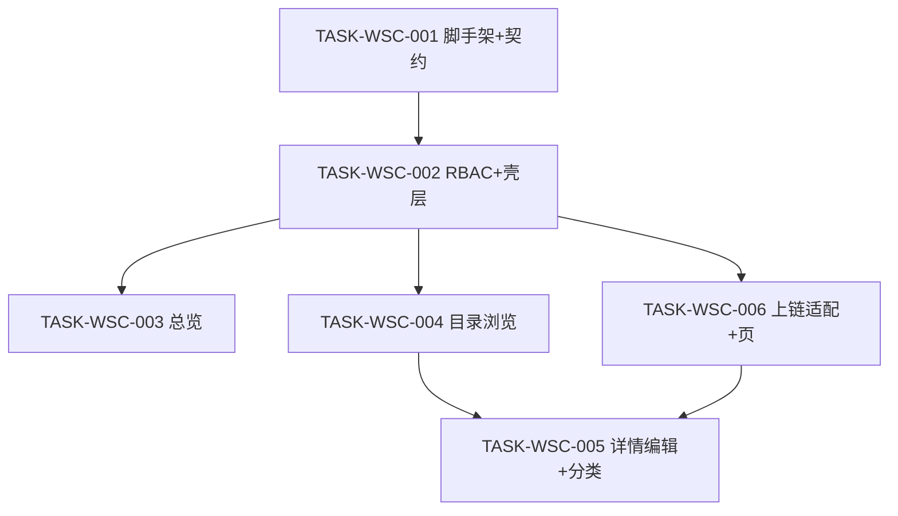

# 接入端工作台（WSC）V1.0 候选执行计划

```yaml
planId: PLAN-WSC-1.0
status: IN_REVIEW
planType: CANDIDATE
snapshotId: SNAP-WSC-001
sourcePrd: product/prd/wsc-v1.0.md
createdAt: 2026-07-28
taskCount: 6
waveCount: 5
requirementCount: 14
authorRoles: [planEditor]
approvalAuthority: none
```

> **声明**：本文仅为候选计划，不代表任何评审角色批准。进入开发前，Product Analyst、Solution Architect、QA Strategist、Parallel Planner 及适用专业角色必须分别留下可审计的 `APPROVE`；任何 `REQUEST_CHANGES` 或 `BLOCK` 均不得由 Plan Editor 代为关闭或伪造。

## 1. 范围、假设与硬门禁

### 1.1 范围

- **In Scope**：Web 接入端工作台壳层与导航；三角色 RBAC；总览（指标、趋势、TOP、最新流、分布）；数据目录（浏览、筛选、预览、详情、新增/编辑、行业分类维护）；按产品查看上链版本与目录快照；模拟存证适配层（DEC-WSC-002）。
- **Out of Scope**（冻结自 SNAP）：数据登记完整业务流、交易订单履约、连接器管理（菜单占位）、真实区块链节点、移动端 App、多租户隔离、真实支付结算。

### 1.2 假设

- **绿地工程**：目标顶层目录为 `frontend/`、`backend/`、`contracts/`、`tests/`；本计划不假设已有业务源码。
- **需求权威**：全部实现必须引用 `SNAP-WSC-001`；需求变更须新建快照，不得静默改写快照或本计划已引用结论。
- **非阻塞开放问题**：`OQ-001`、`OQ-004` 保留但不阻塞实现（见 §2）。

### 1.3 技术栈硬门禁（RULE-ORG-STACK）

| 层 | 固定选型 |
|---|---|
| 前端 | Vue 3 + TypeScript + Vite + pnpm + Pinia + Vue Router 4 + Ant Design Vue |
| 后端 | Spring Boot 3.3.x + Java 17（DEC-WSC-004） |
| 数据 | PostgreSQL 16 + Flyway |
| 测试 | Vitest / JUnit 5 + Testcontainers / Playwright |
| 上链 | 可替换模拟存证适配层（DEC-WSC-002）；禁止业务层直连真实链 SDK |

禁止引入第二套 UI/状态/HTTP Client、第二套 Web 框架/ORM/迁移工具，除非 ADR 批准。

### 1.4 执行硬门禁

- `TASK-WSC-001` 为公共契约与脚手架的**唯一所有者**；后续任务只读契约制品，不得修改。
- 同一波次仅在依赖完成、契约冻结且 `writeSet` 无交集时并行。
- 任务完成 ≠ 开发自测通过。每个实现任务必须依次通过：**独立 developer → 独立 codeReviewer（actorInstance 不同）→ 独立 tester**；三者不得由同一实例兼任。
- 目录与模块写边界遵循 `RULE-PROJECT-LAYOUT` 与 `modules.yaml`（SHELL / RBAC / OVW / CAT / CHAIN）。

## 2. 已关闭决策索引与开放问题

### 2.1 已关闭决策（实现必须遵守）

| DEC | 主题 | 关闭 | 影响 REQ | 路径 |
|---|---|---|---|---|
| DEC-WSC-001 | 产品编码全局唯一与格式 `{DOMAIN}-{FEATURE}-{NNNN}` | OQ-002 | REQ-CAT-004、REQ-CAT-005 | `design/decisions/DEC-WSC-001.md` |
| DEC-WSC-002 | V1 上链采用模拟存证适配层；字段含 metadataHash / ownerDID / timestamp / certificate.owner | OQ-003 | REQ-CHAIN-001、REQ-CAT-005 | `design/decisions/DEC-WSC-002.md` |
| DEC-WSC-003 | 有挂载产品的行业分类禁止删除 | OQ-005 | REQ-CAT-006 | `design/decisions/DEC-WSC-003.md` |

### 2.2 非阻塞开放问题（不阻塞本计划实现）

| id | 处理口径 |
|---|---|
| OQ-001 | 数据登记 / 交易订单 / 连接器管理保持 Out of Scope；壳层点击提示「本版本未开放」 |
| OQ-004 | 「其他数据产品」V1 仅基础信息，无独立类型专属字段区 |

仍 blocking 的开放问题：**无**。本候选计划可进入独立评审，不因上述两项等待新 DEC。

## 3. 关键契约前置与唯一所有权

`TASK-WSC-001` 一次性冻结以下契约，版本标记建议 `wsc-contracts@1.0.0`：

| 契约类型 | 内容 |
|---|---|
| OpenAPI | REST 端点、DTO、错误码、统一响应包装、分页/筛选、认证与 403 语义 |
| RBAC 矩阵 | 管理员 / 提供方 / 普通用户 ×「维护行业分类」「新增产品」「编辑产品」及对应写 API |
| Flyway 初版 schema | 行业分类、数据产品及类型专属字段、上链版本记录、枚举约束、产品编码唯一索引 |
| 路由清单 | 前端路由与元信息（总览、目录、详情、编辑、上链信息、未开放占位） |
| 存证适配接口 | `ChainAttestationPort`（或等价）：输入目录快照 → 输出 metadataHash / ownerDID / timestamp / certificate.owner；业务层仅依赖接口 |

唯一所有权矩阵：

| 共享制品 | 唯一写任务 | 其他任务权限 |
|---|---|---|
| `contracts/openapi/**` | TASK-WSC-001 | 只读 |
| `contracts/rbac/**`（权限矩阵） | TASK-WSC-001 | 只读 |
| `contracts/chain/**`（适配接口契约） | TASK-WSC-001 | 只读 |
| `backend/src/main/resources/db/migration/**` 初版 | TASK-WSC-001 | 只读；后续迁移须新任务且串行 |
| `frontend/src/router/**` 根路由清单 | TASK-WSC-001 | 只读；feature 内子路由扩展点除外须在任务声明 |
| 工程脚手架（根构建配置、前后端可启动骨架） | TASK-WSC-001 | 后续任务不得改动脚手架约定除非独立变更任务 |

后续模块通过预定义扩展点消费契约，**不得**直接编辑上述唯一所有制品。触碰即判定 `SCOPE_VIOLATION`。

## 4. 任务包列表

> 每个实现任务完成后：独立 `developer` ≠ 独立 `codeReviewer`，再由独立 `tester` 执行 `testScope`；证据建议 `DEV-{taskId}` / `REV-{taskId}` / `TESTRUN-{taskId}`。审查与测试不另列 TASK，按波次门禁执行。

### TASK-WSC-001 — 工程脚手架 + 契约冻结

- `requirements`: 全部 14 个 REQ（契约与工程底座覆盖；不作为功能主实现归属）
- `objective`: 创建可构建的前后端绿地工程，并一次性冻结 OpenAPI、RBAC 矩阵、Flyway 初版 schema、路由清单、存证适配接口
- `dependsOn`: `[]`
- `readSet`: `product/requirements/SNAP-WSC-001.md`；`product/prd/wsc-v1.0.md`；`design/decisions/DEC-WSC-001.md`..`DEC-WSC-003.md`；`ai/rules/organization/RULE-ORG-STACK.md`；`ai/rules/project/RULE-PROJECT-LAYOUT.md`；`ai/rules/project/modules.yaml`
- `writeSet`: `frontend/`（脚手架与根配置）；`backend/`（脚手架与根配置）；`contracts/**`；`backend/src/main/resources/db/migration/**`（初版）；`frontend/src/router/**`（根清单）；`tests/`（测试框架配置）
- `allowModify`: 仅 `writeSet` 内脚手架与契约；禁止实现业务 feature 模块
- `denyModify`: `ai/rules/**`；`product/**`；`planning/**`；`**/.env`；`**/application-local.yml`；`**/application-prod.yml`
- `acceptance`: 前后端可构建启动；OpenAPI/RBAC/Flyway/路由/存证接口齐备且互相无冲突；14 REQ 均可映射到端点/页面/模型或测试约束；产品编码唯一约束与 DEC-WSC-001 一致；存证接口字段与 DEC-WSC-002 一致
- `testScope`: OpenAPI lint；Flyway 迁移空库应用；前后端 build；契约-REQ 覆盖检查
- `riskTags`: `[schema-migration]`

### TASK-WSC-002 — RBAC 鉴权与工作台壳层

- `requirements`: `[REQ-RBAC-001, REQ-SHELL-001]`
- `objective`: 实现登录态角色鉴权（管理员/提供方/普通用户）及写入口/写 API 403 控制；落地固定侧栏、主导航、企业信息区与未开放菜单提示；角色变更后写入口立即更新
- `dependsOn`: `[TASK-WSC-001]`
- `readSet`: `contracts/**`；`contracts/rbac/**`；根路由清单；SNAP-WSC-001
- `writeSet`: `frontend/src/features/auth/**`；`frontend/src/features/shell/**`；`frontend/src/layouts/**`；`backend/src/main/java/**/rbac/**`；`backend/src/main/java/**/security/**`；对应单元测试目录
- `allowModify`: 仅 `writeSet`
- `denyModify`: `contracts/**`；`**/db/migration/**`；其他 feature（overview/catalog/chain）；`ai/**`；`product/**`
- `acceptance`: 三角色写入口可见性符合 SNAP；直接调用写 API 无权限返回 403；侧栏含「总览」「数据目录」；「数据登记」「交易订单」「连接器管理」点击提示未开放；企业信息可展示；禁止仅靠前端隐藏作为唯一防护
- `testScope`: RBAC 单元/集成；403 负例矩阵；壳层路由与占位交互组件测试
- `riskTags`: `[]`

### TASK-WSC-003 — 总览 API 与 UI

- `requirements`: `[REQ-OVW-001, REQ-OVW-002, REQ-OVW-003, REQ-OVW-004, REQ-OVW-005]`
- `objective`: 实现总览核心指标卡片、近 30 天上链趋势、产品上链 TOP10、最新上链记录流（默认 10 条）、行业/地域分布可视化
- `dependsOn`: `[TASK-WSC-002]`
- `readSet`: `contracts/openapi/**`（overview）；只读 schema；RBAC 只读上下文；SNAP 枚举与验收
- `writeSet`: `frontend/src/features/overview/**`；`backend/src/main/java/**/overview/**`；对应测试目录
- `allowModify`: 仅 `writeSet`
- `denyModify`: `contracts/**`；`**/db/migration/**`；auth/shell/catalog/chain feature；共享 `frontend/src/api/` 契约生成物（只读消费）
- `acceptance`: 指标含资产总数、活跃节点/企业、今日新增存证及最近更新时间；趋势图空态与窗口缩放可读；TOP10 排序正确；最新流含目录登记/数据登记/交易订单类型字段且倒序；行业占比与地域对比口径与目录侧一致或有说明
- `testScope`: overview API 集成；图表空态组件测试；口径 fixture 校验
- `riskTags`: `[]`

### TASK-WSC-004 — 目录浏览、筛选与预览

- `requirements`: `[REQ-CAT-001, REQ-CAT-002, REQ-CAT-003]`
- `objective`: 实现左侧一级行业索引、中部二级下产品列表、右侧预览；多维筛选与关键词搜索；预览区进入详情/上链/编辑（按权限）入口
- `dependsOn`: `[TASK-WSC-002]`
- `readSet`: `contracts/openapi/**`（catalog 读接口）；只读 schema；RBAC 矩阵；枚举表
- `writeSet`: `frontend/src/features/catalog/**`（浏览/筛选/预览相关，不含详情编辑与分类维护完整实现可留扩展点）；`backend/src/main/java/**/catalog/**`（列表/筛选/预览读路径）；对应测试目录
- `allowModify`: 仅本任务声明的 catalog 浏览读路径文件；不得实现分类维护写 API 与产品写提交（归属 005）
- `denyModify`: `contracts/**`；`**/db/migration/**`；overview/chain/auth/shell；产品写与分类维护实现文件（若已预留空壳则本任务不得填充写逻辑）
- `acceptance`: 三栏结构与列表字段符合 REQ-CAT-001；筛选组合与大小写不敏感搜索符合 REQ-CAT-002；无结果空态；预览三入口可达且普通用户无编辑按钮
- `testScope`: catalog 查询集成；筛选组合用例；预览权限可见性组件测试
- `riskTags`: `[]`

### TASK-WSC-005 — 产品详情/新增编辑与行业分类维护

- `requirements`: `[REQ-CAT-004, REQ-CAT-005, REQ-CAT-006]`
- `objective`: 实现产品详情只读分组页；管理员/提供方新增编辑（校验编码 DEC-WSC-001，提交后上架并调用存证适配产生版本）；管理员行业一/二级分类维护（挂载产品禁止删除 DEC-WSC-003）
- `dependsOn`: `[TASK-WSC-004, TASK-WSC-006]`
- `readSet`: catalog/chain 契约；DEC-WSC-001..003；`ChainAttestationPort` 实现（只读调用）；RBAC；SNAP 字段分组
- `writeSet`: `frontend/src/features/catalog/**`（详情、表单、分类维护弹窗）；`backend/src/main/java/**/catalog/**`（产品写、分类写、详情读）；对应测试目录
- `allowModify`: 仅 `writeSet`；通过依赖注入调用 chain 适配，**不得修改** `backend/.../chain/**` 实现
- `denyModify`: `contracts/**`；`**/db/migration/**`（除非本任务获批增量迁移且串行评审）；`backend/.../chain/**`；overview/auth/shell
- `acceptance`: 详情字段分组完整；编码格式与唯一性错误明确；类型切换专属字段区；标签回车增删；新建第 1 版上链、编辑版本递增；取消不落库；分类左右栏维护、待保存提示、非管理员不可进；有挂载产品删除被拒并提示原因；涉及个人信息字段按展示与落库规则处理
- `testScope`: 产品 CRUD 集成；编码冲突；分类删除负例；与存证适配同事务/失败回滚；PII 字段读写用例
- `riskTags`: `[handles-pii, schema-migration]`

> 说明：若产品写路径发现初版 schema 不足，仅允许经 Orchestrator 批准的**串行增量 Flyway** 任务插入，不得在并行波次改迁移目录。`handles-pii` 因字段「涉及个人信息」及供应商信用代码等敏感标识展示/复制要求。

### TASK-WSC-006 — 上链信息页与模拟存证适配

- `requirements`: `[REQ-CHAIN-001]`（并为 REQ-CAT-005 提供可调用适配实现）
- `objective`: 实现可替换模拟存证适配层；按产品展示上链版本列表与选中版本目录快照（存证上链 + 权属证书字段完整可读）
- `dependsOn`: `[TASK-WSC-002]`
- `readSet`: `contracts/chain/**`；DEC-WSC-002；catalog 产品只读 API/模型（若需关联）；RBAC
- `writeSet`: `frontend/src/features/chain/**`；`backend/src/main/java/**/chain/**`；对应测试目录
- `allowModify`: 仅 `writeSet`
- `denyModify`: `contracts/**`；`**/db/migration/**`；`backend/.../catalog/**` 业务写逻辑；overview/auth/shell
- `acceptance`: 适配输出含 metadataHash、ownerDID、timestamp、certificate.owner；业务层无真实链 SDK；列表默认最新优先；右侧快照完整；无记录空态；UI 敏感标识完整可读（可截断+复制）
- `testScope`: 适配单元（可替换 mock）；上链列表/快照 API 集成；CHAIN 页组件空态
- `riskTags`: `[]`

> 与 CAT 编辑同事务：产品提交由 TASK-WSC-005 编排；005 **依赖** 006 的适配实现已就绪。006 与 005 不得同波次并行（写集虽分属 chain/catalog，但运行时事务耦合，串行降低回滚风险）。

## 5. 波次 / DAG

### 5.1 无环依赖图



拓扑序：`001 → 002 → {003, 004, 006} → 005`。所有边由早层指向晚层，**无环**。

### 5.2 并行波次

| 波次 | 可并行任务 | 启动条件 | 同波 writeSet 校验 |
|---|---|---|---|
| W1 | TASK-WSC-001 | SNAP-WSC-001 可读；DEC-WSC-001..003 已批准 | 单任务 |
| W2 | TASK-WSC-002 | 001 VERIFIED（契约冻结） | 单任务 |
| W3 | TASK-WSC-003、TASK-WSC-004、TASK-WSC-006 | 002 VERIFIED | `overview/**` ∥ `catalog/**`（浏览）∥ `chain/**` 路径互斥，无交集 |
| W4 | TASK-WSC-005 | 004 与 006 均 VERIFIED | 单任务 |
| W5 | （审查/测试收敛，不另开实现 TASK） | 001..006 均完成独立 review+test | 仅允许 `tests/**`、报告类路径补证据；禁止改业务源码除非缺陷修复回退到对应任务 |

W3 固定合并建议顺序（若串行合入）：`003 → 004 → 006`（可按完成先后调整，但不得与 005 并行合入）。

### 5.3 每任务审查/测试门禁（不另列 TASK）

1. `developer` 仅改 `allowModify`，提交 REQ→diff→测试声明。
2. 独立 `codeReviewer` 只读审；P0/P1 未关闭则 `REQUEST_CHANGES`。
3. 独立 `tester` 执行该任务 `testScope`；失败不得标通过。
4. Orchestrator 仅在 scope check、review、tests、交付物齐全后标 `VERIFIED`。

## 6. 风险与回滚

| 风险 | 标签 | 缓解 | 回滚 |
|---|---|---|---|
| Flyway 初版或增量迁移失败/损坏数据 | `schema-migration` | 001 唯一拥有初版；增量必须串行 + migrationReviewer；先 staging 演练 | 保留 down 脚本或备份恢复；禁止生产盲改 |
| 产品含「涉及个人信息」及信用代码等敏感展示 | `handles-pii` | 005 落库与 API 最小化暴露；UI 完整可读但支持复制；日志脱敏 | 关闭相关字段展示开关或回退至只读版本 |
| 产品提交与存证同事务失败 | — | 005 依赖 006；适配失败则整单回滚，不产生半成品版本号 | 事务回滚；无孤儿上链记录 |
| 契约漂移 | — | 后继任务只读 contracts；CI openapi-diff | 拒绝合入；回退违规 diff |
| 范围蔓延（登记/订单/连接器） | — | 壳层占位；拒绝实现 Out of Scope API | 删除越界代码；保持菜单提示 |

## 7. 发布门禁

进入 staging 验收 / 宣称 V1.0 可发布前，须同时满足：

1. **P0 REQ 全覆盖且对应任务 `VERIFIED`**：REQ-SHELL-001、REQ-RBAC-001、REQ-OVW-001、REQ-OVW-002、REQ-OVW-004、REQ-CAT-001..006、REQ-CHAIN-001（及本计划内 P1：REQ-OVW-003、REQ-OVW-005 亦须验收通过）。
2. **P0 缺陷为 0**；SNAP 成功标准 E2E 路径在 staging 通过：登录/角色 → 总览 → 目录筛选 → 详情 → 上链信息 → 新增/编辑并产生链上版本。
3. **契约与迁移**：`wsc-contracts@1.0.0` 无未决冲突；Flyway 可干净应用；回滚演练有证据。
4. **角色独立性**：每个实现任务留存 developer ≠ codeReviewer ≠ tester 证据。
5. **人类批准**：`maintainer`（或等价发布负责人）对发布包给出明确人类批准；**Plan Editor 不得伪造**任何角色的 `APPROVE`。
6. 本计划状态仍为 `IN_REVIEW` / `CANDIDATE`，直至规划委员会各必需角色独立批准且 Orchestrator 门禁通过后方可进入 `planning/approved/`。

## 8. REQ 完整映射（主实现归属）

| 主任务 | REQ |
|---|---|
| TASK-WSC-002 | REQ-SHELL-001、REQ-RBAC-001 |
| TASK-WSC-003 | REQ-OVW-001、REQ-OVW-002、REQ-OVW-003、REQ-OVW-004、REQ-OVW-005 |
| TASK-WSC-004 | REQ-CAT-001、REQ-CAT-002、REQ-CAT-003 |
| TASK-WSC-005 | REQ-CAT-004、REQ-CAT-005、REQ-CAT-006 |
| TASK-WSC-006 | REQ-CHAIN-001 |

计数：`2 + 5 + 3 + 3 + 1 = 14`。每个 REQ 恰有一个主实现归属；TASK-WSC-001 提供契约与工程底座二级覆盖；REQ-CAT-005 对存证的运行时依赖由 TASK-WSC-006 提供，不改变主归属。

## 9. 计划自校验

```yaml
validation:
  referencedSnapshot: SNAP-WSC-001
  status: IN_REVIEW
  planType: CANDIDATE
  tasks:
    actual: 6
    result: PASS
  requirementCoverage:
    expected: 14
    mappedUnique: 14
    missing: []
    result: PASS
  dag:
    nodeCount: 6
    acyclic: true
    result: PASS
  waves:
    count: 5
    sameWaveWriteSetIntersections: []
    result: PASS
  uniqueOwnership:
    contracts: TASK-WSC-001
    flywayInitial: TASK-WSC-001
    rootRoutes: TASK-WSC-001
    result: PASS
  openQuestionsBlocking: []
  approval:
    granted: false
    reason: candidate-plan-awaiting-independent-reviews
```

## 10. 当前阻塞项（候选态）

- `BLOCKER-WSC-PLAN-001`：计划为 `CANDIDATE` / `IN_REVIEW`，必需规划角色尚未独立 `APPROVE`；**禁止**启动 developer 实现。
- `BLOCKER-WSC-PLAN-002`：绿地目录尚无可执行业务工程；属 TASK-WSC-001 预期工作，不得越过契约前置开工。

（无需求侧 blocking OQ；DEC-WSC-001..003 已关闭。）
