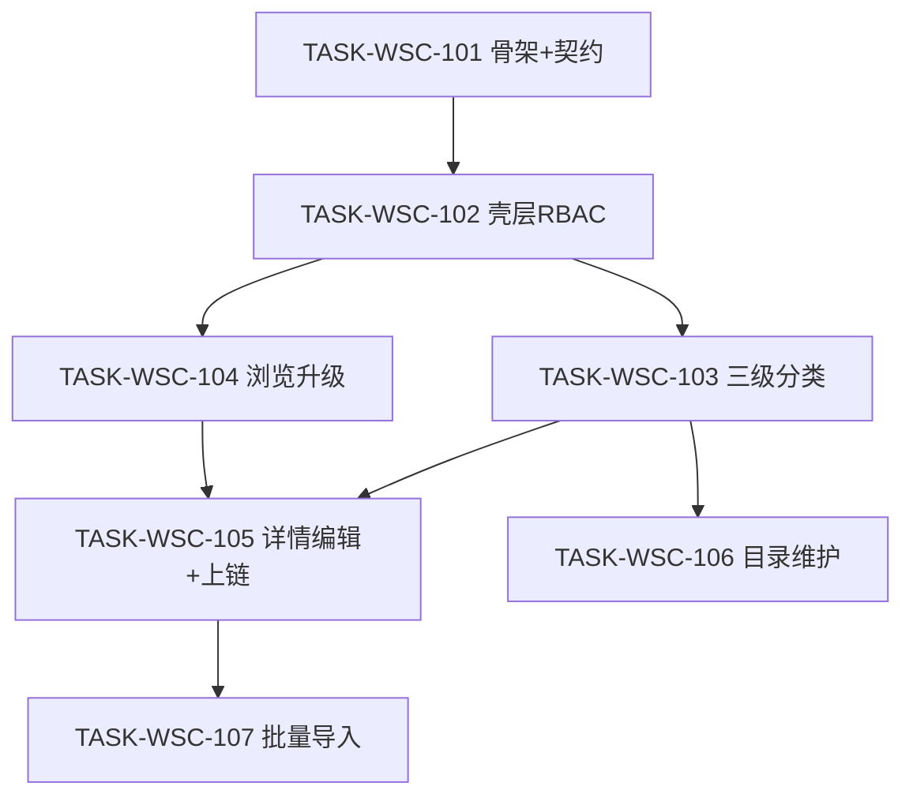

# 接入端工作台（WSC）V1.1 候选执行计划

```yaml
planId: PLAN-WSC-2.0
status: CANDIDATE
planType: CANDIDATE
snapshotId: SNAP-WSC-002
sourcePrd: product/prd/wsc-v1.1.md
runId: RUN-WSC-002
basedOn: PLAN-WSC-1.1
previousRun: RUN-WSC-001
round: 1
createdAt: 2026-07-30
taskCount: 7
waveCount: 5
requirementCount: 17
authorRoles: [planEditor]
```

> **候选声明**：本文件为 `RUN-WSC-002` / `SNAP-WSC-002` 的 Round 1 候选计划，供规划委员会独立评审。未批准前不得作为任务派发权威输入。

## 0. 相对 PLAN-WSC-1.1 / V1.0 交付的定位

| 项 | 说明 |
|---|---|
| 基线 | `RUN-WSC-001` 已 COMPLETED（`PLAN-WSC-1.1` + SNAP-WSC-001） |
| 本计划 | **增量交付**产品 V1.1；非绿地重做 |
| 工程硬约束 | 新功能必须以 **data-chain 骨架** 为权威（DEC-WSC-005）；遗留扁平 `backend/src` + `db/migration` 仅热修 |
| 需求权威 | 仅引用 `SNAP-WSC-002`；不得静默改写快照 |

### 0.1 增量范围一览

| 类型 | 内容 |
|---|---|
| 前置 | 后端迁多模块骨架；契约升级三级分类 / 目录维护 / 批量导入 |
| 修订 | 壳层「目录维护」；RBAC；目录浏览（标签+子类分组+滚动加载）；分类维护三级；详情/编辑/上链路径展示 |
| 新增 | REQ-CAT-007 目录关联维护；REQ-CAT-008 批量导入 |
| 回归 | 总览与 V1.0 P0 主路径在 V1.1 模型下仍可用（E2E 覆盖） |

## 1. 范围、假设与硬门禁

### 1.1 范围

- **In Scope**：SNAP-WSC-002 全部 REQ（含继承项的三级适配）。
- **Out of Scope**：数据登记/交易订单/连接器完整流；真实链；多租户；支付；导入模板全量类型专属列。

### 1.2 假设

- V1.0 前端/契约/行为可作为对照；**数据模型以三级分类为准**，允许破坏性 schema 迁移（须备份恢复演练）。
- OQ-V11-003：**暂定**目录维护条目与数据产品同一可关联实体。
- OQ-V11-004：导入默认**部分成功 + 错误报告**。

### 1.3 技术栈硬门禁（RULE-ORG-STACK + DEC-WSC-005）

| 层 | 固定选型 |
|---|---|
| 前端 | Vue 3 + TS + Vite + pnpm + Pinia + Vue Router 4 + Ant Design Vue |
| 后端 | Spring Boot **2.7.18** + Java 17；Maven 多模块 `backend/app/<service>/` |
| 数据 | **MySQL** + Flyway（`sql/init` + `sql/migration`） |
| 缓存 | Spring Data Redis |
| API 文档 | Knife4j / OpenAPI 3 |
| 测试 | Vitest / JUnit 5 + Testcontainers / Playwright |
| 上链 | 模拟存证适配层（DEC-WSC-002） |

禁止：多数据源；向遗留 `db/migration/` 追加新脚本；第二套 ORM/Web 框架。

### 1.4 执行硬门禁

- `TASK-WSC-101` 唯一拥有契约升级与骨架迁移初版；后继只读 `contracts/**` 与生成 `frontend/src/api/**`。
- 写路径以 `RULE-PROJECT-LAYOUT` 多模块 glob 为准（`backend/app/*/…`）。
- 每任务：独立 developer → codeReviewer → tester；Orchestrator 按 `writeSet` 字面路径做 scope check。

## 2. 决策与开放问题

### 2.1 必须遵守的 DEC

| DEC | 本计划用法 |
|---|---|
| DEC-WSC-001 | 编码唯一；导入与编辑均适用 |
| DEC-WSC-002 | 导入成功行与编辑提交均产生存证版本 |
| DEC-WSC-003 | 三级任一节点有挂载则禁止删除 |
| DEC-WSC-004 | Java 17 |
| DEC-WSC-005 | 骨架、MySQL、Redis、sql 目录 |

### 2.2 开放问题处理口径

| id | 口径 |
|---|---|
| OQ-001 / OQ-004 | 同 V1.0；不阻塞 |
| OQ-V11-003 | 同一可关联条目；schema 单表/单聚合即可 |
| OQ-V11-004 | 部分成功 + 失败行错误报告；全有全无须新 DEC |

## 3. 契约升级与唯一所有权

### 3.1 契约冻结内容（`wsc-contracts@2.0.0`）

由 `TASK-WSC-101` 一次性冻结/升级：

| 契约 | 内容 |
|---|---|
| OpenAPI | 三级分类 CRUD；目录维护关联（单条/批量）；批量导入（上传/模板/结果）；浏览分页或 cursor；既有产品/上链/总览端点适配三级路径 |
| RBAC | 管理员：分类维护 + 目录维护 + 增改导；提供方：增改导；普通用户：只读。矩阵见 §4.1 |
| Flyway | `sql/init` baseline + `sql/migration`：domain/industry/subcategory；产品挂载三级；关联状态；导入作业/错误明细（若需）；从 V1.0 二级模型迁移脚本或重建策略文档化 |
| 路由 | 增加「目录维护」；导入为目录页弹窗或独立路由须在清单声明 |
| 错误码 | 继承 V1.0 最小集；新增至少：`ERR_IMPORT_FILE_TOO_LARGE`、`ERR_IMPORT_ROW_INVALID`、`ERR_CATEGORY_LEAF_REQUIRED`（无可用三级时）、`ERR_MAINTENANCE_FORBIDDEN`（非管理员） |
| 存证 | 快照含三级分类路径字段 |

### 3.2 唯一所有权矩阵

| 共享制品 | 唯一写任务 | 其他任务 |
|---|---|---|
| `contracts/**` | TASK-WSC-101 | 只读 |
| `frontend/src/api/**` | TASK-WSC-101 | 只读 |
| `backend/app/*/src/main/resources/sql/**` 初版/升级迁移 | TASK-WSC-101 | 只读；增量见 §3.3 |
| `backend/pom.xml` 与多模块脚手架 | TASK-WSC-101 | 后继不得推翻模块约定 |
| `frontend/src/router/**` 根清单增量 | TASK-WSC-101 | feature 子路由按任务声明 |

### 3.3 增量迁移协议

- 初版/升级迁移仅 101；不足时 Orchestrator 插入串行 `TASK-WSC-10x-MIG`，独占 `sql/migration/**`。
- 业务任务不得改 `sql/**`。

### 3.4 UI 状态矩阵（增量）

继承 PLAN-WSC-1.1 §3.5，并增加：

| 页面/操作 | loading | empty | error | success |
|---|---|---|---|---|
| 目录维护列表 | 列表 loading | 无条目/筛选空态 | 加载失败 | 单条/批量保存成功反馈 |
| 批量导入 | 上传/解析中 | — | 超限/格式/部分失败（含报告入口） | 成功条数可观测；可检索 |

## 4. RBAC 可测矩阵

| 角色 | 三级分类维护 | 目录维护 | 新增/编辑 | 批量导入 | 对应写 API |
|---|---|---|---|---|---|
| 管理员 | 可见 | 可见 | 可见 | 可见 | 200（合法） |
| 提供方 | 不可见 | 不可见 | 可见 | 可见 | 分类/维护 403；产品写 200 |
| 普通用户 | 不可见 | 不可见 | 不可见 | 不可见 | 全部写 403 |

## 5. 任务包列表

> 任务 ID 自 `TASK-WSC-101` 起，避免与 V1.0 `TASK-WSC-001..006` 冲突。

### TASK-WSC-101 — data-chain 骨架迁移 + 契约升级

- `requirements`: 全部 17 REQ（底座覆盖；非功能主实现）
- `objective`: 将后端迁至 `backend/app/<service>/`（Boot 2.7.18 / MySQL / Redis / Flyway sql 布局）；冻结 `wsc-contracts@2.0.0`；生成 client；空库 init→migration 可启动；文档化相对 V1.0 schema 迁移/重建策略
- `dependsOn`: `[]`
- `readSet`: SNAP-WSC-002；DEC-WSC-001..005；RULE-ORG-STACK；RULE-PROJECT-LAYOUT；既有 `contracts/**`（只读对照）
- `writeSet`: `backend/**`（骨架迁移允许重构）；`contracts/**`；`frontend/src/api/**`；`frontend/src/router/**`（根增量）；`ops/runbooks/`（MySQL 备份恢复要点）；必要时 `frontend/` 根配置对齐
- `allowModify`: 仅 `writeSet`；禁止实现 feature 业务页
- `denyModify`: `ai/rules/**`；`product/**`；`planning/**`；密钥类配置
- `acceptance`: 按 backend Skill 空库可启动；`/health`、`/doc.html` 可达；契约含三级/维护/导入；禁止新脚本写入 `db/migration/`；17 REQ 可映射到端点或约束
- `testScope`: 空库 init+migrate；OpenAPI lint；契约-REQ 覆盖；前后端 build（或后端 package + 前端 build）
- `riskTags`: `[schema-migration]`

### TASK-WSC-102 — 壳层与 RBAC 增量

- `requirements`: `[REQ-SHELL-001, REQ-RBAC-001]`
- `objective`: 管理员侧栏「目录维护」；占位菜单未开放；三角色写入口含批量导入可见性；写 API 403 对齐 §4
- `dependsOn`: `[TASK-WSC-101]`
- `writeSet`: `frontend/src/features/shell/**`；`frontend/src/features/auth/**`；`frontend/src/layouts/**`；`backend/app/*/src/main/java/**/rbac/**`；`backend/app/*/src/main/java/**/security/**`；对应测试
- `denyModify`: `contracts/**`；`frontend/src/api/**`；`**/sql/**`；catalog/overview/chain feature 业务实现
- `acceptance`: §4 矩阵壳层侧通过；角色切换后目录维护与导入入口立即更新
- `testScope`: §4 矩阵（壳层+过滤器）；非管理员不可见目录维护
- `riskTags`: `[]`

### TASK-WSC-103 — 三级分类维护

- `requirements`: `[REQ-CAT-006]`
- `objective`: 空间/行业/子类维护弹窗与 API；待保存提示；有挂载禁止删（DEC-WSC-003）；至少保留一个三级
- `dependsOn`: `[TASK-WSC-102]`
- `writeSet`: `frontend/src/features/catalog/admin/**`；`backend/app/*/src/main/java/**/catalog/admin/**`；对应测试
- `denyModify`: `contracts/**`；`**/sql/**`；`catalog/browse|detail|editor|maintenance|import/**`；chain/overview
- `acceptance`: 三级分栏增改；级联刷新；非管理员不可达；删挂载分类返回明确错误码
- `testScope`: CRUD；禁止删除负例；非管理员 403；至少保留一个三级
- `riskTags`: `[]`

### TASK-WSC-104 — 目录浏览升级

- `requirements`: `[REQ-CAT-001, REQ-CAT-002, REQ-CAT-003]`
- `objective`: 顶部空间/行业标签；子类分组列表；预览与三级路径；筛选对齐三级；滚动加载更多
- `dependsOn`: `[TASK-WSC-102]`
- `writeSet`: `frontend/src/features/catalog/browse/**`；`backend/app/*/src/main/java/**/catalog/browse/**`；对应测试
- `denyModify`: `catalog/admin|detail|editor|maintenance|import/**`；`contracts/**`；`**/sql/**`
- `acceptance`: 标签切换更新产品集；分节字段符合 SNAP；滚动加载有 loading 且保留滚动位置与筛选
- `testScope`: 标签切换；筛选空态；滚动加载；预览权限入口
- `riskTags`: `[]`

### TASK-WSC-105 — 详情/编辑适配三级 + 上链快照路径

- `requirements`: `[REQ-CAT-004, REQ-CAT-005, REQ-CHAIN-001]`
- `objective`: 详情/编辑分类选择器为三级；提交仍产生存证版本；上链快照展示三级路径；回归 OQ-004/DEC-001/002
- `dependsOn`: `[TASK-WSC-103, TASK-WSC-104]`（读分类与浏览契约已就绪；存证端口沿用或经 101 契约）
- `writeSet`: `frontend/src/features/catalog/detail/**`；`frontend/src/features/catalog/editor/**`；`frontend/src/features/chain/**`；`backend/app/*/src/main/java/**/catalog/detail/**`；`backend/app/*/src/main/java/**/catalog/editor/**`；`backend/app/*/src/main/java/**/chain/**`；对应测试
- `denyModify`: `catalog/browse|admin|maintenance|import/**`；`contracts/**`；`**/sql/**`
- `acceptance`: 三级路径展示/选择；新建 v1 / 编辑递增；CHAIN 快照含三级；普通用户无编辑
- `testScope`: 编码冲突；版本递增；适配失败无半成品；快照按 versionId；§4 产品写矩阵回归
- `riskTags`: `[handles-pii]`

### TASK-WSC-106 — 目录维护（关联）

- `requirements`: `[REQ-CAT-007]`
- `objective`: 目录维护页：全部/已维护/待关联；一二三级筛选；分页；单条维护；批量关联
- `dependsOn`: `[TASK-WSC-103]`
- `writeSet`: `frontend/src/features/catalog/maintenance/**`；`backend/app/*/src/main/java/**/catalog/maintenance/**`；对应测试
- `denyModify`: `catalog/browse|detail|editor|admin|import/**`；`contracts/**`；`**/sql/**`
- `acceptance`: 状态页签与筛选；单条保存/取消；批量栏数量与批量保存；提供方/普通用户不可达
- `testScope`: 待关联→已维护；批量关联；非管理员 403；分页
- `riskTags`: `[]`

### TASK-WSC-107 — 批量导入产品

- `requirements`: `[REQ-CAT-008]`
- `objective`: xlsx/csv 导入；模板下载；≤10MB；结果成功/失败计数；错误报告；成功行可检索并上链
- `dependsOn`: `[TASK-WSC-105]`
- `writeSet`: `frontend/src/features/catalog/import/**`；`backend/app/*/src/main/java/**/catalog/import/**`；对应测试（含样例文件 fixture）
- `denyModify`: 其他 catalog 子树业务路径（除非任务声明只读调用编辑/存证端口）；`contracts/**`；`**/sql/**`
- `acceptance`: 权限同提供方/管理员；超限拒绝；部分成功+报告；重新上传；成功行目录可搜且有上链版本
- `testScope`: 模板字段；编码重复/分类不匹配/必填缺失失败行；10MB 边界；成功行 CHAIN 字段齐全
- `riskTags`: `[handles-pii]`

## 6. 波次 / DAG



| 波次 | 任务 | 启动条件 |
|---|---|---|
| W1 | 101 | SNAP-WSC-002 APPROVED |
| W2 | 102 | 101 VERIFIED |
| W3 | 103 ∥ 104 | 102 VERIFIED；writeSet 互斥（admin ∥ browse） |
| W4 | 105；106 可与 105 并行（maintenance ∥ detail/editor/chain） | 103+104 VERIFIED 后开 105；103 VERIFIED 后开 106 |
| W5 | 107；P0/回归 E2E | 105 VERIFIED 后开 107；101..107 均 VERIFIED 后 E2E |

W4 并行校验：`catalog/maintenance/**` 与 `catalog/detail|editor/**` + `chain/**` 路径无交集。

### 6.1 E2E 清单（W5）

在 V1.0 P0 路径上增加：

1. 管理员维护三级分类  
2. 目录维护：待关联 → 关联成功  
3. 提供方/管理员批量导入（含至少一行失败可下载报告的用例，可用 fixture）  
4. 目录标签切换 + 滚动加载抽样  
5. 总览与上链快照三级路径仍可读  

报告：`tests/e2e/reports/p0-wsc-v1.1/`；证据 id 建议 `TESTRUN-WSC-E2E-V11`。

## 7. 风险与回滚

| 风险 | 缓解 | 回滚 |
|---|---|---|
| PG→MySQL / 扁平→多模块迁移失败 | 101 独占；staging 空库+备份演练 | 备份恢复；forward-fix |
| 三级模型破坏旧数据 | 迁移脚本或明确重建+种子；E2E 回归 | 恢复备份 |
| 导入部分成功争议 | 默认 OQ-V11-004；契约写明 | 停用导入入口 |
| 契约漂移 | 后继只读 contracts/api | 拒合入 |
| 范围蔓延 | 占位菜单；拒 Out of Scope API | 删越界代码 |

## 8. 发布门禁（V1.1）

1. SNAP-WSC-002 下全部 P0 REQ 对应任务 VERIFIED；P1（OVW-003/005）回归通过。  
2. P0 缺陷为 0；§6.1 E2E 通过。  
3. `wsc-contracts@2.0.0` 无未决冲突；Flyway 空库可应用；MySQL 回滚演练有证据。  
4. developer ≠ codeReviewer ≠ tester 证据齐全。  
5. maintainer 人类发布批准（写入 `RUN-WSC-002/approvals.yaml`）。  
6. 本计划经规划委员会必需角色 `APPROVE` 后由 Orchestrator 发布至 `planning/approved/`。

## 9. REQ 映射

| 主任务 | REQ |
|---|---|
| 102 | SHELL-001、RBAC-001 |
| 103 | CAT-006 |
| 104 | CAT-001、CAT-002、CAT-003 |
| 105 | CAT-004、CAT-005、CHAIN-001 |
| 106 | CAT-007 |
| 107 | CAT-008 |
| 101 | 底座覆盖全部；OVW 回归由 E2E + 既有 overview 代码适配（若 101/105 契约变更导致编译失败，允许在 105 或独立热修任务内最小适配 `overview/**`，须在 DEV 报告声明） |

> **OVW**：无独立实现任务；若契约/DTO 破坏性变更导致 overview 无法编译，由 105 波次前插入串行热修或并入 101 验收「既有 overview 可编译启动」。默认 101 acceptance 含「overview 模块可编译」。

## 10. 完成检查（候选计划）

- [x] 引用 SNAP-WSC-002 / RUN-WSC-002  
- [x] 任务含 dependsOn、writeSet、acceptance、testScope  
- [x] DAG 无环；W3/W4 并行写集互斥  
- [x] DEC-WSC-005 骨架与迁移路径写清  
- [x] 新增 REQ-CAT-007/008 有主任务  
- [ ] 规划委员会 Round 1 独立评审（待）
