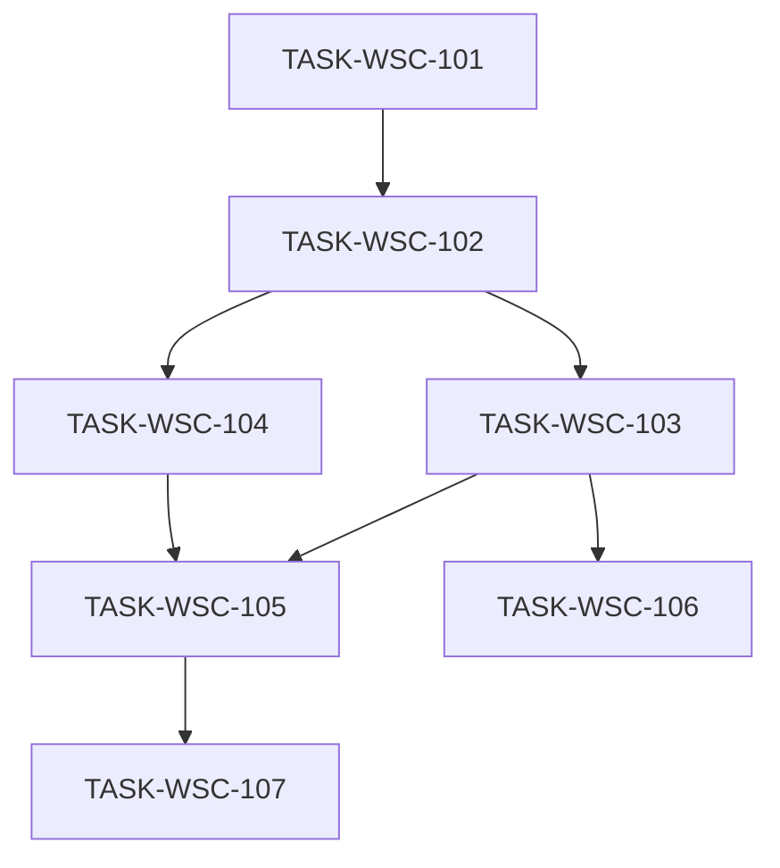

# 接入端工作台（WSC）V1.1 候选执行计划

```yaml
planId: PLAN-WSC-2.1
status: CANDIDATE
planType: CANDIDATE
snapshotId: SNAP-WSC-002
sourcePrd: product/prd/wsc-v1.1.md
runId: RUN-WSC-002
basedOn: PLAN-WSC-2.0
previousRun: RUN-WSC-001
round: 2
createdAt: 2026-07-30
taskCount: 7
waveCount: 5
requirementCount: 17
authorRoles: [planEditor]
```

> **候选声明**：Round 1 异议吸收稿。供 Round 2 独立确认 `closeWhen`；未全员 APPROVE 前不得派发任务。

## 0. 相对 PLAN-WSC-2.0 的修订说明（Round 1 ISSUE）

| ISSUE id | severity | 本计划修订位置 |
|---|---|---|
| ISSUE-PA-R1-001 | medium | §3.1 资源模型「维护条目 ≡ 产品」；101 acceptance |
| ISSUE-PA-R1-002 | medium | §3.1/101/§6.1 OVW 回归必跑与可编译验收 |
| ISSUE-SA-R1-001 | P1 | TASK-WSC-101 writeSet 收敛 + 搬迁表 + denyModify |
| ISSUE-SA-R1-002 | P1 | TASK-WSC-107 denyModify 无叙述例外 |
| ISSUE-QA-R1-001 | P1 | 107 testScope fixture 路径与计数断言 |
| ISSUE-QA-R1-002 | P1 | 104 testScope 筛选+load-more |
| ISSUE-PP-R1-001 | P1 | §6 波次表 106 启动/合入规则 |
| ISSUE-PE-R1-001 | medium | 本节 |
| ISSUE-UX-R1-001 | P2 | 107 acceptance 结果态入口 |
| ISSUE-API-R1-001 | P1 | §3.1 导入同步 API + 结果 DTO |
| ISSUE-API-R1-002 | P1 | §3.1 browse 分页约定 |
| ISSUE-SEC-R1-001 | P1 | §3.5 上传临时存储与错误报告白名单；107 acceptance |

覆盖 ISSUE：**12**。关闭须原提出者在 Round 2 确认。

### 0.1 相对 V1.0 / PLAN-WSC-1.1 定位

| 项 | 说明 |
|---|---|
| 基线 | RUN-WSC-001 COMPLETED |
| 本计划 | 产品 V1.1 **增量**；DEC-WSC-005 骨架为权威 |
| 需求权威 | SNAP-WSC-002 |

## 1. 范围、假设与硬门禁

### 1.1 范围

- In Scope：SNAP-WSC-002 全部 REQ。
- Out of Scope：登记/订单/连接器完整流；真实链；多租户；支付；导入全量类型专属列。

### 1.2 假设

- 三级分类为准；允许破坏性 schema 迁移（须备份演练）。
- OQ-V11-003：维护条目 ≡ 数据产品（见 §3.1）。
- OQ-V11-004：部分成功 + 错误报告。

### 1.3 技术栈硬门禁

同 PLAN-WSC-2.0 §1.3（Boot 2.7.18 / MySQL / Redis / Flyway sql / Knife4j / Java 17）。

### 1.4 执行硬门禁

- 101 唯一写契约与骨架迁移；后继只读 `contracts/**`、`frontend/src/api/**`。
- Orchestrator 按各任务 `writeSet` **字面路径** scope-check。
- developer ≠ codeReviewer ≠ tester。

## 2. 决策与开放问题

同 2.0；OQ-V11-003 下沉为 §3.1 硬约束。

## 3. 契约升级与唯一所有权

### 3.1 契约冻结（`wsc-contracts@2.0.0`）

| 契约 | 内容 |
|---|---|
| 资源模型 | **目录维护条目 ≡ 数据产品**（同一资源 id/编码）；OpenAPI 不得拆两套冲突实体（ISSUE-PA-R1-001） |
| OpenAPI | 三级分类 CRUD；维护关联（单条/批量）；产品/上链/总览适配三级路径 |
| 批量导入 API（同步） | `POST` 上传（multipart）；响应含 `successCount`/`failureCount`/`reportId`（失败为 0 时可空）；`GET` 模板；`GET` 错误报告（按 reportId）；**V1.1 不采用异步 job 轮询**（ISSUE-API-R1-001） |
| Browse 分页 | 列表支持 `page`+`size`（或 `offset`+`limit`，契约择一并写死）；滚动加载 = 递增 page/size；响应含 `total` 或 `hasMore`（ISSUE-API-R1-002） |
| RBAC | 见 §4 |
| Flyway | sql/init + sql/migration；三级树；产品挂三级；禁止新脚本入 `db/migration/` |
| 错误码 | 继承 V1.0；新增 `ERR_IMPORT_FILE_TOO_LARGE`、`ERR_IMPORT_ROW_INVALID`、`ERR_CATEGORY_LEAF_REQUIRED`、`ERR_MAINTENANCE_FORBIDDEN` |
| 存证快照 | 含三级路径 |
| OVW | 既有 overview DTO/端点可编译启动；破坏性变更须在 101 内完成适配（ISSUE-PA-R1-002） |

### 3.2 唯一所有权矩阵

| 共享制品 | 唯一写任务 |
|---|---|
| `contracts/**` | 101 |
| `frontend/src/api/**` | 101 |
| `backend/app/*/src/main/resources/sql/**` 本轮迁移 | 101 |
| 多模块父/子 POM 与启动脚手架 | 101 |
| 根路由增量 | 101 |

### 3.3 增量迁移协议

同 2.0：不足则串行 `TASK-WSC-10x-MIG`。

### 3.4 UI 状态矩阵

同 2.0 §3.4，并强调导入结果态：成功/部分失败/全失败均须可关闭；失败含错误报告入口；可重新上传（ISSUE-UX-R1-001）。

### 3.5 导入安全与敏感字段（ISSUE-SEC-R1-001）

| 项 | 约定 |
|---|---|
| 原始上传文件 | 仅临时存储；导入处理结束后删除或 TTL≤24h（staging 可更短） |
| 错误报告字段 | 白名单：行号、产品编码、原因码/原因文案；**禁止**回显完整信用代码、ownerDID、明文哈希 |
| 日志 | 同 PLAN-WSC-1.1 敏感字段表精神；不得记上传文件全文 |

## 4. RBAC 可测矩阵

同 PLAN-WSC-2.0 §4。

## 5. 任务包列表

### TASK-WSC-101 — data-chain 骨架迁移 + 契约升级

- `requirements`: 全部 17 REQ（底座）
- `objective`: 多模块骨架；冻结 §3.1；生成 client；空库可启动；文档化 V1.0→V1.1 schema 策略；**overview 可编译启动**
- `dependsOn`: `[]`
- `writeSet`（收敛，ISSUE-SA-R1-001）:
  - `backend/pom.xml`
  - `backend/app/*/pom.xml`
  - `backend/app/*/src/main/resources/**`（含 sql/init、sql/migration、application*.yml 样例）
  - `backend/app/*/src/main/java/**/WscApplication.java`（或等价启动类）
  - `backend/app/*/src/main/java/**/config/**`
  - 搬迁清单允许的源→目标（须在 DEV 报告列出）：既有 `backend/src/main/java/com/wsc/**` → `backend/app/<service>/src/main/java/com/wsc/**`（**仅移动/改 package 与编译修复**，不新增 feature 行为）
  - `contracts/**`；`frontend/src/api/**`；`frontend/src/router/**`（根增量）；`ops/runbooks/`；前端根构建配置（若必须）
- `denyModify`: `ai/rules/**`；`product/**`；`planning/**`；`frontend/src/features/**`（禁止在本任务实现业务页）；密钥配置；`**/db/migration/**` 追加新版本脚本
- `acceptance`: `/health`、`/doc.html`；契约含三级/维护/导入同步 DTO/browse 分页；维护条目≡产品映射；overview 可编译启动；禁止新脚本入 db/migration
- `testScope`: 空库 init+migrate；OpenAPI lint；契约-REQ 覆盖；后端 package + 前端 build
- `riskTags`: `[schema-migration]`

### TASK-WSC-102 — 壳层与 RBAC 增量

同 2.0（writeSet/acceptance/testScope 不变）。

### TASK-WSC-103 — 三级分类维护

同 2.0。

### TASK-WSC-104 — 目录浏览升级

- 同 2.0，并：
- `testScope` **追加**（ISSUE-QA-R1-002）：设置筛选 → load-more → 结果仍满足筛选；scroll 位置抽样保留

### TASK-WSC-105 — 详情/编辑适配三级 + 上链快照路径

同 2.0。

### TASK-WSC-106 — 目录维护（关联）

同 2.0（dependsOn 仍 `[TASK-WSC-103]`）。

### TASK-WSC-107 — 批量导入产品

- `dependsOn`: `[TASK-WSC-105]`
- `writeSet`: `frontend/src/features/catalog/import/**`；`backend/app/*/src/main/java/**/catalog/import/**`；对应测试与 `tests/fixtures/import/**`
- `allowModify`: 仅 writeSet；通过 DI **只读调用**已有产品写入/存证端口（不得修改其实现目录）
- `denyModify`（ISSUE-SA-R1-002）：`frontend/src/features/catalog/browse|detail|editor|admin|maintenance/**`；`backend/app/*/src/main/java/**/catalog/browse|detail|editor|admin|maintenance/**`；`backend/app/*/src/main/java/**/chain/**`；`contracts/**`；`frontend/src/api/**`；`**/sql/**`
- `acceptance`: §4 权限；≤10MB；同步导入结果 DTO；部分成功；结果态含重新上传/关闭/失败时错误报告入口；临时文件清理；错误报告字段白名单；成功行可检索并上链
- `testScope`（ISSUE-QA-R1-001）：`tests/fixtures/import/` 至少含 full-success、code-conflict、category-mismatch、oversize；断言 success/failure 计数；CHAIN 字段；报告入口；10MB 边界
- `riskTags`: `[handles-pii]`

## 6. 波次 / DAG



| 波次 | 任务 | 启动条件（ISSUE-PP-R1-001） |
|---|---|---|
| W1 | 101 | SNAP-WSC-002 APPROVED |
| W2 | 102 | 101 VERIFIED |
| W3 | 103 ∥ 104 | 102 VERIFIED；writeSet 互斥 |
| W4 | 105 ∥ 106 | **105**：103+104 VERIFIED；**106**：仅 103 VERIFIED 后可启动，**不得与 103 并行**；105∥106 当 writeSet 无交集（maintenance ∥ detail/editor/chain）；建议合入序先完成者先合，禁止单 PR 混写两任务路径 |
| W5 | 107；E2E | 105 VERIFIED 后 107；101..107 均 VERIFIED 后 E2E |

### 6.1 E2E（W5）

必跑：

1. V1.0 P0 主路径回归（含 **OVW 核心指标可见**，ISSUE-PA-R1-002）  
2. 三级分类维护  
3. 目录维护：待关联→已维护  
4. 批量导入（fixture 含至少一行失败 + 报告可下载）  
5. 标签切换 + 滚动加载抽样  
6. 上链快照三级路径  

报告：`tests/e2e/reports/p0-wsc-v1.1/`；`TESTRUN-WSC-E2E-V11`。

## 7. 风险与回滚

同 2.0，并增加：上传临时文件泄漏 → §3.5 删除/TTL；错误报告 PII → 字段白名单。

## 8. 发布门禁

同 2.0；契约版本 `wsc-contracts@2.0.0`；人类批准写入 `RUN-WSC-002/approvals.yaml`。

## 9. REQ 映射

| 主任务 | REQ |
|---|---|
| 102 | SHELL-001、RBAC-001 |
| 103 | CAT-006 |
| 104 | CAT-001、CAT-002、CAT-003 |
| 105 | CAT-004、CAT-005、CHAIN-001 |
| 106 | CAT-007 |
| 107 | CAT-008 |
| 101 | 底座 + OVW 可编译；E2E 覆盖 OVW-001..005 回归 |

## 10. 完成检查

- [x] 吸收 Round 1 全部 12 条 ISSUE  
- [x] 101 writeSet 可机械 scope-check  
- [x] 导入同步 API + browse 分页冻结  
- [ ] Round 2 原提出者确认 closeWhen / APPROVE  
