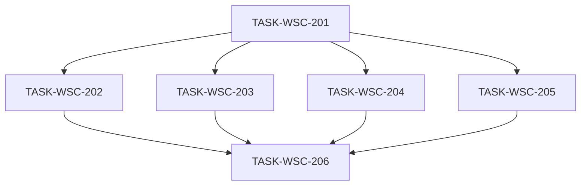

# 接入端工作台（WSC）V1.2-UX 候选执行计划

```yaml
planId: PLAN-WSC-3.0
status: DRAFT
planType: CANDIDATE
snapshotId: SNAP-WSC-003
sourcePrd: product/prd/wsc-v1.2-ux.md
runId: RUN-WSC-003
basedOn: PLAN-WSC-2.2
lineageFrom: PLAN-WSC-2.2
previousRun: RUN-WSC-002
functionalBaseline: SNAP-WSC-002
contractsBaseline: wsc-contracts@2.0.0
visualAuthority: design/prototypes/wsc-v1.1/index.html
round: 1
createdAt: 2026-08-02
taskCount: 6
waveCount: 4
requirementCount: 11
authorRoles: [planEditor]
actorInstance: plan-editor-wsc-003
```

> **候选声明**：本文件为 `PLAN-WSC-3.0` **Round 1** 候选稿（`DRAFT` / `CANDIDATE`）。**不得**视为 `APPROVED`；未获规划委员会必需角色独立 `APPROVE` 前，Orchestrator **不得**复制至 `planning/approved/`。本 planEditor 实例不伪造任何委员会批准。

## 0. 定位与谱系

| 概念 | 本计划取值 | 含义 |
|---|---|---|
| `lineageFrom` / `basedOn` | PLAN-WSC-2.2 | 功能基线批准计划（V1.1）；本计划为其 **UX 增量**，不重开功能范围 |
| `round` | 1 | **本 planId（3.0）** 首轮共识前的候选稿 |
| 功能/契约权威 | SNAP-WSC-002 + `wsc-contracts@2.0.0` | 行为与 API **只读继承**；本 Run 默认不改 |
| 视觉权威 | `design/prototypes/wsc-v1.1/index.html` | 布局/令牌/交互质感对照源 |
| UX 需求权威 | SNAP-WSC-003（APPROVED） | REQ-UX-001..011；OQ-UX-001..004 已 CLOSED |

本计划 **不** 重新打开 SNAP-WSC-002 功能缺陷，除非本轮 UX 改造引入可复现回归。

## 1. 范围、假设与硬门禁

### 1.1 范围

**In Scope（SNAP-WSC-003）**

- 设计令牌与全局样式可追踪对齐原型 `:root`
- 壳层/侧栏、登录、总览、数据目录、目录维护、分类维护弹窗、批量导入弹窗、产品详情/编辑、上链信息页的信息架构与视觉呈现
- 空态/加载态/关键反馈质感统一；桌面端破坏性窄屏修复
- 原型偏差清单闭环 + 人工走查截图证据 + 功能回归（复用扩展既有 E2E）

**Out of Scope（默认 deny）**

- 修改 `contracts/**`、OpenAPI、RBAC 矩阵、后端写路径、Flyway/SQL、领域模型
- 新开业务能力；占位菜单完整业务流
- 移动端原生 App、暗色主题
- 非对齐所必需的图表库替换（优先 CSS/配置级）
- 用 Ant Design 默认主题「凑合」而未对照原型

> 若 UX 验收证明必须扩 scope（后端/契约），须经 PO 批准并新建快照/DEC；本计划 **默认标注为不可调度**，不得静默扩大。

### 1.2 假设（含已关闭 OQ）

| id | 口径（PO 已确认） |
|---|---|
| OQ-UX-001 | **允许**有限全局 CSS / 设计令牌文件重构；不改业务 API |
| OQ-UX-002 | **优先覆写** Ant Design Vue 主题/局部样式；仅当无法达到可验收接近度时，经任务注明后局部替换控件 |
| OQ-UX-003 | 视觉门禁 = **人工走查签字 + 主路径对照截图清单**；Playwright 截图抽样可选增强、非唯一门禁 |
| OQ-UX-004 | **复用并扩展**既有 E2E（功能回归）+ 视觉走查清单；不必单独再开同名 UX E2E Run，除非 QA 论证需要隔离证据目录 |
| OQ-001 / OQ-004 / OQ-V11-003 / OQ-V11-004 | 保留自 SNAP-WSC-002；本 UX 计划不重开裁定 |

### 1.3 技术栈硬门禁（前端 UX Run）

| 层 | 固定选型 |
|---|---|
| 前端 | Vue 3 + TypeScript + Vite + pnpm + Pinia + Vue Router 4 + Ant Design Vue（已在 `frontend/package.json`） |
| 契约 | `wsc-contracts@2.0.0` **只读**；`frontend/src/api/**` 只读 |
| 后端 | **本计划所有任务 `denyModify`**（含 `backend/**`、`**/sql/**`） |
| 测试 | Vitest（组件/样式契约抽样）+ Playwright（复用扩展既有 E2E） |
| 视觉权威 | HTML 原型；实现须可对照 `:root` 变量，不得另起一套不可追踪主题 |

禁止：第二套 UI 框架；静默改契约版本；在任务写集外「顺手」改后端。

### 1.4 执行硬门禁

- 每任务：独立 developer → codeReviewer → tester；Orchestrator 按各任务 `writeSet` **字面路径**做 scope-check。
- developer ≠ codeReviewer ≠ tester。
- 并行任务写集必须互斥；禁止单 PR 混写多任务路径。
- 功能行为验收仍引用 SNAP-WSC-002 对应 REQ；本计划验收聚焦 UX REQ。

## 2. 设计令牌与全局样式策略

### 2.1 原型 `:root` 对照最小集（REQ-UX-001）

实现须提供可追踪令牌（建议路径 `frontend/src/styles/tokens.css`，任务 201 可调整文件名但须在交付物中写明映射表），至少覆盖：

| 令牌 | 原型值 |
|---|---|
| `--sidebar-bg` | `#0b1120` |
| `--sidebar-width` | `232px` |
| `--main-bg` | `#f4f6f9` |
| `--card-bg` | `#ffffff` |
| `--text-primary` | `#1f2937` |
| `--text-secondary` | `#6b7280` |
| `--text-tertiary` | `#9ca3af` |
| `--border-color` | `#e5e7eb` |
| `--blue` / `--blue-light` | `#3b82f6` / `#eff6ff` |
| `--green` / `--green-light` | `#10b981` / `#ecfdf5` |
| `--orange` / `--orange-light` | `#f59e0b` / `#fffbeb` |
| `--red` / `--red-light` | `#ef4444` / `#fef2f2` |
| `--shadow-sm` / `--shadow` / `--shadow-lg` | 原型三级阴影 |

布局约定（验收辅助）：

- 卡片默认圆角约 **12px**；边框 + 轻阴影层次接近原型
- 正文字号阶梯约 **14px** 基线；中文字体栈观感接近：`"PingFang SC", "Microsoft YaHei", -apple-system, BlinkMacSystemFont, "Segoe UI", sans-serif`
- 侧栏菜单项圆角约 **8px**；active 高亮背景 + 白字

### 2.2 Ant Design Vue 策略（OQ-UX-002）

1. **优先**：`ConfigProvider` / 主题 token 映射到 §2.1；辅以有限全局/局部 CSS 覆写（如 Modal header/footer、Table、Tabs、Button 层级）。
2. **禁止默认**：未映射令牌即直接使用 AntDV 默认蓝紫皮肤充当「已对齐」。
3. **局部替换控件**：仅当覆写后仍无法达到可验收接近度；须在该任务交付说明中单列「替换清单 + 理由」，且不得改变功能契约与 data-testid（若 E2E 依赖）。

### 2.3 共享样式所有权

| 制品 | 唯一写任务 | 其他任务 |
|---|---|---|
| `frontend/src/styles/**`（令牌、antd 覆写、全局基线） | TASK-WSC-201 | 只读引用 CSS 变量；页面级 scoped 样式可写本任务 `writeSet` 内 |
| `frontend/src/theme/**`（若引入 AntDV theme 配置） | TASK-WSC-201 | 只读 |
| `frontend/src/App.vue` / `frontend/src/main.ts`（挂载主题/全局样式） | TASK-WSC-201 | 只读 |
| `frontend/src/layouts/**`、`frontend/src/features/shell/**` | TASK-WSC-201 | 只读 |
| `contracts/**`、`frontend/src/api/**`、`backend/**` | **无写任务** | 全任务只读 / deny |

后继任务若发现令牌缺口：提 ISSUE 回 201 补丁波次，或由 Orchestrator 插入串行 `TASK-WSC-201-HOTFIX`（独占 styles/theme）；**禁止**各页面任务私自分叉第二套全局色板。

## 3. 视觉验收与证据路径（OQ-UX-003 / OQ-UX-004）

### 3.1 人工走查 + 截图清单（发布硬门禁）

| 项 | 约定 |
|---|---|
| 差距清单 | `ai/runs/RUN-WSC-003/ux-gap-checklist.md`（TASK-WSC-206 维护；开发波次可预填草稿行） |
| 截图目录 | `ai/runs/RUN-WSC-003/ux-walkthrough/screenshots/` |
| 走查记录 | `ai/runs/RUN-WSC-003/ux-walkthrough/WALKTHROUGH.md`（含 PO/UX 签字栏或等价确认引用） |
| 对照源 | `design/prototypes/wsc-v1.1/index.html` 同屏对比 |
| P0 失败定义 | 「完全不像原型」或主路径信息架构错误；存在则不得发布 |

**主路径截图最低清单（文件名建议）：**

| # | 文件名建议 | 页面 |
|---|---|---|
| 01 | `01-login.png` | 登录 |
| 02 | `02-shell-sidebar.png` | 壳层/侧栏（含品牌区与角色区） |
| 03 | `03-overview.png` | 总览 |
| 04 | `04-catalog-browse.png` | 数据目录 |
| 05 | `05-catalog-maintenance.png` | 目录维护 |
| 06 | `06-category-admin-modal.png` | 分类维护弹窗 |
| 07 | `07-import-modal.png` | 批量导入弹窗 |
| 08 | `08-product-detail.png` | 产品详情 |
| 09 | `09-product-editor.png` | 产品编辑 |
| 10 | `10-chain.png` | 上链信息 |

可选增强：Playwright 截图抽样（非唯一门禁）。

### 3.2 功能回归 E2E（复用扩展）

| 项 | 约定 |
|---|---|
| 基线规格 | `tests/e2e/specs/p0-wsc-v1.1.spec.ts`（及既有 fixtures） |
| 本轮动作 | **扩展**断言/稳定选择器适配 UX DOM 调整；**不**要求独立 `TESTRUN-WSC-E2E-UX` |
| 证据 id | 建议 `TESTRUN-WSC-E2E-V12-UX`（报告目录可 `tests/e2e/reports/p0-wsc-v1.2-ux/`）；若 QA 复用 V11 目录须在报告写明 |
| 命令 | `pnpm exec playwright test --config=tests/e2e/playwright.config.ts`（以实现仓库脚本为准；报告记录实际命令） |
| 负责 | 独立 tester（≠ 末波 developer/codeReviewer） |
| 失败 | 任一步骤失败 → **不得**标本 UX Run 发布就绪 |

回归场景最低集（继承 PLAN-WSC-2.2 §6.1 意图，适配 UX 后 DOM）：

1. 登录/角色切换/退出；OVW 核心指标可见  
2. 目录标签 + 滚动加载抽样  
3. 三级分类维护弹窗可达（管理员）  
4. 目录维护：待关联→已维护  
5. 批量导入 partial-success + 报告入口  
6. 详情/编辑/上链主路径；三角色写入口可见性不回退  

## 4. 任务包列表

> 任务 ID 自 `TASK-WSC-201` 起，避免与 V1.1 `TASK-WSC-101..107` 冲突。字段全文内联。

### TASK-WSC-201 — 设计令牌 / AntDV 主题 / 壳层

- `requirements`: `[REQ-UX-001, REQ-UX-002, REQ-UX-008(角色切换区), REQ-UX-010(壳层)]`
- `objective`: 落地可追踪令牌与全局样式；按 OQ-UX-002 覆写 AntDV 主题；侧栏品牌区/导航激活态/主区背景/底部企业信息卡/角色切换区与占位菜单提示质感对齐原型；挂载全局样式入口
- `dependsOn`: `[]`
- `readSet`: SNAP-WSC-003；原型 `index.html` `:root` 与侧栏结构；PLAN-WSC-2.2（功能壳层行为）；`frontend/src/api/**`（只读）；既有 shell/layout 实现
- `writeSet`:
  - `frontend/src/styles/**`
  - `frontend/src/theme/**`（若采用独立 theme 模块；可不建则令牌仅落 styles）
  - `frontend/src/App.vue`
  - `frontend/src/main.ts`
  - `frontend/src/layouts/**`
  - `frontend/src/features/shell/**`
  - `frontend/src/views/PlaceholderView.vue`（占位/未开放页质感，不改变未开放策略）
  - 对应 Vitest（若有）：`frontend/src/features/shell/**/__tests__/**`、`frontend/src/features/shell/**/*.spec.ts`
  - 前端根构建配置（**仅当**引入全局样式/主题挂载所必需）：`frontend/package.json`、`frontend/vite.config.*`、`frontend/pnpm-lock.yaml`（禁止借机升级重大依赖栈）
- `denyModify`:
  - `contracts/**`；`frontend/src/api/**`；`backend/**`；`**/sql/**`
  - `frontend/src/features/overview/**`
  - `frontend/src/features/catalog/**`
  - `frontend/src/features/chain/**`
  - `frontend/src/features/auth/views/**`（登录页归 202；本任务可改 `RoleSwitcher` 等 shell 组件）
  - `product/**`；`planning/**`；`ai/rules/**`
  - `tests/e2e/**`（E2E 归 206；本任务不得借机改断言冒充 VERIFIED）
- `acceptance`:
  - 存在可对照原型的令牌集，覆盖 §2.1 最小集；卡片圆角/阴影/字号阶梯可走查
  - 侧栏宽约 232px、背景接近 `#0b1120`；Logo 区 +「接入端工作台」层次清晰；菜单含图标（或等价图标位）、圆角、hover/active
  - 主区浅灰背景 + 内边距层次正确；底部企业信息卡 + 角色切换深色菜单/active 蓝强调接近原型
  - 占位菜单点击提示不破坏壳层风格；角色切换后写入口可见性仍符合 SNAP-WSC-002 REQ-SHELL-001 / REQ-RBAC-001
  - 不得仅以 AntDV 默认主题替代令牌对齐
- `testScope`:
  - 前端 build / typecheck
  - shell 相关既有单测回归（RoleSwitcher / 写入口可见性）
  - 人工对照：侧栏 + 主区空壳截图草稿可附（正式清单由 206 归档）
- `riskTags`: `[frontend-theme]`

### TASK-WSC-202 — 总览 + 登录视觉

- `requirements`: `[REQ-UX-003, REQ-UX-008(登录页), REQ-UX-009(总览空态/加载)]`
- `objective`: 登录页与工作台品牌色一致；总览三列指标卡与图表卡片视觉对齐原型；数据契约与图表库默认不改（CSS/配置级收敛）
- `dependsOn`: `[TASK-WSC-201]`
- `readSet`: 令牌与 theme（只读）；原型总览/登录结构；SNAP-WSC-002 REQ-OVW-001..005（行为不改）；`frontend/src/api/overview.ts`（只读）
- `writeSet`:
  - `frontend/src/features/overview/**`
  - `frontend/src/features/auth/views/**`
  - 对应 `*.spec.ts` / `__tests__/**`
- `denyModify`:
  - `frontend/src/styles/**`；`frontend/src/theme/**`；`frontend/src/App.vue`；`frontend/src/main.ts`
  - `frontend/src/layouts/**`；`frontend/src/features/shell/**`
  - `frontend/src/features/catalog/**`；`frontend/src/features/chain/**`
  - `frontend/src/features/auth/store/**`；`frontend/src/features/auth/composables/**`；`frontend/src/features/auth/api/**`（除非登录视觉硬依赖且不改会话语义；默认禁止改鉴权逻辑）
  - `contracts/**`；`frontend/src/api/**`；`backend/**`；`tests/e2e/**`
- `acceptance`:
  - 登录：主色/卡片/输入与按钮层级与壳层品牌一致；登录后进入壳层过渡自然
  - 总览：三列指标卡标题/图标色块（蓝绿橙等）/大号数值/描述层次接近原型
  - 图表卡片具备 card header、圆角阴影与留白；空态可读
  - 功能数据口径仍满足 SNAP-WSC-002 REQ-OVW-001..005（不新增业务指标）
- `testScope`:
  - overview / auth 既有 Vitest 回归
  - 前端 typecheck；登录成功进总览手工或单测 smoke
- `riskTags`: `[]`

### TASK-WSC-203 — 数据目录浏览视觉

- `requirements`: `[REQ-UX-004, REQ-UX-009(目录空态/加载中)]`
- `objective`: 页头、空间/行业标签 active 态、子类分组标题（左侧色条+计数）、筛选条、列表行、预览分栏与滚动加载「加载中」呈现对齐原型；行为继承 REQ-CAT-001（滚动位置与筛选保留）
- `dependsOn`: `[TASK-WSC-201]`
- `readSet`: 令牌（只读）；原型目录区；SNAP-WSC-002 REQ-CAT-001..003；browse composables（行为默认不改）
- `writeSet`:
  - `frontend/src/features/catalog/browse/**`
  - 对应 `*.spec.ts` / `__tests__/**`
- `denyModify`:
  - `frontend/src/styles/**`；`frontend/src/theme/**`；`frontend/src/layouts/**`；`frontend/src/features/shell/**`
  - `frontend/src/features/catalog/admin/**`；`frontend/src/features/catalog/maintenance/**`；`frontend/src/features/catalog/import/**`
  - `frontend/src/features/catalog/detail/**`；`frontend/src/features/catalog/editor/**`
  - `frontend/src/features/overview/**`；`frontend/src/features/chain/**`；`frontend/src/features/auth/**`
  - `contracts/**`；`frontend/src/api/**`；`backend/**`；`tests/e2e/**`
- `acceptance`:
  - 标签 active 蓝底；子类分节左侧色条+计数；筛选条与列表行接近原型
  - 预览区与列表分栏层次清晰；加载中不破坏列表布局且保留滚动位置
  - 无结果空态可读；中文标签与原型用语一致
  - 导入入口按钮视觉可在本页调整，但**不得**改 `import/**` 弹窗实现（弹窗归 204）
- `testScope`:
  - browse 既有 Vitest（筛选、滚动加载、导入入口）回归
  - typecheck
- `riskTags`: `[]`

### TASK-WSC-204 — 目录维护 + 分类/导入弹窗视觉

- `requirements`: `[REQ-UX-005, REQ-UX-006, REQ-UX-009(弹窗加载/提交反馈)]`
- `objective`: 目录维护页签/筛选/批量条/表格分页层次对齐；分类维护弹窗（约 960px 量级）与导入弹窗（约 520px）结构、遮罩、footer 主次按钮层级对齐原型；功能规则仍满足 REQ-CAT-006/007/008
- `dependsOn`: `[TASK-WSC-201]`
- `readSet`: 令牌（只读）；原型维护页与 `#import-modal` / 分类弹窗结构；SNAP-WSC-002 对应 REQ；导入四态定义（PLAN-WSC-2.2 §3.6）
- `writeSet`:
  - `frontend/src/features/catalog/maintenance/**`
  - `frontend/src/features/catalog/admin/**`
  - `frontend/src/features/catalog/import/**`
  - 对应 `*.spec.ts` / `__tests__/**`
- `denyModify`:
  - `frontend/src/styles/**`；`frontend/src/theme/**`；`frontend/src/layouts/**`；`frontend/src/features/shell/**`
  - `frontend/src/features/catalog/browse/**`（入口样式归 203；本任务不得改 browse）
  - `frontend/src/features/catalog/detail/**`；`frontend/src/features/catalog/editor/**`
  - `frontend/src/features/overview/**`；`frontend/src/features/chain/**`；`frontend/src/features/auth/**`
  - `contracts/**`；`frontend/src/api/**`；`backend/**`；`tests/e2e/**`；`tests/fixtures/import/**`（fixture 内容不改，除非仅测试文案；默认禁止）
- `acceptance`:
  - 维护页：全部/已维护/待关联 active 明确；筛选与批量条布局接近原型；表格在白卡片内；非「默认 Ant 表格堆砌」
  - 分类弹窗：宽幅、header/关闭、分栏维护区、footer 右对齐主次按钮；遮罩/圆角/分隔接近原型
  - 导入弹窗：中等宽度、上传区/模板入口/结果反馈区、footer 层级；成功/失败/部分成功四态仍可区分（PLAN-WSC-2.2 §3.6）
  - 非管理员不可达行为不变（REQ-CAT-006/007）；导入权限矩阵不变（REQ-CAT-008 / REQ-RBAC-001）
- `testScope`:
  - maintenance / admin / import 既有 Vitest 回归（含导入四态相关）
  - typecheck；管理员 vs 提供方可达性手工或单测抽样
- `riskTags`: `[]`

### TASK-WSC-205 — 详情 / 编辑 / 上链视觉

- `requirements`: `[REQ-UX-007, REQ-UX-009(页级反馈)]`
- `objective`: 详情字段分组卡片、编辑表单分区与主次按钮、上链版本列表卡+快照卡双栏（或等价）层次对齐原型；三级分类路径展示可读；写路径行为不改
- `dependsOn`: `[TASK-WSC-201]`
- `readSet`: 令牌（只读）；原型详情/编辑/上链结构；SNAP-WSC-002 REQ-CAT-004/005、REQ-CHAIN-001
- `writeSet`:
  - `frontend/src/features/catalog/detail/**`
  - `frontend/src/features/catalog/editor/**`
  - `frontend/src/features/chain/**`
  - 对应 `*.spec.ts` / `__tests__/**`
- `denyModify`:
  - `frontend/src/styles/**`；`frontend/src/theme/**`；`frontend/src/layouts/**`；`frontend/src/features/shell/**`
  - `frontend/src/features/catalog/browse/**`；`frontend/src/features/catalog/admin/**`
  - `frontend/src/features/catalog/maintenance/**`；`frontend/src/features/catalog/import/**`
  - `frontend/src/features/overview/**`；`frontend/src/features/auth/**`
  - `contracts/**`；`frontend/src/api/**`；`backend/**`；`tests/e2e/**`
- `acceptance`:
  - 详情：页头、字段分组卡片、只读层次接近原型
  - 编辑：表单分区、标签/控件间距、主次按钮层级对齐；普通用户无编辑入口行为不变
  - 上链：版本列表卡 + 快照卡双栏（或等价）层次清晰；三级路径样式可读
  - 敏感字段截断等既有行为不回退
- `testScope`:
  - detail / editor / chain 既有 Vitest 回归
  - typecheck
- `riskTags`: `[handles-pii]`（展示层；不得扩大明文回显）

### TASK-WSC-206 — 偏差清单闭环 + 视觉走查 + 功能回归 E2E

- `requirements`: `[REQ-UX-011, REQ-UX-009(主路径统一抽检), REQ-UX-010(桌面破坏性抽检)]`
- `objective`: 对照原型完成主路径差距清单闭环；归档截图与走查签字；复用扩展既有 E2E 证明无 UX 引入的功能回归；确认无 P0「完全不像原型」页面
- `dependsOn`: `[TASK-WSC-201, TASK-WSC-202, TASK-WSC-203, TASK-WSC-204, TASK-WSC-205]`
- `readSet`: 全部主路径页面实现（只读对照）；原型；SNAP-WSC-003；既有 E2E 规格与 PLAN-WSC-2.2 §6.1
- `writeSet`:
  - `ai/runs/RUN-WSC-003/ux-gap-checklist.md`
  - `ai/runs/RUN-WSC-003/ux-walkthrough/**`（含 `screenshots/` 与 `WALKTHROUGH.md`）
  - `tests/e2e/**`（扩展/适配 UX DOM；禁止删减 P0 场景覆盖意图）
  - `tests/e2e/reports/p0-wsc-v1.2-ux/**`（或报告中声明的等价证据路径）
  - 若稳定选择器必须微调且无功能语义变更：允许最小范围触碰各 feature 内 `data-testid` / aria（**须在交付说明列出文件**）；禁止借机做视觉大改（视觉大改回对应 20x）
- `denyModify`:
  - `contracts/**`；`frontend/src/api/**`；`backend/**`；`**/sql/**`
  - `frontend/src/styles/**`；`frontend/src/theme/**`（令牌回归缺陷回 201）
  - `product/**`；`planning/**`（本任务不改计划/快照）
  - 禁止新增业务 API 调用或改 RBAC 逻辑
- `acceptance`:
  - 差距清单：主路径项均可追踪；P0 差距为 0 或已关闭并有证据链接
  - §3.1 截图最低清单齐全；`WALKTHROUGH.md` 含 PO/UX 确认记录（或 Orchestrator 记录的人类确认引用）
  - §3.2 E2E 全场景通过；证据 id 与命令写入报告
  - 空态/加载/toast 主路径抽检风格统一；常见桌面宽度无侧栏遮挡主区、卡片重叠、弹窗溢出等破坏性布局
  - 三角色 V1.1 主路径功能不回退
- `testScope`:
  - 执行扩展后的 Playwright E2E（`E2E_RUN=1` 等既有环境约定）
  - 走查清单勾选；截图路径可检索
  - 可选：Playwright 截图抽样（非唯一门禁）
- `riskTags`: `[release-gate]`

## 5. 波次 / DAG



| 波次 | 任务 | 启动条件 | 同波并行写集校验 |
|---|---|---|---|
| W1 | 201 | SNAP-WSC-003 APPROVED + 本计划 APPROVED 后派发 | 单任务；独占 styles/theme/shell/layout |
| W2 | 202 ∥ 203 | 201 VERIFIED | `overview/**`+`auth/views/**` ∥ `catalog/browse/**` 无交集 |
| W3 | 204 ∥ 205 | 201 VERIFIED（可与 W2 重叠启动，若资源允许） | `maintenance∥admin∥import` ∥ `detail∥editor∥chain` 无交集；均不得写 browse/styles |
| W4 | 206 | 201..205 均 VERIFIED | 单任务；证据 + E2E |

**并行对显式清单：**

| 并行对 | 条件 | writeSet 核心 | 合入约束 |
|---|---|---|---|
| 202 ∥ 203 | 同属 W2 | overview+login-views ∥ browse | 禁止单 PR 混写 |
| 204 ∥ 205 | 同属 W3 | maint/admin/import ∥ detail/editor/chain | 同上 |
| 202∥203∥204∥205 | 均仅依赖 201 | 四互斥写集 | 允许最大并行；建议按页面合入，禁止跨任务 squash |

DAG **无环**；无共享写集并行。

### 5.1 每任务审查/测试门禁

1. `developer` 仅改 `writeSet`，提交 REQ→diff→测试声明；附原型对照说明（改了哪些视觉层次）。
2. 独立 `codeReviewer` 只读审：对照 SNAP-WSC-003 + 原型；P0/P1 未关闭则 `REQUEST_CHANGES`。
3. 独立 `tester` 执行该任务 `testScope`；失败不得标通过。
4. Orchestrator 仅在 scope-check、review、tests、交付物齐全后标 `VERIFIED`。

## 6. REQ 映射

| REQ | 优先级 | 主任务 | 备注 |
|---|---|---|---|
| REQ-UX-001 | P0 | 201 | 令牌；206 走查复核 |
| REQ-UX-002 | P0 | 201 | 壳层 |
| REQ-UX-003 | P0 | 202 | 总览 |
| REQ-UX-004 | P0 | 203 | 目录浏览 |
| REQ-UX-005 | P0 | 204 | 目录维护页 |
| REQ-UX-006 | P0 | 204 | 分类/导入弹窗 |
| REQ-UX-007 | P0 | 205 | 详情/编辑/上链 |
| REQ-UX-008 | P1 | 201（角色区）+ 202（登录） | 拆分写集已声明 |
| REQ-UX-009 | P1 | 202/203/204/205 各页落地；**206** 统一抽检闭环 | 非单页独占 |
| REQ-UX-010 | P1 | 201（壳层）+ 各页；**206** 桌面破坏性抽检 | 不要求移动端完整适配 |
| REQ-UX-011 | P0 | 206 | 差距清单 + 走查 + E2E |

覆盖：**REQ-UX-001..011 共 11 条齐全**。功能继承 REQ（SHELL/RBAC/OVW/CAT/CHAIN）不作为本计划新开发范围，仅作回归约束。

## 7. 风险与回滚

| 风险 | 缓解 | 回滚 |
|---|---|---|
| 全局令牌破坏既有页面 | 201 独占 styles；后继只读变量；分波合入 | 回退 201 commit / 还原 `styles/**`+`App.vue`/`main.ts` |
| AntDV 覆写不彻底导致「半 Ant 半原型」 | OQ-UX-002；CR 对照原型；禁止默认主题冒充 | 加强覆写或经注明局部替换；最坏回退主题文件 |
| UX 改动导致 E2E 选择器失效 | 206 专职适配；保留 data-testid 意图 | 修复选择器；功能回归失败不得发布 |
| 页面任务私自改 API/鉴权 | denyModify + scope-check | 拒合入；打回 |
| 范围蔓延到后端/契约 | §1.1 默认 deny；须 PO+新快照 | 删除越界改动 |
| 视觉「看起来改了」但功能回退 | 206 E2E + 三角色冒烟 | 回退引入回归的 feature 任务 |
| 敏感字段展示回退明文 | 205 riskTag；CR 检查截断组件 | 紧急修复展示层 |

本 Run 回滚面主要为 **前端可回退**（git revert / 特性分支弃用）；无 DB 迁移回滚项。

## 8. 发布门禁（本 UX Run / RUN-WSC-003）

1. SNAP-WSC-003 下全部 **P0** REQ-UX 对应任务 VERIFIED；P1（008/009/010）走查通过或差距清单已关闭。
2. §3.1：差距清单 P0=0；截图最低清单齐全；PO/UX 走查确认已记录。
3. §3.2：扩展后的 Playwright E2E 通过（独立 tester）；P0 功能缺陷为 0。
4. `wsc-contracts@2.0.0` 无变更、无未决冲突；本 Run diff 不含 `contracts/**` / `backend/**`（除 PO 另批扩 scope）。
5. developer ≠ codeReviewer ≠ tester 证据齐全。
6. 本计划经规划委员会必需角色独立 `APPROVE` 后，由 Orchestrator 发布至 `planning/approved/`。
7. maintainer 人类发布批准（写入 `ai/runs/RUN-WSC-003/approvals.yaml`）。

## 9. 完成检查（候选计划）

- [x] 引用 SNAP-WSC-003 / RUN-WSC-003；`planId: PLAN-WSC-3.0`；`status: DRAFT` / `planType: CANDIDATE`；`round: 1`
- [x] 功能基线 SNAP-WSC-002 + 契约只读；视觉权威原型已声明
- [x] OQ-UX-001..004 闭合口径写入假设与验收
- [x] 任务 201..206 全文内联 dependsOn、writeSet、denyModify、acceptance、testScope、riskTags
- [x] DAG 无环；并行写集互斥已声明
- [x] REQ-UX-001..011 映射齐全
- [x] 视觉证据路径 + E2E 复用扩展约定已写明
- [x] 发布门禁与前端回滚策略已写明
- [ ] Round 1 规划委员会独立评审 / APPROVE（**尚未发生**；本文件不伪造）
