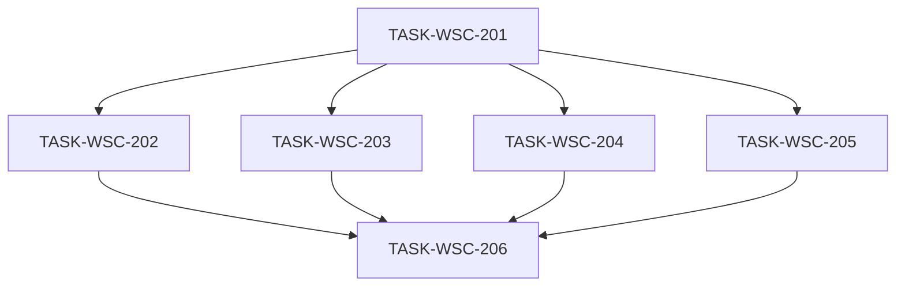

# 接入端工作台（WSC）V1.2-UX 候选执行计划

```yaml
planId: PLAN-WSC-3.1
status: DRAFT
planType: CANDIDATE
snapshotId: SNAP-WSC-003
sourcePrd: product/prd/wsc-v1.2-ux.md
runId: RUN-WSC-003
basedOn: PLAN-WSC-3.0
lineageFrom: PLAN-WSC-3.0
previousRun: RUN-WSC-002
functionalBaseline: SNAP-WSC-002
contractsBaseline: wsc-contracts@2.0.0
visualAuthority: design/prototypes/wsc-v1.1/index.html
round: 1
createdAt: 2026-08-02
taskCount: 6
waveCount: 4
requirementCount: 11
authorRoles: [planEditor]
actorInstance: plan-editor-wsc-003-r2
```

> **候选声明**：本文件为 `PLAN-WSC-3.1` **Round 1** 候选稿（`DRAFT` / `CANDIDATE`），吸收 `PLAN-WSC-3.0` Round 1 隔离评审 ISSUE 的 closeWhen **意图**。**不得**视为 `APPROVED`；未获规划委员会必需角色独立 `APPROVE` 前，Orchestrator **不得**复制至 `planning/approved/`。本 planEditor 实例不伪造任何委员会批准，**不**自行关闭任何 ISSUE。

## 0. Round 1 ISSUE 修订映射（相对 PLAN-WSC-3.0）

> **关闭须原提出者在 Round 2 确认**本文件对应修订满足其 `closeWhen`。下表仅映射修订位置与吸收意图，**不**表示 ISSUE 已关闭。

| ISSUE id | sev | 本文件修订位置（吸收意图） |
|---|---|---|
| ISSUE-SA-R1-001 | P1 | §2.2 控件基座选定 **CSS-token-first**；201 acceptance + 202..205 交付约束 |
| ISSUE-SA-R1-002 | P1 | §4 TASK-206：删除跨 feature testid 散文例外；选择器回流 20x / `TASK-WSC-20x-HOTFIX`；`denyModify` 含 `frontend/src/features/**` |
| ISSUE-QA-WSC3-R1-001 | P1 | §3.1 / §5.1 / 各任务 `testScope`+`acceptance`：方案 **(A)** 分波草稿截图 + 差距草稿行作为页面 VERIFIED 视觉证据 |
| ISSUE-QA-WSC3-R1-002 | P1 | §3.1 + 201..205 `writeSet`：可写 `ux-gap-drafts/TASK-WSC-20x.md` 与 `ux-walkthrough/drafts/**`；删除「可预填但无写权」表述 |
| ISSUE-QA-WSC3-R1-003 | P1 | §3.2 场景 6 + 206 `testScope`：三角色写入口可见性矩阵可勾选扩展断言 |
| ISSUE-QA-WSC3-R1-004 | P2 | §3.1 桌面视口 ≥2（1280×800、1440×900）+ 破坏性检查项 |
| ISSUE-QA-WSC3-R1-005 | P2 | 201 `testScope` 钉死 `useCanWrite`；§3.2/206 钉死规格文件与报告落点 |
| ISSUE-PP-WSC3-R1-001 | P1 | 同 SA-002 / PE-001：206 无 feature 触碰例外；仅 `tests/e2e/**` + 证据路径 |
| ISSUE-PP-WSC3-R1-002 | P2 | §5：显式 **禁止 203∥204**；最大并行不含该对；W2/W3 重叠时排除 203 未完成窗口 |
| ISSUE-PE-WSC3-R1-001 | P1 | 同 SA-002：206 writeSet 仅字面路径 |
| ISSUE-PE-WSC3-R1-002 | P1 | §3.4 内联导入结果四态；204 acceptance/testScope/readSet 引用本计划 §3.4 |
| ISSUE-PE-WSC3-R1-003 | medium | 202：`auth/store|composables|api` **绝对** `denyModify`；删除「除非」软例外 |
| ISSUE-UX-WSC3-R1-001 | P1 | §1.5 + 204 acceptance：**载体 B** — 保留独立路由 + 路由页内等价 modal 壳；截图 06 用语一致 |
| ISSUE-UX-WSC3-R1-002 | P2 | §3.1 差距清单最低 schema + 与截图 01–10 覆盖关系；206 acceptance |
| ISSUE-SEC-UX-R1-001 | P1 | §1.4 硬门禁 + §7 + 201/204/205/206：禁止纯 CSS 替代权限；可达性不可仅靠肉眼不可见 |
| ISSUE-SEC-UX-R1-002 | P1 | §3.5 前端展示白名单内联；204 `riskTags: [handles-pii]` + acceptance/testScope |
| ISSUE-SEC-UX-R1-003 | P2 | §3.1 / 206：走查截图须 fixture/脱敏；禁止真实 PII 证据入库 |

**映射条数：17**（均已吸收进正文；无升级项）。

### 0.1 谱系与共识轮次

| 概念 | 本计划取值 | 含义 |
|---|---|---|
| `lineageFrom` / `basedOn` | PLAN-WSC-3.0 | 相对上一候选的修订谱系（吸收其 Round 1 ISSUE 意图） |
| `round` | 1 | **本 planId（3.1）** 待进入的共识轮次（即将进入对本候选的独立评审 Round 1） |
| 功能基线谱系 | PLAN-WSC-2.2 / SNAP-WSC-002 | UX 增量之上的功能批准计划；本计划不重开功能范围 |
| 功能/契约权威 | SNAP-WSC-002 + `wsc-contracts@2.0.0` | 行为与 API **只读继承**；本 Run 默认不改 |
| 视觉权威 | `design/prototypes/wsc-v1.1/index.html` | 布局/令牌/交互质感对照源 |
| UX 需求权威 | SNAP-WSC-003（APPROVED） | REQ-UX-001..011；OQ-UX-001..004 已 CLOSED |

本计划 **不** 重新打开 SNAP-WSC-002 功能缺陷，除非本轮 UX 改造引入可复现回归。

## 1. 范围、假设与硬门禁

### 1.1 范围

**In Scope（SNAP-WSC-003）**

- 设计令牌与全局样式可追踪对齐原型 `:root`
- 壳层/侧栏、登录、总览、数据目录、目录维护、分类维护（路由页内 modal 壳）、批量导入弹窗、产品详情/编辑、上链信息页的信息架构与视觉呈现
- 空态/加载态/关键反馈质感统一；桌面端破坏性窄屏修复
- 原型偏差清单闭环 + 人工走查截图证据 + 功能回归（复用扩展既有 E2E）

**Out of Scope（默认 deny）**

- 修改 `contracts/**`、OpenAPI、RBAC 矩阵、后端写路径、Flyway/SQL、领域模型
- 新开业务能力；占位菜单完整业务流
- 移动端原生 App、暗色主题
- 非对齐所必需的图表库替换（优先 CSS/配置级）
- 用 Ant Design 默认主题「凑合」而未对照原型
- 将分类维护从独立路由迁移为目录页 overlay（本 Run 选定载体 B，见 §1.5）

> 若 UX 验收证明必须扩 scope（后端/契约），须经 PO 批准并新建快照/DEC；本计划 **默认标注为不可调度**，不得静默扩大。

### 1.2 假设（含已关闭 OQ）

| id | 口径（PO 已确认） |
|---|---|
| OQ-UX-001 | **允许**有限全局 CSS / 设计令牌文件重构；不改业务 API |
| OQ-UX-002 | **优先**以自研 DOM + 设计令牌对齐原型（见 §2.2 CSS-token-first）；AntDV 仅经任务「替换清单」局部引入并必须消费 201 令牌 |
| OQ-UX-003 | 视觉门禁 = **人工走查签字 + 主路径对照截图清单**；Playwright 截图抽样可选增强、非唯一门禁 |
| OQ-UX-004 | **复用并扩展**既有 E2E（功能回归）+ 视觉走查清单；不必单独再开同名 UX E2E Run，除非 QA 论证需要隔离证据目录 |
| OQ-001 / OQ-004 / OQ-V11-003 / OQ-V11-004 | 保留自 SNAP-WSC-002；本 UX 计划不重开裁定 |

### 1.3 技术栈硬门禁（前端 UX Run）

| 层 | 固定选型 |
|---|---|
| 前端 | Vue 3 + TypeScript + Vite + pnpm + Pinia + Vue Router 4；Ant Design Vue **已在** `frontend/package.json`（本 Run 默认不强制挂载为控件基座，见 §2.2） |
| 契约 | `wsc-contracts@2.0.0` **只读**；`frontend/src/api/**` 只读 |
| 后端 | **本计划所有任务 `denyModify`**（含 `backend/**`、`**/sql/**`） |
| 测试 | Vitest（组件/样式契约抽样）+ Playwright（复用扩展既有 E2E） |
| 视觉权威 | HTML 原型；实现须可对照 `:root` 变量，不得另起一套不可追踪主题 |

禁止：第二套 UI 框架并行习惯；静默改契约版本；在任务写集外「顺手」改后端；未挂载 201 令牌即裸用 AntDV 默认皮肤。

### 1.4 执行硬门禁

- 每任务：独立 developer → codeReviewer → tester；Orchestrator 按各任务 `writeSet` **字面路径**做 scope-check（**禁止**散文例外绕过）。
- developer ≠ codeReviewer ≠ tester。
- 并行任务写集必须互斥；禁止单 PR 混写多任务路径；**禁止 203∥204**（见 §5）。
- 功能行为验收仍引用 SNAP-WSC-002 对应 REQ；本计划验收聚焦 UX REQ。
- **权限不可用纯 CSS 替代（ISSUE-SEC-UX-R1-001）**：UX 任务不得以 `display:none` / `visibility` / `opacity:0` / `pointer-events:none` 等纯样式手段替代或弱化既有权限条件渲染（`v-if` 等）与路由/菜单守卫；特权控件对无权限角色须保持**结构不可达**（与 V1.1 一致）。三角色可达性校验**不得**仅依赖「肉眼不可见」。
- 本 Run `frontend/src/router/**` **只读冻结**（无任务 writeSet 纳入）；路由表变更须 HOTFIX 计划修订后派发。

### 1.5 分类维护 UI 载体冻结（ISSUE-UX-WSC3-R1-001）

本 Run 选定 **方案 B**：

| 项 | 冻结口径 |
|---|---|
| 载体 | **保留独立路由**（现行 `/catalog/admin/categories` 或等价）；页面内以 **等价 modal 壳**呈现（遮罩/宽约 960px/header+关闭/分栏维护区/footer 右对齐主次按钮） |
| 入口 | 侧栏/写入口（管理员）进入独立路由；关闭或「返回」回到进入前表面（通常目录浏览或前一路由） |
| 与原型偏差 | 原型为目录页 overlay `#category-modal`；本 Run **不**强制改为 browse 宿主挂载。该偏差为 **非 P0**，须写入差距清单且走查可勾选 |
| 写集 | 204 独占 `catalog/admin/**`；**不**要求 203 挂载分类弹窗；204 继续 `denyModify` `catalog/browse/**` |
| 截图 06 | `06-category-admin-modal.png` = 路由页内 modal 壳最终可达 UI（非要求证明为目录 overlay） |

导入弹窗载体不变：目录页弹窗（`ImportDialog`，宿主 browse），203 入口视觉 / 204 弹窗实现拆分同 PLAN-WSC-3.0。

## 2. 设计令牌与全局样式策略

### 2.1 原型 `:root` 对照最小集（REQ-UX-001）

实现须提供可追踪令牌（建议路径 `frontend/src/styles/tokens.css`，任务 201 可调整文件名但须在交付物中写明映射表），至少覆盖：

| 令牌 | 原型值 |
|---|---|
| `--sidebar-bg` | `#0b1120` |
| `--sidebar-width` | `232px` |
| `--main-bg` | `#f4f6f9` |
| `--card-bg` | `#ffffff` |
| `--text-primary` | `#1f2937` |
| `--text-secondary` | `#6b7280` |
| `--text-tertiary` | `#9ca3af` |
| `--border-color` | `#e5e7eb` |
| `--blue` / `--blue-light` | `#3b82f6` / `#eff6ff` |
| `--green` / `--green-light` | `#10b981` / `#ecfdf5` |
| `--orange` / `--orange-light` | `#f59e0b` / `#fffbeb` |
| `--red` / `--red-light` | `#ef4444` / `#fef2f2` |
| `--shadow-sm` / `--shadow` / `--shadow-lg` | 原型三级阴影 |

布局约定（验收辅助）：

- 卡片默认圆角约 **12px**；边框 + 轻阴影层次接近原型
- 正文字号阶梯约 **14px** 基线；中文字体栈观感接近：`"PingFang SC", "Microsoft YaHei", -apple-system, BlinkMacSystemFont, "Segoe UI", sans-serif`
- 侧栏菜单项圆角约 **8px**；active 高亮背景 + 白字

### 2.2 控件基座与 AntDV 边界（ISSUE-SA-R1-001 / OQ-UX-002）

**选定：CSS-token-first（方案 A）**

理由：仓库 `frontend/src` 当前为零 AntDV 引用，主路径为自研 DOM/CSS；与「优先 ConfigProvider 覆写」脱节。默认延续自研基座，避免并行页任务各自引入 `a-table`/`a-modal` 造成半 Ant 半自研分叉。

| 规则 | 口径 |
|---|---|
| 默认 | 自研 markup + §2.1 CSS 变量 / 有限全局样式；201 独占令牌与全局挂载 |
| AntDV | **仅当**某任务交付说明单列「替换清单 + 理由」后局部引入；必须消费 201 令牌/theme（若有）；**禁止**未挂载主题的裸用默认皮肤 |
| 禁止 | 202..205 并行私自建立第二套控件习惯或第二套全局色板 |
| data-testid | 局部替换控件时不得无故改变 E2E 依赖的 testid（若必须变更 → 对应 20x 任务或串行 HOTFIX，见 §4.206） |
| 201 职责 | 落地令牌 + 全局基线；**不强制**本 Run 挂载全量 AntDV；若某后继任务经替换清单引入 AntDV，201-HOTFIX 可补 `ConfigProvider`/全局样式挂载（独占 styles/theme/App/main） |

### 2.3 共享样式所有权

| 制品 | 唯一写任务 | 其他任务 |
|---|---|---|
| `frontend/src/styles/**`（令牌、全局基线、可选 antd 覆写） | TASK-WSC-201 | 只读引用 CSS 变量；页面级 scoped 样式可写本任务 `writeSet` 内 |
| `frontend/src/theme/**`（若引入） | TASK-WSC-201 | 只读 |
| `frontend/src/App.vue` / `frontend/src/main.ts` | TASK-WSC-201 | 只读 |
| `frontend/src/layouts/**`、`frontend/src/features/shell/**` | TASK-WSC-201 | 只读 |
| `frontend/src/router/**` | **无写任务（本 Run 冻结）** | 全任务只读 |
| `contracts/**`、`frontend/src/api/**`、`backend/**` | **无写任务** | 全任务只读 / deny |

后继任务若发现令牌缺口：提 ISSUE 回 201 补丁波次，或由 Orchestrator 插入串行 `TASK-WSC-201-HOTFIX`（独占 styles/theme）；**禁止**各页面任务私自分叉第二套全局色板。

## 3. 视觉验收、导入四态与证据路径

### 3.1 人工走查 + 截图清单（发布硬门禁）

| 项 | 约定 |
|---|---|
| 正式差距清单 | `ai/runs/RUN-WSC-003/ux-gap-checklist.md`（**仅 TASK-WSC-206** 写入终稿） |
| 分波差距草稿 | `ai/runs/RUN-WSC-003/ux-gap-drafts/TASK-WSC-20x.md`（201..205 各写本任务文件；206 合并入正式清单） |
| 正式截图目录 | `ai/runs/RUN-WSC-003/ux-walkthrough/screenshots/` |
| 分波草稿截图 | `ai/runs/RUN-WSC-003/ux-walkthrough/drafts/`（文件名与下表一致；201..205 写入） |
| 走查记录 | `ai/runs/RUN-WSC-003/ux-walkthrough/WALKTHROUGH.md`（含 PO/UX 签字栏或等价确认引用） |
| 对照源 | `design/prototypes/wsc-v1.1/index.html` 同屏对比 |
| P0 失败定义 | 「完全不像原型」或主路径信息架构错误；存在则不得发布 |
| 截图脱敏（ISSUE-SEC-UX-R1-003） | 草稿与正式截图均须使用**测试 fixture 或已脱敏演示数据**；**禁止**将含真实 PII 的截图作为发布证据；误用须重拍替换后再关门禁 |

**主路径截图最低清单 + 分波草稿责任：**

| # | 文件名 | 页面 | 草稿任务 |
|---|---|---|---|
| 01 | `01-login.png` | 登录 | 202 |
| 02 | `02-shell-sidebar.png` | 壳层/侧栏（含品牌区与角色区） | 201 |
| 03 | `03-overview.png` | 总览 | 202 |
| 04 | `04-catalog-browse.png` | 数据目录 | 203 |
| 05 | `05-catalog-maintenance.png` | 目录维护 | 204 |
| 06 | `06-category-admin-modal.png` | 分类维护（路由页内 modal 壳） | 204 |
| 07 | `07-import-modal.png` | 批量导入弹窗 | 204 |
| 08 | `08-product-detail.png` | 产品详情 | 205 |
| 09 | `09-product-editor.png` | 产品编辑 | 205 |
| 10 | `10-chain.png` | 上链信息 | 205 |

**桌面视口抽检（ISSUE-QA-WSC3-R1-004）** — 206 走查至少覆盖：

| 视口 | 检查项 |
|---|---|
| 1280×800 | 侧栏不遮挡主区；卡片不重叠；弹窗/modal 壳不溢出视口 |
| 1440×900 | 同上 |

可选增强：Playwright 截图抽样（非唯一门禁）。

**差距清单最低 schema（ISSUE-UX-WSC3-R1-002）** — 正式清单与各任务草稿均须使用（草稿可缺 evidence，终稿须补齐）：

| 字段 | 说明 |
|---|---|
| `id` | 稳定差距 id（如 `GAP-UX-004-01`） |
| `screenshot` / `pathKey` | 对应截图#（01–10）或主路径键 |
| `dimension` | 令牌 / IA / 控件层级 / 空加载反馈 / 文案 |
| `severity` | P0 / P1 |
| `status` | open / closed / n/a |
| `evidence` | 关闭时链到截图路径或 `WALKTHROUGH.md` 条目；无差距则 `status=closed` 或 `n/a` + 走查引用 |

覆盖关系：§3.1 截图最低清单 **每一项**至少有一行可追踪记录。P0 行关闭须链到截图或 WALKTHROUGH 条目。

### 3.2 功能回归 E2E（复用扩展）

| 项 | 约定 |
|---|---|
| 基线规格（本轮门禁） | `tests/e2e/specs/p0-wsc-v1.1.spec.ts`（及既有 fixtures） |
| 本轮动作 | **扩展**断言/稳定选择器适配 UX DOM 调整；**不**要求独立 `TESTRUN-WSC-E2E-UX` |
| 证据 id | `TESTRUN-WSC-E2E-V12-UX` |
| 命令（机械条款） | `pnpm --dir tests/e2e exec playwright test specs/p0-wsc-v1.1.spec.ts`（或仓库等价 `pnpm --dir tests/e2e test:v1.1`）；报告记录实际命令；**不得**以跑全量 `specs/`（含遗留 `p0-wsc.spec.ts`）冒充本轮门禁而无声明 |
| 报告落点 | 优先 `tests/e2e/reports/p0-wsc-v1.2-ux/`（可改 `playwright.config.ts` 报告目录）；若复用 V11 目录 `reports/p0-wsc-v1.1`，报告**必须**声明 `evidenceId=TESTRUN-WSC-E2E-V12-UX` + 时间戳子目录 |
| 负责 | 独立 tester（≠ 末波 developer/codeReviewer） |
| 失败 | 任一步骤失败 → **不得**标本 UX Run 发布就绪 |

回归场景最低集（继承 PLAN-WSC-2.2 §6.1 意图，适配 UX 后 DOM）：

1. 登录/角色切换/退出；OVW 核心指标可见  
2. 目录标签 + 滚动加载抽样  
3. 三级分类维护可达（管理员；路由页内 modal 壳）  
4. 目录维护：待关联→已维护  
5. 批量导入 partial-success + 报告入口  
6. 详情/编辑/上链主路径；**三角色写入口可见性矩阵**（ISSUE-QA-WSC3-R1-003）：  
   - ADMIN：分类维护、目录维护、产品写、导入入口 **可见/可达**  
   - PROVIDER：产品写、导入 **可见**；分类维护、目录维护 **不可达**（结构不可达，非仅 CSS 隐藏）  
   - USER：分类维护、目录维护、产品写、导入 **均不可达**  
   扩展断言须落入 `p0-wsc-v1.1.spec.ts`（或继任规格文件，须在报告声明）中可勾选步骤  

### 3.3 分波视觉证据与 VERIFIED（ISSUE-QA-WSC3-R1-001 / 002）

**方案 A（选定）**：201–205 的 `VERIFIED` **包含**本任务主路径视觉证据，不只是 build/typecheck。

| 交付物 | 要求 |
|---|---|
| 草稿截图 | 落入 `ux-walkthrough/drafts/`，文件名映射 §3.1 表中本任务行 |
| 差距草稿 | `ux-gap-drafts/TASK-WSC-20x.md`，schema 见 §3.1；本任务主路径项至少一行 |
| tester | 执行该任务 `testScope`（含草稿截图存在性 + 逻辑回归）；无草稿不得标视觉相关 acceptance 通过 |
| 206 | 合并草稿→正式清单与 `screenshots/`；PO/UX 签字；E2E；构成正式发布门禁 |

### 3.4 导入结果四态（本计划内联；ISSUE-PE-WSC3-R1-002）

可验收、禁止混淆；204 / 206 引用**本节**，不得以外挂 PLAN-WSC-2.2 §3.6 为唯一依据：

| 态 | 判定 | UI 最低要求 |
|---|---|---|
| ① 全成功 | `successCount>0` 且 `failureCount=0` | 可关闭/可重传；无报告亦可 |
| ② 部分成功 | `successCount>0` 且 `failureCount>0` | **同时**可观测两计数 + 错误报告入口 + 可关闭/重传；**禁止**仅标「导入失败」而无成功计数 |
| ③ 全失败（行级） | `successCount=0` 且 `failureCount>0` | 失败计数 + 报告 + 可关闭/重传 |
| ④ 文件级拒绝 | 请求级错误（超限/非法格式） | 停留上传步或等价提示；映射 `ERR_IMPORT_FILE_TOO_LARGE` 等；**不**伪装成行级结果态 |

### 3.5 导入结果/错误报告前端展示白名单（ISSUE-SEC-UX-R1-002）

继承功能基线意图，本 UX Run **前端展示**约束（后端/契约仍 denyModify）：

| 项 | 约定 |
|---|---|
| 允许展示字段 | 行号、产品编码、原因码/原因文案；成功/失败计数；`reportId`（若有） |
| **禁止**回显 | 完整信用代码、ownerDID、明文哈希；不得因样式/结构改造把原始错误 payload 整段渲染进结果区 |
| 报告入口 | 鉴权行为不变（管理员/提供方可；普通用户不可）；本计划不改 API |

## 4. 任务包列表

> 任务 ID 自 `TASK-WSC-201` 起，避免与 V1.1 `TASK-WSC-101..107` 冲突。字段全文内联。

### TASK-WSC-201 — 设计令牌 / 全局样式 / 壳层

- `requirements`: `[REQ-UX-001, REQ-UX-002, REQ-UX-008(角色切换区), REQ-UX-010(壳层)]`
- `objective`: 落地可追踪令牌与全局样式（CSS-token-first）；侧栏品牌区/导航激活态/主区背景/底部企业信息卡/角色切换区与占位菜单提示质感对齐原型；挂载全局样式入口；**不强制**全量 AntDV 挂载
- `dependsOn`: `[]`
- `readSet`: SNAP-WSC-003；原型 `index.html` `:root` 与侧栏结构；PLAN-WSC-2.2（功能壳层行为）；`frontend/src/api/**`（只读）；既有 shell/layout 实现；`frontend/src/features/auth/composables/useCanWrite*`（只读跑测）
- `writeSet`:
  - `frontend/src/styles/**`
  - `frontend/src/theme/**`（若采用独立 theme 模块；可不建则令牌仅落 styles）
  - `frontend/src/App.vue`
  - `frontend/src/main.ts`
  - `frontend/src/layouts/**`
  - `frontend/src/features/shell/**`
  - `frontend/src/views/PlaceholderView.vue`（占位/未开放页质感，不改变未开放策略）
  - `ai/runs/RUN-WSC-003/ux-gap-drafts/TASK-WSC-201.md`
  - `ai/runs/RUN-WSC-003/ux-walkthrough/drafts/02-shell-sidebar.png`
  - 对应 Vitest（若有）：`frontend/src/features/shell/**/__tests__/**`、`frontend/src/features/shell/**/*.spec.ts`
  - 前端根构建配置（**仅当**引入全局样式/主题挂载所必需）：`frontend/package.json`、`frontend/vite.config.*`、`frontend/pnpm-lock.yaml`（禁止借机升级重大依赖栈）
- `denyModify`:
  - `contracts/**`；`frontend/src/api/**`；`backend/**`；`**/sql/**`
  - `frontend/src/router/**`
  - `frontend/src/features/overview/**`
  - `frontend/src/features/catalog/**`
  - `frontend/src/features/chain/**`
  - `frontend/src/features/auth/**`（含 views/store/composables/api；登录页归 202；本任务可改 `features/shell` 内 RoleSwitcher）
  - `product/**`；`planning/**`；`ai/rules/**`
  - `tests/e2e/**`（E2E 归 206）
  - `ai/runs/RUN-WSC-003/ux-gap-checklist.md`；`ai/runs/RUN-WSC-003/ux-walkthrough/screenshots/**`；`ai/runs/RUN-WSC-003/ux-walkthrough/WALKTHROUGH.md`（正式制品归 206）
- `acceptance`:
  - 存在可对照原型的令牌集，覆盖 §2.1 最小集；卡片圆角/阴影/字号阶梯可走查
  - 侧栏宽约 232px、背景接近 `#0b1120`；Logo 区 +「接入端工作台」层次清晰；菜单含图标（或等价图标位）、圆角、hover/active
  - 主区浅灰背景 + 内边距层次正确；底部企业信息卡 + 角色切换深色菜单/active 蓝强调接近原型
  - 占位菜单点击提示不破坏壳层风格；角色切换后写入口可见性仍符合 SNAP-WSC-002 REQ-SHELL-001 / REQ-RBAC-001
  - 写入口/角色区：**结构**条件渲染保留；禁止纯 CSS 隐藏替代（§1.4）
  - 不得仅以 AntDV 默认主题替代令牌对齐；符合 §2.2 CSS-token-first
  - 草稿截图 `02-shell-sidebar.png` + 差距草稿行已交付
- `testScope`:
  - 前端 build / typecheck
  - 写入口可见性回归：执行 `frontend/src/features/auth/composables/useCanWrite.spec.ts`（只读；本任务不改该文件）
  - 草稿截图文件存在于 `ux-walkthrough/drafts/`；`ux-gap-drafts/TASK-WSC-201.md` schema 行可检
- `riskTags`: `[frontend-theme]`

### TASK-WSC-202 — 总览 + 登录视觉

- `requirements`: `[REQ-UX-003, REQ-UX-008(登录页), REQ-UX-009(总览空态/加载)]`
- `objective`: 登录页与工作台品牌色一致；总览三列指标卡与图表卡片视觉对齐原型；数据契约与图表库默认不改（CSS/配置级收敛）
- `dependsOn`: `[TASK-WSC-201]`
- `readSet`: 令牌与 theme（只读）；原型总览/登录结构；SNAP-WSC-002 REQ-OVW-001..005（行为不改）；`frontend/src/api/overview.ts`（只读）
- `writeSet`:
  - `frontend/src/features/overview/**`
  - `frontend/src/features/auth/views/**`
  - 对应 `*.spec.ts` / `__tests__/**`
  - `ai/runs/RUN-WSC-003/ux-gap-drafts/TASK-WSC-202.md`
  - `ai/runs/RUN-WSC-003/ux-walkthrough/drafts/01-login.png`
  - `ai/runs/RUN-WSC-003/ux-walkthrough/drafts/03-overview.png`
- `denyModify`:
  - `frontend/src/styles/**`；`frontend/src/theme/**`；`frontend/src/App.vue`；`frontend/src/main.ts`
  - `frontend/src/layouts/**`；`frontend/src/features/shell/**`；`frontend/src/router/**`
  - `frontend/src/features/catalog/**`；`frontend/src/features/chain/**`
  - `frontend/src/features/auth/store/**`；`frontend/src/features/auth/composables/**`；`frontend/src/features/auth/api/**`（**绝对禁止**；登录视觉仅限 `auth/views/**`）
  - `contracts/**`；`frontend/src/api/**`；`backend/**`；`tests/e2e/**`
  - `ai/runs/RUN-WSC-003/ux-gap-checklist.md`；正式 `screenshots/**` / `WALKTHROUGH.md`
- `acceptance`:
  - 登录：主色/卡片/输入与按钮层级与壳层品牌一致；登录后进入壳层过渡自然
  - 总览：三列指标卡标题/图标色块（蓝绿橙等）/大号数值/描述层次接近原型
  - 图表卡片具备 card header、圆角阴影与留白；空态/加载可读且引用共享令牌或全局反馈样式
  - 功能数据口径仍满足 SNAP-WSC-002 REQ-OVW-001..005（不新增业务指标）
  - 局部引入 AntDV 须有替换清单且消费 201 令牌（§2.2）
  - 草稿截图 01+03 + 差距草稿已交付
- `testScope`:
  - overview / auth views 既有 Vitest 回归
  - 前端 typecheck；登录成功进总览手工或单测 smoke
  - 草稿截图与 `ux-gap-drafts/TASK-WSC-202.md` 可检
- `riskTags`: `[]`

### TASK-WSC-203 — 数据目录浏览视觉

- `requirements`: `[REQ-UX-004, REQ-UX-009(目录空态/加载中)]`
- `objective`: 页头、空间/行业标签 active 态、子类分组标题（左侧色条+计数）、筛选条、列表行、预览分栏与滚动加载「加载中」呈现对齐原型；行为继承 REQ-CAT-001（滚动位置与筛选保留）
- `dependsOn`: `[TASK-WSC-201]`
- `readSet`: 令牌（只读）；原型目录区；SNAP-WSC-002 REQ-CAT-001..003；browse composables（行为默认不改）；`catalog/import/ImportDialog`（**只读**消费；实现归 204）
- `writeSet`:
  - `frontend/src/features/catalog/browse/**`
  - 对应 `*.spec.ts` / `__tests__/**`
  - `ai/runs/RUN-WSC-003/ux-gap-drafts/TASK-WSC-203.md`
  - `ai/runs/RUN-WSC-003/ux-walkthrough/drafts/04-catalog-browse.png`
- `denyModify`:
  - `frontend/src/styles/**`；`frontend/src/theme/**`；`frontend/src/layouts/**`；`frontend/src/features/shell/**`；`frontend/src/router/**`
  - `frontend/src/features/catalog/admin/**`；`frontend/src/features/catalog/maintenance/**`；`frontend/src/features/catalog/import/**`
  - `frontend/src/features/catalog/detail/**`；`frontend/src/features/catalog/editor/**`
  - `frontend/src/features/overview/**`；`frontend/src/features/chain/**`；`frontend/src/features/auth/**`
  - `contracts/**`；`frontend/src/api/**`；`backend/**`；`tests/e2e/**`
  - 正式差距清单 / 正式 screenshots / WALKTHROUGH
- `acceptance`:
  - 标签 active 蓝底；子类分节左侧色条+计数；筛选条与列表行接近原型
  - 预览区与列表分栏层次清晰；加载中不破坏列表布局且保留滚动位置
  - 无结果空态可读；中文标签与原型用语一致；空态/加载引用共享令牌或全局反馈样式
  - 导入入口按钮视觉可在本页调整，但**不得**改 `import/**` 弹窗实现（弹窗归 204）
  - 草稿截图 04 + 差距草稿已交付
- `testScope`:
  - browse 既有 Vitest（筛选、滚动加载、导入入口）回归
  - typecheck
  - 草稿截图与差距草稿可检
- `riskTags`: `[]`

### TASK-WSC-204 — 目录维护 + 分类 modal 壳 + 导入弹窗视觉

- `requirements`: `[REQ-UX-005, REQ-UX-006, REQ-UX-009(弹窗加载/提交反馈)]`
- `objective`: 目录维护页签/筛选/批量条/表格分页层次对齐；分类维护**路由页内等价 modal 壳**（约 960px）与导入弹窗（约 520px）结构、遮罩、footer 主次按钮层级对齐；功能规则仍满足 REQ-CAT-006/007/008；导入四态与报告展示白名单不回退
- `dependsOn`: `[TASK-WSC-201]`
- `readSet`: 令牌（只读）；原型维护页与 `#import-modal` / `#category-modal` 结构；SNAP-WSC-002 对应 REQ；本计划 §3.4 / §3.5
- `writeSet`:
  - `frontend/src/features/catalog/maintenance/**`
  - `frontend/src/features/catalog/admin/**`
  - `frontend/src/features/catalog/import/**`
  - 对应 `*.spec.ts` / `__tests__/**`
  - `ai/runs/RUN-WSC-003/ux-gap-drafts/TASK-WSC-204.md`
  - `ai/runs/RUN-WSC-003/ux-walkthrough/drafts/05-catalog-maintenance.png`
  - `ai/runs/RUN-WSC-003/ux-walkthrough/drafts/06-category-admin-modal.png`
  - `ai/runs/RUN-WSC-003/ux-walkthrough/drafts/07-import-modal.png`
- `denyModify`:
  - `frontend/src/styles/**`；`frontend/src/theme/**`；`frontend/src/layouts/**`；`frontend/src/features/shell/**`；`frontend/src/router/**`
  - `frontend/src/features/catalog/browse/**`（入口样式归 203；本任务不得改 browse）
  - `frontend/src/features/catalog/detail/**`；`frontend/src/features/catalog/editor/**`
  - `frontend/src/features/overview/**`；`frontend/src/features/chain/**`；`frontend/src/features/auth/**`
  - `contracts/**`；`frontend/src/api/**`；`backend/**`；`tests/e2e/**`；`tests/fixtures/import/**`（fixture 内容默认禁止）
  - 正式差距清单 / 正式 screenshots / WALKTHROUGH
- `acceptance`:
  - 维护页：全部/已维护/待关联 active 明确；筛选与批量条布局接近原型；表格在白卡片内；非「默认 Ant 表格堆砌」
  - 分类维护（§1.5 载体 B）：路由页内 modal 壳宽幅约 960px、header/关闭、分栏、footer 右对齐主次按钮；遮罩/圆角/分隔接近原型；与目录 overlay 偏差记入差距草稿（非 P0）
  - 导入弹窗：中等宽度约 520px、上传区/模板入口/结果反馈区、footer 层级；**§3.4 四态**均可区分（①全成功/②部分成功/③全失败/④文件级拒绝）
  - 结果区/错误报告入口展示字段遵守 **§3.5 白名单**；禁止扩大信用代码/ownerDID/明文哈希回显
  - 非管理员不可达行为不变（REQ-CAT-006/007）；导入权限矩阵不变（REQ-CAT-008 / REQ-RBAC-001）；禁止纯 CSS 替代权限（§1.4）；校验不得仅靠肉眼不可见
  - 草稿截图 05+06+07 + 差距草稿已交付
- `testScope`:
  - maintenance / admin / import 既有 Vitest 回归（含导入四态相关）
  - 至少一条 Vitest 或既有断言：禁止字段（信用代码/ownerDID/明文哈希）不出现在导入结果 UI（§3.5）
  - typecheck；管理员 vs 提供方可达性手工或单测抽样（结构不可达）
  - 草稿截图与差距草稿可检
- `riskTags`: `[handles-pii]`

### TASK-WSC-205 — 详情 / 编辑 / 上链视觉

- `requirements`: `[REQ-UX-007, REQ-UX-009(页级反馈)]`
- `objective`: 详情字段分组卡片、编辑表单分区与主次按钮、上链版本列表卡+快照卡双栏（或等价）层次对齐原型；三级分类路径展示可读；写路径行为不改
- `dependsOn`: `[TASK-WSC-201]`
- `readSet`: 令牌（只读）；原型详情/编辑/上链结构；SNAP-WSC-002 REQ-CAT-004/005、REQ-CHAIN-001
- `writeSet`:
  - `frontend/src/features/catalog/detail/**`
  - `frontend/src/features/catalog/editor/**`
  - `frontend/src/features/chain/**`
  - 对应 `*.spec.ts` / `__tests__/**`
  - `ai/runs/RUN-WSC-003/ux-gap-drafts/TASK-WSC-205.md`
  - `ai/runs/RUN-WSC-003/ux-walkthrough/drafts/08-product-detail.png`
  - `ai/runs/RUN-WSC-003/ux-walkthrough/drafts/09-product-editor.png`
  - `ai/runs/RUN-WSC-003/ux-walkthrough/drafts/10-chain.png`
- `denyModify`:
  - `frontend/src/styles/**`；`frontend/src/theme/**`；`frontend/src/layouts/**`；`frontend/src/features/shell/**`；`frontend/src/router/**`
  - `frontend/src/features/catalog/browse/**`；`frontend/src/features/catalog/admin/**`
  - `frontend/src/features/catalog/maintenance/**`；`frontend/src/features/catalog/import/**`
  - `frontend/src/features/overview/**`；`frontend/src/features/auth/**`
  - `contracts/**`；`frontend/src/api/**`；`backend/**`；`tests/e2e/**`
  - 正式差距清单 / 正式 screenshots / WALKTHROUGH
- `acceptance`:
  - 详情：页头、字段分组卡片、只读层次接近原型
  - 编辑：表单分区、标签/控件间距、主次按钮层级对齐；普通用户无编辑入口（结构不可达，禁止纯 CSS 替代）
  - 上链：版本列表卡 + 快照卡双栏（或等价）层次清晰；三级路径样式可读
  - 敏感字段截断等既有行为不回退；空态/页级反馈引用共享令牌或全局反馈样式
  - 草稿截图 08+09+10 + 差距草稿已交付
- `testScope`:
  - detail / editor / chain 既有 Vitest 回归
  - typecheck
  - 草稿截图与差距草稿可检
- `riskTags`: `[handles-pii]`（展示层；不得扩大明文回显）

### TASK-WSC-206 — 偏差清单闭环 + 视觉走查 + 功能回归 E2E

- `requirements`: `[REQ-UX-011, REQ-UX-009(主路径统一抽检), REQ-UX-010(桌面破坏性抽检)]`
- `objective`: 合并分波草稿、对照原型完成主路径差距清单闭环；归档正式截图与走查签字；复用扩展既有 E2E 证明无 UX 引入的功能回归；确认无 P0「完全不像原型」页面
- `dependsOn`: `[TASK-WSC-201, TASK-WSC-202, TASK-WSC-203, TASK-WSC-204, TASK-WSC-205]`
- `readSet`: 全部主路径页面实现（只读对照）；原型；SNAP-WSC-003；既有 E2E 规格；本计划 §3.1–§3.5；`ux-gap-drafts/**` 与 `ux-walkthrough/drafts/**`（只读合并源）
- `writeSet`（字面路径；纳入 scope-check）:
  - `ai/runs/RUN-WSC-003/ux-gap-checklist.md`
  - `ai/runs/RUN-WSC-003/ux-walkthrough/**`（含 `screenshots/`、`WALKTHROUGH.md`；可整理/复制 drafts→screenshots，**不**改 feature 源码）
  - `tests/e2e/specs/p0-wsc-v1.1.spec.ts`（及同目录为扩展断言所必需的 helper/fixture 引用文件，须在交付说明列出）
  - `tests/e2e/playwright.config.ts`（仅当调整报告目录至 `p0-wsc-v1.2-ux/` 所必需）
  - `tests/e2e/reports/p0-wsc-v1.2-ux/**`（或报告中声明的 V11 复用路径 + 时间戳子目录）
- `denyModify`:
  - `contracts/**`；`frontend/src/api/**`；`backend/**`；`**/sql/**`
  - `frontend/src/styles/**`；`frontend/src/theme/**`（令牌回归缺陷回 201）
  - `frontend/src/features/**`（**禁止**本任务改任何 feature 源码，含 data-testid/aria；选择器适配优先改 `tests/e2e/**`；若必须改生产 DOM 选择器属性 → Orchestrator 插入串行 `TASK-WSC-20x-HOTFIX`，writeSet=该 feature 字面路径）
  - `frontend/src/App.vue`；`frontend/src/main.ts`；`frontend/src/layouts/**`；`frontend/src/router/**`
  - `product/**`；`planning/**`
  - 禁止新增业务 API 调用或改 RBAC 逻辑
- `acceptance`:
  - 差距清单：§3.1 schema；截图 01–10 每项至少一行；P0 差距为 0 或已关闭并有证据链接；分类载体 B 与原型 overlay 偏差若保留则非 P0 且可勾选
  - §3.1 正式截图最低清单齐全（脱敏/fixture）；`WALKTHROUGH.md` 含 PO/UX 确认记录
  - §3.1 视口 1280×800 与 1440×900 破坏性检查已勾选
  - §3.2 E2E 全场景通过（含场景 6 三角色矩阵）；证据 id、命令、报告落点写入报告
  - 空态/加载/toast 主路径抽检风格统一；三角色 V1.1 主路径功能不回退；可达性校验非仅肉眼不可见
- `testScope`:
  - 执行 §3.2 钉死命令针对 `p0-wsc-v1.1.spec.ts`（`E2E_RUN=1` 等既有环境约定）
  - 可勾选：ADMIN/PROVIDER/USER 写入口矩阵扩展步骤已在规格中且通过
  - 走查清单勾选；正式截图路径可检索；脱敏声明
  - 可选：Playwright 截图抽样（非唯一门禁）
- `riskTags`: `[release-gate]`

## 5. 波次 / DAG



| 波次 | 任务 | 启动条件 | 同波并行写集校验 |
|---|---|---|---|
| W1 | 201 | SNAP-WSC-003 APPROVED + 本计划 APPROVED 后派发 | 单任务；独占 styles/theme/shell/layout |
| W2 | 202 ∥ 203 | 201 VERIFIED | `overview/**`+`auth/views/**` ∥ `catalog/browse/**` 无交集 |
| W3 | 204 ∥ 205 | 201 VERIFIED；**不得与未完成的 203 并行启动 204**（见下） | `maintenance∥admin∥import` ∥ `detail∥editor∥chain` 无交集；均不得写 browse/styles |
| W4 | 206 | 201..205 均 VERIFIED | 单任务；证据 + E2E；不得写 `frontend/src/features/**` |

**并行对显式清单（ISSUE-PP-WSC3-R1-002）：**

| 并行对 | 条件 | writeSet 核心 | 合入约束 |
|---|---|---|---|
| 202 ∥ 203 | 同属 W2 | overview+login-views ∥ browse | 禁止单 PR 混写 |
| 204 ∥ 205 | 同属 W3 | maint/admin/import ∥ detail/editor/chain | 同上 |
| **203 ∥ 204** | **禁止** | browse 编译期读 `ImportDialog`（204 写） | W2/W3 资源重叠时：须 **203 VERIFIED（或至少合入冻结）之后** 再启动/合入 204；或先完成并合入 204（ImportDialog props/events 冻结）再验/合入 203。**最大并行不含 203∥204** |
| 202∥205、202∥204、203∥205 | 写集互斥且无 203→ImportDialog 读边 | 允许 | 禁止跨任务 squash |

DAG **无环**；允许的并行对写集无交集；203∥204 以调度约束消除不稳定读。

### 5.1 每任务审查/测试门禁

1. `developer` 仅改 `writeSet`，提交 REQ→diff→测试声明；附原型对照说明（改了哪些视觉层次）；附草稿截图与差距草稿路径。
2. 独立 `codeReviewer` 只读审：对照 SNAP-WSC-003 + 原型 + §1.4 权限/§2.2 基座；P0/P1 未关闭则 `REQUEST_CHANGES`。
3. 独立 `tester` 执行该任务 `testScope`（含分波视觉草稿）；失败不得标通过。
4. Orchestrator 仅在 **字面** scope-check、review、tests、交付物齐全后标 `VERIFIED`。
5. 选择器必须改生产 DOM 时：插入串行 `TASK-WSC-20x-HOTFIX`（独占该 feature 字面路径），**不得**由 206 散文扩写。

## 6. REQ 映射

| REQ | 优先级 | 主任务 | 备注 |
|---|---|---|---|
| REQ-UX-001 | P0 | 201 | 令牌；206 走查复核 |
| REQ-UX-002 | P0 | 201 | 壳层 |
| REQ-UX-003 | P0 | 202 | 总览 |
| REQ-UX-004 | P0 | 203 | 目录浏览 |
| REQ-UX-005 | P0 | 204 | 目录维护页 |
| REQ-UX-006 | P0 | 204 | 分类 modal 壳 / 导入弹窗 |
| REQ-UX-007 | P0 | 205 | 详情/编辑/上链 |
| REQ-UX-008 | P1 | 201（角色区）+ 202（登录） | 拆分写集已声明 |
| REQ-UX-009 | P1 | 202/203/204/205 各页落地；**206** 统一抽检闭环 | 非单页独占 |
| REQ-UX-010 | P1 | 201（壳层）+ 各页；**206** 桌面破坏性抽检（§3.1 视口） | 不要求移动端完整适配 |
| REQ-UX-011 | P0 | 206 | 差距清单 schema + 走查 + E2E |

覆盖：**REQ-UX-001..011 共 11 条齐全**。功能继承 REQ（SHELL/RBAC/OVW/CAT/CHAIN）不作为本计划新开发范围，仅作回归约束。

## 7. 风险与回滚

| 风险 | 缓解 | 回滚 |
|---|---|---|
| 全局令牌破坏既有页面 | 201 独占 styles；后继只读变量；分波合入 | 回退 201 commit / 还原 `styles/**`+`App.vue`/`main.ts` |
| 半 Ant 半自研分叉 | §2.2 CSS-token-first；替换清单门禁；CR | 移除未授权 AntDV 引入；回退主题/页面 |
| UX 改动导致 E2E 选择器失效 | 206 仅改 `tests/e2e/**`；必要 DOM 属性改走 20x-HOTFIX | 修复选择器；功能回归失败不得发布 |
| 页面任务私自改 API/鉴权 | denyModify + 字面 scope-check；202 绝对 deny auth 逻辑 | 拒合入；打回 |
| 纯 CSS 隐藏削弱权限 | §1.4 + 201/204/205/206 acceptance；E2E 矩阵结构可达性 | 紧急恢复条件渲染/守卫 |
| 导入结果区扩大 PII 回显 | §3.5 + 204 handles-pii + Vitest 负例 | 紧急收紧结果 UI |
| 走查截图含真实 PII | §3.1 脱敏/fixture 门禁 | 重拍替换后关门禁 |
| 范围蔓延到后端/契约 | §1.1 默认 deny；须 PO+新快照 | 删除越界改动 |
| 视觉「看起来改了」但功能回退 | 分波草稿 + 206 E2E + 三角色冒烟 | 回退引入回归的 feature 任务 |
| 敏感字段展示回退明文 | 205 riskTag；CR 检查截断组件 | 紧急修复展示层 |
| 203∥204 不稳定读 | §5 禁止并行 / 合入序 | 拒并行合入；重跑受影响 tester |

本 Run 回滚面主要为 **前端可回退**（git revert / 特性分支弃用）；无 DB 迁移回滚项。

## 8. 发布门禁（本 UX Run / RUN-WSC-003）

1. SNAP-WSC-003 下全部 **P0** REQ-UX 对应任务 VERIFIED；P1（008/009/010）走查通过或差距清单已关闭。
2. §3.1：差距清单 schema 完整且 P0=0；截图最低清单齐全（脱敏）；视口抽检勾选；PO/UX 走查确认已记录。
3. §3.2：扩展后的 Playwright E2E 通过（独立 tester；含三角色写入口矩阵）；P0 功能缺陷为 0。
4. `wsc-contracts@2.0.0` 无变更、无未决冲突；本 Run diff 不含 `contracts/**` / `backend/**`（除 PO 另批扩 scope）。
5. developer ≠ codeReviewer ≠ tester 证据齐全；各任务 writeSet 字面 scope-check 通过。
6. 本计划经规划委员会必需角色独立 `APPROVE` 后，由 Orchestrator 发布至 `planning/approved/`。
7. maintainer 人类发布批准（写入 `ai/runs/RUN-WSC-003/approvals.yaml`）。

## 9. 完成检查（候选计划）

- [x] 引用 SNAP-WSC-003 / RUN-WSC-003；`planId: PLAN-WSC-3.1`；`status: DRAFT` / `planType: CANDIDATE`；`round: 1`（本 planId 共识轮次）
- [x] `basedOn`/`lineageFrom: PLAN-WSC-3.0`；谱系 vs 共识轮次已区分
- [x] §0 映射 Round 1 全部 ISSUE（17）修订位置；注明关闭须原提出者 Round 2 确认
- [x] 功能基线 SNAP-WSC-002 + 契约只读；视觉权威原型已声明
- [x] OQ-UX-001..004 闭合口径 + CSS-token-first 写入假设与 §2.2
- [x] 任务 201..206 全文内联 dependsOn、writeSet、denyModify、acceptance、testScope、riskTags
- [x] 206 无跨 feature 散文写例外；选择器 HOTFIX 回流已写明
- [x] 分波视觉证据方案 A + 草稿写权；差距清单 schema；载体 B；四态/白名单内联
- [x] DAG 无环；禁止 203∥204；其余并行写集互斥已声明
- [x] REQ-UX-001..011 映射齐全
- [x] 发布门禁与前端回滚策略已写明
- [ ] 对本 planId（3.1）的规划委员会独立评审 / APPROVE（**尚未发生**；本文件不伪造）
