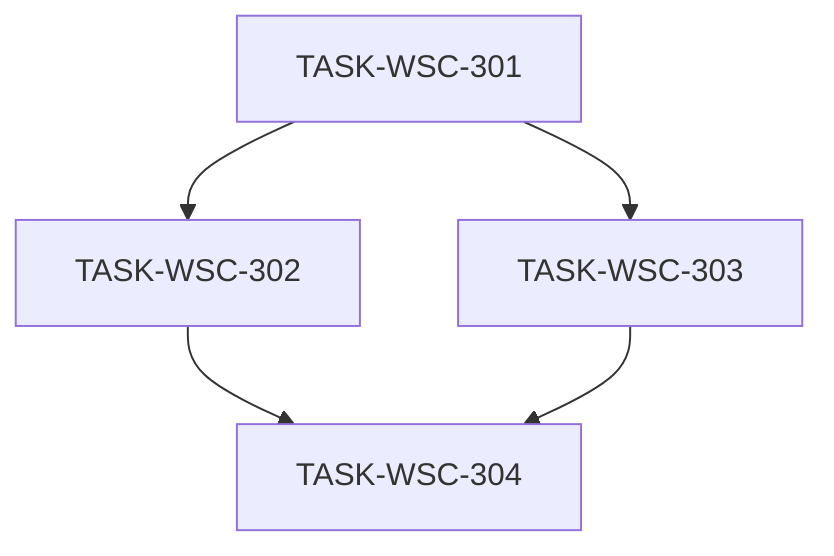

# 接入端工作台（WSC）V1.3 候选执行计划 — OpenAPI 与 v0729 导入

```yaml
planId: PLAN-WSC-4.0
status: DRAFT
planType: CANDIDATE
snapshotId: SNAP-WSC-004
sourcePrd: product/prd/wsc-v1.3-openapi-import.md
runId: RUN-WSC-004
basedOn: null
lineageFrom: null
previousRun: RUN-WSC-003
functionalBaseline:
  snapshotId: SNAP-WSC-002
  planId: PLAN-WSC-2.2
  contracts: wsc-contracts@2.0.0
uxBaseline:
  snapshotId: SNAP-WSC-003
  planId: PLAN-WSC-3.1
contractsTarget: wsc-contracts@2.1.0
templateAsset: product/assets/import/product-import-template-v0729.xlsx
round: 1
createdAt: 2026-08-02
taskCount: 4
waveCount: 3
requirementCount: 5
authorRoles: [planEditor]
actorInstance: plan-editor-wsc-004
```

> **候选声明**：本文件为 RUN-WSC-004 Round 1 候选计划（`planType: CANDIDATE` / `status: DRAFT`）。须经规划委员会独立评审；**不得**在未满足门禁前标为 `APPROVED`。需求权威仅引用 `SNAP-WSC-004`（APPROVED）。

## 0. 谱系与定位

| 概念 | 本计划取值 | 含义 |
|---|---|---|
| `planId` | PLAN-WSC-4.0 | V1.3 首版候选 |
| `round` | 1 | 本 planId 待进入的共识轮次（Round 1 独立评审） |
| `basedOn` / `lineageFrom` | null | 无同 Run 前序候选；功能/UX 基线见下 |
| 功能基线 | PLAN-WSC-2.2 / SNAP-WSC-002 / `wsc-contracts@2.0.0` | 导入四态、报告白名单、RBAC、上链等行为**不削弱** |
| UX 基线 | PLAN-WSC-3.1 / SNAP-WSC-003 | 令牌/壳层/主路径质感**不回退**；本版不重做令牌体系 |
| 契约目标 | `wsc-contracts@2.1.0` | 由 TASK-WSC-301 唯一升级 |
| 需求权威 | SNAP-WSC-004 | 修订 CAT-004/005/008；新增 API-001；继承 RBAC-001 |

本计划 **不** 改写 SNAP-WSC-001/002/003 正文结论；以增量任务承接 V1.3。

## 1. 范围、假设与硬门禁

### 1.1 范围

**In Scope（SNAP-WSC-004）**

| 面 | 内容 |
|---|---|
| 契约 | 升版 `wsc-contracts@2.1.0`：`typeSpecific.api` OpenAPI 形状、枚举增量、导入错误码、模板语义 |
| 后端 | 产品读写 `typeSpecific` 扩展；v0729 导入解析；旧模板文件级拒绝；模板下载对齐权威 xlsx |
| 前端编辑 | OpenAPI 结构面板 + 按类型扩展数据描述字段（REQ-CAT-005 / REQ-API-001） |
| 前端详情 | 只读 OpenAPI / 扩展数据描述（REQ-CAT-004 / REQ-API-001） |
| 前端导入 | 导入 UI/结果态适配 v0729 + 旧模板拒绝文案；Vitest + E2E 扩展（REQ-CAT-008） |

**Out of Scope / 默认 deny**

- 重做 UX 令牌体系或另起视觉主题（继承 PLAN-WSC-3.1）
- 引入独立异步导入 Job
- 数据登记 / 交易订单 / 连接器完整业务流
- 真实链共识、移动端 App、公开注册、多租户、支付
- 改写历史 SNAP 正文；本计划任务外修改 Run `state.yaml` / `events.jsonl`
- 强制复用 cds-dataspace-ui 组件或引入 Element Plus（见 §1.5）

### 1.2 假设（PO 已确认 / SNAP CLOSED）

| 项 | 口径 |
|---|---|
| `contractsTarget` | **`wsc-contracts@2.1.0`**（OQ-V13-003 CLOSED） |
| 旧模板 | **文件级拒绝** + 明确请求级错误码 `ERR_IMPORT_TEMPLATE_UNSUPPORTED`（OQ-V13-001 CLOSED） |
| OpenAPI 存贮 | **`swaggerFileContent`（原文）+ `endpoints[]`**（OQ-V13-002 CLOSED）；写以新结构为准 |
| 旧 `api.endpoint` | 读兼容；写优先新结构；可派生兼容字段（OQ-V13-007 CLOSED） |
| 模板无产品编码列 | 导入时服务端按 DEC-WSC-001 **自动生成**（OQ-V13-005 CLOSED） |
| 行业分类映射 | 按名称/完整路径匹配 L2/L3（延续 V1.1 ImportFieldMapper）；失败 → 行失败（OQ-V13-006 CLOSED） |
| 「不更新」 | 契约 2.1.0 扩枚举（建议 `NO_UPDATE`）（OQ-V13-008 CLOSED） |
| 接口定义解析失败 | 单元格非空且解析失败 → **行级失败**（OQ-V13-009 CLOSED） |
| 异步 Job | **不**引入（OQ-V13-004 CLOSED） |
| OTHER 专属字段 | 允许 `contentDescription` 及共用时间/地域（OQ-004 修订口径，SNAP 已收录） |
| UX 不回退 | SNAP-WSC-003 / PLAN-WSC-3.1 主路径质感与权限结构不回退；可在既有令牌内增量 OpenAPI 控件 |
| 导入四态 | 继承 PLAN-WSC-2.2 / 3.1：全成功 / 部分成功 / 全失败（行级）/ 文件级拒绝（含旧模板拒绝） |
| OQ-V11-003 | 目录维护 ≡ 数据产品（暂定；本 Run 不拆实体） |
| OQ-V11-004 | 部分成功 + 错误报告（不改变） |

### 1.3 技术栈硬门禁

| 层 | 固定选型 |
|---|---|
| 前端 | Vue 3 + TypeScript + Vite + pnpm + Pinia + Vue Router 4；**CSS-token-first**（PLAN-WSC-3.1 §2.2）；Ant Design Vue 仅经替换清单局部引入 |
| 后端 | Spring Boot **2.7.18** + Java 17；`backend/app/<service>/`（DEC-WSC-004/005） |
| 数据 | MySQL + Flyway（`sql/init` + `sql/migration`）；禁止向 `db/migration/` 追加新脚本 |
| 缓存 | Spring Data Redis |
| 契约 | 目标 `wsc-contracts@2.1.0`；client 生成至 `frontend/src/api/**` |
| 测试 | JUnit 5 / Testcontainers；Vitest；Playwright |

禁止：第二套 UI 框架习惯（含强制 Element Plus）；静默改契约版本号；业务任务私改 `contracts/**` / `frontend/src/api/**`（除 301）。

### 1.4 执行硬门禁

- 每任务：独立 developer → codeReviewer → tester；Orchestrator 按各任务 `writeSet` **字面路径** scope-check。
- developer ≠ codeReviewer ≠ tester。
- 并行任务写集必须互斥；禁止单 PR 混写多任务路径。
- `TASK-WSC-301` **唯一**拥有契约升级与 `frontend/src/api/**` 生成；302/303/304 只读消费。
- 权限不可用纯 CSS 替代（继承 PLAN-WSC-3.1 §1.4）：写入口结构不可达；三角色矩阵不回退。
- UX：本版增量控件须消费既有令牌；**禁止**另起全局色板。

### 1.5 OpenAPI 交互意图（非技术锁定）

参考 cds-dataspace-ui `ApiDocEditPanel` **交互意图**（SNAP §参考交互）：

| 区域 | 意图 |
|---|---|
| 侧栏 | 端点列表；method 标签；摘要/路径；增删；空态引导「新增或从 Swagger 导入」 |
| 编辑区 | 摘要、描述、method+path、参数表、响应表、可选 schema |
| Swagger 导入 | 粘贴/上传 → 回填 `endpoints[]` 且保留原文至 `swaggerFileContent` |
| 详情 | 同等信息只读 |

实现可选任意等价 UI（自研 DOM + 令牌优先）；**不**要求复用该仓库组件；**不**强制 Element Plus 或 AntDV 表格/抽屉。

### 1.6 UX 不回退（PLAN-WSC-3.1）

| 约束 | 口径 |
|---|---|
| 令牌 | 沿用 201 落地之 CSS 变量；302/303/304 仅 scoped 增量 |
| 壳层/主路径 | 登录、侧栏、总览、目录、维护、导入弹窗载体、详情/编辑布局层级不回退到「默认组件堆砌」 |
| 导入载体 | 仍为目录页弹窗（`ImportDialog`，宿主 browse） |
| 导入四态 UI | 见 §3.4；旧模板拒绝归入 **④ 文件级拒绝** |
| 报告白名单展示 | 行号、产品编码、原因码/文案；禁止扩大 PII 回显 |

## 2. 决策与开放问题

### 2.1 必须遵守的 DEC

| DEC | 本计划用法 |
|---|---|
| DEC-WSC-001 | 产品编码唯一与格式；导入自动生成须符合 |
| DEC-WSC-002 | 导入成功行与编辑提交均产生存证版本 |
| DEC-WSC-003 | 有挂载禁止删分类（继承，本版不改） |
| DEC-WSC-004 | Java 17 |
| DEC-WSC-005 | data-chain 栈 / sql 布局 |

本版无新增 DEC。

### 2.2 开放问题处理口径

| id | status | 本计划口径 |
|---|---|---|
| OQ-V13-001..009 | CLOSED（SNAP） | 按 §1.2 |
| OQ-004 | 修订收录于 SNAP | OTHER 允许 `contentDescription`；契约/实现按此落地 |
| OQ-001 | 保留 | Out of Scope |
| OQ-V11-003 | CLOSED（暂定） | 不拆实体 |
| OQ-V11-004 | 保留 | 部分成功不改变 |
| Blocking OQ | **无** | 可调度 |

## 3. 契约升级与唯一所有权（`wsc-contracts@2.1.0`）

### 3.1 契约冻结内容（TASK-WSC-301 一次性）

| 契约项 | 内容 |
|---|---|
| VERSION | `2.0.0` → **`2.1.0`** |
| `typeSpecific.api` | 冻结 SNAP 建议形状：`swaggerFileContent`、`endpoints[]`（含 method/path/summary/description/parameters/responses/optional schemas）、`fieldDescription`、`dataSample`、`timeRange`、`regionScope`；兼容旧 `endpoint` |
| `typeSpecific.dataset` | `timeRange`、`regionScope`、`dataScale`、`dataForm`、`fieldDescription`、`dataSample` |
| `typeSpecific.report` / `other` | `timeRange`、`regionScope`、`contentDescription`（OTHER 允许） |
| 枚举增量 | `UpdateFrequency` 增加 **`NO_UPDATE`（不更新）**；数据形态取值约束可落 schema/描述 |
| 导入错误码 | 新增请求级 **`ERR_IMPORT_TEMPLATE_UNSUPPORTED`**（旧模板/非 v0729 表头整文件拒绝）；纳入 `importSemantics.requestLevel` |
| 既有导入语义 | 请求级 vs 行级不回退：`ERR_IMPORT_FILE_TOO_LARGE`、`ERR_IMPORT_FORMAT_INVALID`；`ERR_IMPORT_ROW_INVALID` 仅报告内；报告白名单四字段；TTL≤24h；`ERR_IMPORT_REPORT_NOT_FOUND` |
| 导入模板 | GET 模板字节与权威 `product-import-template-v0729.xlsx` 列组一致（分组行 + 列名行） |
| Browse 分页 | 继续 `page`/`pageSize`/`total`（禁止本版改分页模型） |
| RBAC | 写路径仍仅 ADMIN+PROVIDER；USER 403（REQ-RBAC-001） |

### 3.2 旧模板判定（文件级拒绝）

| 项 | 口径 |
|---|---|
| 判定 | 表头**不是** v0729 权威列集（含 V1.1 最小列集等）→ 整单拒绝 |
| HTTP | 错误响应（非成功 envelope + 行级报告） |
| 错误码 | **`ERR_IMPORT_TEMPLATE_UNSUPPORTED`** |
| UI | §3.4 态 ④；**禁止**伪装为部分成功/行级全失败 |
| 与 FORMAT | 无法解析/非允许扩展名 → 仍用 `ERR_IMPORT_FORMAT_INVALID`；可解析但列集不匹配 → `ERR_IMPORT_TEMPLATE_UNSUPPORTED` |

### 3.3 OpenAPI 存贮形状（业务冻结）

```yaml
typeSpecific:
  api:
    swaggerFileContent: string      # 原始 OpenAPI/Swagger 文本；可空
    endpoints:                      # 解析或手工维护
      - id: string
        method: string              # GET|POST|PUT|DELETE|PATCH 等
        path: string
        summary: string
        description: string
        parameters:
          - name: string
            type: string
            required: boolean
            description: string
        responses:
          - code: string
            description: string
        responseBodySchema: string  # 可选
        requestBodySchema: string   # 可选
    fieldDescription: string
    dataSample: string
    timeRange: string
    regionScope: string
    endpoint: string                # 兼容旧字段；非唯一真源
```

| 场景 | 策略 |
|---|---|
| 读旧数据（仅有 `endpoint`） | 详情/编辑可读；`endpoints` 可为空；UI 不报错 |
| 写新数据 | 以 `swaggerFileContent` + `endpoints[]` 为准 |
| 兼容字段 | 允许派生 `endpoint`（如首端点 `method path`）供旧只读客户端 |
| 批量导入「接口定义」 | 写入原文 + 解析 endpoints；非空解析失败 → 行失败 |

### 3.4 导入结果四态（本计划内联；不回退）

| 态 | 判定 | UI 最低要求 |
|---|---|---|
| ① 全成功 | `successCount>0` 且 `failureCount=0` | 可关闭/可重传；无报告亦可 |
| ② 部分成功 | `successCount>0` 且 `failureCount>0` | **同时**两计数 + 错误报告入口 + 可关闭/重传 |
| ③ 全失败（行级） | `successCount=0` 且 `failureCount>0` | 失败计数 + 报告 + 可关闭/重传 |
| ④ 文件级拒绝 | 请求级错误 | 停留上传步或等价提示；映射 `ERR_IMPORT_FILE_TOO_LARGE` / `ERR_IMPORT_FORMAT_INVALID` / **`ERR_IMPORT_TEMPLATE_UNSUPPORTED`**；**不**伪装成行级结果态 |

### 3.5 唯一所有权矩阵

| 共享制品 | 唯一写任务 | 其他任务 |
|---|---|---|
| `contracts/**` | TASK-WSC-301 | 只读 |
| `frontend/src/api/**` | TASK-WSC-301 | 只读 |
| 后端导入解析 / 模板下载 | TASK-WSC-301 | 304 只读 API；不得改 backend import |
| 后端产品 typeSpecific 读写 | TASK-WSC-301 | 302/303 经 API 消费 |
| `frontend/.../editor/**` | TASK-WSC-302 | 303/304 deny |
| `frontend/.../detail/**` | TASK-WSC-303 | 302/304 deny |
| `frontend/.../import/**` | TASK-WSC-304 | 302/303 deny |
| `tests/e2e/**`（本轮扩展） | TASK-WSC-304 | 他任务 deny |
| `frontend/src/styles/**` / shell / router | **无写任务** | 全任务只读（UX 令牌不重开） |

### 3.6 增量迁移协议

- 若 `typeSpecific` 已为 JSON 列且可容纳新键：**优先无破坏性迁移**；仅当物理列/索引不足以承载时，301 可独占追加 `sql/migration/**` 一版，并在交付说明声明。
- 302/303/304 **denyModify** `**/sql/**`。
- 禁止向 `db/migration/` 追加新脚本。

### 3.7 导入安全与报告（继承不回退）

| 项 | 约定 |
|---|---|
| 原始上传 | 临时存储；处理结束后删除或 TTL≤24h |
| 报告字段白名单 | `rowNumber, productCode, reasonCode, reasonMessage` |
| 报告鉴权 | 已认证 + ADMIN/PROVIDER；USER/匿名 403 |
| 日志 | 不得记上传全文 / swagger 全文敏感泄漏 |

## 4. RBAC 可测矩阵（不回退）

| 角色 | 编辑 OpenAPI/数据描述 | 详情只读 OpenAPI/描述 | 批量导入 | 写 API |
|---|---|---|---|---|
| 管理员 | 可见/可写 | 可见 | 可见 | 200（合法） |
| 提供方 | 可见/可写 | 可见 | 可见 | 产品写/导入 200 |
| 普通用户 | 不可达 | 可见（只读） | 不可达 | 全部写 403；报告 GET 403 |

前端隐藏 ≠ 授权（REQ-RBAC-001）。

## 5. 任务包列表

> 任务 ID 自 `TASK-WSC-301` 起，避免与 V1.1 `101..107`、V1.2-UX `201..206` 冲突。字段全文内联。

### TASK-WSC-301 — 契约 2.1.0 + client + 后端 typeSpecific / v0729 导入

- `requirements`: `[REQ-CAT-008, REQ-CAT-004, REQ-CAT-005, REQ-API-001, REQ-RBAC-001]`（底座：契约与后端能力；前端面由 302..304 完成）
- `objective`: 冻结并发布 `wsc-contracts@2.1.0`（含 §3.1–§3.3）；生成/更新 `frontend/src/api/**`；后端产品读写扩展 `typeSpecific`（含 OpenAPI 形状与 dataset/report/other 扩展字段）；实现 v0729 列映射解析、无编码列自动生成、旧模板文件级拒绝（`ERR_IMPORT_TEMPLATE_UNSUPPORTED`）、模板下载对齐权威资产；导入四态/报告白名单/同步完成态不回退；成功行可检索并上链
- `dependsOn`: `[]`
- `readSet`:
  - `product/requirements/SNAP-WSC-004.md`
  - `product/prd/wsc-v1.3-openapi-import.md`
  - `product/assets/import/product-import-template-v0729.xlsx`（及 strings 对照）
  - `planning/approved/PLAN-WSC-2.2.md`（导入语义/四态）
  - `planning/approved/PLAN-WSC-3.1.md`（UX 不回退约束，只读）
  - 既有 `contracts/**`（对照升版）；既有 `backend/app/*/src/main/java/**/catalog/**`
- `writeSet`（字面路径，纳入 scope-check）:
  - `contracts/**`（含 `VERSION` → `2.1.0`、`openapi/**`、`errors/codes.yaml`、相关 ui/state 文档若需同步错误码）
  - `frontend/src/api/**`
  - `backend/app/*/src/main/java/**/catalog/import/**`
  - `backend/app/*/src/main/java/**/catalog/editor/**`
  - `backend/app/*/src/main/java/**/catalog/detail/**`（若详情 DTO/组装与 typeSpecific 同包；仅后端只读组装所需）
  - `backend/app/*/src/main/resources/**`（模板静态资源镜像、`application*.yml` 仅导入相关必要项）
  - `backend/app/*/src/main/resources/sql/migration/**`（**仅当** §3.6 证明必需；否则不得无故新增）
  - `backend/app/*/src/test/**`（与上述包对称的导入/编辑/契约集成测试）
  - `tests/fixtures/import/**`（后端/契约对齐所需的 v0729 与旧模板负例 fixture；前端专属 UI fixture 可留 304 增补）
  - 前端根构建配置（**仅当** client 生成所必需）：`frontend/package.json`、`frontend/pnpm-lock.yaml`（禁止借机大升级）
- `denyModify`:
  - `frontend/src/features/**`（前端面归 302/303/304）
  - `frontend/src/styles/**`；`frontend/src/theme/**`；`frontend/src/layouts/**`；`frontend/src/features/shell/**`
  - `frontend/src/router/**`
  - `backend/app/*/src/main/java/**/catalog/browse/**`
  - `backend/app/*/src/main/java/**/catalog/admin/**`
  - `backend/app/*/src/main/java/**/catalog/maintenance/**`
  - `backend/app/*/src/main/java/**/overview/**`
  - `backend/app/*/src/main/java/**/chain/**`（经端口只读调用存证；不得改 chain 实现）
  - `tests/e2e/**`（归 304）
  - `product/**`；`planning/**`；`ai/rules/**`；`ai/runs/**/state.yaml`；`ai/runs/**/events.jsonl`
  - 向 `**/db/migration/**` 追加新脚本；密钥类配置
- `allowModify`: 仅 `writeSet`；导入成功路径通过 DI **只读调用**既有产品写入/存证端口（不得修改 chain 包实现）
- `acceptance`:
  - `contracts/VERSION` = `2.1.0`；OpenAPI/错误码含 §3.1 全部增量；`ERR_IMPORT_TEMPLATE_UNSUPPORTED` 为请求级
  - client 生成后前端可 typecheck 消费新 DTO（允许 302 前编译警告由 302 消化 UI，但 **api 包自身**须完整）
  - 产品写 API：提交 `swaggerFileContent`+`endpoints[]` 可持久化并回读；旧仅 `endpoint` 数据可读不报错
  - 扩展字段：dataset/report/other 按 SNAP 映射可读写
  - `UpdateFrequency` 含「不更新」枚举值
  - GET 模板与权威 v0729 列组一致
  - 旧模板上传 → HTTP 错误 + `ERR_IMPORT_TEMPLATE_UNSUPPORTED`；无部分写入
  - v0729：成功行自动生成编码（DEC-WSC-001）；接口定义非空解析失败 → 报告内行失败；异型非空列建议行失败（与 SNAP 建议一致）
  - 四态后端语义、报告白名单、RBAC、上链不回退
  - 同步完成态；不引入异步 Job
- `testScope`:
  - 契约 lint / OpenAPI 校验；错误码表含新码且列入 requestLevel
  - 后端集成：v0729 full-success / partial-success；旧模板负例 → `ERR_IMPORT_TEMPLATE_UNSUPPORTED`；oversize / format-invalid 回归
  - 接口定义坏文本（非空）→ 行失败原因可读
  - 产品写读 round-trip：endpoints + swagger 原文；旧 endpoint 兼容读
  - USER 导入/产品写 403；报告 GET 403
  - 无编码列导入后目录可检索 + 存证版本产生（抽样）
- `riskTags`: `[contracts-bump, handles-pii, import-parser]`

### TASK-WSC-302 — 前端编辑：OpenAPI 面板 + 扩展表单字段

- `requirements`: `[REQ-CAT-005, REQ-API-001, REQ-RBAC-001, REQ-UX-007(不回退)]`
- `objective`: 在产品编辑页按类型动态展示扩展数据描述区；数据接口类型提供 OpenAPI 结构编辑（侧栏端点列表 + 端点详情 + Swagger 导入回填，意图对齐 §1.5）；提交写入 2.1.0 `typeSpecific`；UX 令牌/表单层级不回退 PLAN-WSC-3.1
- `dependsOn`: `[TASK-WSC-301]`
- `readSet`:
  - `frontend/src/api/**`（只读）
  - `contracts/**`（只读对照）
  - SNAP-WSC-004；本计划 §1.5 / §3.3
  - `frontend/src/styles/**`（令牌只读）
  - 既有 `frontend/src/features/catalog/editor/**`
- `writeSet`:
  - `frontend/src/features/catalog/editor/**`
  - 对应 `*.spec.ts` / `__tests__/**`
- `denyModify`:
  - `contracts/**`；`frontend/src/api/**`；`backend/**`；`**/sql/**`
  - `frontend/src/features/catalog/detail/**`（归 303）
  - `frontend/src/features/catalog/import/**`（归 304）
  - `frontend/src/features/catalog/browse/**`；`frontend/src/features/catalog/admin/**`；`frontend/src/features/catalog/maintenance/**`
  - `frontend/src/features/shell/**`；`frontend/src/layouts/**`；`frontend/src/styles/**`；`frontend/src/theme/**`
  - `frontend/src/router/**`；`frontend/src/features/overview/**`；`frontend/src/features/chain/**`；`frontend/src/features/auth/**`
  - `tests/e2e/**`；`product/**`；`planning/**`
- `acceptance`:
  - 切换产品类型动态切换扩展区（API / DATASET / REPORT / OTHER）
  - API：可增删端点；编辑参数/响应/可选 schema；Swagger 导入回填 endpoints 且保留原文；保存后再打开不丢失
  - 提交体符合 2.1.0；上链版本规则不回退（DEC-WSC-002）
  - 旧仅 `endpoint` 产品打开编辑不崩溃；可迁移填写新结构
  - 未填名称/编码（手工路径）阻止提交；取消不保存
  - 无写权限角色结构不可达编辑（非纯 CSS）；PROVIDER/ADMIN 可达
  - 视觉：消费既有令牌；主次按钮/分组卡片层级不回退 REQ-UX-007；**不**强制 Element Plus
- `testScope`:
  - Vitest：端点增删；Swagger 文本导入回填；类型切换字段显隐；提交 payload 形状抽样
  - 前端 typecheck / 相关 editor 单测回归
  - 手工或单测：USER 无编辑入口
- `riskTags`: `[frontend-openapi-editor]`

### TASK-WSC-303 — 前端详情：只读 OpenAPI / 扩展数据描述

- `requirements`: `[REQ-CAT-004, REQ-API-001, REQ-RBAC-001, REQ-UX-007(不回退)]`
- `objective`: 产品详情在既有分组之上，按类型只读展示扩展数据描述；数据接口只读展示 endpoints + 文档信息；兼容旧 `endpoint`；有写权限时保留编辑入口
- `dependsOn`: `[TASK-WSC-301]`
- `readSet`:
  - `frontend/src/api/**`（只读）
  - SNAP-WSC-004；本计划 §3.3
  - `frontend/src/styles/**`（只读）
  - 既有 `frontend/src/features/catalog/detail/**`
- `writeSet`:
  - `frontend/src/features/catalog/detail/**`
  - 对应 `*.spec.ts` / `__tests__/**`
- `denyModify`:
  - `contracts/**`；`frontend/src/api/**`；`backend/**`；`**/sql/**`
  - `frontend/src/features/catalog/editor/**`（归 302）
  - `frontend/src/features/catalog/import/**`（归 304）
  - `frontend/src/features/catalog/browse/**`；`frontend/src/features/catalog/admin/**`；`frontend/src/features/catalog/maintenance/**`
  - `frontend/src/features/shell/**`；`frontend/src/layouts/**`；`frontend/src/styles/**`；`frontend/src/theme/**`
  - `frontend/src/router/**`；`frontend/src/features/overview/**`；`frontend/src/features/chain/**`；`frontend/src/features/auth/**`
  - `tests/e2e/**`；`product/**`；`planning/**`
- `acceptance`:
  - 既有基础信息/供应商/产权/标签/简介等分组保留
  - API：只读 endpoints（method/path/summary 等）与可理解文档信息；无写控件
  - DATASET/REPORT/OTHER：按 SNAP 展示扩展字段（规模/形态/字段描述/样例/内容描述/时间地域等）
  - 旧仅 `endpoint` 可读不报错
  - ADMIN/PROVIDER 显示编辑入口；USER 无编辑入口（结构不可达）
  - 视觉不回退详情分组卡片质感（REQ-UX-007）
- `testScope`:
  - Vitest：各产品类型只读字段渲染抽样；旧 endpoint 兼容；编辑入口角色可见性
  - typecheck；detail 既有单测回归
- `riskTags`: `[]`

### TASK-WSC-304 — 导入 UI/结果 + Vitest + E2E 扩展

- `requirements`: `[REQ-CAT-008, REQ-API-001(导入路径接口定义), REQ-RBAC-001]`
- `objective`: 目录页导入弹窗适配 v0729 模板下载/上传文案与结果态；文件级拒绝（含旧模板）可区分；四态与报告白名单不回退；补充 Vitest 与 Playwright E2E，覆盖 OpenAPI 编辑/详情只读与 v0729 导入主路径
- `dependsOn`: `[TASK-WSC-301, TASK-WSC-302, TASK-WSC-303]`
- `readSet`:
  - `frontend/src/api/**`（只读）
  - 本计划 §3.2 / §3.4 / §4；SNAP-WSC-004
  - `frontend/src/features/catalog/editor/**`、`detail/**`（只读，供 E2E 选择器稳定对照）
  - `tests/fixtures/import/**`（301 已有 + 本任务可增补）
  - 既有 `tests/e2e/specs/p0-wsc-v1.1.spec.ts`（扩展基线）
- `writeSet`:
  - `frontend/src/features/catalog/import/**`
  - 对应 `*.spec.ts` / `__tests__/**`
  - `tests/fixtures/import/**`（UI/E2E 所需增补：v0729 样例、legacy-template 负例等）
  - `tests/e2e/specs/**`（新建或扩展 V1.3 规格，须在报告声明文件名）
  - `tests/e2e/playwright.config.ts`（仅当报告目录调整所必需）
  - `tests/e2e/reports/p0-wsc-v1.3/**`（或报告声明的等价落点）
- `denyModify`:
  - `contracts/**`；`frontend/src/api/**`；`backend/**`；`**/sql/**`
  - `frontend/src/features/catalog/editor/**`；`frontend/src/features/catalog/detail/**`
  - `frontend/src/features/catalog/browse/**`（导入入口宿主样式默认不改；若必须改入口文案 → 串行 HOTFIX 扩 browse，禁止本任务散文扩写）
  - `frontend/src/features/catalog/admin/**`；`frontend/src/features/catalog/maintenance/**`
  - `frontend/src/styles/**`；`frontend/src/theme/**`；`frontend/src/layouts/**`；`frontend/src/features/shell/**`
  - `frontend/src/router/**`；`product/**`；`planning/**`
- `acceptance`:
  - 模板下载为 v0729；上传区/结果区中文反馈清晰
  - §3.4 四态均可区分；旧模板 → 态 ④ + `ERR_IMPORT_TEMPLATE_UNSUPPORTED` 文案可映射
  - 部分成功：两计数 + 报告入口；报告展示白名单不扩大
  - USER 无导入入口；ADMIN/PROVIDER 可达；关闭弹窗回到目录浏览
  - E2E：v0729 导入主路径 + OpenAPI 编辑保存回读 + 详情只读可见 + 三角色写入口矩阵不回退
  - UX：导入弹窗质感不回退 PLAN-WSC-3.1（截图 07 级别）
- `testScope`:
  - Vitest：四态 UI 分支（含 template-unsupported）；报告字段白名单负例；权限隐藏
  - Playwright（独立 tester）：
    | # | 场景 | 要点 |
    |---|---|---|
    | 1 | V1.1/V1.2 主路径回归抽样 | 登录/目录/详情/编辑/上链不回退 |
    | 2 | v0729 导入 | 成功或 partial-success；计数 + 报告 |
    | 3 | 旧模板拒绝 | 请求级错误；非行级结果态 |
    | 4 | OpenAPI 编辑 | 增端点或 Swagger 回填 → 保存 → 再开不丢 |
    | 5 | 详情只读 | API 产品可见 endpoints/文档信息 |
    | 6 | 三角色矩阵 | ADMIN/PROVIDER/USER 写入口结构可达性 |
  - 证据 id 建议：`TESTRUN-WSC-E2E-V13`；命令与报告路径写入测试报告
  - 失败 → 不得标发布就绪
- `riskTags`: `[release-gate, handles-pii]`

## 6. 波次 / DAG



| 波次 | 任务 | 启动条件 | 同波并行写集校验 |
|---|---|---|---|
| W1 | 301 | SNAP-WSC-004 APPROVED + 本计划 APPROVED 后派发 | 单任务；独占 contracts / api / 后端 import+产品 typeSpecific |
| W2 | **302 ∥ 303** | 301 VERIFIED | `catalog/editor/**` ∥ `catalog/detail/**` **无交集** |
| W3 | 304 | 301+302+303 均 VERIFIED | 单任务；import UI + fixtures + E2E；不得写 editor/detail/contracts |

**并行写集互斥声明：**

| 并行对 | 条件 | writeSet 核心 | 合入约束 |
|---|---|---|---|
| **302 ∥ 303** | 同属 W2；均 dependsOn 仅 301 | `editor/**` ∥ `detail/**` | **写集无交集**；禁止单 PR 混写；建议先完成者先合入 |
| 302 ∥ 304 | **禁止**（304 dependsOn 302） | — | 串行 |
| 303 ∥ 304 | **禁止**（304 dependsOn 303） | — | 串行 |
| 301 与任何后继 | **禁止并行** | contracts/api/backend | 301 VERIFIED 前不得启动 302/303 |

DAG **无环**；W2 唯一并行对写集互斥已声明。

### 6.1 每任务审查/测试门禁

1. `developer` 仅改 `writeSet`，提交 REQ→diff→测试声明。
2. 独立 `codeReviewer` 只读审：对照 SNAP-WSC-004 + 本计划 §1/§3；P0/P1 未关闭则 `REQUEST_CHANGES`。
3. 独立 `tester` 执行该任务 `testScope`；失败不得标通过。
4. Orchestrator 仅在字面 scope-check、review、tests、交付物齐全后标 `VERIFIED`。

## 7. REQ 映射

| REQ | priority | change | 主任务 | 备注 |
|---|---|---|---|---|
| REQ-CAT-008 | P0 | 修订 | **301**（解析/模板/错误码）+ **304**（UI/E2E） | 旧模板 → `ERR_IMPORT_TEMPLATE_UNSUPPORTED` |
| REQ-CAT-004 | P0 | 修订 | **301**（DTO/后端）+ **303**（详情 UI） | 只读 OpenAPI/扩展描述 |
| REQ-CAT-005 | P0 | 修订 | **301**（持久化）+ **302**（编辑 UI） | 写 swagger+endpoints；UX 不回退 |
| REQ-API-001 | P0 | 新增 | **301**（形状/导入解析）+ **302**（编辑）+ **303**（只读）+ **304**（导入列/E2E） | 交互意图 §1.5 |
| REQ-RBAC-001 | P0 | 继承 | **301..304** 各写路径回归 | 矩阵 §4；前端隐藏≠授权 |

覆盖：本快照修订/新增/继承的 5 条 P0 REQ 齐全。  
行为继承（不削弱、不单列开发）：SHELL/OVW/CAT-001..003/006/007/CHAIN 及 REQ-UX-001..011 — 由 304 E2E 回归抽样 + 各任务 deny 越界保证。

## 8. 风险与回滚

| 风险 | 缓解 | 回滚 |
|---|---|---|
| 契约 2.1.0 破坏旧客户端 | 旧 `endpoint` 读兼容；版本钉死 301；后继只读 contracts | 拒合入；回退 VERSION/DTO |
| 旧模板误判/漏判 | 301 明确表头校验；负例 fixture；304 E2E 态 ④ | 热修判定；停用导入入口 |
| OpenAPI 解析不稳定 | 非空失败 → 行失败；原文必存；编辑侧可手工修 endpoints | 放宽须新 ISSUE/PO |
| 行业分类映射失败率高 | 延续 V1.1 名称/路径匹配；失败行可读原因 | 种子分类对齐模板门类名 |
| UX 回退 / 第二套控件 | CSS-token-first；禁止强制 Element Plus；CR 对照 3.1 | 回退 302/303/304 UI |
| 302∥303 合入冲突 | 写集互斥；禁止混 PR | 拆 PR 重合 |
| 报告/导入 PII | 白名单 + 鉴权；riskTags | 收紧展示；吊销 reportId |
| 权限纯 CSS 弱化 | §1.4 + E2E 矩阵 | 恢复条件渲染 |
| 范围蔓延到异步 Job / 令牌重做 | Out of Scope；deny | 删越界代码 |

## 9. 发布门禁（V1.3 / RUN-WSC-004）

1. SNAP-WSC-004 下全部 **P0** REQ（CAT-008/004/005、API-001、RBAC-001）对应任务 **VERIFIED**。
2. `wsc-contracts@2.1.0` 无未决冲突；`ERR_IMPORT_TEMPLATE_UNSUPPORTED` 已冻结且可测。
3. 旧模板文件级拒绝与 v0729 主路径均有自动化证据；导入四态可区分；报告白名单不回退。
4. OpenAPI：编辑保存回读 + 详情只读 + 导入「接口定义」路径均通过。
5. UX：相对 PLAN-WSC-3.1 主路径质感无 P0 回退；令牌体系未重做。
6. §6 / 304 E2E 通过（独立 tester；`TESTRUN-WSC-E2E-V13` 或报告声明 id）；**P0 缺陷为 0**。
7. developer ≠ codeReviewer ≠ tester 证据齐全；各任务 writeSet 字面 scope-check 通过。
8. 本计划经规划委员会必需角色独立 `APPROVE` 后，由 Orchestrator 发布至 `planning/approved/`。
9. maintainer 人类发布批准（写入 `ai/runs/RUN-WSC-004/approvals.yaml`）。

## 10. 完成检查（候选计划）

- [x] 引用 SNAP-WSC-004 / RUN-WSC-004；`planId: PLAN-WSC-4.0`；`status: DRAFT`；`planType: CANDIDATE`；`round: 1`
- [x] 范围/假设含 contractsTarget 2.1.0、旧模板文件级拒绝、OpenAPI 存贮形状、UX 不回退 3.1
- [x] 任务 301..304 全文内联 dependsOn、writeSet、denyModify、acceptance、testScope、riskTags
- [x] DAG：W1=301 → W2=302∥303 → W3=304；写集互斥已声明
- [x] REQ 映射：CAT-008/004/005、API-001、RBAC-001
- [x] 发布门禁；错误码 `ERR_IMPORT_TEMPLATE_UNSUPPORTED`
- [x] ApiDocEditPanel 交互意图参考；不强制 Element Plus
- [ ] Round 1 规划委员会独立评审 / APPROVE（**尚未发生**；本文件不伪造）
