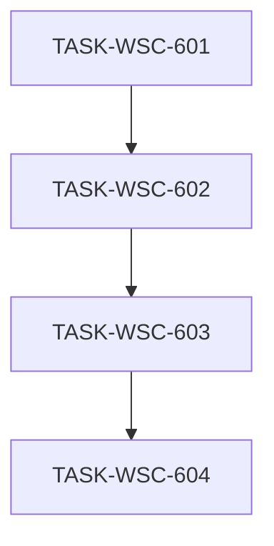

# 接入端工作台（WSC）V1.4 候选执行计划 — 座序图 / 用户管理 / 我的数据产品

```yaml
planId: PLAN-WSC-5.1
status: DRAFT
planType: CANDIDATE
snapshotId: SNAP-WSC-005
sourcePrd: product/prd/wsc-v1.4-seatmap-users-mine.md
runId: RUN-WSC-008
basedOn: PLAN-WSC-4.1
lineageFrom: PLAN-WSC-4.1
previousRun: RUN-WSC-004
functionalBaseline:
  snapshotId: SNAP-WSC-004
  planId: PLAN-WSC-4.1
  contracts: wsc-contracts@2.1.0
uxBaseline:
  snapshotId: SNAP-WSC-003
  planId: PLAN-WSC-3.1
contractsTarget: wsc-contracts@2.2.0
round: 1
createdAt: 2026-08-05
taskCount: 4
waveCount: 4
requirementCount: 6
authorRoles: [planEditor]
actorInstance: plan-editor-wsc-008-r1
```

> **候选声明**：本文件为 `PLAN-WSC-5.1` **Round 1** 候选稿（`planType: CANDIDATE` / `status: DRAFT`）。须经规划委员会**隔离**独立评审后方可进入 `APPROVED`；本 planEditor 实例**不**伪造任何委员会批准，**不**自行关闭任何 ISSUE，**不**将 `status` 标为 `APPROVED`。  
> **需求权威**：`snapshotId: SNAP-WSC-005`。当前 SNAP 状态为 **`IN_REVIEW`**（先前主会话旁路伪造 APPROVED 已作废：`approvalVoidedAt`）。派发/发布门禁须：**快照正式批准**，或委员会在对本 planId 的评审中**书面确认范围等同 SNAP 正文**；在此之前不得将任务标为可合入生产的 VERIFIED 发布就绪。  
> **协议修复**：主会话曾旁路落地部分 `frontend/**` / `backend/**` / `contracts/**` 改动。本计划以 SNAP 为验收权威；已存在改动须纳入对应任务 `acceptance` / `testScope` **对账验收**，**不得**假装从空树开始。

## 0. 协议修复与预落地对账

### 0.1 谱系与定位

| 概念 | 本计划取值 | 含义 |
|---|---|---|
| `planId` | PLAN-WSC-5.1 | V1.4 候选执行计划 |
| `round` | 1 | **本 planId** 待进入的共识轮次（即将独立评审 Round 1） |
| `basedOn` / `lineageFrom` | PLAN-WSC-4.1 | 相对 V1.3 批准谱系增量；**不**抄写 V1.3 业务内容 |
| 功能基线 | PLAN-WSC-4.1 / SNAP-WSC-004 / `wsc-contracts@2.1.0` | OpenAPI 导入、四态、报告白名单、上链等**不削弱** |
| UX 基线 | PLAN-WSC-3.1 / SNAP-WSC-003 | 令牌/壳层/主路径质感**不回退** |
| 契约目标 | `wsc-contracts@2.2.0` | 由 TASK-WSC-601 **唯一**拥有升版与 `frontend/src/api/**` 生成 |
| 需求权威 | SNAP-WSC-005 | 修订 SHELL/RBAC；新增 CAT-009/USER-001/CAT-010；继承 CAT-001 |
| 仓布局 | `ai/rules/project/repos.yaml` | 前端 `frontend/`（data-chain-static）；后端 `backend/`（data-chain-backend）；契约在控制面 `contracts/` |

本计划 **不** 改写 SNAP-WSC-001..004 正文结论；以增量任务承接 V1.4。

### 0.2 预落地对账（强制）

> 下列路径在计划起草时**可能已存在**于工作树（主会话旁路）。各任务 developer **必须**先 diff 对账：保留符合 SNAP 的实现并补齐缺口；偏离 SNAP 的改动须修正或开 ISSUE。验收以 SNAP + 本计划 acceptance 为准，**不以「代码已在」代替测试证据**。

| 波次/任务 | 预落地迹象（非穷尽；以工作树为准） | 对账要求 |
|---|---|---|
| **601** | `contracts/VERSION`=`2.2.0`；`contracts/rbac/matrix.yaml`；`openapi` 含 `/admin/users`、`/catalog/l2-distribution`、`mine`；`req-coverage.md` V1.4 行 | 核对与 SNAP 一致；补齐缺失错误码/描述；**重新生成** `frontend/src/api/**` 并保证可 typecheck；不得静默再升版 |
| **602** | `V6__create_sys_user.sql`；`SysUserEntity` / `UserAccountService` / `AdminUserController`；`AuthController` 登录 hash + `POST /session/role`→410；`UsersAdminPage.vue`；`authStore` 禁切角色 | 验收真登录、ADMIN CRUD、软删、三角色种子；壳层须**结构不可达**自由切角色（非仅 throw）；PROVIDER/USER 用户管理 403 |
| **603** | `RbacMatrix` 产品写/导入仅 PROVIDER；`WriteAuthorizationInterceptor`；browse `mine` + `create_by` 隔离；`/my-products` 复用 `CatalogBrowsePage`；`useCanWrite`；公共目录去写入口 | 公共目录无增改导；我的产品仅 PROVIDER + 本人列表；ADMIN 保留分类/目录维护且**无**产品增改导；导入宿主迁至我的产品 |
| **604** | `GET /catalog/l2-distribution`；`CirculationSeatMap.vue`（Top5、比例点阵、hover）；公共目录挂载、我的产品不挂 | L2 Top5 按产品数；比例座位；hover 熄灭其它；**真实** `totalProducts`；仅公共目录 |

**包结构约束（后端）**：实现须符合 `backend/CLAUDE.md` / `RULE-PROJECT-LAYOUT` **按类型分层**（`controller|service|repository|entity|model|config|common`）。若预落地仍含业务域顶层包残留，纳入对应任务写集内收敛；**禁止**新建域顶层包。

**控制面禁止**：任何实现任务 **denyModify** `ai/runs/**/state.yaml`、`ai/runs/**/events.jsonl`（除 Orchestrator 说明性引用）；禁止伪造 REV-\* / 全员 APPROVE。

### 0.3 已知缺口提示（对账时优先核验）

| 缺口 | 归属任务 | 说明 |
|---|---|---|
| `RoleSwitcher` 仍可能渲染可选菜单 | 602 | SNAP「下线自由切角色」→ 登录后角色只读展示；禁止可点切换 UI |
| `ERR_ROLE_SWITCH_DISABLED` 等码可能未入 `codes.yaml` | 601 | 契约与 OpenAPI/后端码表硬同步 |
| 我的产品增改导路由是否仍挂在 `/catalog/products/*` | 603 | 入口须从「我的数据产品」可达；公共目录结构不可达 |
| E2E / Vitest 覆盖不足 | 各任务 testScope + 建议 604 或独立 hotfix 补回归 | 不得以手工「看起来行」代替 P0 自动化 |
| SNAP `IN_REVIEW` | 门禁 | 见文首候选声明 |

## 1. 范围、假设与硬门禁

### 1.1 范围

**In Scope（SNAP-WSC-005 / PO 已锁定）**

| 面 | 内容 |
|---|---|
| 契约 | 升版 `wsc-contracts@2.2.0`：RBAC 矩阵（产品写仅 PROVIDER；用户管理；我的产品）；`mine` 查询；`l2-distribution`；用户 CRUD；角色切换禁用语义 |
| 用户 | 持久化 `sys_user`；密码 hash 真登录；ADMIN CRUD（创建/改角色/软删）；下线自由切角色 |
| 我的数据产品 | 仅 PROVIDER；布局同目录但**无**座序图；承载增改导；列表 `create_by=当前用户`；公共目录取消增改导 |
| 管理员保留 | 分类维护 + 目录维护；**无**产品增改导 |
| 座序图 | AI-SEP Vue 数据目录；L2 Top5；比例座位；hover 熄灭其它域；真实产品总数；仅公共目录 |

**Out of Scope / 默认 deny**

- Downloads React 仓改造；座序图点击联动 L2 筛选
- OAuth / 密码重置邮件 / 多租户 / 公开注册
- 重做 UX 令牌体系或另起视觉主题
- 引入独立异步导入 Job；削弱 V1.3 导入四态/报告白名单
- 改写历史 SNAP 正文；实现任务写 Run `state.yaml` / `events.jsonl`
- 强制 Element Plus / 第二套 UI 框架习惯

### 1.2 假设（PO 已确认 / SNAP 收录）

| 项 | 口径 |
|---|---|
| `contractsTarget` | **`wsc-contracts@2.2.0`** |
| 前端座序图 | **AI-SEP Vue**（自 Downloads 视觉意图移植，非改 Downloads 仓） |
| 用户存贮 | **持久化 `sys_user`**（非纯演示内存账号） |
| 导入入口 | **迁至「我的数据产品」**；仅 PROVIDER |
| ADMIN 保留 | 分类维护 + 目录维护；产品写 API **403** |
| 角色绑定 | 登录身份绑定角色；**禁止**任意会话角色切换 |
| `create_by` | 我的产品列表与编辑隔离均以当前 `userId` 为准 |
| UX 不回退 | SNAP-WSC-003 / PLAN-WSC-3.1 主路径质感与权限「隐藏≠授权」不回退 |
| 导入四态 / OpenAPI | 继承 PLAN-WSC-4.1；本版不重开 2.1.0 契约形状（除非 601 发现与 2.2.0 冲突的文档漂移） |
| Blocking OQ | **无**（范围已 PO 锁定）；调度前提见 SNAP 门禁说明 |

### 1.3 技术栈硬门禁

| 层 | 固定选型 |
|---|---|
| 前端 | Vue 3 + TypeScript + Vite + pnpm + Pinia + Vue Router 4；**CSS-token-first**（PLAN-WSC-3.1）；Ant Design Vue 仅经既有替换清单 |
| 后端 | Spring Boot **2.7.18** + Java 17；`backend/app/data-chain-service/`；包按类型分层（DEC-WSC-004/005 + CLAUDE.md） |
| 数据 | MySQL + Flyway（`sql/init` + `sql/migration`）；禁止向 `db/migration/` 追加新脚本 |
| 缓存 | Spring Data Redis |
| 契约 | 目标 `wsc-contracts@2.2.0`；client 生成至 `frontend/src/api/**` |
| 测试 | JUnit 5 / Testcontainers；Vitest；Playwright |
| 多仓 | 按 `repos.yaml`：worker 写 `frontend` / `backend`；契约在控制面；state 仅控制面 Orchestrator |

禁止：静默改契约版本号；业务任务私改 `contracts/**` / `frontend/src/api/**`（除 601）；纯 CSS 替代鉴权。

### 1.4 执行硬门禁

- 每任务：独立 developer → codeReviewer → tester；Orchestrator 按各任务 `writeSet` **字面路径** scope-check。
- developer ≠ codeReviewer ≠ tester。
- 并行任务写集必须互斥；禁止单 PR 混写多任务路径。本计划波次为 **串行四波**（见 §6），无同波并行对。
- `TASK-WSC-601` **唯一**拥有契约升级与 `frontend/src/api/**` 生成；602..604 只读消费。
- 权限不可用纯 CSS 替代：写入口结构不可达；三角色矩阵对齐 `contracts/rbac/matrix.yaml`。
- UX：增量控件消费既有令牌；**禁止**另起全局色板。
- 预落地 diff **必须**进入该任务 review 证据；不得删除对账节要求的负例测试。

### 1.5 UX 不回退（PLAN-WSC-3.1）

| 约束 | 口径 |
|---|---|
| 令牌 | 沿用既有 CSS 变量；本版仅 scoped 增量 |
| 壳层/主路径 | 登录、侧栏、总览、目录、维护、详情/编辑布局层级不回退 |
| 座序图 | 作为目录页内一块流通链可视化；不引入第二套仪表盘视觉语言 |
| 导入载体 | 迁至我的产品后，四态 UI / 报告白名单不回退 PLAN-WSC-4.1 |
| 报告白名单 | `rowNumber, productCode, reasonCode, reasonMessage`；禁止扩大 PII |

## 2. 决策与开放问题

### 2.1 必须遵守的 DEC

| DEC | 本计划用法 |
|---|---|
| DEC-WSC-001 | 产品编码唯一与格式（导入/新建不削弱） |
| DEC-WSC-002 | 成功写入产生存证版本（不削弱） |
| DEC-WSC-003 | 有挂载禁止删分类（继承） |
| DEC-WSC-004 | Java 17 |
| DEC-WSC-005 | data-chain 栈 / sql 布局 / 按类型分层 |

本版无新增 DEC；RBAC 重划以 SNAP + `matrix.yaml` 2.2.0 为准。

### 2.2 开放问题处理口径

| id | status | 本计划口径 |
|---|---|---|
| PO 座序图前端仓 | CLOSED | AI-SEP Vue |
| PO 用户持久化 | CLOSED | `sys_user` |
| PO 导入迁入我的产品 | CLOSED | PROVIDER only |
| PO ADMIN 保留项 | CLOSED | 分类 + 目录维护 |
| OQ-001 等历史 | 保留 / Out of Scope | 本版不展开 |
| Blocking OQ | **无** | 可调度（前提：SNAP 门禁满足） |

## 3. 契约升级与唯一所有权（`wsc-contracts@2.2.0`）

### 3.1 契约冻结内容（TASK-WSC-601 一次性）

| 契约项 | 内容 |
|---|---|
| VERSION | `2.1.0` → **`2.2.0`**（若树中已是 2.2.0：对账确认内容完整，禁止再 bump） |
| RBAC | `contracts/rbac/matrix.yaml`：ADMIN 产品写/导入 **hidden + API 403**；PROVIDER 产品写/导入 + `myProductsUI`；USER 只读；`userManage*` 仅 ADMIN；注释含「登录绑定角色 / create_by 隔离 / 公共目录无写入口」 |
| Browse | `GET /catalog/products` 支持 `mine=true` → 仅 `create_by=当前用户` |
| 座序图 API | `GET /catalog/l2-distribution`：`totalProducts` + `items[]`（code/name/count），按产品数降序（消费方可取 Top5） |
| 用户管理 | `/admin/users` CRUD（列表/创建/改角色等/软删）；非 ADMIN 403 |
| 会话 | 登录校验持久化用户；`POST /auth/session/role` **禁用**（建议 410 + 稳定错误码，如 `ERR_ROLE_SWITCH_DISABLED`）；禁止任意切角色 |
| 错误码 | 新增/同步：角色切换禁用、用户管理相关码（若有）；**硬同步** `errors/codes.yaml` + OpenAPI examples |
| 既有不回退 | 2.1.0 OpenAPI `typeSpecific`、导入四态、报告白名单、分类/维护错误码 |
| req-coverage | 更新 SHELL/RBAC/CAT-009/USER-001/CAT-010 映射行 |
| UI state-matrix | 侧栏可见性 / 公共目录只读 / 我的产品写入口 / 角色只读展示 |

### 3.2 唯一所有权矩阵

| 共享制品 | 唯一写任务 | 其他任务 |
|---|---|---|
| `contracts/**` | TASK-WSC-601 | 只读 |
| `frontend/src/api/**` | TASK-WSC-601 | 只读 |
| `sys_user` 迁移 / 安全登录 / 用户 API | TASK-WSC-602 | 他任务只读消费会话 |
| 我的产品 + 目录去写 + create_by 产品路径 | TASK-WSC-603 | 604 不得改产品写/导入语义 |
| `l2-distribution` + `CirculationSeatMap` | TASK-WSC-604 | 603 不得改座序图组件（可只读挂载约定） |
| `frontend/src/styles/**` / theme | **无写任务** | 全任务只读（令牌不重开） |
| `ai/runs/**/state.yaml` | **无写任务** | 全任务 denyModify |

### 3.3 数据迁移协议

- `sys_user`：Flyway `sql/migration/V*__*.sql`（预落地多为 `V6__create_sys_user.sql`）；602 独占；触发 migration-review 口径。
- 产品 `create_by`：若物理列已在基线 schema 存在，603 **优先无破坏性**写入语义；仅当缺列/缺索引时 603 可独占追加一版 migration，并在交付说明声明。
- 禁止向 `db/migration/` 追加新脚本。
- 601/604 **默认** denyModify `**/sql/**`（604 无 schema；601 无表）。

## 4. RBAC 可测矩阵（对齐 `contracts/rbac/matrix.yaml` 2.2.0）

| 能力 | ADMIN | PROVIDER | USER |
|---|---|---|---|
| 公共目录浏览 + 座序图 | 可见 | 可见 | 可见 |
| 分类维护 UI/API | 可见 / 200 | 隐藏 / 403 | 隐藏 / 403 |
| 目录维护 UI/API | 可见 / 200 | 隐藏 / 403 | 隐藏 / 403 |
| 产品增改 UI/API | **隐藏 / 403** | 可见 / 200（本人） | 隐藏 / 403 |
| 批量导入 UI/API | **隐藏 / 403** | 可见 / 200 | 隐藏 / 403 |
| 我的数据产品菜单 | 隐藏 | 可见 | 隐藏 |
| 用户管理 UI/API | 可见 / 200 | 隐藏 / 403 | 隐藏 / 403 |
| 会话切角色 | **禁用** | **禁用** | **禁用** |
| 导入报告 GET | 200（规则内） | 200（importer） | 403 |

前端隐藏 ≠ 授权（REQ-RBAC-001）。

## 5. 任务包列表

> 任务 ID：`TASK-WSC-601`..`604`。字段全文内联。路径以 `repos.yaml` 本地布局为准；后端 Java 根 = `backend/app/data-chain-service/src/main/java/com/shdata/datachain`。

### TASK-WSC-601 — 契约 2.2.0 + RBAC matrix + client 生成

- `requirements`: `[REQ-RBAC-001, REQ-SHELL-001, REQ-CAT-009, REQ-USER-001, REQ-CAT-010]`（契约面；实现面由 602..604 完成）
- `objective`: 冻结并发布 `wsc-contracts@2.2.0`（§3.1）；对齐 `rbac/matrix.yaml`；生成/更新 `frontend/src/api/**`；更新 req-coverage / state-matrix；对账预落地契约 diff，补齐缺口（含角色切换禁用错误码硬同步）
- `dependsOn`: `[]`
- `readSet`:
  - `product/requirements/SNAP-WSC-005.md`
  - `product/prd/wsc-v1.4-seatmap-users-mine.md`
  - `planning/proposals/PLAN-WSC-5.1.md`（本文件 §1/§3/§4）
  - `planning/approved/PLAN-WSC-4.1.md`（不回退面，只读）
  - 既有 `contracts/**`（对照升版/对账）
- `writeSet`:
  - `contracts/**`（含 `VERSION`=`2.2.0`、`openapi/**`、`rbac/matrix.yaml`、`errors/codes.yaml`、`ui/state-matrix.md`、`req-coverage.md` 及相关语义文档）
  - `frontend/src/api/**`
  - 前端根构建配置（**仅当** client 生成必需）：`frontend/package.json`、`frontend/pnpm-lock.yaml`（禁止借机大升级）
- `denyModify`:
  - `frontend/src/features/**`；`frontend/src/layouts/**`；`frontend/src/router/**`；`frontend/src/styles/**`；`frontend/src/theme/**`；`frontend/src/components/**`
  - `backend/**`；`**/sql/**`
  - `tests/e2e/**`
  - `product/**`；`planning/**`（本任务不改计划正文）；`ai/rules/**`；`ai/runs/**/state.yaml`；`ai/runs/**/events.jsonl`
  - 密钥类配置；向 `**/db/migration/**` 追加脚本
- `acceptance`:
  - `contracts/VERSION` = `2.2.0`；OpenAPI info.version 一致
  - `rbac/matrix.yaml` 与 §4 / SNAP 角色表一致（含 userManage / myProducts / 产品写仅 PROVIDER）
  - OpenAPI 含：`/admin/users`、`GET /catalog/l2-distribution`、`GET /catalog/products` 的 `mine`、会话角色切换禁用语义
  - 角色切换禁用错误码已硬同步 `codes.yaml` + OpenAPI
  - 2.1.0 导入/OpenAPI typeSpecific / 报告白名单描述**不回退**
  - `frontend/src/api/**` 生成后可 typecheck；导出类型可供 602..604 消费
  - 预落地契约 diff 已对账；偏差已修正或列入交付说明 + ISSUE
- `testScope`:
  - 契约 lint / OpenAPI 校验
  - matrix 与文档交叉检查清单（三角色 × 关键能力）
  - client 生成后 `pnpm` typecheck（api 包）
  - 回归：既有 2.1.0 关键 schema/错误码仍存在
- `riskTags`: `[contracts-bump, rbac-breaking]`

### TASK-WSC-602 — sys_user + 真登录 + 用户管理前后端 + 下线切角色

- `requirements`: `[REQ-USER-001, REQ-SHELL-001, REQ-RBAC-001]`
- `objective`: 持久化 `sys_user`（Flyway）；密码 hash 真登录；ADMIN 用户 CRUD（创建/改角色/软删）；侧栏「用户管理」仅 ADMIN；**下线自由切角色**（API 禁用 + UI 结构不可达）；对账预落地安全/用户代码
- `dependsOn`: `[TASK-WSC-601]`
- `readSet`:
  - `frontend/src/api/**`（只读）
  - `contracts/**`（只读对照）
  - SNAP-WSC-005；本计划 §1.2 / §4 / §0.2
  - 既有 `backend/.../common/security/**`、`controller/security/**`、`service/security/**`
  - `frontend/src/features/auth/**`、`frontend/src/features/shell/**`、`frontend/src/layouts/**`
- `writeSet`:
  - `backend/app/data-chain-service/src/main/resources/sql/migration/**`（`sys_user` 及种子用户所必需；预落地 V6 对账）
  - `backend/app/data-chain-service/src/main/java/com/shdata/datachain/entity/SysUserEntity.java`（及用户相关 entity 增量）
  - `backend/app/data-chain-service/src/main/java/com/shdata/datachain/repository/SysUserRepository.java`（及直接相关 repository）
  - `backend/app/data-chain-service/src/main/java/com/shdata/datachain/controller/security/**`
  - `backend/app/data-chain-service/src/main/java/com/shdata/datachain/service/security/**`
  - `backend/app/data-chain-service/src/main/java/com/shdata/datachain/common/security/**`（PasswordHasher / AuthAuditLogger / 会话相关；**RBAC 产品写规则以 603 为准时可只读**，若预落地已改矩阵则对账后允许本任务写矩阵中与用户管理/登录相关部分，产品写最终以 603 acceptance 为准）
  - `backend/app/data-chain-service/src/main/java/com/shdata/datachain/model/**`（LoginRequest / SessionPrincipal / Role / 用户 DTO 等）
  - `backend/app/data-chain-service/src/main/java/com/shdata/datachain/config/SecurityWebConfig.java`（及安全相关 config）
  - `backend/app/data-chain-service/src/test/java/**/security/**`；`**/rbac/**`（登录/用户/切角色相关）
  - `frontend/src/features/auth/**`
  - `frontend/src/features/users/**`
  - `frontend/src/features/shell/**`（RoleSwitcher → 只读角色展示）
  - `frontend/src/layouts/WorkbenchLayout.vue`（用户管理导航可见性；**不得**借机大改目录/座序图）
  - `frontend/src/router/routes.ts`（`/admin/users` 路由）
  - 对应 `*.spec.ts` / `__tests__/**`
- `denyModify`:
  - `contracts/**`；`frontend/src/api/**`
  - `frontend/src/features/catalog/**`（归 603/604）
  - `frontend/src/features/overview/**`；`frontend/src/features/chain/**`；`frontend/src/features/portal/**`
  - `frontend/src/styles/**`；`frontend/src/theme/**`；`frontend/src/components/**`
  - `backend/.../controller/catalog/**`；`backend/.../service/catalog/**`（产品/目录业务归 603/604）
  - `tests/e2e/**`（本任务以单测/集成测为主；E2E 场景可留给后续波次引用）
  - `product/**`；`planning/**`；`ai/runs/**/state.yaml`；`ai/runs/**/events.jsonl`
  - 向 `**/db/migration/**` 追加新脚本
- `acceptance`:
  - Flyway 存在并可重复执行的 `sys_user` 表（username 唯一、role、password hash、软删、审计字段）
  - 登录：正确密码建会话；错误密码失败；会话角色 = 账号角色
  - `POST /auth/session/role`（或等价）返回禁用（410/403 + 稳定错误码）；**无**成功切角色路径
  - 前端：登录后角色只读；**无可点切换**自由切角色控件（结构不可达）
  - ADMIN：`/admin/users` 可列表/创建/改角色/软删；PROVIDER/USER：UI 不可达 + API 403
  - 预置/种子账号可文档化演示（不得明文落盘生产密钥）
  - 预落地安全代码已对账；偏离 SNAP 已修
- `testScope`:
  - 后端集成：登录成功/失败；切角色禁用；ADMIN CRUD；非 ADMIN 403；软删用户不可登录
  - Vitest：`useCanWrite` / authStore / RoleSwitcher（只读）/ UsersAdminPage 权限
  - 回归：既有 SessionAuth / Rbac 测试中与登录相关断言更新后通过
- `riskTags`: `[authn, handles-pii, migration, rbac-breaking]`

### TASK-WSC-603 — 我的数据产品 + 公共目录去写 + create_by 隔离

- `requirements`: `[REQ-CAT-010, REQ-RBAC-001, REQ-SHELL-001, REQ-CAT-001]`
- `objective`: 新增「我的数据产品」（仅 PROVIDER；无座序图）；产品增改导仅从此入口；公共数据目录取消增改导但仍可浏览（不削弱 REQ-CAT-001）；服务端产品写/导入仅 PROVIDER + `create_by` 本人隔离；ADMIN 保留分类/目录维护且产品写 403；对账预落地 catalog/RBAC 改动
- `dependsOn`: `[TASK-WSC-602]`
- `readSet`:
  - `frontend/src/api/**`（只读）
  - contracts matrix / OpenAPI（只读）
  - SNAP-WSC-005；本计划 §4 / §0.2
  - 既有 `frontend/src/features/catalog/**`（browse/editor/import/detail/admin/maintenance）
  - `backend/.../controller/catalog/**`、`service/catalog/**`、`repository/**`、产品 entity
  - `CirculationSeatMap.vue`（只读：确认我的产品页不挂载）
- `writeSet`:
  - `frontend/src/features/catalog/browse/**`（去写入口、`mode=mine` 列表行为；**禁止**改 `components/CirculationSeatMap.vue` 实现——该文件归 604）
  - `frontend/src/features/catalog/editor/**`（入口/权限/返回路径适配我的产品；OpenAPI 编辑能力不削弱）
  - `frontend/src/features/catalog/import/**`（宿主迁至我的产品；四态不回退）
  - `frontend/src/features/catalog/detail/**`（编辑入口仅 PROVIDER+本人可达时的结构控制；只读浏览不削弱）
  - `frontend/src/features/auth/composables/useCanWrite.ts` 及对应 spec（产品写/导入/我的产品可见性）
  - `frontend/src/layouts/WorkbenchLayout.vue`（我的产品导航；与 602 冲突时本任务仅改 my-products 相关片段，串行已保证）
  - `frontend/src/router/routes.ts`（`/my-products` 及必要的创建/编辑路由 props）
  - `backend/.../controller/catalog/browse/**`
  - `backend/.../controller/catalog/editor/**`
  - `backend/.../controller/catalog/productimport/**`
  - `backend/.../service/catalog/browse/**`
  - `backend/.../service/catalog/editor/**`
  - `backend/.../service/catalog/productimport/**`
  - `backend/.../repository/CatalogBrowseSeedStore.java`（及产品 create_by 读写相关 repository/store）
  - `backend/.../entity/DataProductEntity.java`（若需）
  - `backend/.../common/security/RbacMatrix.java`；`WriteAuthorizationInterceptor.java`（产品写/导入仅 PROVIDER）
  - `backend/app/*/src/main/resources/sql/migration/**`（**仅当** §3.3 证明 create_by 缺列/索引必需）
  - `backend/app/*/src/test/java/**/catalog/**`；`**/rbac/**`（产品写矩阵）
  - 对应前端 `*.spec.ts`
- `denyModify`:
  - `contracts/**`；`frontend/src/api/**`
  - `frontend/src/features/catalog/browse/components/CirculationSeatMap.vue`（归 604）
  - `frontend/src/features/users/**`；`frontend/src/features/shell/components/RoleSwitcher.vue`（归 602；本任务不回退切角色下线）
  - `frontend/src/features/overview/**`；`frontend/src/features/chain/**`
  - `frontend/src/styles/**`；`frontend/src/theme/**`；`frontend/src/components/**`
  - `backend/.../controller/security/**`；`backend/.../service/security/UserAccountService.java`（用户 CRUD 归 602）
  - `backend/.../controller/catalog/admin/**`；`backend/.../service/catalog/admin/**`（分类维护行为不改，仅依赖既有 ADMIN）
  - `backend/.../controller/catalog/maintenance/**`；`backend/.../service/catalog/maintenance/**`
  - `backend/.../controller/catalog/browse/**` 中 **仅** `l2-distribution` 处理器若与 browse 同文件：允许为挂 `mine` 而改同一 Controller 类，但 **不得**改 L2 聚合算法（归 604）；若冲突则本任务只加 `mine` 参数路径，L2 方法留给 604 对账
  - `tests/e2e/**`
  - `product/**`；`planning/**`；`ai/runs/**/state.yaml`；`ai/runs/**/events.jsonl`
- `acceptance`:
  - PROVIDER 可见「我的数据产品」；ADMIN/USER 不可见
  - 我的产品：无座序图；可新增/编辑/导入；列表仅 `create_by=本人`
  - 公共目录：三角色均可浏览；**无**增改导入口（结构不可达）
  - ADMIN：产品写/导入 API **403**；分类/目录维护仍 200（合法）
  - PROVIDER：改他人产品 403；导入报告规则不回退
  - USER：全部产品写/导入 403
  - REQ-CAT-001 浏览不削弱（分页/分类/详情可读）
  - 导入四态 / OpenAPI 编辑能力相对 PLAN-WSC-4.1 **不回退**
  - 预落地 catalog/RBAC diff 已对账
- `testScope`:
  - 后端：PROVIDER 本人写 200；ADMIN 产品写 403；`mine=true` 过滤；跨用户编辑 403；导入权限矩阵
  - Vitest：公共目录无写入口；我的产品入口；`useCanWrite` 三角色；导入宿主
  - 回归：分类维护 / 目录维护 ADMIN 路径抽样
- `riskTags`: `[rbac-breaking, data-isolation, import-host-move]`

### TASK-WSC-604 — L2 distribution + CirculationSeatMap（公共目录）

- `requirements`: `[REQ-CAT-009, REQ-CAT-001]`
- `objective`: 实现 `GET /catalog/l2-distribution`（真实总数 + L2 产品计数降序）；Vue `CirculationSeatMap`：Top5、比例座位、hover 熄灭其它域；仅挂公共数据目录；我的产品不挂；对账预落地座序图
- `dependsOn`: `[TASK-WSC-603]`
- `readSet`:
  - `frontend/src/api/**`（只读）
  - OpenAPI `l2-distribution`（只读）
  - SNAP-WSC-005；本计划 §0.2 / §1.5
  - `frontend/src/features/catalog/browse/CatalogBrowsePage.vue`（挂载点）
  - 既有 overview distribution（只读对照，**禁止**把总览图当座序图真源）
- `writeSet`:
  - `frontend/src/features/catalog/browse/components/CirculationSeatMap.vue`
  - `frontend/src/features/catalog/browse/CatalogBrowsePage.vue`（仅座序图挂载/`showSeatMap`；不得恢复公共目录写入口）
  - 对应 browse 座序图 `*.spec.ts`
  - `backend/.../controller/catalog/browse/**`（`l2-distribution` 端点）
  - `backend/.../service/catalog/browse/**`（L2 聚合）
  - 必要 repository 只读查询辅助（若需新增方法于既有 store/repository）
  - `backend/app/*/src/test/java/**/catalog/browse/**`（distribution 测试）
- `denyModify`:
  - `contracts/**`；`frontend/src/api/**`
  - `frontend/src/features/catalog/editor/**`；`import/**`；`admin/**`；`maintenance/**`
  - `frontend/src/features/users/**`；`frontend/src/features/auth/**`；`frontend/src/features/shell/**`
  - `frontend/src/styles/**`；`frontend/src/theme/**`；`frontend/src/components/**`（座序图留在 feature 内）
  - `backend/.../controller/security/**`；`service/security/**`
  - `backend/.../controller/catalog/editor/**`；`productimport/**`；`admin/**`；`maintenance/**`
  - `**/sql/**`
  - `product/**`；`planning/**`；`ai/runs/**/state.yaml`；`ai/runs/**/events.jsonl`
- `acceptance`:
  - API：`totalProducts` = 真实产品总数（非 Top5 之和冒充，除非 SNAP 另有定义——以「真实总数」为准）；`items` 按 count 降序
  - UI：取 L2 Top5；座位数量按占比渲染；hover 某域时其它域熄灭/弱化
  - 仅 `/catalog`（公共）显示；`/my-products` **不**显示
  - 加载失败有可读错误，不导致目录页崩溃
  - 预落地座序图已对账；随机点阵可接受，但占比与 Top5/总数断言可测
  - 不实现点击筛选（Out of Scope）
- `testScope`:
  - 后端：distribution 计数与种子数据一致；总数断言；空目录安全
  - Vitest：Top5 截断；hover 态 class/样式；`showSeatMap` 在 mine 模式为 false
  - 手工或 Playwright 抽样（建议 evidence 可写 `TESTRUN-WSC-E2E-V14` 若本波次扩展 E2E；非强制阻塞若 601..603 单测已覆盖 P0，但发布门禁见 §9）
- `riskTags`: `[visualization, perf-aggregation]`

## 6. 波次 / DAG



| 波次 | 任务 | 启动条件 | 同波并行写集校验 |
|---|---|---|---|
| W1 | 601 | SNAP 门禁满足（正式批准 **或** 委员会确认范围）+ 本计划 APPROVED 后派发 | 单任务；独占 contracts / api |
| W2 | 602 | 601 VERIFIED | 单任务；sys_user + auth + users |
| W3 | 603 | 602 VERIFIED | 单任务；我的产品 + 去写 + create_by |
| W4 | 604 | 603 VERIFIED | 单任务；L2 API + CirculationSeatMap |

**并行写集互斥声明：**

| 并行对 | 条件 | 结论 |
|---|---|---|
| 任意 601..604 两两 | 本计划 | **禁止并行**（串行四波）；避免 browse/layout/RBAC 写集交集 |
| 601 与后继 | — | 601 VERIFIED 前不得启动 602+ |

DAG **无环**；无同波并行对。

### 6.1 建议 E2E 场景（发布门禁引用）

| # | 场景 | 要点 |
|---|---|---|
| 1 | 真登录三角色 | 角色绑定；无自由切角色 |
| 2 | ADMIN 用户管理 | CRUD 抽样；非 ADMIN 不可达 |
| 3 | 公共目录只读写入口 | ADMIN/PROVIDER/USER 均无公共目录增改导 |
| 4 | 我的产品 | PROVIDER 增改导；列表本人；无座序图 |
| 5 | ADMIN 产品写 API | 403；分类/维护仍可用 |
| 6 | 座序图 | 公共目录可见 Top5 + 总数；hover；我的产品无图 |
| 7 | V1.3 回归抽样 | 导入四态/OpenAPI 编辑不回退 |

建议 `evidenceId`: `TESTRUN-WSC-E2E-V14`；报告目录 `tests/e2e/reports/p0-wsc-v1.4/`（若本 Run 扩展 Playwright）。独立 tester；失败不得标发布就绪。

### 6.2 每任务审查/测试门禁

1. `developer` 仅改 `writeSet`，提交 REQ→diff→**预落地对账说明**→测试声明。
2. 独立 `codeReviewer` 只读审：对照 SNAP-WSC-005 + 本计划 §1/§3/§4；P0/P1 未关闭则 `REQUEST_CHANGES`。
3. 独立 `tester` 执行该任务 `testScope`；失败不得标通过。
4. Orchestrator 仅在字面 scope-check、review、tests、交付物齐全后标 `VERIFIED`。

## 7. REQ 映射

| REQ | priority | change | 主任务 | 备注 |
|---|---|---|---|---|
| REQ-SHELL-001 | P0 | 修订 | **602**（切角色下线/用户菜单）+ **603**（我的产品菜单） | 菜单可见性按角色；登录绑定角色 |
| REQ-RBAC-001 | P0 | 修订 | **601**（matrix）+ **602/603**（实现） | 产品写仅 PROVIDER；ADMIN 403；隐藏≠授权 |
| REQ-CAT-009 | P0 | 新增 | **601**（API 契约）+ **604**（实现） | L2 Top5 + hover + 真实总数；仅公共目录 |
| REQ-USER-001 | P0 | 新增 | **601**（契约）+ **602**（实现） | sys_user；hash 登录；ADMIN CRUD |
| REQ-CAT-010 | P0 | 新增 | **601**（mine/契约）+ **603**（实现） | 我的产品；去写；create_by |
| REQ-CAT-001 | P0 | 继承 | **603/604** 回归 | 公共目录只读浏览不削弱 |

覆盖：本快照修订/新增/继承列入表的 **6** 条 P0 REQ。  
行为继承（不削弱）：OVW/CAT-002..008/CHAIN/API-001/UX-\* — 由各任务 deny 越界 + §6.1 回归抽样保证。

## 8. 风险与回滚

| 风险 | 缓解 | 回滚 |
|---|---|---|
| 契约 2.2.0 破坏旧客户端 | 601 钉死版本；保留 2.1.0 导入/OpenAPI 形状；后继只读 contracts | 拒合入；回退 VERSION/DTO |
| 预落地与 SNAP 漂移 | §0.2 强制对账；acceptance 以 SNAP 为准 | 按 SNAP 回退偏离 diff |
| ADMIN 失去产品写导致运营习惯冲突 | PO 已锁定；矩阵可测；文档说明改走 PROVIDER | 需新 SNAP/PO，不得私改 |
| create_by 历史数据为空 | 603 明确空归属策略（不可被 PROVIDER 冒领编辑）；种子修复 | 数据回填脚本（另任务） |
| 切角色 UI 残留 | 602 acceptance 结构不可达 | 删除下拉 |
| 座序图总数/占比错误 | 604 单测钉死 totalProducts 与 Top5 | 热修聚合 |
| 目录去写误伤浏览 | CAT-001 回归；详情只读保留 | 恢复只读入口 |
| 迁移/密码 hash | migration-review；禁止明文密码落库 | 回滚 V6+；吊销会话 |
| 权限纯 CSS 弱化 | §1.4 + 矩阵 + E2E | 恢复条件渲染 |
| 范围蔓延到 OAuth/点击筛选/Downloads 仓 | Out of Scope；deny | 删越界代码 |
| SNAP 仍 IN_REVIEW | 文首门禁；不得伪称已批准 | 等待正式批准或委员会确认 |

## 9. 发布门禁（V1.4 / RUN-WSC-008）

1. **SNAP-WSC-005** 已正式批准，**或**委员会对本 planId 评审中确认范围；其后本计划经必需角色独立 `APPROVE`，由 Orchestrator 发布至 `planning/approved/`。
2. 全部 P0 REQ（§7 六条）对应任务 **VERIFIED**。
3. `wsc-contracts@2.2.0` 无未决冲突；matrix 与实现一致且可测。
4. 真登录 + 用户管理 + 切角色下线有自动化证据。
5. 公共目录无增改导；我的产品 create_by 隔离；ADMIN 产品写 403；分类/维护保留。
6. 座序图：Top5、hover、真实总数、仅公共目录 — 有测试证据。
7. V1.3 导入/OpenAPI 主路径无 P0 回退；UX 相对 3.1 无 P0 回退。
8. §6.1 E2E（或等价证据包）通过；**P0 缺陷为 0**。
9. developer ≠ codeReviewer ≠ tester；各任务 writeSet 字面 scope-check 通过；预落地对账说明齐全。
10. maintainer 人类发布批准（写入 Run `approvals.yaml`，由 Orchestrator/人类操作——实现任务不得写 state）。

## 10. 完成检查（候选计划）

- [x] 引用 SNAP-WSC-005 / RUN-WSC-008；`planId: PLAN-WSC-5.1`；`status: DRAFT`；`planType: CANDIDATE`；`round: 1`
- [x] 注明 SNAP 当前 `IN_REVIEW` 与派发门禁
- [x] §0.2 **预落地对账**节齐全；验收以 SNAP 为准
- [x] 范围含座序图 / sys_user / 我的产品 / RBAC 重划 / contracts@2.2.0
- [x] 任务 601..604 全文内联 dependsOn、readSet、writeSet、denyModify、acceptance、testScope、riskTags
- [x] DAG：W1=601 → W2=602 → W3=603 → W4=604；无环；无同波并行写集交集
- [x] REQ 映射六条 P0
- [x] 风险与发布门禁
- [ ] 对本 planId 的规划委员会独立评审 / APPROVE（**尚未发生**；本文件不伪造）

---

**planEditor decision（本实例）**：`PLAN-WSC-5.1` 已扩写为可调度的 **CANDIDATE / DRAFT** 候选执行计划，结构项（任务字段、DAG、写集、验收、测试范围、风险、预落地对账）已就绪，**可以提交规划委员会隔离评审**。本实例 **不** 输出 APPROVE，**不** 将 status 标为 APPROVED。
