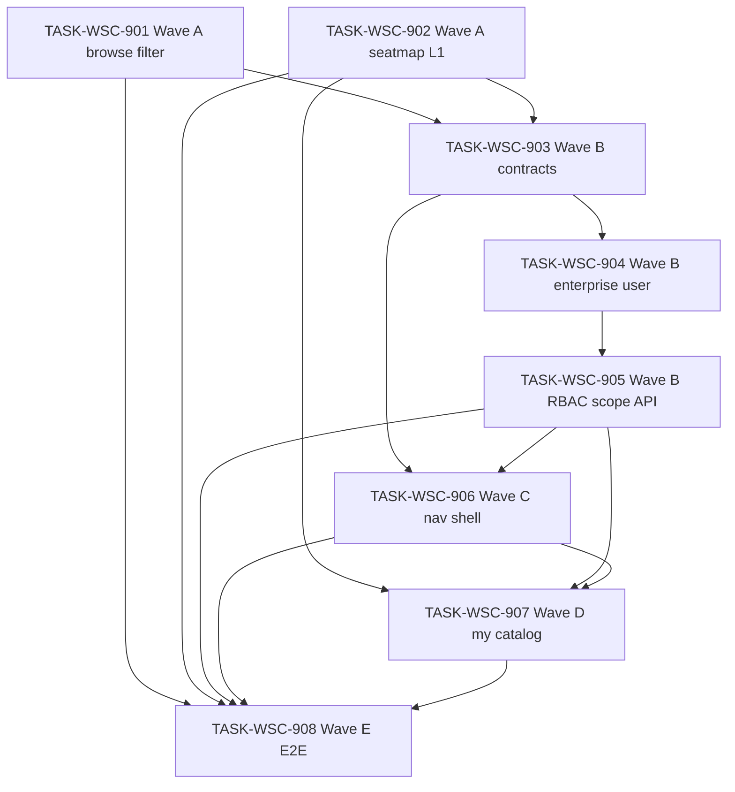

# 接入端工作台（WSC）V1.6 候选执行计划 — 目录筛选 / 座序图 L1 / 我的目录 / 企业 scope

```yaml
planId: PLAN-WSC-8.1
status: DRAFT
planType: CANDIDATE
snapshotId: SNAP-WSC-008
sourcePrd: product/prd/wsc-v1.6-catalog-filter-ux.md
runId: RUN-WSC-011
basedOn: PLAN-WSC-6.2
lineageFrom: PLAN-WSC-6.2
previousRun: RUN-WSC-009
functionalBaseline:
  snapshotId: SNAP-WSC-006
  planId: PLAN-WSC-6.2
  contracts: wsc-contracts@2.3.2
uxBaseline:
  snapshotId: SNAP-WSC-003
  planId: PLAN-WSC-3.1
contractsTarget: wsc-contracts@2.3.2
round: 1
createdAt: 2026-08-17
taskCount: 8
waveCount: 5
requirementCount: 10
authorRoles: [planEditor]
actorInstance: plan-editor-wsc-011-r1
```

> **候选声明**：本文件为 `PLAN-WSC-8.1` **Round 1** 候选稿（`planType: CANDIDATE` / `status: DRAFT`）。须经规划委员会**隔离**独立评审后方可进入 `APPROVED`；本 planEditor 实例**不**伪造任何委员会批准，**不**自行关闭任何 ISSUE，**不**将 `status` 标为 `APPROVED`，**不**写入 `ai/runs/**/state.yaml` 或 `events.jsonl`。  
> **需求权威**：`snapshotId: SNAP-WSC-008`（`status: APPROVED`，PO 2026-08-17）。  
> **PO 已锁定**（PO-CONFIRM-011-001 + SNAP `poLockedDefaults`）：ADMIN 双入口（目录维护**全量** + 我的目录**本企业**）；PROVIDER **仅**我的目录、**无**目录维护；**无**企业管理页；座序图**无**企业筛选；浏览筛选**无** `industryCategory`；编辑/导入/详情**复用** `INDUSTRY_CATEGORY_OPTIONS`；全链目录**无**企业过滤。

## 0. 谱系、预落地对账与文件互斥

### 0.1 谱系与定位

| 概念 | 本计划取值 | 含义 |
|---|---|---|
| `planId` | PLAN-WSC-8.1 | V1.6 候选执行计划 |
| `round` | 1 | **本 planId** 待进入的共识轮次（Round 1 独立评审） |
| `basedOn` / `lineageFrom` | PLAN-WSC-6.2 | 相对 V1.5 批准谱系增量；**不**抄写 V1.5 业务正文 |
| 功能基线 | PLAN-WSC-6.2 / **SNAP-WSC-006（RELEASED）** / `wsc-contracts@2.3.2` | 浏览 Ant、supplierName、未分类 API 垫底、座序图、用户管理、维护 Pagination/Cascader/本页全选等**不削弱** |
| UX 基线 | PLAN-WSC-3.1 / **SNAP-WSC-003** | 令牌/壳层/主路径质感**不回退** |
| 契约目标 | **`wsc-contracts@2.3.2`**（Wave B **增量**） | 由 **TASK-WSC-903** **唯一**拥有契约/doc 增量与 `frontend/src/api/**` 生成；**禁止**其他任务 bump VERSION |
| 需求权威 | SNAP-WSC-008 | 10 条 REQ（9×P0 + 1×P1）；继承 CAT-001..013 / OVW / CHAIN / API / UX |
| 仓布局 | `ai/rules/project/repos.yaml` | 前端 `frontend/`；后端 `backend/`；契约在控制面 `contracts/` |

本计划 **不** 改写 SNAP-WSC-001..007 正文结论；以增量任务承接 V1.6。

### 0.2 预落地对账（强制）

> RUN-WSC-011 曾旁路派发 `TASK-WSC-901`（无批准计划）并已 **void**（`events.jsonl` `RUN_RESET`）。下列路径在计划起草时**可能已存在**于工作树。各任务 developer **必须**先 diff 对账：保留符合 SNAP-008 的实现并补齐缺口；偏离 SNAP 的改动须修正或开 ISSUE。验收以 SNAP + 本计划 acceptance 为准，**不以「代码已在」代替测试证据**。

| 波次/任务 | 预落地迹象（非穷尽；以工作树为准） | 对账要求 |
|---|---|---|
| **906** | `useCanWrite.ts` 含 `canSeeMyMaintenance`；`WorkbenchLayout.vue` 含「我的目录」/`/my-maintenance`；`routes.ts` 有路由占位 | 对齐 SNAP：ADMIN+PROVIDER 可见；PROVIDER **无**目录维护；ADMIN **双入口**；深链门控；企业信息区留给 SHELL-010 |
| **901** | 浏览页可能仍含 V1.5 卡片/收起/advanced toggle/`industryCategory` | 按 REQ-CAT-014 重构；移除卡片与 toggle；Cascader l1/l2 |
| **902** | `CirculationSeatMap.vue` 无 L1 下拉 | 标题右 L1 下拉；卡片随 L1 过滤；**无**企业筛选 |
| **903** | `contracts/VERSION` 可能为 `2.3.2` 或更高（如 `2.3.3`） | **对账**企业 scope 增量是否齐全；**禁止**静默再 bump；矩阵/myCatalog/ADMIN 产品写/openapi `l1` 参数 |
| **matrix** | 2.3.2 矩阵仍含 PROVIDER `catalogMaintenanceUI: visible`、ADMIN 产品写 403 | Wave B 由 903/905 **按 SNAP-008 纠偏**（非削弱 V1.5 已发布浏览/座序图能力） |

**包结构约束（后端）**：按类型分层（`controller|service|repository|entity|model|config|common`）；禁止新建业务域顶层包。

**控制面禁止**：实现任务 **denyModify** `ai/runs/**/state.yaml`、`ai/runs/**/events.jsonl`；禁止伪造 REV-\* / 全员 APPROVE。

### 0.3 文件级互斥总览（机械 scope-check）

| 共享制品 | 唯一写任务 | 其他任务 |
|---|---|---|
| `frontend/.../CatalogBrowsePage.vue` + `useCatalogBrowse.ts`（及 spec） | **901**（Wave A 筛选区） | 902/903..908 deny（902 **不得**改 browse 页筛选区） |
| `frontend/.../browse/components/**`（**除**座序图） | **901** | 902 deny |
| `frontend/.../CirculationSeatMap.vue`（及 spec） | **902** | 901/903..908 deny |
| `contracts/**` + `frontend/src/api/**` | **903** | 他任务只读；**禁止 903∥907** |
| `sys_user` / 企业实体 Flyway + 用户 enterprise 字段 | **904** | 他任务 denyModify `**/sql/**`（除 904） |
| `CatalogBrowseController` / `CatalogBrowseService` / `RbacMatrix` / `WriteAuthorizationInterceptor`（scope 面） | **905** | 902 可写 `L2Distribution*`；904 不得改 browse list |
| `frontend/.../WorkbenchLayout.vue` + `useCanWrite.ts`（及 spec）+ 壳层企业展示 | **906** | 901/902/907 deny |
| `frontend/.../router/routes.ts`（导航/我的目录路由） | **906** → **907**（串行：907 扩 my-catalog 页级门控） | 901/902 deny |
| `CatalogMaintenancePage.vue` + `useCatalogMaintenance.ts` + `maintenance/components/**` | **907**（全量维护页 **与** 我的目录复用/参数化） | 他任务 deny |
| `frontend/.../catalog/editor/**`、`import/**`、`detail/**`（`INDUSTRY_CATEGORY_OPTIONS` 回归） | **907**（Wave D 回归面） | 901 仅 deny 浏览筛选 industryCategory |
| `tests/e2e/**` | **908** | 901..907 deny |
| `frontend/src/styles/**` / `theme/**` | **无写任务** | 全任务只读 |
| `ai/runs/**/state.yaml` | **无写任务** | 全任务 denyModify |

> **串行拥有权**：`router/routes.ts` 在 906 VERIFIED 前仅 906 可写导航/meta；907 启动后可增 `/my-catalog`（或最终路径）及页级 guard，**不得**删除 906 已建立的 ADMIN 双入口语义。  
> **CatalogBrowsePage**：901 VERIFIED 前仅 901 可写；902 **仅**改 `CirculationSeatMap.vue` 及其 spec/backend distribution，**禁止**改 browse 筛选条。

## 1. 范围、假设与硬门禁

### 1.1 范围

**In Scope（SNAP-WSC-008 / PO 已锁定）**

| Wave | 任务 | 内容 | 契约 |
|---|---|---|---|
| **A** | 901 ∥ 902 | REQ-CAT-014 浏览筛选重构；REQ-CAT-019 浏览侧去 `industryCategory`；REQ-CAT-015 座序图 L1 下拉（FE 可先 mock/query） | 可选 `GET /catalog/l2-distribution?l1=`（902 BE 或 903 契约） |
| **B** | 903 → 904 → 905 | REQ-USER-002 企业归属；REQ-RBAC-002；REQ-CAT-016 mine 本企业 + ADMIN 可写；REQ-CAT-018 全链无企业过滤 | **wsc-contracts@2.3.2 增量**（enterprise、list scope、矩阵、可选 `l1`） |
| **C** | 906 | REQ-SHELL-009 导航重排；REQ-SHELL-010 侧栏企业只读展示（P1，不阻塞 A/B） | 只读 903 生成物 |
| **D** | 907 | REQ-CAT-017 我的目录路由与维护 UX 复用；REQ-CAT-013 行为回归；REQ-CAT-019 编辑/导入枚举回归 | 只读 api；scope 消费 905 |
| **E** | 908 | V1.6 P0 E2E 证据包 + V1.5/V1.4 回归命令共存 | — |

**Out of Scope / 默认 deny**

- 企业管理页（企业 CRUD、切换、配额）
- 独立超管后台；超级管理员 vs 企业管理员菜单拆分
- 座序图企业筛选 UI 或按企业过滤
- 座序图点击联动列表 L2 筛选
- 浏览页 `industryCategory` 筛选项（产品字段与其他页面保留）
- 跨页全选统一维护
- 用户硬删除、密码重置邮件、OAuth、完整多租户
- Downloads React 仓改造
- 削弱 V1.5：未分类置底、supplierName 搜、座序图存在、mine 无座序图、维护 Pagination/Cascader/本页全选
- 改写历史 SNAP 正文；实现任务写 Run state/events

### 1.2 假设（PO 已确认 / SNAP 收录）

| 项 | 口径 |
|---|---|
| `contractsTarget` | **`wsc-contracts@2.3.2`**（Wave B 增量；若树中 VERSION 已 ≥2.3.2：**对账**企业 scope 文档/矩阵/OpenAPI 完整，**禁止**静默再 bump） |
| 浏览筛选 | **无**列表区业务视图/业务大类卡片；高级筛选**常显**、**无** toggle；**无**行业类别；Cascader l1/l2 |
| 座序图 | 标题右 L1 下拉默认「全部」；卡片随 L1 过滤；**无**企业筛选 UI/API |
| ADMIN 导航 | **同时**有「目录维护」（**全量**）与「我的目录」（**本企业**） |
| PROVIDER 导航 | **仅**「我的目录」；**不可见**「目录维护」 |
| 我的数据产品 | ADMIN+PROVIDER；列表 **本企业**；ADMIN **可**增改导 |
| 我的目录 | ADMIN=本企业；PROVIDER=本人 `create_by`；UX 同 REQ-CAT-013 维护页 |
| 全链目录 | **全平台**口径；用户企业**不影响**全链列表/座序图统计 |
| 行业类别 | 浏览**不传** `industryCategory`；编辑/导入/详情**复用** `INDUSTRY_CATEGORY_OPTIONS` |
| 企业实体 | OQ-V16-001/002 非阻塞；最小 `enterpriseId`+名称 + `sys_user` 外键可接受 |
| UX 不回退 | SNAP-WSC-003 / PLAN-WSC-3.1 |
| Blocking OQ | **无** |

### 1.3 技术栈硬门禁

| 层 | 固定选型 |
|---|---|
| 前端 | Vue 3 + TypeScript + Vite + pnpm + Pinia + Vue Router 4；**CSS-token-first**；Ant Design Vue **4.x（既有）** |
| 后端 | Spring Boot **2.7.18** + Java 17；`backend/app/data-chain-service/`；包按类型分层 |
| 数据 | MySQL + Flyway；企业字段/关联须 Flyway（**904 独占**） |
| 契约 | 目标 `wsc-contracts@2.3.2` 增量；client 生成至 `frontend/src/api/**` |
| 测试 | JUnit 5；Vitest；Playwright |
| 多仓 | `repos.yaml`：worker 写 `frontend` / `backend`；契约在控制面 |

禁止：业务任务私改 `contracts/**` / `frontend/src/api/**`（除 **903**）；纯 CSS 替代鉴权；静默 bump 契约超过计划口径。

### 1.4 执行硬门禁

- 每任务：独立 developer → codeReviewer → tester；Orchestrator 按 `writeSet` **字面路径** scope-check。
- developer ≠ codeReviewer ≠ tester。
- 同波并行写集必须互斥（见 §6）；**禁止 903∥907**。
- `TASK-WSC-903` **唯一**拥有契约/doc 增量与 `frontend/src/api/**` 生成。
- 权限：隐藏 ≠ 授权；深链与 API 一致。
- UX：增量控件消费既有令牌；**禁止**另起全局色板。

### 1.5 UX 不回退（PLAN-WSC-3.1 + V1.5 冻结面继承）

| 约束 | 口径 |
|---|---|
| 令牌 | 沿用既有 CSS 变量；本版 SFC scoped / Ant `ConfigProvider` 映射增量 |
| Ant→token 最小映射集 | 继承 PLAN-WSC-6.2 §1.5；Cascader/L1 下拉须映射，禁止未映射默认皮肤主导 |
| 双目录表面 | `/catalog` 与 `/my-products` 筛选行为同源（REQ-CAT-014）；mine **无**座序图 |
| V1.5 不回退 | supplierName 搜、未分类 API 垫底、座序图 hover/总数、维护 Pagination/Cascader/本页全选 |
| 座序图 | 仅公共目录；本任务 **902** 改组件；**不**引入企业筛选 |

## 2. 决策与开放问题

### 2.1 必须遵守的 DEC / PO 锁定

| 项 | 本计划用法 |
|---|---|
| DEC-WSC-001..005 | 不削弱 |
| PO-CONFIRM-011-001 | ADMIN 保留目录维护全量 + 新增我的目录本企业；PROVIDER 仅我的目录 |
| PO：座序图无企业过滤 | 902/905/908 负例钉死 |
| PO：浏览无 industryCategory | 901 移除；907 保证 editor/import 仍用 `INDUSTRY_CATEGORY_OPTIONS` |
| SNAP-WSC-006 RELEASED | 不得削弱已发布 V1.5 能力；V1.6 为增量/修订 |

### 2.2 开放问题处理口径

| id | status | 本计划口径 |
|---|---|---|
| OQ-V16-001 | OPEN（non-blocking） | 904 最小企业实体 + `sys_user.enterprise_id`（或等价）；PO 行为已锁 |
| OQ-V16-002 | OPEN（non-blocking） | 904 种子/默认企业策略写入交付说明；不阻塞调度 |
| OQ-V16-003 | OPEN（non-blocking） | 902 建议 `totalProducts` 与 L1 卡片同口径；acceptance 可勾选 |
| OQ-V16-004 | CLOSED | ADMIN 双入口 + PROVIDER 仅我的目录 |
| Blocking OQ | **无** | 可送委员会评审 |

## 3. 契约增量与唯一所有权（`wsc-contracts@2.3.2` Wave B）

### 3.1 契约冻结内容（TASK-WSC-903 一次性 — 硬冻结）

| 契约项 | 内容 |
|---|---|
| VERSION | 保持 **`2.3.2`**（若树中更高：对账合并 V1.6 增量至当前 VERSION 文档，**禁止**无委员会批准的再 bump） |
| 用户/会话 | 用户模型含 **enterprise** 归属（id/name 或等价）；会话 principal 可解析 `enterpriseId` |
| `GET /catalog/products` | **全链默认全平台**（REQ-CAT-018）；`mine=true` → **本企业**产品（非仅 create_by）；可选 `scope=myCatalog` 或等价参数表达「我的目录」ADMIN 本企业 / PROVIDER create_by（与实现命名在 OpenAPI 硬描述） |
| `GET /catalog/l2-distribution` | 支持可选 **`l1`** 过滤 L2 分布；**不按**登录用户企业过滤 |
| RBAC 矩阵（硬） | ADMIN：`myProductsUI` visible；`productWriteUI/ImportUI` **visible**（本企业）；`catalogMaintenanceUI` visible（全量）；新增 `myCatalogUI` visible；PROVIDER：`catalogMaintenanceUI` **hidden**；`myCatalogUI` visible；`catalogMaintenanceApi` 对 PROVIDER **403**；USER：全部隐藏 |
| 既有不回退 | supplierName、未分类排序、mine、用户管理、导入四态、报告白名单；浏览 query 仍支持 l1/l2/l3 等 |
| `ui/state-matrix.md` | V1.6 导航/myCatalog/ADMIN 双入口/企业展示 |
| `req-coverage.md` | 映射 SNAP-008 十条 REQ |
| client | 重新生成 `frontend/src/api/**` 且可 typecheck |

### 3.2 数据迁移协议

- 企业表 + `sys_user` 企业外键：**904 独占** Flyway `sql/migration/V*__*.sql`。
- 905 **默认** denyModify `**/sql/**`；905 仅改 Java 范围逻辑。
- 902 可选改 `L2DistributionService` **无** schema。
- 禁止向 `db/migration/` 追加脚本。

## 4. RBAC 可测矩阵（对齐 SNAP-WSC-008）

| 能力 | ADMIN | PROVIDER | USER |
|---|---|---|---|
| 全链数据目录浏览 + 座序图 | 可见；**全平台** | 可见；**全平台** | 可见 |
| 座序图 L1 下拉 | 有；**无**企业筛 | 同左 | 同左 |
| 我的数据产品 | 可见；**本企业**增改导 | 可见；**本企业**增改导 | 隐藏 / 403 |
| 我的目录 | 可见；**本企业**维护 UX | 可见；**本人 create_by** | 隐藏 / 深链不可达 |
| 目录维护（侧栏） | 可见；**全量** | **隐藏** / 深链不可达 / API 403 | 隐藏 / 403 |
| 分类维护 / 用户管理 | ADMIN 可见 | 隐藏 | 隐藏 |
| 浏览 industryCategory | **无**（全角色） | 同左 | 同左 |

前端隐藏 ≠ 授权。深链 `/catalog/maintenance` 对 PROVIDER **结构不可达**；`/my-catalog`（或等价）对 USER 不可达。

### 4.1 三角色回归单元格（906 / 907 / 908 强制勾选）

| 角色 | 正例 | 负例 |
|---|---|---|
| ADMIN | 全链 + 座序图；目录维护全量；我的目录本企业；我的数据产品本企业可写；用户管理可见 | 无企业管理页；全链不受本企业限制 |
| PROVIDER | 全链 + 座序图；我的目录本人；我的数据产品本企业可写 | **无**目录维护菜单/深链；维护 API 403 |
| USER | 仅全链浏览 + 座序图 | 我的目录/我的产品/维护/用户管理不可达 |

## 5. 任务包列表

> 任务 ID：`TASK-WSC-901`..`908`。路径以 `repos.yaml` 为准；后端 Java 根 = `backend/app/data-chain-service/src/main/java/com/shdata/datachain`。

### TASK-WSC-901 — Wave A：浏览筛选重构（卡片移除 / 常显高级区 / Cascader / 去 industryCategory）

- `requirements`: `[REQ-CAT-014, REQ-CAT-019]`
- `objective`: 公共目录与我的数据产品同源浏览：移除列表区业务视图/业务大类卡片；高级筛选**常显**、移除「高级筛选」toggle；高级区**无**行业类别、列表请求**不传** `industryCategory`；以 Cascader 联动 l1/l2；保留 V1.5 其余 Ant 筛选项与 supplierName/未分类行为；**不改**座序图组件
- `dependsOn`: `[]`
- `readSet`:
  - `product/requirements/SNAP-WSC-008.md`
  - `product/prd/wsc-v1.6-catalog-filter-ux.md`
  - `planning/proposals/PLAN-WSC-8.1.md`（本文件 §1/§0.3）
  - `planning/archived/v1.5/PLAN-WSC-6.2.md`（V1.5 浏览基线，只读）
  - 既有 `frontend/src/features/catalog/browse/**`
- `writeSet`:
  - `frontend/src/features/catalog/browse/CatalogBrowsePage.vue`
  - `frontend/src/features/catalog/browse/composables/useCatalogBrowse.ts`
  - `frontend/src/features/catalog/browse/composables/useCatalogBrowse.spec.ts`
  - `frontend/src/features/catalog/browse/CatalogBrowsePage.spec.ts`
  - `frontend/src/features/catalog/browse/components/**`（**除** `CirculationSeatMap.vue` / `CirculationSeatMap.spec.ts`）
  - `frontend/src/features/catalog/browse/utils/labels.ts`（若需 Cascader 文案）
- `denyModify`:
  - `frontend/src/features/catalog/browse/components/CirculationSeatMap.vue`
  - `frontend/src/features/catalog/browse/components/CirculationSeatMap.spec.ts`
  - `frontend/src/layouts/WorkbenchLayout.vue`
  - `frontend/src/features/auth/composables/useCanWrite.ts`
  - `frontend/src/features/catalog/maintenance/**`
  - `frontend/src/features/catalog/editor/**`；`import/**`；`detail/**`
  - `contracts/**`；`frontend/src/api/**`
  - `backend/**`；`**/sql/**`
  - `tests/e2e/**`
  - `product/**`；`planning/**`；`ai/runs/**/state.yaml`；`ai/runs/**/events.jsonl`
  - `frontend/src/styles/**`；`frontend/src/theme/**`
- `acceptance`:
  - 产品列表区**无**业务视图/业务大类卡片与 active 标签行
  - **无**「高级筛选」toggle；筛选面板默认可见
  - 高级区**无**行业类别控件；请求 query **无** `industryCategory`
  - Cascader：选 L1 传 `l1`；选 L2 传 `l2`；清空为不限
  - `/catalog` 与 `/my-products` 筛选行为一致；mine **仍无**座序图（挂载点不改坏）
  - V1.5 supplierName、l1/l2/l3 等其余筛选项与 Ant 控件**不回退**
  - 座序图区域仍挂载（组件实现由 902 负责；本任务不得破坏挂载容器）
- `testScope`:
  - Vitest：无卡片 DOM/testid；无 advanced toggle；query 无 `industryCategory`；Cascader 映射 l1/l2
  - Vitest：**catalog + mine mode** 参数化同一套断言
  - 回归：supplierName 仍发出；V1.5 文案（业务视图/业务大类）可见
- `riskTags`: `[ux-filter-refactor, antd-cascader, browse-dual-surface]`

### TASK-WSC-902 — Wave A：座序图 L1 下拉与卡片联动（无企业筛选）

- `requirements`: `[REQ-CAT-015, REQ-CAT-018]`
- `objective`: `CirculationSeatMap` 标题右增加 L1 下拉（含「全部」默认）；选 L1 后 L2 卡片/图例仅该 L1；**无**企业筛选 UI；实现/对接 `GET /catalog/l2-distribution?l1=`（可与 903 契约对账；FE 可先 mock）；全链统计**不按**用户企业过滤；hover/leave/空态/loading 不回退
- `dependsOn`: `[]`
- `readSet`:
  - SNAP-WSC-008 REQ-CAT-015/018
  - 既有 `CirculationSeatMap.vue`、`CatalogBrowsePage.vue`（**只读**挂载关系）
  - 既有 `L2DistributionController` / `L2DistributionService`（只读）
- `writeSet`:
  - `frontend/src/features/catalog/browse/components/CirculationSeatMap.vue`
  - `frontend/src/features/catalog/browse/components/CirculationSeatMap.spec.ts`
  - `backend/app/data-chain-service/src/main/java/com/shdata/datachain/controller/catalog/browse/L2DistributionController.java`
  - `backend/app/data-chain-service/src/main/java/com/shdata/datachain/service/catalog/browse/L2DistributionService.java`
  - `backend/app/data-chain-service/src/test/java/com/shdata/datachain/catalog/browse/L2DistributionServiceTest.java`
  - `backend/app/data-chain-service/src/test/java/com/shdata/datachain/catalog/browse/L2DistributionIntegrationTest.java`
- `denyModify`:
  - `frontend/src/features/catalog/browse/CatalogBrowsePage.vue`（**禁止**改筛选区；若必须传 props 开 ISSUE 并入 901 或最小 mount 补丁由 reviewer 裁定）
  - `frontend/src/features/catalog/browse/composables/useCatalogBrowse.ts`
  - `frontend/src/features/catalog/browse/components/**`（**除** CirculationSeatMap*）
  - `frontend/src/layouts/**`；`frontend/src/features/auth/**`
  - `contracts/**`；`frontend/src/api/**`（可临时硬编码 query 至 903 对齐）
  - `CatalogBrowseController.java`；`CatalogBrowseService.java`（归 905）
  - `**/sql/**`
  - `tests/e2e/**`；`product/**`；`planning/**`；`ai/runs/**/state.yaml`；`ai/runs/**/events.jsonl`
- `acceptance`:
  - 标题右下拉含「全部」+ 全部 L1；默认「全部」行为同 V1.5 Top5
  - 选 L1 后卡片/图例仅该 L1 下 L2（Top5 可在 L1 子集内）
  - 区域**无**企业筛选控件；API/展示**不按**登录用户企业过滤
  - 仅公共目录挂载；mine 模式不显示
  - hover/leave/空态/loading 不回退 V1.5
  - OQ-V16-003：`totalProducts` 口径与卡片一致（建议验收勾选）
- `testScope`:
  - 后端：`?l1=` 过滤集成测；无企业 scope 参数
  - Vitest：下拉切换；Top5 截断；hover 态；无 enterprise 控件
  - 负例：请求/响应**无** enterprise 过滤字段
- `riskTags`: `[visualization, l1-filter, perf-aggregation]`

### TASK-WSC-903 — Wave B：契约 2.3.2 增量 + client 生成 + 矩阵 V1.6

- `requirements`: `[REQ-USER-002, REQ-RBAC-002, REQ-CAT-016, REQ-CAT-017, REQ-CAT-018, REQ-SHELL-009, REQ-CAT-015]`
- `objective`: 按 §3.1 冻结 **wsc-contracts@2.3.2 V1.6 增量**；更新 `rbac/matrix.yaml`、OpenAPI、state-matrix、req-coverage；生成 `frontend/src/api/**`；**唯一**契约 bump/生成任务
- `dependsOn`: `[TASK-WSC-901, TASK-WSC-902]`
- `readSet`:
  - SNAP-WSC-008；本计划 §3 / §4
  - 既有 `contracts/**`
  - 901/902 已确定的 query 形状（l1/l2、distribution `l1`）
- `writeSet`:
  - `contracts/**`（含 `VERSION`、`openapi/**`、`rbac/matrix.yaml`、`ui/state-matrix.md`、`req-coverage.md`、`errors/codes.yaml` 若需）
  - `frontend/src/api/**`
  - `frontend/package.json`、`frontend/pnpm-lock.yaml`（**仅当** client 生成必需）
- `denyModify`:
  - `frontend/src/features/**`；`frontend/src/layouts/**`；`frontend/src/router/**`
  - `backend/**`；`**/sql/**`
  - `tests/e2e/**`
  - `product/**`；`planning/**`；`ai/runs/**/state.yaml`；`ai/runs/**/events.jsonl`
- `acceptance`:
  - `contracts/VERSION` = **`2.3.2`**（或已对账的更高版本 **且** 无未批准 bump）
  - OpenAPI 含 enterprise 字段、mine/scope 语义、全链无企业 filter 描述、`l2-distribution?l1=`
  - `matrix.yaml` 与 §4 一致：ADMIN 产品写可见；PROVIDER 目录维护 hidden+403；myCatalogUI；myProducts 本企业语义
  - V1.5 supplierName/未分类/mine/用户管理/L2 **不回退**
  - `frontend/src/api/**` 生成后可 typecheck
  - req-coverage / state-matrix 含 V1.6 十条 REQ 映射
- `testScope`:
  - 契约 lint / OpenAPI 校验
  - matrix 与 §4 交叉检查清单
  - client typecheck
- `riskTags`: `[contracts-bump, rbac-breaking, enterprise-scope]`

### TASK-WSC-904 — Wave B：用户企业归属 + Flyway + 会话 enterprise

- `requirements`: `[REQ-USER-002]`
- `objective`: 最小企业实体（或等价表）+ `sys_user` 企业外键；种子支持一企多 ADMIN；登录会话 principal 含 `enterpriseId`/`enterpriseName`；ADMIN 创建用户默认同企业；对账 OQ-V16-002 默认策略
- `dependsOn`: `[TASK-WSC-903]`
- `readSet`:
  - `frontend/src/api/**`（只读，903 生成物）
  - `contracts/**`（只读）
  - SNAP-WSC-008 REQ-USER-002
  - 既有 `SysUserEntity` / `UserAccountService` / 安全会话
- `writeSet`:
  - `backend/app/data-chain-service/src/main/resources/sql/migration/**`（企业表 + user 外键 + 种子；**独占**）
  - `backend/app/data-chain-service/src/main/java/com/shdata/datachain/entity/SysUserEntity.java`（及企业 entity 若新建）
  - `backend/app/data-chain-service/src/main/java/com/shdata/datachain/repository/**`（用户/企业 repository 增量）
  - `backend/app/data-chain-service/src/main/java/com/shdata/datachain/service/security/**`（用户 CRUD 企业字段）
  - `backend/app/data-chain-service/src/main/java/com/shdata/datachain/controller/security/**`（用户 API 企业字段）
  - `backend/app/data-chain-service/src/main/java/com/shdata/datachain/model/**`（SessionPrincipal / User DTO enterprise 字段）
  - `backend/app/data-chain-service/src/main/java/com/shdata/datachain/common/security/**`（会话解析 enterprise）
  - `backend/app/data-chain-service/src/test/java/**/security/**`（enterprise 会话/用户 CRUD）
  - `frontend/src/features/users/**`（用户表单/列表展示企业归属，**仅** enterprise 字段增量）
- `denyModify`:
  - `contracts/**`；`frontend/src/api/**`
  - `backend/.../controller/catalog/**`；`service/catalog/**`（归 905）
  - `frontend/src/layouts/**`；`frontend/src/features/catalog/**`
  - `tests/e2e/**`；`product/**`；`planning/**`；`ai/runs/**/state.yaml`；`ai/runs/**/events.jsonl`
- `acceptance`:
  - Flyway 可重复执行；用户含企业归属；同企业可有多 ADMIN
  - 登录会话可解析 enterprise 供后续 scope
  - ADMIN 创建用户可指定/继承企业
  - **无**企业管理页/企业 CRUD UI（Out of Scope）
  - 历史无企业用户有 documented 默认策略（OQ-V16-002）
- `testScope`:
  - 集成：多 ADMIN 同企业；会话含 enterprise；用户 CRUD 企业字段
  - 迁移 smoke：空库/已有库
- `riskTags`: `[migration, handles-pii, enterprise-model]`

### TASK-WSC-905 — Wave B：RBAC + 列表 scope API（mine 本企业 / 全链无企业过滤 / ADMIN 可写）

- `requirements`: `[REQ-RBAC-002, REQ-CAT-016, REQ-CAT-018]`
- `objective`: 实现 listProducts mine=**本企业**；全链列表**无**企业 filter；ADMIN 产品写/导入 **200**（本企业范围校验）；PROVIDER 仍不可写他人产品；`RbacMatrix` / `WriteAuthorizationInterceptor` 与 903 矩阵同步；对账 V1.5 未分类/supplierName 不回退
- `dependsOn`: `[TASK-WSC-903, TASK-WSC-904]`
- `readSet`:
  - `contracts/openapi/**`、`rbac/matrix.yaml`（只读）
  - SNAP-WSC-008 §REQ-CAT-016/018、REQ-RBAC-002
  - `CatalogBrowseController` / `CatalogBrowseService` / `RbacMatrix` / `WriteAuthorizationInterceptor`
  - 产品 editor/import controller/service
- `writeSet`:
  - `backend/app/data-chain-service/src/main/java/com/shdata/datachain/controller/catalog/browse/CatalogBrowseController.java`
  - `backend/app/data-chain-service/src/main/java/com/shdata/datachain/service/catalog/browse/CatalogBrowseService.java`
  - `backend/app/data-chain-service/src/main/java/com/shdata/datachain/common/security/RbacMatrix.java`
  - `backend/app/data-chain-service/src/main/java/com/shdata/datachain/common/security/WriteAuthorizationInterceptor.java`
  - `backend/app/data-chain-service/src/main/java/com/shdata/datachain/controller/catalog/editor/**`
  - `backend/app/data-chain-service/src/main/java/com/shdata/datachain/controller/catalog/productimport/**`
  - `backend/app/data-chain-service/src/main/java/com/shdata/datachain/service/catalog/editor/**`
  - `backend/app/data-chain-service/src/main/java/com/shdata/datachain/service/catalog/productimport/**`
  - `backend/app/data-chain-service/src/test/java/com/shdata/datachain/catalog/browse/ListProductsFilterSortIntegrationTest.java`
  - `backend/app/data-chain-service/src/test/java/com/shdata/datachain/catalog/browse/CatalogBrowseIntegrationTest.java`
  - `backend/app/data-chain-service/src/test/java/com/shdata/datachain/rbac/RbacMatrixTest.java`
  - `backend/app/data-chain-service/src/test/java/**/catalog/**`（enterprise scope / ADMIN 写相关新建或增量）
  - `frontend/src/features/auth/composables/useCanWrite.ts`（**仅** `canWriteProduct`/`canImportProduct` ADMIN=true 与 903 矩阵对齐片段；**完整**导航门控归 906）
  - `frontend/src/features/auth/composables/useCanWrite.spec.ts`
- `denyModify`:
  - `contracts/**`；`frontend/src/api/**`
  - `frontend/src/layouts/WorkbenchLayout.vue`（归 906）
  - `frontend/src/features/catalog/browse/CatalogBrowsePage.vue`（归 901；905 可改 mine 列表消费逻辑若在同 composable 须开 ISSUE——默认 901 已支持 mine query，905 以后端为准）
  - `frontend/src/features/catalog/maintenance/**`
  - `L2DistributionController.java`；`L2DistributionService.java`（归 902）
  - `**/sql/**`
  - `tests/e2e/**`；`product/**`；`planning/**`；`ai/runs/**/state.yaml`；`ai/runs/**/events.jsonl`
- `acceptance`:
  - ADMIN/PROVIDER mine 列表均为**本企业**产品（非仅 create_by 本人）
  - ADMIN 产品写/导入 **不再 403**（本企业范围内）；跨企业写 403
  - 全链 `GET /catalog/products` **无**登录企业 filter；supplierName/未分类排序**不回退**
  - PROVIDER 不可维护他人 create_by / 他人企业产品
  - `RbacMatrix` 与 §4 / matrix.yaml 一致
- `testScope`:
  - 集成：三角色 mine/全链 scope；ADMIN 写本企业 200、跨企业 403；全链不受 enterprise 影响
  - Vitest：`useCanWrite` ADMIN 产品写/导入 true
  - 回归：supplierName、未分类跨页、V1.5 list 排序
- `riskTags`: `[rbac-breaking, data-isolation, enterprise-scope]`

### TASK-WSC-906 — Wave C：导航重排 + 侧栏企业展示 + FE 门控

- `requirements`: `[REQ-SHELL-009, REQ-SHELL-010]`
- `objective`: 「数据目录」子菜单：全链、**我的目录**（ADMIN+PROVIDER）、我的数据产品（ADMIN+PROVIDER）；**ADMIN** 另有「目录维护」（全量）；**PROVIDER** **无**目录维护；侧栏只读展示当前用户企业名称/标识（P1）；`useCanWrite` 导航可见性与 §4 一致；对账预落地 `/my-maintenance` 占位
- `dependsOn`: `[TASK-WSC-903, TASK-WSC-905]`
- `readSet`:
  - SNAP-WSC-008 REQ-SHELL-009/010
  - `frontend/src/api/**`（只读）
  - `contracts/rbac/matrix.yaml`（只读）
  - `WorkbenchLayout.vue`、`useCanWrite.ts`、`routes.ts`
- `writeSet`:
  - `frontend/src/layouts/WorkbenchLayout.vue`
  - `frontend/src/features/auth/composables/useCanWrite.ts`
  - `frontend/src/features/auth/composables/useCanWrite.spec.ts`
  - `frontend/src/layouts/WorkbenchLayout.spec.ts`（若有/新建）
  - `frontend/src/router/routes.ts`（导航 meta/title；**不得**删除 `/admin/users` 等既有路由）
  - `frontend/src/features/shell/**`（企业只读展示组件，若独立）
- `denyModify`:
  - `frontend/src/features/catalog/browse/**`
  - `frontend/src/features/catalog/maintenance/**`（页面实现归 907）
  - `contracts/**`；`frontend/src/api/**`
  - `backend/**`
  - `tests/e2e/**`；`product/**`；`planning/**`；`ai/runs/**/state.yaml`；`ai/runs/**/events.jsonl`
  - `frontend/src/styles/**`；`frontend/src/theme/**`
- `acceptance`:
  - ADMIN：可见全链 + **目录维护** + **我的目录** + 我的数据产品 + 用户管理；**无**企业管理页
  - PROVIDER：可见全链 + **我的目录** + 我的数据产品；**不可见**目录维护；深链维护结构不可达
  - USER：仅全链；其余不可达
  - 侧栏展示企业名称/标识；**无**企业切换/编辑（REQ-SHELL-010 P1）
  - 双表面 active 规则不回退；用户管理菜单不删
  - 对账 void 前 `/my-maintenance` 占位：路由/meta 与 SNAP 最终命名一致（`/my-catalog` 或 PO 确认路径，**全计划统一**）
- `testScope`:
  - Vitest：§4.1 三角色菜单正例+负例；`canSeeMyMaintenance`/`canMaintainCatalog`/`canSeeMyProducts`
  - Vitest：企业信息区渲染（有 enterprise 时）
  - 深链负例：PROVIDER `/catalog/maintenance` 不可达
- `riskTags`: `[shell-nav, rbac-visibility, prelanding-reconcile]`

### TASK-WSC-907 — Wave D：我的目录页 + 维护 UX 复用 + 行业类别非浏览回归

- `requirements`: `[REQ-CAT-017, REQ-CAT-013, REQ-CAT-019]`
- `objective`: 新增「我的目录」路由与页：复用目录维护 UX（Pagination、Cascader、本页全选、统一维护）；ADMIN 范围**本企业**；PROVIDER 范围**本人 create_by**；ADMIN 全量「目录维护」页**不改语义**（仍全平台）；编辑/导入/详情**仍用** `INDUSTRY_CATEGORY_OPTIONS`；后端 scope API 与菜单一致
- `dependsOn`: `[TASK-WSC-902, TASK-WSC-905, TASK-WSC-906]`
- `readSet`:
  - SNAP-WSC-008 REQ-CAT-017/013/019
  - `frontend/src/api/**`（只读；**须 903 VERIFIED**）
  - 既有 `frontend/src/features/catalog/maintenance/**`
  - `useCanWrite.ts`（只读）
  - `backend/.../controller/catalog/maintenance/**`（只读，若 scope 需 BE 增量则本任务 writeSet 含 maintenance service）
- `writeSet`:
  - `frontend/src/features/catalog/maintenance/CatalogMaintenancePage.vue`（参数化：全量 vs myCatalog scope）
  - `frontend/src/features/catalog/maintenance/composables/useCatalogMaintenance.ts`
  - `frontend/src/features/catalog/maintenance/composables/useCatalogMaintenance.spec.ts`
  - `frontend/src/features/catalog/maintenance/components/**`
  - `frontend/src/router/routes.ts`（`/my-catalog` 或统一路径；页级 guard；**在 906 基础上**增量）
  - `frontend/src/features/catalog/editor/**`（**仅** `INDUSTRY_CATEGORY_OPTIONS` 回归断言相关）
  - `frontend/src/features/catalog/import/**`（同上）
  - `frontend/src/features/catalog/detail/**`（同上）
  - `backend/app/data-chain-service/src/main/java/com/shdata/datachain/controller/catalog/maintenance/**`（若需 myCatalog scope 参数）
  - `backend/app/data-chain-service/src/main/java/com/shdata/datachain/service/catalog/maintenance/**`
  - `backend/app/data-chain-service/src/test/java/**/catalog/maintenance/**`
- `denyModify`:
  - `frontend/src/layouts/WorkbenchLayout.vue`（归 906）
  - `frontend/src/features/catalog/browse/**`
  - `contracts/**`；`frontend/src/api/**`
  - `L2Distribution*`（归 902）
  - `CatalogBrowseController` / `CatalogBrowseService`（归 905，除非 maintenance 与 browse 不同模块）
  - `tests/e2e/**`；`product/**`；`planning/**`；`ai/runs/**/state.yaml`；`ai/runs/**/events.jsonl`
  - `**/sql/**`
- `acceptance`:
  - ADMIN 我的目录：本企业产品；目录维护：仍**全量**
  - PROVIDER 我的目录：本人 create_by；**无**目录维护入口
  - UX 同 REQ-CAT-013：Pagination 跳页、Cascader 规则、本页全选、统一维护、筛/Tab 清选择
  - 编辑/导入/详情仍展示/提交 `industryCategory` + `INDUSTRY_CATEGORY_OPTIONS`；浏览页仍无该筛项
  - USER 深链不可达；API scope 与 UI 一致
- `testScope`:
  - Vitest：myCatalog vs full maintenance scope；Cascader/本页全选/regression
  - Vitest：editor/import 仍含 industry category 控件
  - 后端：ADMIN myCatalog 本企业；PROVIDER 本人；跨 scope 403
- `riskTags`: `[maintenance-reuse, scope-isolation, enum-regression]`

### TASK-WSC-908 — Wave E：V1.6 P0 E2E 证据包（串行；与 V1.5/V1.4 共存）

- `requirements`: `[REQ-CAT-014, REQ-CAT-015, REQ-CAT-016, REQ-CAT-017, REQ-CAT-018, REQ-CAT-019, REQ-SHELL-009, REQ-RBAC-002, REQ-USER-002]`
- `objective`: 独占 Playwright E2E，覆盖 §6.1 场景；产出可审计证据包；**保留** V1.5/V1.4 回归可执行；**不改**业务 feature 源码
- `dependsOn`: `[TASK-WSC-901, TASK-WSC-902, TASK-WSC-905, TASK-WSC-906, TASK-WSC-907]`
- `readSet`:
  - SNAP-WSC-008；本计划 §6.1 / §4.1
  - 既有 `tests/e2e/**`
- `writeSet`:
  - `tests/e2e/specs/p0-wsc-v1.6.spec.ts`
  - `tests/e2e/playwright.v16.config.ts`
  - `tests/e2e/package.json`（增补 script **`test:p0-v16`**；**保留** `test:p0-v15`、`test:p0-v14`）
  - `tests/e2e/reports/p0-wsc-v1.6/**`
  - `tests/e2e/helpers/wsc-v16-fixtures.ts`（若需）
- `denyModify`:
  - `tests/e2e/playwright.config.ts`（**禁止**把默认 config 改成仅 v1.6 而冲掉 v1.4）
  - `tests/e2e/playwright.v15.config.ts`；`tests/e2e/specs/p0-wsc-v1.5.spec.ts`（若存在）
  - `tests/e2e/specs/p0-wsc-v1.4.spec.ts`
  - `frontend/src/**`；`backend/**`；`contracts/**`；`**/sql/**`
  - `product/**`；`planning/**`；`ai/runs/**/state.yaml`；`ai/runs/**/events.jsonl`
- `acceptance`:
  - §6.1 场景全部强制通过
  - **唯一** V1.6 命令：`pnpm --dir tests/e2e run test:p0-v16`（`package.json` script 一字不差指向 `playwright test specs/p0-wsc-v1.6.spec.ts --config=playwright.v16.config.ts`）
  - 报告落于 `tests/e2e/reports/p0-wsc-v1.6/`；`evidenceId: TESTRUN-WSC-E2E-V16` 写入报告
  - **共存**：`test:p0-v15`、`test:p0-v14` 仍可执行（v1.5 spec/config 若尚未存在，交付说明记录基线命令，**不得**破坏 v1.4 config）
  - P0 缺陷为 0
- `testScope`:
  - 强制执行：`pnpm --dir tests/e2e run test:p0-v16`
  - 强制回归：`pnpm --dir tests/e2e run test:p0-v14`（至少 RBAC/基线相关场景）
  - 建议回归：`pnpm --dir tests/e2e run test:p0-v15`（若 v1.5 规格已落地）
  - 场景勾选表见 §6.1
- `riskTags`: `[e2e-gate, release-evidence]`

## 6. 波次 / DAG



| 波次 | 任务 | 启动条件 | 同波并行写集校验 |
|---|---|---|---|
| **A** | 901 ∥ 902 | 本计划 APPROVED 后派发 | **可并行**（browse 筛选 vs CirculationSeatMap/L2 API 互斥） |
| **B** | 903 → 904 → 905 | 901+902 VERIFIED 后开 903；904 在 903 后；905 在 904 后 | 903 独占 contracts/**api**；904 独占 sql/用户 enterprise；905 独占 browse RBAC/editor |
| **C** | 906 | 903+905 VERIFIED | 906 独占 WorkbenchLayout/useCanWrite/壳层 |
| **D** | 907 | 902+905+906 VERIFIED | 907 独占 maintenance 页与 myCatalog 路由增量；**禁止 903∥907** |
| **E** | 908 | 901+902+905+906+907 VERIFIED | 908 独占 e2e |

**并行写集互斥声明：**

| 并行对 | 条件 | 结论 |
|---|---|---|
| 901 ∥ 902 | Wave A | **允许**（902 不得改 CatalogBrowsePage 筛选区） |
| 903 ∥ 907 | — | **禁止**（907 须稳定读 `frontend/src/api/**`） |
| 905 ∥ 906 | 写集无交且 903 已 VERIFIED | **允许**（905 后端+useCanWrite 片段 vs 906 layout） |
| 901 与 907 | browse vs maintenance | **禁止并行**（不同波次已串行） |
| 903 与任意改 contracts 者 | — | 仅 903 可写 |
| 908 与任何 feature | — | **禁止并行** |

DAG **无环**。

### 6.1 P0 E2E 场景（发布门禁强制；TASK-WSC-908）

| # | 场景 | 要点 | 强制? |
|---|---|---|---|
| 1 | 浏览筛选 V1.6 | 无卡片；高级区常显；无 industryCategory；Cascader l1/l2；**抽样 `/my-products`** | **是** |
| 2 | 座序图 L1 | 标题右下拉；默认全部= V1.5 Top5；选 L1 过滤卡片；**无**企业筛 | **是** |
| 3 | 全链无企业过滤 | 不同 enterprise 用户全链列表一致；supplierName/未分类**不回退** | **是** |
| 4 | 我的数据产品本企业 | ADMIN+PROVIDER 可见；ADMIN 可增改导；列表本企业 | **是** |
| 5 | 导航 ADMIN 双入口 | 目录维护全量 + 我的目录本企业；用户管理不删 | **是** |
| 6 | PROVIDER 仅我的目录 | 无目录维护；深链维护不可达；我的目录本人 scope | **是** |
| 7 | 我的目录维护 UX | Pagination/Cascader/本页全选/统一维护；ADMIN 本企业 vs 全量维护分离 | **是** |
| 8 | 行业类别非浏览 | 编辑/导入仍含 `INDUSTRY_CATEGORY_OPTIONS`；浏览 query 无 industryCategory | **是** |
| 9 | V1.5/V1.4 回归抽样 | supplierName；未分类垫底；座序图 hover；`test:p0-v14` 可跑 | **是** |

| 证据字段 | 值 |
|---|---|
| `evidenceId` | **`TESTRUN-WSC-E2E-V16`** |
| 规格文件 | **`tests/e2e/specs/p0-wsc-v1.6.spec.ts`** |
| V1.6 命令 | **`pnpm --dir tests/e2e run test:p0-v16`** |
| V1.6 config | **`tests/e2e/playwright.v16.config.ts`** |
| 报告落点 | **`tests/e2e/reports/p0-wsc-v1.6/`** |
| V1.5 共存命令 | **`pnpm --dir tests/e2e run test:p0-v15`**（若 spec 存在） |
| V1.4 共存命令 | **`pnpm --dir tests/e2e run test:p0-v14`**（保留既有 config） |

### 6.2 每任务审查/测试门禁

1. `developer` 仅改 `writeSet`，提交 REQ→diff→**预落地对账说明**→测试声明。
2. 独立 `codeReviewer`：对照 SNAP-WSC-008 + 本计划；字面 scope-check。
3. 独立 `tester` 执行 `testScope`。
4. 904 命中 migration → `migrationReviewer`。
5. Orchestrator 仅在 scope-check、review、tests、交付物齐全后标 `VERIFIED`。

## 7. REQ 映射

| REQ | priority | change | 主任务 | 备注 |
|---|---|---|---|---|
| REQ-CAT-014 | P0 | 新增 | **901** + **908** | 浏览筛选重构 |
| REQ-CAT-015 | P0 | 修订 | **902** + **903**（`l1` 契约）+ **908** | 座序图 L1；无企业筛 |
| REQ-CAT-016 | P0 | 修订 | **903** + **905** + **908** | mine 本企业；ADMIN 可写 |
| REQ-CAT-017 | P0 | 新增 | **903** + **907** + **908** | 我的目录 UX 复用 |
| REQ-CAT-018 | P0 | 新增 | **902** + **905** + **908** | 全链无企业过滤 |
| REQ-CAT-019 | P0 | 新增 | **901**（浏览去字段）+ **907**（编辑/导入回归）+ **908** | `INDUSTRY_CATEGORY_OPTIONS` |
| REQ-SHELL-009 | P0 | 修订 | **906** + **908** | ADMIN 双入口；PROVIDER 仅我的目录 |
| REQ-SHELL-010 | P1 | 新增 | **906** | 侧栏企业只读；不阻塞 A/B |
| REQ-USER-002 | P0 | 修订 | **903** + **904** + **908** | 企业归属；一企多 ADMIN |
| REQ-RBAC-002 | P0 | 修订 | **903** + **905** + **906** + **907** + **908** | scope 与菜单/API 一致 |

覆盖：本快照 **10** 条 REQ（9×P0 + 1×P1）。  
行为继承（不削弱）：CAT-001..013（除被修订项）/ OVW / CHAIN / API-001 / UX-001..011 — 由各任务 deny 越界 + §6.1 回归保证。

## 8. 风险与回滚

| 风险 | 缓解 | 回滚 |
|---|---|---|
| 预落地 `/my-maintenance` 与 SNAP 漂移 | §0.2 对账；906 acceptance 统一路径 | 按 SNAP 回退导航 diff |
| 契约 enterprise scope 与实现分叉 | 903 唯一冻结；905 单测钉死 | 拒合入；回退 matrix/OpenAPI |
| CatalogBrowsePage 双作者 | 901 独占筛选区；902 仅座序图 | scope-check 拒收 |
| 903∥907 api 交叉 | dependsOn + 并行表禁止 | 调度拒收 |
| ADMIN/PROVIDER 维护门控双轨 | 906 useCanWrite + 907 scope + 903 matrix + 908 深链 | 对齐 SNAP 双入口 |
| mine 从 create_by 切到本企业 | 905 集成测 + 908 场景 4 | 热修 scope 查询 |
| 浏览去掉 industryCategory 误伤编辑 | 907 回归 INDUSTRY_CATEGORY_OPTIONS | 恢复 editor/import 字段 |
| 座序图误加企业筛 | 902/908 负例 | 删除 enterprise 控件 |
| V1.6 E2E 冲掉 V1.4 | 独立 v16 config；denyModify 默认 config | 恢复 test:p0-v14 |
| 企业迁移 OQ-V16-002 | 904 文档化默认企业 | 数据回填脚本（另任务） |

## 9. 发布门禁（V1.6 / RUN-WSC-011）

1. **SNAP-WSC-008** 已 APPROVED；本计划经必需角色独立 `APPROVE` 后由 Orchestrator 发布至 `planning/approved/`。
2. 全部 P0 REQ（§7 九条）对应任务 **VERIFIED**（含 **908**）。
3. `wsc-contracts@2.3.2` V1.6 增量无未决冲突；enterprise scope 与 matrix 可测。
4. Wave A：浏览筛选 + 座序图 L1 可观察通过。
5. Wave B：企业归属 + mine 本企业 + ADMIN 可写 + 全链无企业 filter 有自动化证据。
6. Wave C/D：ADMIN 双入口、PROVIDER 仅我的目录、维护 UX 复用、行业类别非浏览回归。
7. UX/RBAC 相对 SNAP-WSC-003 / V1.5 无 P0 回退。
8. **§6.1 E2E 强制通过**：`evidenceId: TESTRUN-WSC-E2E-V16`；命令 `pnpm --dir tests/e2e run test:p0-v16`；`test:p0-v14` 仍可跑通。
9. developer ≠ codeReviewer ≠ tester；字面 scope-check 通过；预落地对账说明齐全。
10. maintainer 人类发布批准（Run `approvals.yaml`，由 Orchestrator/人类操作）。

## 10. 完成检查（候选计划）

- [x] 引用 SNAP-WSC-008 / RUN-WSC-011；`planId: PLAN-WSC-8.1`；`status: DRAFT`；`planType: CANDIDATE`；`round: 1`
- [x] §0 范围、基线（SNAP-WSC-006 RELEASED、UX SNAP-WSC-003）
- [x] PO 锁定项齐全（ADMIN 双菜单、PROVIDER 仅我的目录、无企管页、座序图无企业筛、INDUSTRY_CATEGORY_OPTIONS）
- [x] 波次 A/B/C/D/E；任务 901..908 全文内联 requirements、dependsOn、readSet、writeSet、denyModify、acceptance、testScope、riskTags
- [x] 文件级互斥：CatalogBrowsePage、WorkbenchLayout、CirculationSeatMap、maintenance、contracts（仅 903）
- [x] DAG + 并行规则；906/907 串行；禁止 903∥907
- [x] §6 E2E 门禁 908 + `test:p0-v16` 命令模式
- [x] REQ 映射十条
- [ ] 对本 planId 的规划委员会独立评审 / APPROVE（**尚未发生**；本文件不伪造）

---

**planEditor decision（本实例）**：`PLAN-WSC-8.1` 已落盘为可调度的 **CANDIDATE / DRAFT** Round 1 候选执行计划，**可以提交规划委员会隔离评审**。本实例 **不** 输出 APPROVE，**不** 将 status 标为 APPROVED，**不** 关闭 ISSUE，**不** 写入 `ai/runs` state/events，**不** commit。
