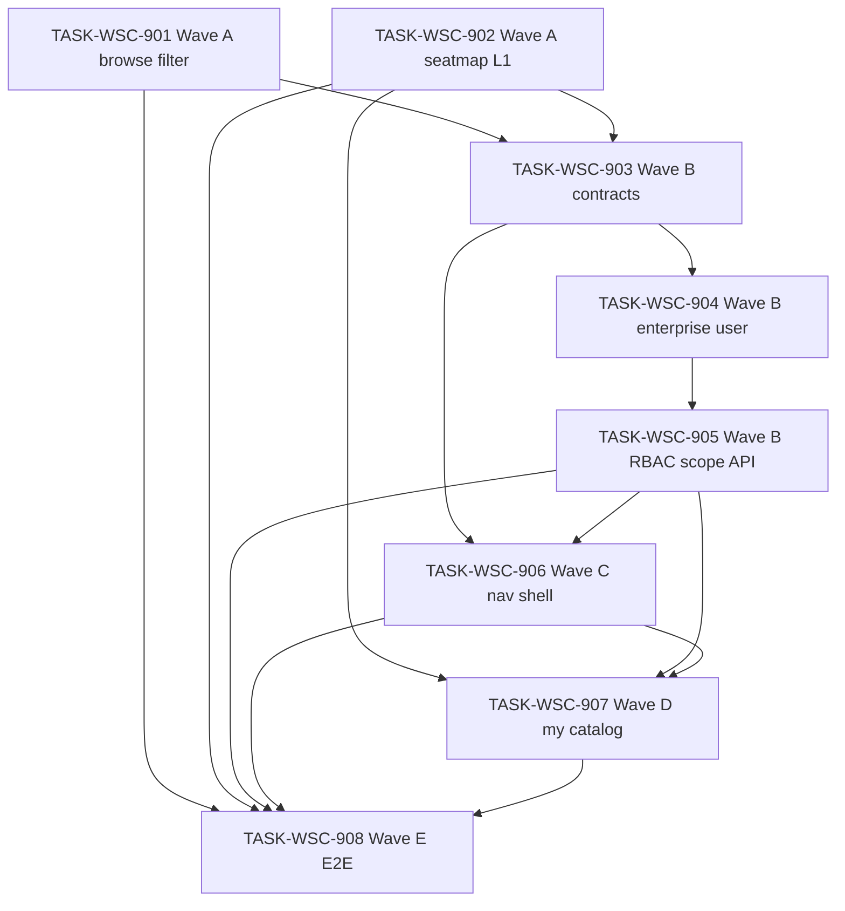

# 接入端工作台（WSC）V1.6 候选执行计划 — 目录筛选 / 座序图 L1 / 我的目录 / 企业 scope（Round 2）

```yaml
planId: PLAN-WSC-8.2
status: DRAFT
planType: CANDIDATE
snapshotId: SNAP-WSC-008
sourcePrd: product/prd/wsc-v1.6-catalog-filter-ux.md
runId: RUN-WSC-011
basedOn: PLAN-WSC-8.1
lineageFrom: PLAN-WSC-6.2
previousRun: RUN-WSC-009
functionalBaseline:
  snapshotId: SNAP-WSC-006
  planId: PLAN-WSC-6.2
  contracts: wsc-contracts@2.3.2
uxBaseline:
  snapshotId: SNAP-WSC-003
  planId: PLAN-WSC-3.1
contractsTarget: wsc-contracts@2.3.2
round: 2
createdAt: 2026-08-17
taskCount: 8
waveCount: 5
requirementCount: 10
authorRoles: [planEditor]
actorInstance: plan-editor-wsc-011-r2
```

> **候选声明**：本文件为 `PLAN-WSC-8.2` **Round 2** 候选稿（`planType: CANDIDATE` / `status: DRAFT`），基于 `PLAN-WSC-8.1` Round 1 评审修订。须经规划委员会**隔离**独立复评后方可进入 `APPROVED`；本 planEditor 实例**不**伪造任何委员会批准，**不**自行关闭任何 ISSUE，**不**将 `status` 标为 `APPROVED`，**不**写入 `ai/runs/**/state.yaml` 或 `events.jsonl`。  
> **需求权威**：`snapshotId: SNAP-WSC-008`（`status: APPROVED`，PO 2026-08-17）。  
> **PO 已锁定**（PO-CONFIRM-011-001 + SNAP `poLockedDefaults`）：ADMIN 双入口（目录维护**全量** + 我的目录**本企业**）；PROVIDER **仅**我的目录、**无**目录维护；**无**企业管理页；座序图**无**企业筛选；浏览筛选**无** `industryCategory`；编辑/导入/详情**复用** `INDUSTRY_CATEGORY_OPTIONS`；全链目录**无**企业过滤。

## 修订说明 / 待 R2 复评

> 下列映射吸收 Round 1 各 REV 的 `closeWhen` 修订意图；**ISSUE 状态未关闭**，须由原提出者在 Round 2 独立复评后确认。

| ISSUE | 来源 | 修订章节 / 任务 | 吸收摘要（未关闭） |
|---|---|---|---|
| ISSUE-SA-R1-001 / PE-001 / PP-001 | solutionArchitect / planEditor / parallelPlanner | §0.3、§5 905/906、§6 | **方案 A**：905 **denyModify** `useCanWrite.ts`；906 **独占** composable 全文（含 ADMIN 产品写 + 导航门控）；§6 并行表删除「905∥906 写集无交」 |
| ISSUE-SA-R1-002 | solutionArchitect | §5 TASK-904 | 904 `model/**` 改为**显式文件列表**；denyModify 禁止触碰 catalog 相关 model |
| ISSUE-SA-R1-003 / API-001 | solutionArchitect / apiDataDesigner | §3.1、§5 903/907 | maintenance entries **硬冻结** `scope=full\|myCatalog`；**删除** listProducts 上 myCatalog 叙述 |
| ISSUE-SA-R1-004 / PE-005 / UX-003 | solutionArchitect / planEditor / uxUiPlanner | §0.2、§3.1、906/907/908 | 路由/菜单/API **单一路径** `/my-catalog`；§0.2 对账 void 前 `/my-maintenance` |
| ISSUE-SA-R1-005 | solutionArchitect | §3.2、905 acceptance | 本企业 scope 推导规则：`create_by → sys_user.enterprise_id` |
| ISSUE-SA-R1-006 | solutionArchitect | §5 904 acceptance | `enterprise_id` FK 与 `enterprise_name` 兼容/回填/deprecate 策略 |
| ISSUE-API-WSC8-R1-002 | apiDataDesigner | §3.1 | SessionPrincipal / AdminUser **必填** `enterpriseId` + `enterpriseName` |
| ISSUE-API-WSC8-R1-003 | apiDataDesigner | §3.1、905 testScope | `mine=true` → 本企业；禁止 create_by-only 叙述 |
| ISSUE-API-WSC8-R1-004 | apiDataDesigner | §3.1 matrix 表、903 acceptance | `myCatalogUI`/`myCatalogApi`/`catalogMaintenanceApi` 逐 cell 字面表 |
| ISSUE-API-WSC8-R1-005 | apiDataDesigner | §3.1、901/902 | **保留** `l1CategoryId`/`l2CategoryId`；`l2-distribution?l1CategoryId=` |
| ISSUE-API-WSC8-R1-006 | apiDataDesigner | §5 903 acceptance | VERSION / matrix / OpenAPI info / state-matrix **四头同步**对账清单 |
| ISSUE-SEC-WSC8-R1-001 | securityOperations | §5 903/905 riskTags、§6.2 | 增 **`auth-model-change`**；命中须独立 **securityReviewer** |
| ISSUE-SEC-WSC8-R1-002 | securityOperations | §5 904 riskTags、§6.2 | 增 **`schema-migration`**；命中须独立 **migrationReviewer** |
| ISSUE-SEC-WSC8-R1-003 | securityOperations | §3.1、905 acceptance | scope **仅**取自 SessionPrincipal；禁止客户端 enterprise 参数 IDOR |
| ISSUE-SEC-WSC8-R1-004 | securityOperations | §3.1、905 acceptance | maintenance scope-aware 拦截：PROVIDER full→403、myCatalog→200 |
| ISSUE-SEC-WSC8-R1-005 | securityOperations | §5 905 acceptance | 空/缺失 create_by 产品 → 403 负例 |
| ISSUE-SEC-WSC8-R1-006 | securityOperations | §5 904 acceptance | OQ-V16-002 orphan 用户默认企业安全验收 |
| ISSUE-QA-WSC8-R1-001 | qaStrategist | §5 906 testScope、§6.1 | USER 菜单 + 深链负例（含 `/my-catalog`） |
| ISSUE-QA-WSC8-R1-002 | qaStrategist | §5 902 testScope、§6.1 | 座序图 cross-enterprise parity 强制 |
| ISSUE-QA-WSC8-R1-003 | qaStrategist | §5 905 testScope | §4 单元格分项正/负例表 |
| ISSUE-QA-WSC8-R1-004 | qaStrategist | §5 907 testScope、§6.1 | ADMIN 双入口深链 scope 分离（N vs M 条） |
| ISSUE-QA-WSC8-R1-005 | qaStrategist | §5 901 testScope | Cascader 清空/仅 L1 边界 |
| ISSUE-QA-WSC8-R1-006 | qaStrategist | §5 901–907 testScope | §0.2 对账 P0 行为须命名自动化用例 |
| ISSUE-QA-WSC8-R1-007 | qaStrategist | §5 902 testScope | `totalProducts` 与 L1 卡片同口径 |
| ISSUE-QA-WSC8-R1-008 | qaStrategist | §5 901/905 testScope | query **无** `enterpriseName` 负例 |
| ISSUE-UX-WSC8-R1-001 | uxUiPlanner | §1.5、§5 901 | Cascader 文案/placeholder/loading；supersede REQ-UX-004 标签栏 |
| ISSUE-UX-WSC8-R1-002 | uxUiPlanner | §5 902 | L1 布局/loading/与 browse Cascader **不联动** |
| ISSUE-UX-WSC8-R1-003 | uxUiPlanner | §5 906 | IA 归位子菜单、菜单序、四 surface active/页头 |
| ISSUE-UX-WSC8-R1-004 | uxUiPlanner | §5 906 | 数据目录可收起非回归 |
| ISSUE-UX-WSC8-R1-005 | uxUiPlanner | §1.5、901/902 | Ant→token 可勾选断言 |
| ISSUE-PE-WSC8-R1-002 | planEditor | §0.3、902/905 denyModify | 902 **不得**改 CatalogBrowsePage/props；905 删除 composable 软例外 |
| ISSUE-PE-WSC8-R1-003 | planEditor | §5 907 writeSet | 回归面具名 spec；maintenance BE **无条件**列入 |
| ISSUE-PE-WSC8-R1-004 | planEditor | §6 并行表 | 905→906 **禁止并行**（串行交接） |

## 0. 谱系、预落地对账与文件互斥

### 0.1 谱系与定位

| 概念 | 本计划取值 | 含义 |
|---|---|---|
| `planId` | PLAN-WSC-8.2 | V1.6 Round 2 候选执行计划 |
| `round` | 2 | 本 planId 共识轮次（Round 2 独立复评） |
| `basedOn` | PLAN-WSC-8.1 | Round 1 候选 + R1 评审修订 |
| `lineageFrom` | PLAN-WSC-6.2 | 相对 V1.5 批准谱系增量 |
| 功能基线 | PLAN-WSC-6.2 / **SNAP-WSC-006（RELEASED）** / `wsc-contracts@2.3.2` | 浏览 Ant、supplierName、未分类 API 垫底、座序图、用户管理、维护 Pagination/Cascader/本页全选等**不削弱** |
| UX 基线 | PLAN-WSC-3.1 / **SNAP-WSC-003** | 令牌/壳层/主路径质感**不回退** |
| 契约目标 | **`wsc-contracts@2.3.2`**（Wave B **增量**） | 由 **TASK-WSC-903** **唯一**拥有契约/doc 增量与 `frontend/src/api/**` 生成 |
| 需求权威 | SNAP-WSC-008 | 10 条 REQ（9×P0 + 1×P1） |
| 仓布局 | `ai/rules/project/repos.yaml` | 前端 `frontend/`；后端 `backend/`；契约在控制面 `contracts/` |

### 0.2 预落地对账（强制）

> RUN-WSC-011 曾旁路派发 `TASK-WSC-901`（无批准计划）并已 **void**（`events.jsonl` `RUN_RESET`）。下列路径在计划起草时**可能已存在**于工作树。各任务 developer **必须**先 diff 对账：保留符合 SNAP-008 的实现并补齐缺口；偏离 SNAP 的改动须修正或开 ISSUE。验收以 SNAP + 本计划 acceptance 为准，**不以「代码已在」代替测试证据**。

| 波次/任务 | 预落地迹象（非穷尽；以工作树为准） | 对账要求 |
|---|---|---|
| **906** | `useCanWrite.ts` 含 `canSeeMyMaintenance`；`WorkbenchLayout.vue` 含「我的目录」/`/my-maintenance`；`routes.ts` 有路由占位 | 对齐 SNAP：ADMIN+PROVIDER 可见；PROVIDER **无**目录维护；ADMIN **双入口**；**统一路由** `/my-catalog`（迁移 void 前 `/my-maintenance`）；深链门控；企业信息区留给 SHELL-010 |
| **901** | 浏览页可能仍含 V1.5 卡片/收起/advanced toggle/`industryCategory` | 按 REQ-CAT-014 重构；移除卡片与 toggle；Cascader l1/l2（`l1CategoryId`/`l2CategoryId`） |
| **902** | `CirculationSeatMap.vue` 无 L1 下拉 | 标题右 L1 下拉；卡片随 L1 过滤；**无**企业筛选 |
| **903** | `contracts/VERSION` 可能为 `2.3.2` 或更高（如 `2.3.3`） | **对账**企业 scope + maintenance scope 增量是否齐全；**禁止**静默再 bump；矩阵/myCatalog/ADMIN 产品写/`l1CategoryId` 参数 |
| **matrix** | 2.3.2 矩阵仍含 PROVIDER `catalogMaintenanceUI: visible`、ADMIN 产品写 403 | Wave B 由 903/905 **按 SNAP-008 纠偏** |

**路由冻结（全计划常量）**

| 常量 | 值 | 用途 |
|---|---|---|
| `ROUTE_MY_CATALOG` | **`/my-catalog`** | 菜单、routes.ts、深链、E2E、OpenAPI 叙述引用 |
| `ROUTE_CATALOG_MAINTENANCE` | **`/catalog/maintenance`** | ADMIN 全量目录维护 |
| `ROUTE_CATALOG_BROWSE` | **`/catalog`** | 全链浏览 |
| `ROUTE_MY_PRODUCTS` | **`/my-products`** | 我的数据产品（mine 列表） |

**包结构约束（后端）**：按类型分层（`controller|service|repository|entity|model|config|common`）；禁止新建业务域顶层包。

**控制面禁止**：实现任务 **denyModify** `ai/runs/**/state.yaml`、`ai/runs/**/events.jsonl`；禁止伪造 REV-\* / 全员 APPROVE。

### 0.3 文件级互斥总览（机械 scope-check）

| 共享制品 | 唯一写任务 | 其他任务 |
|---|---|---|
| `frontend/.../CatalogBrowsePage.vue` + `useCatalogBrowse.ts`（及 spec） | **901**（Wave A 筛选区） | 902/903..908 deny（902 **不得**改 browse 页/props/composable） |
| `frontend/.../browse/components/**`（**除**座序图） | **901** | 902 deny |
| `frontend/.../CirculationSeatMap.vue`（及 spec） | **902** | 901/903..908 deny |
| `contracts/**` + `frontend/src/api/**` | **903** | 他任务只读；**禁止 903∥907** |
| `sys_user` / 企业实体 Flyway + 用户 enterprise 字段 | **904** | 他任务 denyModify `**/sql/**`（除 904） |
| `CatalogBrowseController` / `CatalogBrowseService` / `RbacMatrix` / `WriteAuthorizationInterceptor`（scope 面） | **905** | 902 可写 `L2Distribution*`；904 不得改 browse list |
| `frontend/.../WorkbenchLayout.vue` + 壳层企业展示 | **906** | 901/902/907 deny |
| `frontend/.../useCanWrite.ts` + spec | **906**（**独占全文**） | **905 denyModify**；901/902/907 deny |
| `frontend/.../router/routes.ts`（导航/我的目录路由） | **906** → **907**（串行：907 扩 my-catalog 页级 guard） | 901/902 deny |
| `CatalogMaintenancePage.vue` + `useCatalogMaintenance.ts` + `maintenance/components/**` | **907** | 他任务 deny |
| maintenance controller/service（scope API） | **907**（BE scope 实现） | 905 独占 interceptor/matrix；907 **不得**改 `WriteAuthorizationInterceptor` |
| `frontend/.../catalog/editor/**`、`import/**`、`detail/**`（行业类别回归 spec） | **907**（**仅**具名 spec 路径，见 §5） | 901 仅 deny 浏览筛选 industryCategory |
| `tests/e2e/**` | **908** | 901..907 deny |
| `frontend/src/styles/**` / `theme/**` | **无写任务** | 全任务只读 |
| `ai/runs/**/state.yaml` | **无写任务** | 全任务 denyModify |

> **串行拥有权**：`router/routes.ts` 在 906 VERIFIED 前仅 906 可写导航/meta；907 启动后可增 `/my-catalog` 及页级 guard，**不得**删除 906 已建立的 ADMIN 双入口语义。  
> **useCanWrite.ts**：905 **仅**后端 RBAC/scope；906 **独占** FE composable 全文（含 ADMIN 产品写 + 导航/myCatalog/myMaintenance 门控），905 VERIFIED 后 906 启动。  
> **CatalogBrowsePage**：901 VERIFIED 前仅 901 可写；902 **仅**改 `CirculationSeatMap.vue` 及其 spec/backend distribution，**禁止**改 `CatalogBrowsePage`/`useCatalogBrowse`/props。

## 1. 范围、假设与硬门禁

### 1.1 范围

**In Scope（SNAP-WSC-008 / PO 已锁定）**

| Wave | 任务 | 内容 | 契约 |
|---|---|---|---|
| **A** | 901 ∥ 902 | REQ-CAT-014 浏览筛选重构；REQ-CAT-019 浏览侧去 `industryCategory`；REQ-CAT-015 座序图 L1 下拉 | 可选 `GET /catalog/l2-distribution?l1CategoryId=`（902 BE 或 903 契约） |
| **B** | 903 → 904 → 905 | REQ-USER-002 企业归属；REQ-RBAC-002；REQ-CAT-016 mine 本企业 + ADMIN 可写；REQ-CAT-018 全链无企业过滤 | **wsc-contracts@2.3.2 增量**（enterprise、maintenance scope、矩阵、`l1CategoryId`） |
| **C** | 906 | REQ-SHELL-009 导航重排；REQ-SHELL-010 侧栏企业只读展示（P1，不阻塞 A/B） | 只读 903 生成物 |
| **D** | 907 | REQ-CAT-017 我的目录（`/my-catalog`）与维护 UX 复用；REQ-CAT-013 行为回归；REQ-CAT-019 编辑/导入枚举回归 | 只读 api；scope 消费 903/905 |
| **E** | 908 | V1.6 P0 E2E 证据包 + V1.5/V1.4 回归命令共存 | — |

**Out of Scope / 默认 deny** — 同 PLAN-WSC-8.1 §1.1（企管页、座序图企业筛、浏览 industryCategory、OAuth、削弱 V1.5 等）。

### 1.2 假设（PO 已确认 / SNAP 收录）

| 项 | 口径 |
|---|---|
| `contractsTarget` | **`wsc-contracts@2.3.2`**（Wave B 增量；若树中 VERSION 已 ≥2.3.2：**对账** V1.6 增量完整，**禁止**静默再 bump） |
| 浏览筛选 | **无**列表区业务视图/业务大类卡片；高级筛选**常显**、**无** toggle；**无**行业类别；Cascader `l1CategoryId`/`l2CategoryId` |
| 座序图 | 标题右 L1 下拉默认「全部」；卡片随 L1 过滤；**无**企业筛选 UI/API；与 browse Cascader **不联动** |
| ADMIN 导航 | **同时**有「目录维护」（**全量** `/catalog/maintenance`）与「我的目录」（**本企业** `/my-catalog`） |
| PROVIDER 导航 | **仅**「我的目录」`/my-catalog`；**不可见**「目录维护」 |
| 我的数据产品 | ADMIN+PROVIDER；列表 **本企业**（`mine=true`）；ADMIN **可**增改导 |
| 我的目录 | ADMIN=本企业（`scope=myCatalog`）；PROVIDER=本人 `create_by`；UX 同 REQ-CAT-013 |
| 全链目录 | **全平台**口径；用户企业**不影响**全链列表/座序图统计 |
| 行业类别 | 浏览**不传** `industryCategory`；编辑/导入/详情**复用** `INDUSTRY_CATEGORY_OPTIONS` |
| 授权 scope | mine/myCatalog/写校验 **仅**从 `SessionPrincipal.enterpriseId`（及角色规则）推导；**禁止**客户端传 `enterpriseId` 作授权依据 |
| 企业实体 | OQ-V16-001/002 非阻塞；最小 `enterpriseId`+名称 + `sys_user` FK |
| UX 不回退 | SNAP-WSC-003 / PLAN-WSC-3.1 |
| Blocking OQ | **无** |

### 1.3 技术栈硬门禁

同 PLAN-WSC-8.1 §1.3（Vue 3 + TS + Spring Boot 2.7.18 + Flyway + Playwright 等）。

### 1.4 执行硬门禁

- 每任务：独立 developer → codeReviewer → tester；Orchestrator 按 `writeSet` **字面路径** scope-check。
- developer ≠ codeReviewer ≠ tester。
- 同波并行写集必须互斥（见 §6）；**禁止 903∥907**；**禁止 905∥906 并行**（906 dependsOn 905，串行交接）。
- `TASK-WSC-903` **唯一**拥有契约/doc 增量与 `frontend/src/api/**` 生成。
- 权限：隐藏 ≠ 授权；深链与 API 一致。
- UX：增量控件消费既有令牌；**禁止**另起全局色板。
- 命中 `ai/workflow/policies.yaml` `riskTriggers.securityReviewer`（含 **`auth-model-change`**）→ 须独立 **securityReviewer**，未通过不得 `VERIFIED`。
- 命中 `riskTriggers.migrationReviewer`（含 **`schema-migration`**）→ 须独立 **migrationReviewer**，未通过不得 `VERIFIED`。

### 1.5 UX 不回退（PLAN-WSC-3.1 + V1.5 冻结面继承）

| 约束 | 口径 |
|---|---|
| 令牌 | 沿用既有 CSS 变量；本版 SFC scoped / Ant `ConfigProvider` 映射增量 |
| Ant→token 最小映射集 | 继承 PLAN-WSC-6.2 §1.5；**Cascader** 与座序图 **L1 Select** 须映射，禁止未映射默认皮肤主导 |
| REQ-UX-004 supersede | V1.6 **以 REQ-CAT-014 为准**：列表区**无**空间/行业标签栏 active 蓝底；筛选以 **Cascader + 常显 filter-bar** 取代 V1.5 标签栏 |
| 双目录表面 | `/catalog` 与 `/my-products` 筛选行为同源（REQ-CAT-014）；mine **无**座序图 |
| V1.5 不回退 | supplierName 搜、未分类 API 垫底、座序图 hover/总数、维护 Pagination/Cascader/本页全选 |
| 座序图 | 仅公共目录；browse Cascader 与座序图 L1 **独立状态、不双向同步** |

## 2. 决策与开放问题

### 2.1 必须遵守的 DEC / PO 锁定

同 PLAN-WSC-8.1 §2.1（DEC-WSC-001..005、PO-CONFIRM-011-001、SNAP-WSC-006 RELEASED）。

### 2.2 开放问题处理口径

| id | status | 本计划口径 |
|---|---|---|
| OQ-V16-001 | OPEN（non-blocking） | 904 最小企业实体 + `sys_user.enterprise_id` FK |
| OQ-V16-002 | OPEN（non-blocking） | 904 种子/默认企业策略 + **安全验收**（orphan 不得获跨企写权限） |
| OQ-V16-003 | OPEN（non-blocking） | 902 **testScope 强制**：选 L1 时 `totalProducts` 与 L1 卡片同口径 |
| OQ-V16-004 | CLOSED | ADMIN 双入口 + PROVIDER 仅我的目录 |
| Blocking OQ | **无** | 可送委员会 Round 2 复评 |

## 3. 契约增量与唯一所有权（`wsc-contracts@2.3.2` Wave B）

### 3.1 契约冻结内容（TASK-WSC-903 一次性 — 硬冻结）

| 契约项 | 内容 |
|---|---|
| VERSION | 保持 **`2.3.2`**（若 WORKTREE 已为 2.3.3：**合并 V1.6 增量至 2.3.3 且不再升**；四头同步见 903 acceptance） |
| 用户/会话 | `SessionPrincipal` + OpenAPI session schema **必填** `enterpriseId`（string/long）+ `enterpriseName`；`AdminUser` Create/Update **含** `enterpriseId`；create 可默认继承操作者企业 |
| `GET /catalog/products` | **全链默认全平台**（REQ-CAT-018）；`mine=true` → **本企业**产品（见 §3.2 推导规则）；**不得**再写 create_by-only；浏览 query 仍支持 `l1CategoryId`/`l2CategoryId`/`l3CategoryId` 等；**无** `scope=myCatalog`（myCatalog 走 maintenance API） |
| `GET /catalog/maintenance/entries` | **硬冻结** query **`scope=full\|myCatalog`**（OpenAPI enum）：`full` = ADMIN **全平台**目录维护；`myCatalog` = ADMIN **本企业** / PROVIDER **ownCreateBy**；PROVIDER 调 `scope=full` → **403**；USER 任意 → **403**；batch/put 等同 scope 规则 |
| `GET /catalog/l2-distribution` | 支持可选 **`l1CategoryId`** 过滤 L2 分布；**不按**登录用户企业过滤 |
| 安全说明（OpenAPI description） | mine/myCatalog/写/维护 scope **仅**信服务端 `SessionPrincipal`；**拒绝/忽略**客户端 `enterpriseId` query/body 作为授权依据 |
| RBAC 矩阵（硬 — 903 须逐 cell 一致） | 见下表 |
| 既有不回退 | supplierName、未分类排序、mine、用户管理、导入四态、报告白名单 |
| `ui/state-matrix.md` | V1.6：侧栏增「我的目录」；ADMIN 我的产品 **可见**；PROVIDER **无**目录维护；四头 version 同步 |
| `req-coverage.md` | 映射 SNAP-008 十条 REQ |
| client | 重新生成 `frontend/src/api/**` 且可 typecheck |

**RBAC 矩阵字面表（903 / §4 / OpenAPI 须一致）**

| 能力键 | ADMIN | PROVIDER | USER |
|---|---|---|---|
| `catalogMaintenanceUI` | visible | **hidden** | hidden |
| `catalogMaintenanceApi`（`scope=full`） | **200** | **403** | 403 |
| `myCatalogUI` | visible | visible | hidden |
| `myCatalogApi`（`scope=myCatalog`） | **200 ownEnterprise** | **200 ownCreateBy** | 403 |
| `myProductsUI` | visible | visible | hidden |
| `productWriteUI` / `ImportUI` | **visible** | visible | hidden |
| `productWriteApi` / `ImportApi` | **200 ownEnterprise** | 200 ownCreateBy | 403 |

### 3.2 数据迁移与 scope 推导协议

- 企业表 + `sys_user.enterprise_id` FK：**904 独占** Flyway `sql/migration/V*__*.sql`。
- 905 **默认** denyModify `**/sql/**`；905 仅改 Java 范围逻辑 + interceptor。
- **本企业产品判定（权威规则）**：产品通过 `create_by` 关联 `sys_user`，取用户 `enterprise_id` 与会话 `SessionPrincipal.enterpriseId` 比较；**同 enterpriseId 即本企业**（不要求 create_by=当前用户）。产品表**不新增** `enterprise_id` 列（V1.6）。
- **myCatalog scope**：ADMIN → 本企业产品集合；PROVIDER → `create_by = 当前用户Id`。
- **904 `enterprise_name` 列策略**：新增 `enterprise_id` FK 时须 documented 回填/deprecate/兼容策略；会话 principal **单一真源**为 `enterpriseId`+`enterpriseName`。
- 902 可选改 `L2DistributionService` **无** schema。
- 禁止向 `db/migration/` 追加脚本。

## 4. RBAC 可测矩阵（对齐 SNAP-WSC-008）

| 能力 | ADMIN | PROVIDER | USER |
|---|---|---|---|
| 全链数据目录浏览 + 座序图 | 可见；**全平台** | 可见；**全平台** | 可见 |
| 座序图 L1 下拉 | 有；**无**企业筛 | 同左 | 同左 |
| 我的数据产品 | 可见；**本企业**增改导 | 可见；**本企业**增改导 | 隐藏 / 403 |
| 我的目录 `/my-catalog` | 可见；**本企业**维护 UX | 可见；**本人 create_by** | 隐藏 / 深链不可达 |
| 目录维护 `/catalog/maintenance` | 可见；**全量** | **隐藏** / 深链不可达 / API 403 | 隐藏 / 403 |
| 分类维护 / 用户管理 | ADMIN 可见 | 隐藏 | 隐藏 |
| 浏览 industryCategory | **无**（全角色） | 同左 | 同左 |

前端隐藏 ≠ 授权。

### 4.1 三角色回归单元格（906 / 907 / 908 强制勾选）

| 角色 | 正例 | 负例 |
|---|---|---|
| ADMIN | 全链 + 座序图；目录维护全量；我的目录本企业；我的数据产品本企业可写；用户管理可见 | 无企业管理页；全链不受本企业限制；myCatalog 不含跨企产品 |
| PROVIDER | 全链 + 座序图；我的目录本人；我的数据产品本企业可写 | **无**目录维护菜单/深链；`scope=full` maintenance **403**；维护 API 403 |
| USER | 仅全链浏览 + 座序图 | 我的目录/我的产品/维护/用户管理 **菜单隐藏 + 深链结构不可达** |

## 5. 任务包列表

> 任务 ID：`TASK-WSC-901`..`908`。路径以 `repos.yaml` 为准；后端 Java 根 = `backend/app/data-chain-service/src/main/java/com/shdata/datachain`。

### TASK-WSC-901 — Wave A：浏览筛选重构（卡片移除 / 常显高级区 / Cascader / 去 industryCategory）

- `requirements`: `[REQ-CAT-014, REQ-CAT-019]`
- `objective`: 公共目录与我的数据产品同源浏览：移除列表区业务视图/业务大类卡片；高级筛选**常显**、移除 toggle；高级区**无**行业类别、请求**不传** `industryCategory`；Cascader 联动 `l1CategoryId`/`l2CategoryId`；保留 V1.5 其余筛选项；**不改**座序图组件
- `dependsOn`: `[]`
- `readSet`:
  - `product/requirements/SNAP-WSC-008.md`
  - `product/prd/wsc-v1.6-catalog-filter-ux.md`
  - `planning/proposals/PLAN-WSC-8.2.md`（本文件 §1/§0.3）
  - `planning/archived/v1.5/PLAN-WSC-6.2.md`（只读）
  - 既有 `frontend/src/features/catalog/browse/**`
- `writeSet`:
  - `frontend/src/features/catalog/browse/CatalogBrowsePage.vue`
  - `frontend/src/features/catalog/browse/composables/useCatalogBrowse.ts`
  - `frontend/src/features/catalog/browse/composables/useCatalogBrowse.spec.ts`
  - `frontend/src/features/catalog/browse/CatalogBrowsePage.spec.ts`
  - `frontend/src/features/catalog/browse/components/**`（**除** `CirculationSeatMap.vue` / `CirculationSeatMap.spec.ts`）
  - `frontend/src/features/catalog/browse/utils/labels.ts`（Cascader 文案常量）
- `denyModify`:
  - `frontend/src/features/catalog/browse/components/CirculationSeatMap.vue`
  - `frontend/src/features/catalog/browse/components/CirculationSeatMap.spec.ts`
  - `frontend/src/layouts/WorkbenchLayout.vue`
  - `frontend/src/features/auth/composables/useCanWrite.ts`
  - `frontend/src/features/catalog/maintenance/**`
  - `frontend/src/features/catalog/editor/**`；`import/**`；`detail/**`
  - `contracts/**`；`frontend/src/api/**`
  - `backend/**`；`**/sql/**`
  - `tests/e2e/**`
  - `product/**`；`planning/**`；`ai/runs/**/state.yaml`；`ai/runs/**/events.jsonl`
  - `frontend/src/styles/**`；`frontend/src/theme/**`
- `acceptance`:
  - 产品列表区**无**业务视图/业务大类卡片与 active 标签行（**supersede REQ-UX-004 标签栏**）
  - **无**「高级筛选」toggle；筛选面板默认可见
  - 高级区**无**行业类别控件；请求 query **无** `industryCategory`、**无** `enterpriseName`
  - Cascader：placeholder/标签「业务视图 / 业务大类」（或 `labels.ts` 常量）；选 L1 → 传 `l1CategoryId`；选 L2 → 传 `l1CategoryId`+`l2CategoryId`；清空 → 两者皆空；loading/error/空选项可读反馈
  - Cascader 与其余 Ant 筛选项经 `ConfigProvider` 或 scoped 消费 CSS 变量；**禁止**未映射 Ant 默认蓝/灰主导
  - `/catalog` 与 `/my-products` 筛选行为一致；mine **仍无**座序图
  - V1.5 supplierName、分类筛选项与 Ant 控件**不回退**
  - 座序图区域仍挂载（组件由 902 负责）
- `testScope`:
  - Vitest：无卡片 DOM/testid；无 advanced toggle；query 无 `industryCategory`、无 `enterpriseName`
  - Vitest Cascader：选 L1 → 有 `l1CategoryId` 无 `l2CategoryId`；选 L2 → 两者皆有；**清空 → 两者皆无**
  - Vitest：**catalog + mine mode** 参数化同一套断言（含 Cascader 边界）
  - Vitest：supplierName 仍发出；分类 loading/empty 态
  - Vitest：token 映射断言（如 `data-browse-filter-theme="ant-token-mapped"` 或 ConfigProvider 键）
  - **§0.2 对账**：命名用例 `901-no-nav-cards`、`901-cascader-l1-l2-clear`、`901-no-industryCategory-query`
- `riskTags`: `[ux-filter-refactor, antd-cascader, browse-dual-surface]`

### TASK-WSC-902 — Wave A：座序图 L1 下拉与卡片联动（无企业筛选）

- `requirements`: `[REQ-CAT-015, REQ-CAT-018]`
- `objective`: `CirculationSeatMap` 标题**右侧** L1 下拉（Ant `Select` 或等价；含「全部」默认）；选 L1 后 L2 卡片/图例仅该 L1；**无**企业筛选 UI；**与 browse Cascader 不联动**；对接 `GET /catalog/l2-distribution?l1CategoryId=`；全链统计**不按**用户企业过滤
- `dependsOn`: `[]`
- `readSet`:
  - SNAP-WSC-008 REQ-CAT-015/018
  - 既有 `CirculationSeatMap.vue`、`CatalogBrowsePage.vue`（**只读**挂载关系，**禁止改**）
  - 既有 `L2DistributionController` / `L2DistributionService`（只读）
- `writeSet`:
  - `frontend/src/features/catalog/browse/components/CirculationSeatMap.vue`
  - `frontend/src/features/catalog/browse/components/CirculationSeatMap.spec.ts`
  - `backend/app/data-chain-service/src/main/java/com/shdata/datachain/controller/catalog/browse/L2DistributionController.java`
  - `backend/app/data-chain-service/src/main/java/com/shdata/datachain/service/catalog/browse/L2DistributionService.java`
  - `backend/app/data-chain-service/src/test/java/com/shdata/datachain/catalog/browse/L2DistributionServiceTest.java`
  - `backend/app/data-chain-service/src/test/java/com/shdata/datachain/catalog/browse/L2DistributionIntegrationTest.java`
- `denyModify`:
  - `frontend/src/features/catalog/browse/CatalogBrowsePage.vue`
  - `frontend/src/features/catalog/browse/composables/useCatalogBrowse.ts`
  - `frontend/src/features/catalog/browse/components/**`（**除** CirculationSeatMap*）
  - `frontend/src/layouts/**`；`frontend/src/features/auth/**`
  - `contracts/**`；`frontend/src/api/**`
  - `CatalogBrowseController.java`；`CatalogBrowseService.java`
  - `**/sql/**`
  - `tests/e2e/**`；`product/**`；`planning/**`；`ai/runs/**/state.yaml`；`ai/runs/**/events.jsonl`
- `acceptance`:
  - 标题行布局：h2 左、L1 控件右（flex 对齐）；testid 可定位
  - 下拉含「全部」+ 全部 L1；默认「全部」= V1.5 Top5
  - 选 L1 后卡片/图例/`l2-distribution?l1CategoryId=` 同 L1；L1 切换 loading 不崩布局
  - **不与** browse Cascader 双向同步（各自独立 state）
  - 选具体 L1 时 `totalProducts` 与 L1 下卡片计数**同口径**
  - 区域**无**企业筛选控件；API/展示**不按**登录用户企业过滤
  - 仅公共目录挂载；mine 模式不显示
  - hover/leave/空态/loading 不回退 V1.5
  - L1 控件 token 映射（同 §1.5）
- `testScope`:
  - 后端：`?l1CategoryId=` 过滤集成测；无 enterprise scope 参数
  - Vitest：下拉切换；Top5 截断；hover 态；无 enterprise 控件；L1 切换 loading
  - Vitest：**cross-enterprise parity** — 两不同 enterprise 用户同一 L1，L2 卡片集合与 API 结果**一致**
  - Vitest：`totalProducts` 与 L1 卡片计数一致
  - Vitest：token 映射断言
  - 负例：请求/响应**无** enterprise 过滤字段
  - **§0.2 对账**：命名用例 `902-seatmap-l1-dropdown`、`902-no-enterprise-filter`
- `riskTags`: `[visualization, l1-filter, perf-aggregation]`

### TASK-WSC-903 — Wave B：契约 2.3.2 增量 + client 生成 + 矩阵 V1.6

- `requirements`: `[REQ-USER-002, REQ-RBAC-002, REQ-CAT-016, REQ-CAT-017, REQ-CAT-018, REQ-SHELL-009, REQ-CAT-015]`
- `objective`: 按 §3.1 冻结 **wsc-contracts@2.3.2 V1.6 增量**；更新 matrix、OpenAPI、state-matrix、req-coverage；生成 `frontend/src/api/**`；**唯一**契约 bump/生成任务
- `dependsOn`: `[TASK-WSC-901, TASK-WSC-902]`
- `readSet`:
  - SNAP-WSC-008；本计划 §3 / §4
  - 既有 `contracts/**`
  - 901/902 已确定的 query 形状（`l1CategoryId`/`l2CategoryId`、distribution `l1CategoryId`）
- `writeSet`:
  - `contracts/**`（含 `VERSION`、`openapi/**`、`rbac/matrix.yaml`、`ui/state-matrix.md`、`req-coverage.md`、`errors/codes.yaml` 若需）
  - `frontend/src/api/**`
  - `frontend/package.json`、`frontend/pnpm-lock.yaml`（**仅当** client 生成必需）
- `denyModify`:
  - `frontend/src/features/**`；`frontend/src/layouts/**`；`frontend/src/router/**`
  - `backend/**`；`**/sql/**`
  - `tests/e2e/**`
  - `product/**`；`planning/**`；`ai/runs/**/state.yaml`；`ai/runs/**/events.jsonl`
- `acceptance`:
  - **版本四头同步**：`contracts/VERSION`、`rbac/matrix.yaml` version、`openapi.yaml` `info.version`、`ui/state-matrix.md` 版本头 **同一 semver**（2.3.2 或对账版本）
  - OpenAPI：`enterpriseId`+`enterpriseName`；`mine` = 本企业 description；**maintenance `scope=full|myCatalog`**；全链无企业 filter 安全说明；`l2-distribution?l1CategoryId=`
  - `matrix.yaml` 与 §3.1 矩阵表 **逐 cell 一致**（含 `myCatalogUI`/`myCatalogApi`、PROVIDER maintenance 403、ADMIN 产品写 200）
  - `state-matrix.md`：侧栏「我的目录」；ADMIN 我的产品 visible；PROVIDER 无目录维护
  - V1.5 supplierName/未分类/mine/用户管理/L2 **不回退**
  - `frontend/src/api/**` 生成后可 typecheck
  - req-coverage 含 V1.6 十条 REQ 映射
- `testScope`:
  - 契约 lint / OpenAPI 校验
  - matrix 与 §3.1 交叉检查清单（逐 cell）
  - client typecheck
  - **对账清单**：预落地 VERSION 2.3.3 / matrix 2.3.2 / OpenAPI 2.2.0 漂移须在本任务闭合
- `riskTags`: `[contracts-bump, rbac-breaking, enterprise-scope, auth-model-change]`

### TASK-WSC-904 — Wave B：用户企业归属 + Flyway + 会话 enterprise

- `requirements`: `[REQ-USER-002]`
- `objective`: 最小企业实体 + `sys_user.enterprise_id` FK；种子支持一企多 ADMIN；登录会话 principal 含 `enterpriseId`/`enterpriseName`；ADMIN 创建用户默认同企业；`enterprise_name` 列兼容/回填策略
- `dependsOn`: `[TASK-WSC-903]`
- `readSet`:
  - `frontend/src/api/**`（只读，903 生成物）
  - `contracts/**`（只读）
  - SNAP-WSC-008 REQ-USER-002
  - 既有 `SysUserEntity` / `UserAccountService` / 安全会话
- `writeSet`:
  - `backend/app/data-chain-service/src/main/resources/sql/migration/**`（**独占**）
  - `backend/app/data-chain-service/src/main/java/com/shdata/datachain/entity/SysUserEntity.java`
  - `backend/app/data-chain-service/src/main/java/com/shdata/datachain/entity/EnterpriseEntity.java`（若新建）
  - `backend/app/data-chain-service/src/main/java/com/shdata/datachain/repository/SysUserRepository.java`（及企业 repository 若新建）
  - `backend/app/data-chain-service/src/main/java/com/shdata/datachain/service/security/UserAccountService.java`（及同包 enterprise 增量）
  - `backend/app/data-chain-service/src/main/java/com/shdata/datachain/controller/security/AdminUserController.java`（及同包增量）
  - `backend/app/data-chain-service/src/main/java/com/shdata/datachain/model/SessionPrincipal.java`
  - `backend/app/data-chain-service/src/main/java/com/shdata/datachain/model/AdminUserCreateRequest.java`
  - `backend/app/data-chain-service/src/main/java/com/shdata/datachain/model/AdminUserUpdateRequest.java`
  - `backend/app/data-chain-service/src/main/java/com/shdata/datachain/model/AdminUserResponse.java`
  - `backend/app/data-chain-service/src/main/java/com/shdata/datachain/common/security/SessionContextSupport.java`（或等价会话解析类）
  - `backend/app/data-chain-service/src/test/java/**/security/**`（enterprise 会话/用户 CRUD）
  - `frontend/src/features/users/**`（用户表单/列表展示 enterprise 字段增量）
- `denyModify`:
  - `contracts/**`；`frontend/src/api/**`
  - `backend/.../model/CatalogProduct*.java`（及一切 catalog 相关 model）
  - `backend/.../controller/catalog/**`；`service/catalog/**`
  - `frontend/src/layouts/**`；`frontend/src/features/catalog/**`
  - `tests/e2e/**`；`product/**`；`planning/**`；`ai/runs/**/state.yaml`；`ai/runs/**/events.jsonl`
- `acceptance`:
  - Flyway 幂等可重复执行；用户含 `enterpriseId` 归属；同企业可有多 ADMIN
  - 登录会话可解析 `enterpriseId`+`enterpriseName` 供 scope（**单一真源**）
  - **`enterprise_name` 列**：documented 回填/deprecate/兼容策略（与 `enterprise_id` FK 不双源冲突）
  - ADMIN 创建用户可指定/继承企业
  - **无**企业管理页/企业 CRUD UI
  - OQ-V16-002：orphan 用户默认 enterprise 策略可审计；**不得**因默认策略获其他企业产品 mine/myCatalog **写**权限
- `testScope`:
  - 集成：多 ADMIN 同企业；会话含 enterpriseId；用户 CRUD 企业字段
  - 迁移 smoke：空库/已有库（含既有 `enterprise_name` 数据）
  - 安全：orphan 默认策略负例（若单默认企业，仅演示种子且生产须补录）
  - **§0.2 对账**：命名用例 `904-session-enterprise-id`
- `riskTags`: `[schema-migration, handles-pii, enterprise-model]`

### TASK-WSC-905 — Wave B：RBAC + 列表/maintenance scope API（mine 本企业 / 全链无企业过滤 / ADMIN 可写）

- `requirements`: `[REQ-RBAC-002, REQ-CAT-016, REQ-CAT-018]`
- `objective`: 实现 listProducts `mine=true` → **本企业**（§3.2 规则）；全链**无**企业 filter；ADMIN 产品写/导入 **200**（本企业）；PROVIDER 不可写他人产品；`RbacMatrix` / `WriteAuthorizationInterceptor` **scope-aware**（maintenance `full` vs `myCatalog`）；**不改** FE `useCanWrite.ts`（归 906）
- `dependsOn`: `[TASK-WSC-903, TASK-WSC-904]`
- `readSet`:
  - `contracts/openapi/**`、`rbac/matrix.yaml`（只读）
  - SNAP-WSC-008 §REQ-CAT-016/018、REQ-RBAC-002
  - `CatalogBrowseController` / `CatalogBrowseService` / `RbacMatrix` / `WriteAuthorizationInterceptor`
  - 产品 editor/import controller/service
- `writeSet`:
  - `backend/app/data-chain-service/src/main/java/com/shdata/datachain/controller/catalog/browse/CatalogBrowseController.java`
  - `backend/app/data-chain-service/src/main/java/com/shdata/datachain/service/catalog/browse/CatalogBrowseService.java`
  - `backend/app/data-chain-service/src/main/java/com/shdata/datachain/common/security/RbacMatrix.java`
  - `backend/app/data-chain-service/src/main/java/com/shdata/datachain/common/security/WriteAuthorizationInterceptor.java`
  - `backend/app/data-chain-service/src/main/java/com/shdata/datachain/controller/catalog/editor/**`
  - `backend/app/data-chain-service/src/main/java/com/shdata/datachain/controller/catalog/productimport/**`
  - `backend/app/data-chain-service/src/main/java/com/shdata/datachain/service/catalog/editor/**`
  - `backend/app/data-chain-service/src/main/java/com/shdata/datachain/service/catalog/productimport/**`
  - `backend/app/data-chain-service/src/test/java/com/shdata/datachain/catalog/browse/ListProductsFilterSortIntegrationTest.java`
  - `backend/app/data-chain-service/src/test/java/com/shdata/datachain/catalog/browse/CatalogBrowseIntegrationTest.java`
  - `backend/app/data-chain-service/src/test/java/com/shdata/datachain/rbac/RbacMatrixTest.java`
  - `backend/app/data-chain-service/src/test/java/**/catalog/**`（enterprise scope / ADMIN 写 / maintenance scope 相关）
- `denyModify`:
  - `contracts/**`；`frontend/src/api/**`
  - `frontend/src/features/auth/composables/useCanWrite.ts`（**归 906 独占**）
  - `frontend/src/layouts/WorkbenchLayout.vue`
  - `frontend/src/features/catalog/browse/**`（归 901）
  - `frontend/src/features/catalog/maintenance/**`（service 层 scope 过滤若需与 907 协调，907 改 maintenance service；interceptor **仅本任务**）
  - `L2DistributionController.java`；`L2DistributionService.java`
  - `**/sql/**`
  - `tests/e2e/**`；`product/**`；`planning/**`；`ai/runs/**/state.yaml`；`ai/runs/**/events.jsonl`
- `acceptance`:
  - ADMIN/PROVIDER `mine=true` 均为**本企业**（同企异 create_by 用户可见；跨企不可见）
  - ADMIN 产品写/导入 **200**（本企业）；跨企业写 **403**
  - 全链 `GET /catalog/products` **无**登录企业 filter；supplierName/未分类**不回退**
  - **scope 仅信 SessionPrincipal**；篡改 enterprise query/body **不扩大**可见面
  - PROVIDER `scope=full` maintenance → **403**；PROVIDER `scope=myCatalog` → **200**（service 层 create_by 过滤）
  - ADMIN `scope=full` → 全平台；ADMIN `scope=myCatalog` → 本企业
  - 空/缺失/非授权范围 `create_by` 产品：PROVIDER 与 ADMIN（myCatalog/mine 路径）编辑/导入/维护 → **403**
  - `RbacMatrix` 与 §3.1 / matrix.yaml 一致
- `testScope`:
  - **§4 单元格分项表**（每格正例+负例）：
    - USER：mine/产品写/导入/maintenance → **403**
    - PROVIDER：他人 create_by 写 **403**；`scope=full` maintenance **403**；myCatalog **200** 仅本人
    - ADMIN：本企业写 **200**；跨企业写 **403**；full maintenance **200** 全平台；myCatalog **200** 本企业
    - 全链：两 enterprise 用户同一 query 结果集**相同**
  - 集成：篡改 enterprise 参数负例；空 create_by 负例；同企多 ADMIN + 跨企负例 seed
  - 回归：supplierName、未分类跨页；query **无** `enterpriseName`
  - **§0.2 对账**：命名用例 `905-mine-enterprise-scope`、`905-provider-maintenance-403`
- `riskTags`: `[rbac-breaking, data-isolation, enterprise-scope, auth-model-change]`

### TASK-WSC-906 — Wave C：导航重排 + 侧栏企业展示 + FE 门控（独占 useCanWrite）

- `requirements`: `[REQ-SHELL-009, REQ-SHELL-010]`
- `objective`: 「数据目录」**可收起**子菜单：全链 → **我的目录** → 我的数据产品 →（仅 ADMIN）目录维护；**ADMIN** 双入口；**PROVIDER** **无**目录维护；路由 **`/my-catalog`**；侧栏企业只读（P1）；**独占** `useCanWrite.ts` 全文对齐 §3.1 矩阵
- `dependsOn`: `[TASK-WSC-903, TASK-WSC-905]`
- `readSet`:
  - SNAP-WSC-008 REQ-SHELL-009/010
  - `frontend/src/api/**`（只读）
  - `contracts/rbac/matrix.yaml`（只读）
  - `WorkbenchLayout.vue`、`useCanWrite.ts`、`routes.ts`
- `writeSet`:
  - `frontend/src/layouts/WorkbenchLayout.vue`
  - `frontend/src/features/auth/composables/useCanWrite.ts`
  - `frontend/src/features/auth/composables/useCanWrite.spec.ts`
  - `frontend/src/layouts/WorkbenchLayout.spec.ts`（若有/新建）
  - `frontend/src/router/routes.ts`（含 **`/my-catalog`** meta/title/guard；**不得**删除 `/admin/users` 等既有路由）
  - `frontend/src/features/shell/**`（企业只读展示组件，若独立）
- `denyModify`:
  - `frontend/src/features/catalog/browse/**`
  - `frontend/src/features/catalog/maintenance/**`（页面实现归 907）
  - `contracts/**`；`frontend/src/api/**`
  - `backend/**`
  - `tests/e2e/**`；`product/**`；`planning/**`；`ai/runs/**/state.yaml`；`ai/runs/**/events.jsonl`
  - `frontend/src/styles/**`；`frontend/src/theme/**`
- `acceptance`:
  - **IA**：「我的目录」在 `nav-catalog-submenu` **内**（非组外）；菜单序：全链 → 我的目录 → 我的数据产品 →（ADMIN）目录维护
  - 路由 **`/my-catalog`** 统一（迁移 void 前 `/my-maintenance`）
  - **四 surface active**：`/catalog`、`/my-products`、`/catalog/maintenance`、`/my-catalog` 侧栏 active 与页头/meta.title 可区分（ADMIN 双维护：「目录维护（全量）」vs「我的目录（本企业/本人）」）
  - ADMIN：全链 + 目录维护 + 我的目录 + 我的数据产品 + 用户管理
  - PROVIDER：全链 + 我的目录 + 我的数据产品；**不可见**目录维护；深链 `/catalog/maintenance` 结构不可达
  - USER：仅全链；其余菜单隐藏 + 深链结构不可达
  - `useCanWrite` 导出与 §3.1 矩阵一致（含 ADMIN `canWriteProduct`/`canImportProduct` **true**）
  - 数据目录组：`aria-expanded`/`aria-controls`、sessionStorage 持久化、chevron 旋转、收起时子项不可达但激活路由高亮组头
  - 侧栏企业名称/标识只读（P1）；**无**切换/编辑
- `testScope`:
  - Vitest §4.1 三角色菜单正例+负例表
  - Vitest **USER 负例**：菜单不可见 + 深链结构不可达 — `/catalog/maintenance`、`/my-catalog`、`/my-products`、`/admin/users`
  - Vitest PROVIDER：深链 `/catalog/maintenance` 不可达
  - Vitest：四 surface active 规则；页头/meta.title 区分
  - Vitest：可收起组非回归（aria/sessionStorage/chevron）
  - Vitest：企业信息区渲染
  - **§0.2 对账**：命名用例 `906-nav-my-catalog-submenu`、`906-provider-no-maintenance-menu`
- `riskTags`: `[shell-nav, rbac-visibility, prelanding-reconcile, auth-model-change]`

### TASK-WSC-907 — Wave D：我的目录页 + 维护 UX 复用 + 行业类别非浏览回归

- `requirements`: `[REQ-CAT-017, REQ-CAT-013, REQ-CAT-019]`
- `objective`: **`/my-catalog`** 路由与页：复用目录维护 UX；ADMIN **本企业**（`scope=myCatalog`）；PROVIDER **本人 create_by**；ADMIN 全量 `/catalog/maintenance` **不改语义**；编辑/导入/详情行业类别回归；maintenance BE scope 与 903/905 一致
- `dependsOn`: `[TASK-WSC-902, TASK-WSC-905, TASK-WSC-906]`
- `readSet`:
  - SNAP-WSC-008 REQ-CAT-017/013/019
  - `frontend/src/api/**`（只读；**须 903 VERIFIED**）
  - 既有 `frontend/src/features/catalog/maintenance/**`
  - `useCanWrite.ts`（只读，906 产出）
  - `backend/.../controller/catalog/maintenance/**`（只读）
- `writeSet`:
  - `frontend/src/features/catalog/maintenance/CatalogMaintenancePage.vue`（参数化：full vs myCatalog）
  - `frontend/src/features/catalog/maintenance/composables/useCatalogMaintenance.ts`
  - `frontend/src/features/catalog/maintenance/composables/useCatalogMaintenance.spec.ts`
  - `frontend/src/features/catalog/maintenance/components/**`
  - `frontend/src/router/routes.ts`（**在 906 基础上**增 `/my-catalog` 页级 guard；**不得**删改 906 ADMIN 双入口 meta）
  - `frontend/src/features/catalog/editor/components/IndustryCategoryField.spec.ts`（或等价具名 industry 回归 spec）
  - `frontend/src/features/catalog/import/components/ImportFieldMapping.spec.ts`（或等价具名 spec，若含 industry）
  - `frontend/src/features/catalog/detail/CatalogProductDetail.spec.ts`（或等价具名 spec，若含 industry）
  - `backend/app/data-chain-service/src/main/java/com/shdata/datachain/controller/catalog/maintenance/CatalogMaintenanceController.java`
  - `backend/app/data-chain-service/src/main/java/com/shdata/datachain/service/catalog/maintenance/CatalogMaintenanceService.java`
  - `backend/app/data-chain-service/src/test/java/**/catalog/maintenance/**`
- `denyModify`:
  - `frontend/src/layouts/WorkbenchLayout.vue`
  - `frontend/src/features/auth/composables/useCanWrite.ts`
  - `frontend/src/features/catalog/browse/**`
  - `frontend/src/common/security/WriteAuthorizationInterceptor.java`（归 905）
  - `contracts/**`；`frontend/src/api/**`
  - `L2Distribution*`
  - `CatalogBrowseController` / `CatalogBrowseService`
  - `tests/e2e/**`；`product/**`；`planning/**`；`ai/runs/**/state.yaml`；`ai/runs/**/events.jsonl`
  - `**/sql/**`
- `acceptance`:
  - ADMIN `/catalog/maintenance`（`scope=full`）：**全平台**产品
  - ADMIN `/my-catalog`（`scope=myCatalog`）：**本企业**产品
  - PROVIDER `/my-catalog`：本人 create_by；**无**目录维护入口
  - UX 同 REQ-CAT-013：Pagination、Cascader、本页全选、统一维护、筛/Tab 清选择
  - 编辑/导入/详情仍展示/提交 `industryCategory` + `INDUSTRY_CATEGORY_OPTIONS`；浏览仍无该筛项
  - USER 深链 `/my-catalog` 不可达；API scope 与 UI 一致
- `testScope`:
  - Vitest：myCatalog vs full maintenance scope；Cascader/本页全选/regression
  - Vitest：editor/import/detail industry category 具名 spec 通过
  - 后端：ADMIN myCatalog 本企业；PROVIDER 本人；跨 scope 403
  - **ADMIN 双入口 scope 分离**：固定 seed 下 ADMIN 打开 `/catalog/maintenance` 见**全平台 N 条**、`/my-catalog` 见**本企业 M 条**（M≤N；跨企产品仅出现在前者）
  - **§0.2 对账**：命名用例 `907-my-catalog-scope-split`、`907-industry-category-regression`
- `riskTags`: `[maintenance-reuse, scope-isolation, enum-regression]`

### TASK-WSC-908 — Wave E：V1.6 P0 E2E 证据包（串行；与 V1.5/V1.4 共存）

- `requirements`: `[REQ-CAT-014, REQ-CAT-015, REQ-CAT-016, REQ-CAT-017, REQ-CAT-018, REQ-CAT-019, REQ-SHELL-009, REQ-RBAC-002, REQ-USER-002]`
- `objective`: 独占 Playwright E2E，覆盖 §6.1 场景；产出可审计证据包；**保留** V1.5/V1.4 回归可执行；**不改**业务 feature 源码
- `dependsOn`: `[TASK-WSC-901, TASK-WSC-902, TASK-WSC-905, TASK-WSC-906, TASK-WSC-907]`
- `readSet`:
  - SNAP-WSC-008；本计划 §6.1 / §4.1
  - 既有 `tests/e2e/**`
- `writeSet`:
  - `tests/e2e/specs/p0-wsc-v1.6.spec.ts`
  - `tests/e2e/playwright.v16.config.ts`
  - `tests/e2e/package.json`（增补 script **`test:p0-v16`**；**保留** `test:p0-v15`、`test:p0-v14`）
  - `tests/e2e/reports/p0-wsc-v1.6/**`
  - `tests/e2e/helpers/wsc-v16-fixtures.ts`（若需）
- `denyModify`:
  - `tests/e2e/playwright.config.ts`
  - `tests/e2e/playwright.v15.config.ts`；`tests/e2e/specs/p0-wsc-v1.5.spec.ts`（若存在）
  - `tests/e2e/specs/p0-wsc-v1.4.spec.ts`
  - `frontend/src/**`；`backend/**`；`contracts/**`；`**/sql/**`
  - `product/**`；`planning/**`；`ai/runs/**/state.yaml`；`ai/runs/**/events.jsonl`
- `acceptance`:
  - §6.1 场景全部强制通过
  - **唯一** V1.6 命令：`pnpm --dir tests/e2e run test:p0-v16`
  - 报告落于 `tests/e2e/reports/p0-wsc-v1.6/`；`evidenceId: TESTRUN-WSC-E2E-V16`
  - **共存**：`test:p0-v15`、`test:p0-v14` 仍可执行
  - P0 缺陷为 0
- `testScope`:
  - 强制执行：`pnpm --dir tests/e2e run test:p0-v16`
  - 强制回归：`pnpm --dir tests/e2e run test:p0-v14`
  - 建议回归：`pnpm --dir tests/e2e run test:p0-v15`（若 spec 存在）
  - 场景勾选表见 §6.1
- `riskTags`: `[e2e-gate, release-evidence]`

## 6. 波次 / DAG



| 波次 | 任务 | 启动条件 | 同波并行写集校验 |
|---|---|---|---|
| **A** | 901 ∥ 902 | 本计划 APPROVED 后派发 | **可并行**（browse 筛选 vs CirculationSeatMap/L2 API 互斥） |
| **B** | 903 → 904 → 905 | 901+902 VERIFIED 后开 903 | 903 独占 contracts/**api**；904 独占 sql；905 独占 browse RBAC/interceptor |
| **C** | 906 | 903+905 VERIFIED | 906 独占 WorkbenchLayout/**useCanWrite**/routes 导航面 |
| **D** | 907 | 902+905+906 VERIFIED | 907 独占 maintenance 页 + `/my-catalog` 路由增量；**禁止 903∥907** |
| **E** | 908 | 901+902+905+906+907 VERIFIED | 908 独占 e2e |

**并行写集互斥声明：**

| 并行对 | 条件 | 结论 |
|---|---|---|
| 901 ∥ 902 | Wave A | **允许**（902 **不得**改 CatalogBrowsePage/useCatalogBrowse/props） |
| 903 ∥ 907 | — | **禁止** |
| 905 ∥ 906 | — | **禁止并行**（906 `dependsOn` 905；**useCanWrite 906 独占**；须 905 VERIFIED 后开 906） |
| 903 与任意改 contracts 者 | — | 仅 903 可写 |
| 908 与任何 feature | — | **禁止并行** |

DAG **无环**。

### 6.1 P0 E2E 场景（发布门禁强制；TASK-WSC-908）

| # | 场景 | 要点 | 强制? |
|---|---|---|---|
| 1 | 浏览筛选 V1.6 | 无卡片；高级区常显；无 industryCategory；Cascader `l1CategoryId`/`l2CategoryId`；**抽样 `/my-products`** | **是** |
| 2 | 座序图 L1 | 标题右下拉；默认全部= V1.5 Top5；选 L1 过滤卡片；**无**企业筛；**两用户 cross-enterprise 座序图一致** | **是** |
| 3 | 全链无企业过滤 | 不同 enterprise 用户全链列表一致；supplierName/未分类**不回退**；query **无** `enterpriseName` | **是** |
| 4 | 我的数据产品本企业 | ADMIN+PROVIDER 可见；ADMIN 可增改导；列表本企业（同企异 create_by 可见） | **是** |
| 5 | 导航 ADMIN 双入口 | 目录维护全量 + **我的目录** `/my-catalog` 本企业；**深链 scope 分离**（N vs M）；用户管理不删 | **是** |
| 6 | PROVIDER 仅我的目录 + USER 隔离 | PROVIDER 无目录维护、深链维护不可达、我的目录本人 scope；**USER** 菜单隐藏 + 深链 `/my-catalog`/`/my-products`/`/catalog/maintenance`/`/admin/users` **不可达** | **是** |
| 7 | 我的目录维护 UX | Pagination/Cascader/本页全选/统一维护；ADMIN 本企业 vs 全量维护分离 | **是** |
| 8 | 行业类别非浏览 | 编辑/导入仍含 `INDUSTRY_CATEGORY_OPTIONS`；浏览 query 无 industryCategory | **是** |
| 9 | V1.5/V1.4 回归抽样 | supplierName；未分类垫底；座序图 hover；`test:p0-v14` 可跑 | **是** |

| 证据字段 | 值 |
|---|---|
| `evidenceId` | **`TESTRUN-WSC-E2E-V16`** |
| 规格文件 | **`tests/e2e/specs/p0-wsc-v1.6.spec.ts`** |
| V1.6 命令 | **`pnpm --dir tests/e2e run test:p0-v16`** |
| V1.6 config | **`tests/e2e/playwright.v16.config.ts`** |
| 报告落点 | **`tests/e2e/reports/p0-wsc-v1.6/`** |
| 我的目录路由 | **`/my-catalog`**（E2E 深链字面常量） |

### 6.2 每任务审查/测试门禁

1. `developer` 仅改 `writeSet`，提交 REQ→diff→**预落地对账说明**→测试声明。
2. 独立 `codeReviewer`：对照 SNAP-WSC-008 + 本计划；字面 scope-check。
3. 独立 `tester` 执行 `testScope`。
4. 命中 **`schema-migration`**（TASK-WSC-904）→ 独立 **`migrationReviewer`**；**未通过不得 `VERIFIED`**。
5. 命中 **`auth-model-change`**（TASK-WSC-903、905、906）→ 独立 **`securityReviewer`**；对照 enterprise scope / ADMIN 写开放 / PROVIDER maintenance 403 / 三角色 mine·全链矩阵；**未通过不得 `VERIFIED`**。
6. Orchestrator 仅在 scope-check、review、tests、交付物齐全后标 `VERIFIED`。

## 7. REQ 映射

| REQ | priority | change | 主任务 | 备注 |
|---|---|---|---|---|
| REQ-CAT-014 | P0 | 新增 | **901** + **908** | Cascader；supersede REQ-UX-004 标签栏 |
| REQ-CAT-015 | P0 | 修订 | **902** + **903**（`l1CategoryId`）+ **908** | 座序图 L1；无企业筛；cross-enterprise parity |
| REQ-CAT-016 | P0 | 修订 | **903** + **905** + **906** + **908** | mine 本企业；ADMIN 可写；906 useCanWrite |
| REQ-CAT-017 | P0 | 新增 | **903** + **907** + **908** | `/my-catalog`；maintenance `scope=myCatalog` |
| REQ-CAT-018 | P0 | 新增 | **902** + **905** + **908** | 全链无企业过滤；座序图 parity |
| REQ-CAT-019 | P0 | 新增 | **901** + **907** + **908** | 浏览去字段；editor/import 回归 |
| REQ-SHELL-009 | P0 | 修订 | **906** + **908** | ADMIN 双入口；PROVIDER 仅我的目录；USER 深链 |
| REQ-SHELL-010 | P1 | 新增 | **906** | 侧栏企业只读 |
| REQ-USER-002 | P0 | 修订 | **903** + **904** + **908** | enterpriseId FK；会话 principal |
| REQ-RBAC-002 | P0 | 修订 | **903** + **905** + **906** + **907** + **908** | scope 与菜单/API 一致；securityReviewer |

## 8. 风险与回滚

| 风险 | 缓解 | 回滚 |
|---|---|---|
| 预落地 `/my-maintenance` 与 SNAP 漂移 | §0.2 统一 **`/my-catalog`**；906 acceptance 迁移 | 按 SNAP 回退导航 diff |
| maintenance scope 与 listProducts 分叉 | §3.1 硬冻结 `scope=full\|myCatalog`；903 唯一契约 | 拒合入；回退 OpenAPI/matrix |
| 905/906 useCanWrite 双写 | **906 独占** composable；905 仅 BE | scope-check 拒收 |
| 契约 enterprise scope 与实现分叉 | 903 唯一冻结；905 单测钉死 | 拒合入 |
| mine 从 create_by 切到本企业 | §3.2 规则 + 905/908 场景 4 | 热修 scope 查询 |
| IDOR（客户端 enterprise 参数） | §3.1 安全说明 + 905 负例 | 拒收/热修 interceptor |
| PROVIDER maintenance 403 vs myCatalog 200 分裂 | 905 scope-aware interceptor + 907 BE | 对齐 matrix |
| V1.6 E2E 冲掉 V1.4 | 独立 v16 config | 恢复 test:p0-v14 |

## 9. 发布门禁（V1.6 / RUN-WSC-011）

1. **SNAP-WSC-008** 已 APPROVED；本计划经必需角色独立 `APPROVE` 后由 Orchestrator 发布至 `planning/approved/`。
2. 全部 P0 REQ（§7 九条）对应任务 **VERIFIED**（含 **908**）。
3. `wsc-contracts@2.3.2` V1.6 增量无未决冲突；maintenance scope + enterprise scope + matrix 可测。
4. Wave A：浏览筛选 + 座序图 L1 可观察通过。
5. Wave B：企业归属 + mine 本企业 + ADMIN 可写 + maintenance scope + 全链无企业 filter 有自动化证据；**securityReviewer** + **migrationReviewer** 通过。
6. Wave C/D：ADMIN 双入口、PROVIDER 仅我的目录、维护 UX 复用、行业类别非浏览回归。
7. UX/RBAC 相对 SNAP-WSC-003 / V1.5 无 P0 回退。
8. **§6.1 E2E 强制通过**：`evidenceId: TESTRUN-WSC-E2E-V16`。
9. developer ≠ codeReviewer ≠ tester；字面 scope-check 通过。
10. maintainer 人类发布批准。

## 10. 完成检查（候选计划）

- [x] 引用 SNAP-WSC-008 / RUN-WSC-011；`planId: PLAN-WSC-8.2`；`status: DRAFT`；`planType: CANDIDATE`；`round: 2`；`basedOn: PLAN-WSC-8.1`
- [x] §「修订说明 / 待 R2 复评」映射 R1 ISSUE（**未关闭**）
- [x] §0 预落地对账；路由冻结 `/my-catalog`
- [x] §3.1 maintenance `scope=full|myCatalog`；删除 listProducts myCatalog；matrix 字面表
- [x] 905 denyModify useCanWrite；906 独占 composable
- [x] 904 显式 model 路径；907 无条件 maintenance BE + 具名 industry spec
- [x] §6 并行表修正 905→906 串行
- [x] §6.2 securityReviewer + migrationReviewer 硬绑定
- [x] UX/E2E testScope 机械化（Cascader、L1、USER 深链、ADMIN scope 分离、403 分项）
- [ ] 对本 planId 的规划委员会 **Round 2** 独立评审 / APPROVE（**尚未发生**；本文件不伪造）

---

**planEditor decision（本实例）**：`PLAN-WSC-8.2` 已落盘为 Round 2 **CANDIDATE / DRAFT**，吸收 PLAN-WSC-8.1 Round 1 评审意图，**可以提交规划委员会 Round 2 隔离复评**。本实例 **不** 输出 APPROVE，**不** 关闭 ISSUE，**不** 写入 `ai/runs` state/events，**不** commit，**不** 写入 `planning/approved/`。
