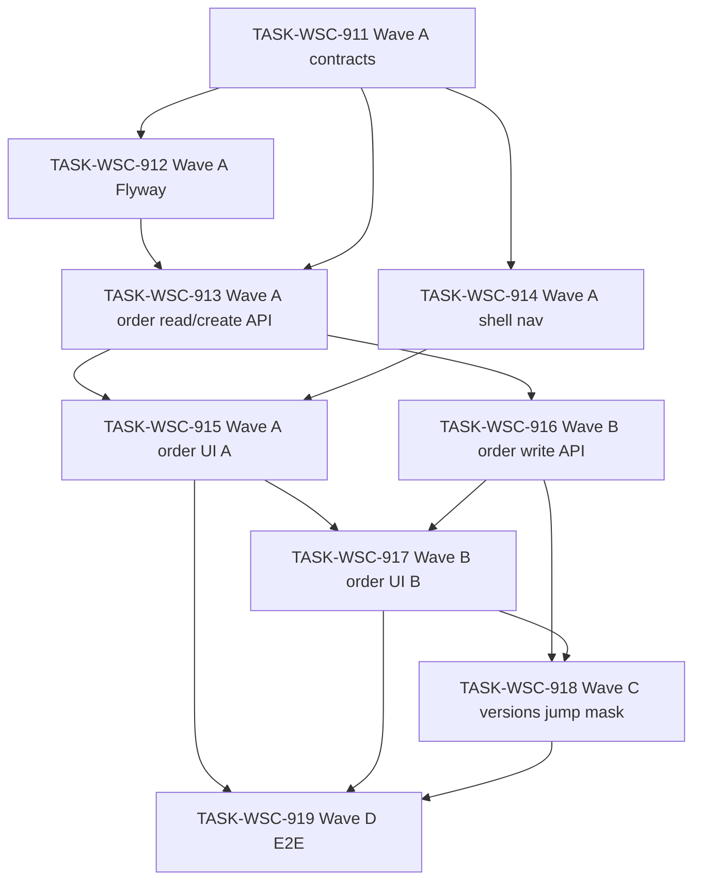

# 接入端工作台（WSC）V1.7 候选执行计划 — 交易订单（链内一事一议简易流程）（Round 1）

```yaml
planId: PLAN-WSC-9.1
status: DRAFT
planType: CANDIDATE
snapshotId: SNAP-WSC-009
sourcePrd: product/prd/wsc-v1.7-transaction-orders.md
runId: RUN-WSC-012
basedOn: PLAN-WSC-8.3
lineageFrom: PLAN-WSC-8.3
previousRun: RUN-WSC-011
functionalBaseline:
  snapshotId: SNAP-WSC-008
  planId: PLAN-WSC-8.3
  contracts: wsc-contracts@2.3.2
uxBaseline:
  snapshotId: SNAP-WSC-003
  planId: PLAN-WSC-3.1
contractsTarget: wsc-contracts@2.3.2
round: 1
createdAt: 2026-08-19
taskCount: 9
waveCount: 4
requirementCount: 21
authorRoles: [planEditor]
actorInstance: plan-editor-wsc-012-r1
```

> **候选声明**：本文件为 `PLAN-WSC-9.1` **Round 1** 候选稿（`planType: CANDIDATE` / `status: DRAFT`），基于已批准需求快照 `SNAP-WSC-009` 与功能基线 `PLAN-WSC-8.3`。须经规划委员会**隔离**独立评审后方可进入 `APPROVED`；本 planEditor 实例**不**伪造任何委员会批准，**不**自行关闭任何 ISSUE，**不**将 `status` 标为 `APPROVED`，**不**写入 `REV-*`，**不**写入 `ai/runs/**/state.yaml` 或 `events.jsonl`。
>
> **需求权威**：`snapshotId: SNAP-WSC-009`（`status: APPROVED`，PO 2026-08-19）。PRD `product/prd/wsc-v1.7-transaction-orders.md` 仅作叙述对照；验收以 SNAP 为准。
>
> **PO 已锁定**（SNAP `poLockedDefaults`）：成功指标=订单可追踪率；本期止于合约达成；仅平台内建单、外部回传建单不做；平台统一须知；签署附件为主；统一合约确认页；Word/PDF、20MB、一份、无限期、白名单+病毒扫描、按角色下载；人民币两位小数；含税未税同价且保留两字段；无拒绝/退回/超时态；上链 mock；按角色脱敏；列表仅分页（jumper+pageSize，档位 10/20/50/100）；状态不可回退；三未完成态三方可取消；ADMIN 可代 PROVIDER 确认订单/确认合约/取消；PROVIDER 仅本企业作为提供方；USER 仅本人需求方；ADMIN 列表全部；产品始终下单快照；数字合约主数据带入、变更出新版本；无通知 SLA；前端 `RULE-GLOBAL-FRONTEND`；波次 A/B/C。

## 0. 谱系、预落地对账与文件互斥

### 0.1 谱系与定位

| 概念 | 本计划取值 | 含义 |
|---|---|---|
| `planId` | PLAN-WSC-9.1 | V1.7 Round 1 候选执行计划 |
| `round` | 1 | 本 planId 共识轮次 |
| `basedOn` / `lineageFrom` | PLAN-WSC-8.3 | 相对 V1.6 批准计划的增量；**不抄** 8.3 业务任务（901–908） |
| 功能基线 | **SNAP-WSC-008** / **PLAN-WSC-8.3** / **`wsc-contracts@2.3.2`** | 目录筛选、座序图 L1、我的数据产品、我的目录、目录维护、用户企业归属、壳层目录菜单等**不得削弱** |
| UX 基线 | PLAN-WSC-3.1 / **SNAP-WSC-003** | 令牌/壳层质感**不回退** |
| 契约目标 | **`wsc-contracts@2.3.2`**（V1.7 **增量**挂在当前工作树已发布 semver 上） | 由 **TASK-WSC-911** **唯一**拥有契约/doc 增量与 `frontend/src/api/**` 生成；**禁止**他任务 bump `VERSION` |
| 需求权威 | SNAP-WSC-009 | 21 条增量 REQ（20×P0 级主路径含 FE + SHELL-011；2×P1）+ 继承 SNAP-008 行为 |
| 仓布局 | `ai/rules/project/repos.yaml` | 前端 `frontend/`；后端 `backend/`；契约在控制面 `contracts/` |
| 任务编号 | **TASK-WSC-911** 起递增 | **禁止**复用 TASK-WSC-901..910 |

### 0.2 预落地对账（强制）

> 下列路径在计划起草时**已存在**于工作树。各任务 developer **必须**先 diff 对账：保留符合 SNAP-008 的实现并补齐 SNAP-009 缺口；偏离 SNAP 的改动须修正或开 ISSUE。验收以 SNAP-009 + 本计划 acceptance 为准，**不以「代码已在」代替测试证据**。

| 波次/任务 | 预落地迹象（非穷尽；以工作树为准） | 对账要求 |
|---|---|---|
| **契约** | `contracts/VERSION` = **`2.3.3`**（高于目标声明 2.3.2）；OpenAPI / matrix / state-matrix 为 V1.6 | **911 对账**：在**当前 semver（2.3.3）**上合并 V1.7 订单增量；**禁止**静默再 bump 到 2.3.4（除非四头已互不一致，仅 911 可做一次对齐 bump）。**不得削弱** 2.3.2/2.3.3 已发布目录/企业 scope 语义 |
| **914** | `WorkbenchLayout.vue` 将「交易订单」放在 `navClosed`，点击 `goUnavailable('orders')`，展示「未开放」；`routes.ts` `/unavailable` hint 含交易订单 | 对齐 SNAP：USER「我的订单」；PROVIDER/ADMIN「交易订单」；进入真实列表；**保留**数据登记/连接器占位未开放；**不回退** V1.6 数据目录子菜单 |
| **useCanWrite.ts** | 对齐 matrix 2.3.3 目录能力，**无**订单能力键 | 914 **独占**增订单可见性导出；不得删 V1.6 `canSeeMyCatalog` 等 |
| **详情** | `ProductDetailPage.vue` 无订购入口 | 915 增加 USER 订购入口；不得改浏览筛选/座序图 |
| **后端** | 无 `controller/order`；Flyway 最高 **V9**（企业归属）；`ChainAttestationPort` 面向产品目录快照 | 912 从 **V10** 起新增 `t_order_*`；913/916 **复用**既有 mock 端口或订单专用 mock 适配，**禁止**接真链；包路径按类型分层 |
| **matrix** | 无订单 UI/API 单元格 | 911 增订单能力键；913/916 实现与矩阵逐 cell 一致 |

**路由冻结（全计划常量）**

| 常量 | 值 | 用途 |
|---|---|---|
| `ROUTE_ORDERS` | **`/orders`** | 三角色订单列表（菜单文案按角色：USER=我的订单，PROVIDER/ADMIN=交易订单） |
| `ROUTE_ORDER_DETAIL` | **`/orders/:orderId`** | 订单详情 |
| `ROUTE_ORDER_SUBSCRIBE` | **`/orders/subscribe/:productId`** | 订购入口（须知、链内提交；外部跳转非建单） |
| `ROUTE_MY_CATALOG` | `/my-catalog` | **继承** PLAN-WSC-8.3，本版不得改语义 |
| `ROUTE_CATALOG_MAINTENANCE` | `/catalog/maintenance` | 继承 |
| `ROUTE_CATALOG_BROWSE` | `/catalog` | 继承 |
| `ROUTE_MY_PRODUCTS` | `/my-products` | 继承 |

**包结构约束（后端）**：按类型分层（`controller|service|repository|entity|model|config|common`）；订单代码放 `controller/order/**`、`service/order/**`；**禁止**新建 `order/` 业务域顶层包。Java 根 = `backend/app/data-chain-service/src/main/java/com/shdata/datachain`。

**控制面禁止**：实现任务 **denyModify** `ai/runs/**/state.yaml`、`ai/runs/**/events.jsonl`；禁止伪造 REV-\* / 全员 APPROVE。

### 0.3 文件级互斥总览（机械 scope-check）

| 共享制品 | 唯一写任务 | 其他任务 |
|---|---|---|
| `contracts/**` + `frontend/src/api/**` | **911** | 他任务只读；**禁止**多任务 bump `VERSION`；**禁止 911∥915/917/918 写 api** |
| `backend/.../sql/migration/**`（及一切 `**/sql/**`） | **912** | 他任务 denyModify `**/sql/**` |
| 订单 BE 读/建：`controller/order/**`、`service/order/**`（创建/列表/详情）、订单 `entity`/`repository`/`model` 初版 | **913** → **916**（串行交接状态写） | 912 不得写 Java；916 启动前仅 913 可写上述路径 |
| `RbacMatrix.java` / `WriteAuthorizationInterceptor.java`（订单能力键增量） | **913** → **916**（串行） | 他任务 deny；**不得**削弱 V1.6 maintenance/mine 规则 |
| `frontend/.../WorkbenchLayout.vue` | **914** | 他任务 deny |
| `frontend/.../useCanWrite.ts` + spec | **914**（**独占全文**） | 913/915/916/917 denyModify |
| `frontend/.../router/routes.ts`、`shell/deepLinkAccess.ts`、`shell/navSurfaces.ts` | **914** → **915**（串行：915 增 subscribe/detail 路由，不得删 914 列表入口） | 917 不得改 routes（详情动作走已有 `/orders/:orderId`） |
| `frontend/src/features/order/**` 列表/订购/只读详情 | **915** → **917** → **918**（串行扩写动作/确认页/版本与脱敏） | 914 不得写 order feature 页 |
| `frontend/.../catalog/detail/ProductDetailPage.vue`（订购 CTA） | **915** | 他任务 deny（外部跳转做在 subscribe 页，归 918） |
| `tests/e2e/**` | **919** | 911..918 deny |
| `frontend/src/features/catalog/browse/**` | **无写任务** | 全任务 deny（V1.6 不回退） |
| `frontend/src/styles/**` / `theme/**` | **无写任务** | 全任务只读 |
| `ai/runs/**/state.yaml` | **无写任务** | 全任务 denyModify |

> **串行拥有权**：`routes.ts` 在 914 VERIFIED 前仅 914 可写订单列表路由；915 启动后可增 subscribe/detail，**不得**删除 914 已建立的角色化列表入口。  
> **useCanWrite.ts**：914 **独占**全文（含订单菜单/深链门控 + 既有 V1.6 导出）。  
> **订单 BE**：913 VERIFIED 前仅 913；916 在 913 基础上扩状态写/附件，**禁止**与 913 并行。  
> **订单 FE**：915 只读详情；917 扩动作按钮与统一确认/取消；918 扩数字合约版本区、外部跳转、脱敏对齐。

## 1. 范围、假设与硬门禁

### 1.1 范围

**In Scope（SNAP-WSC-009 / PO 已锁定）**

| Wave | 任务 | 内容 | 契约 |
|---|---|---|---|
| **A** | 911 → 912 → 913；911 → 914；913+914 → 915 | 菜单范围、订购入口/须知/创建、列表分页字段、详情快照只读、写成功 toast | **2.3.3 工作树增量**（订单读/建 + **一次性冻结**后续写接口形状，避免二次 bump） |
| **B** | 916 → 917 | 主流转、权限、附件计费、统一确认、取消+二次确认、时间线与 mock 上链（创建已在 A，B 补齐其余变更） | 消费 911；**禁止**再 bump |
| **C** | 918 | 数字合约版本、外部跳转非建单、脱敏对齐 | 消费 911 |
| **D** | 919 | V1.7 P0 E2E 证据包 + 与 V1.6/V1.4 回归命令共存 | — |

**Out of Scope / 默认 deny**

- 外部成交回传建单（可保留跳转入口）
- 拒绝、退回、撤回、超时关闭等额外状态
- 通知、待办、催办、处理时限
- 真实上链与上链失败补偿（本期 mock；不以真链成败阻断状态）
- 支付、退款、分账、发票、对账、交付、履约、售后；本期止于**合约达成**
- 列表导出、批量操作、日期范围筛选
- 合同司法效力、电子签章平台对接细则
- 同一企业内订单共享、协作、转交
- 企业管理页、超管/企管菜单拆分
- 削弱 V1.6 目录/座序图/我的数据产品/我的目录/目录维护/用户企业/壳层目录菜单
- 将 Demo 示例金额、随机哈希、固定企业信息当作正式规则
- 复用或改写 TASK-WSC-901..910 的业务写集（浏览筛选、座序图、我的目录等）

### 1.2 假设（PO 已确认 / SNAP 收录；OPEN 项为实现假设，**不假装 PO 已关**）

| 项 | 口径 |
|---|---|
| `contractsTarget` | 语义基线 **`wsc-contracts@2.3.2` 不得削弱**；工作树当前 **2.3.3**；V1.7 由 **911 唯一**合并增量，**默认不再升 semver** |
| 订单列表路由 | 三角色共用 **`/orders`**；**菜单文案**按角色区分，避免 USER 看到「交易订单」范围误解 |
| 提供方企业 | 下单时 `providerEnterpriseId` = 产品 `create_by` 对应用户的 `sys_user.enterprise_id`（与 V1.6 本企业推导同源）；PROVIDER 列表/动作仅匹配该字段 = 会话 `enterpriseId` |
| 需求方 | `demandUserId` = 创建会话用户；USER 列表仅此；上传合约仅此 |
| ADMIN 代操作 | 可对**任意企业**订单执行确认订单、确认合约、取消；**不可**代需求方上传合约 |
| 链内简易流程开关 | 产品列 `allow_simple_order`（912）；**实现假设**：既有产品迁移默认 `1` 以便 Wave A 可观察；本版**不改**产品编辑器（编辑开关非 SNAP 条目）。不允许则为 0，不可链内建单 |
| 平台统一须知 | 服务端只读资源 + 勾选令牌；每次链内提交须勾选；正文可查看 |
| 状态机 | 待确认订单 → 待上传合约 → 待确认合约 → 合约已达成；旁路已取消；**不可回退**；无拒绝/退回/超时 |
| 上链 | **mock**；创建及每次状态变更写时间线 + mock 记录；列表 `chainCount` = 详情记录数 |
| 附件 | 一份 Word/PDF ≤20MB；白名单+病毒扫描；无合格附件不能进待确认合约；在线文本不能替代附件 |
| 金额 | 人民币、两位小数；单价>0；缺单位或数量不能提交；含税未税**同价**且**两字段都存** |
| 产品信息 | 详情产品区**始终快照**，不跟新产品漂移 |
| 数字合约 | 下单按主数据出初版；相关变更出新版本并保留历史；无主数据空值不阻断下单（P1，Wave C） |
| 外部跳转 | 有地址打开；无地址提示未配置；**不建单**（P1，Wave C） |
| UX 不回退 | SNAP-WSC-003 / PLAN-WSC-3.1；前端 toast/二次确认/分页以 `RULE-GLOBAL-FRONTEND` 为准 |
| OQ-V17-001 | **OPEN non-blocking**：脱敏实现假设见 §2.2 |
| OQ-V17-002 | **OPEN non-blocking**：扫描实现假设见 §2.2 |
| OQ-V16-001..003 | **OPEN non-blocking**：继承 8.3，本模块不改企业模型/座序图口径 |
| Blocking OQ | **无** |

### 1.3 技术栈硬门禁

同 PLAN-WSC-8.3 / PLAN-WSC-8.1：Vue 3 + TypeScript；Ant Design Vue 增量控件须 token 映射；Spring Boot 2.7.18；Flyway 唯一 DDL 入口；`ddl-auto=validate`；Playwright E2E。

### 1.4 执行硬门禁

- 每任务：独立 developer → codeReviewer → tester；Orchestrator 按 `writeSet` **字面路径** scope-check。
- developer ≠ codeReviewer ≠ tester。
- 同波并行写集必须互斥（见 §6）。
- **TASK-WSC-911** **唯一**拥有契约/doc 增量与 `frontend/src/api/**` 生成；禁止他任务改 `contracts/VERSION`。
- **TASK-WSC-912** **唯一**拥有 Flyway；订单表 `t_` 前缀 + 审计四件套 + `del_flag`；**无跨表外键**。
- 权限：隐藏 ≠ 授权；深链与 API 一致。
- UX：增量控件消费既有令牌；**禁止**另起全局色板。
- 命中 `auth-model-change`（911/913/914/916）→ 独立 **securityReviewer**，未通过不得 `VERIFIED`。
- 命中 `schema-migration`（912）→ 独立 **migrationReviewer**，未通过不得 `VERIFIED`。

### 1.5 UX 不回退 + 前端全局规则

| 约束 | 口径 |
|---|---|
| 令牌 | 沿用既有 CSS 变量；订单页 scoped / Ant `ConfigProvider` 映射增量 |
| V1.6 壳层 | 数据目录可收起子菜单、ADMIN 双入口、PROVIDER 无目录维护、侧栏企业只读、USER 深链隔离 **不回退** |
| `RULE-GLOBAL-FRONTEND` §1 | 创建/确认订单/提交合约/确认合约/取消 **成功须 toast**；失败无成功 toast；只读成功不必 toast |
| `RULE-GLOBAL-FRONTEND` §2 | 取消须二次确认；未确认不发请求、状态不变 |
| `RULE-GLOBAL-FRONTEND` §3 | 订单列表 quick jumper + pageSize；档位 10/20/50/100，缺省 10；改 size 回第 1 页；复用维护页 Pagination 约定 |

## 2. 决策与开放问题

### 2.1 必须遵守的 DEC / PO 锁定

- DEC-WSC-001..006（产品编码、mock 存证端口、包结构等）继承，不削弱。
- SNAP-WSC-008 / PLAN-WSC-8.3 **RELEASED/APPROVED** 行为继承。
- SNAP-WSC-009 `poLockedDefaults` 全文遵守（见文首）。

### 2.2 开放问题处理口径

| id | status | 本计划口径（**不关闭** OQ） |
|---|---|---|
| OQ-V17-001 | OPEN（non-blocking） | **实现假设**：ADMIN 详情/列表敏感字段完整可读；PROVIDER 可见本企业订单的需求方姓名/单位，信用代码/连接器/合约正文按目录 `SensitiveId` 截断+可复制策略；USER 仅见本人信息明文，提供方信用代码等截断。附件下载：需求方本人、本企业 PROVIDER、ADMIN 可下载签署附件；越权 403。细则可被后续 PO 修订而不改任务边界 |
| OQ-V17-002 | OPEN（non-blocking） | **实现假设**：引入 `OrderAttachmentScanPort`；本期默认实现为**同步调用且对白名单文件返回通过**（保证「必须扫描」可观察：未调用端口不得入库）；可替换为真实引擎。扫描失败或未扫描 → 附件不合格，不能进入待确认合约。选型不在本计划裁定为最终架构 |
| OQ-V16-001 | OPEN（non-blocking） | 不改企业最小字段；订单只读 `SessionPrincipal.enterpriseId` |
| OQ-V16-002 | OPEN（non-blocking） | 不改 orphan 迁移；UNASSIGNED 企业 PROVIDER 不得看到 DEMO 企业作为提供方的订单 |
| OQ-V16-003 | OPEN（non-blocking） | 本模块不改座序图 |
| OQ-V17-PO-001..020 | CLOSED | 按 SNAP 已关闭结论实现，不重开 |

## 3. 契约增量与唯一所有权（工作树 2.3.3 上的 V1.7 增量）

### 3.1 契约冻结内容（TASK-WSC-911 一次性 — 硬冻结）

| 契约项 | 内容 |
|---|---|
| VERSION | **保持工作树当前 semver（起草时 2.3.3）**；合并 V1.7 订单增量；**禁止**他任务再 bump；四头同步见 911 acceptance |
| 既有不回退 | Session `enterpriseId`+`enterpriseName`；maintenance `scope=full\|myCatalog`；mine 本企业；全链无企业过滤；`l1CategoryId`；PROVIDER 无目录维护；ADMIN 产品写 200 |
| tag | 新增 `orders` |
| `GET /orders` | 分页列表；query：`keyword`、`status`、`page`、`pageSize`（档位 10/20/50/100）；范围**仅**信 SessionPrincipal：**禁止**客户端传 `enterpriseId`/`userId` 扩权。USER=本人需求方；PROVIDER=本企业提供方；ADMIN=全部 |
| `POST /orders` | 链内创建；body：`productId`、`remark`、`noticeAccepted=true`；备注空/未勾选须知 → 4xx；产品 `allowSimpleOrder=false` → 4xx；成功：订单号、状态=`PENDING_CONFIRM`（页面名「待确认订单」）、快照已写 |
| `GET /orders/{orderId}` | 详情：快照、参与方、状态、附件元数据、交易信息、时间线、mock 上链、数字合约版本列表；越权 403 |
| `POST /orders/{orderId}/confirm` | 确认订单；PROVIDER 本企业或 ADMIN；`PENDING_CONFIRM` → `PENDING_UPLOAD` |
| `POST /orders/{orderId}/contract` | multipart：签署附件 + 交易信息 JSON；仅需求方本人；`PENDING_UPLOAD` → `PENDING_CONTRACT_CONFIRM`；无合格附件 4xx |
| `POST /orders/{orderId}/contract/confirm` | 统一确认；body：`noticeAccepted=true`；PROVIDER 本企业或 ADMIN；`PENDING_CONTRACT_CONFIRM` → `CONTRACT_REACHED` |
| `POST /orders/{orderId}/cancel` | 三未完成态；USER 本人 / PROVIDER 本企业 / ADMIN；终态不可取消 |
| `GET /orders/notices/current` | 平台统一须知正文 |
| `GET /orders/{orderId}/attachment` | 按角色下载；越权 403 |
| 状态枚举（API 代码） | `PENDING_CONFIRM`、`PENDING_UPLOAD`、`PENDING_CONTRACT_CONFIRM`、`CONTRACT_REACHED`、`CANCELLED`；页面文案与 SNAP 状态机表对齐 |
| 金额 | `currency=CNY`；`amountTaxInclusive`、`amountTaxExclusive` 均为 string/decimal 两位；本期写入相等 |
| 安全说明 | 订单 scope **仅**信 SessionPrincipal；拒绝客户端 enterprise/user 作授权 |
| `rbac/matrix.yaml` | 见 §3.1 矩阵表；**逐 cell** 与 OpenAPI description 一致 |
| `ui/state-matrix.md` | USER 我的订单；PROVIDER/ADMIN 交易订单；占位「未开放」对订单消失；目录菜单不回退 |
| `req-coverage.md` | 映射 SNAP-009 全部增量 REQ + 注明继承 SNAP-008 |
| `ChainAttestationPort.md` | 允许订单事件以 mock 适配调用（可扩展 request 类型或并列 OrderAttestation 说明）；**不**要求真链 |
| client | 重新生成 `frontend/src/api/**` 且可 typecheck |

**RBAC 矩阵字面表（911 / §4 / OpenAPI 须一致；V1.6 单元格不得改值）**

| 能力键 | ADMIN | PROVIDER | USER |
|---|---|---|---|
| V1.6 全部既有键 | **保持 2.3.3 原文** | 保持 | 保持 |
| `ordersUI` | visible（文案「交易订单」） | visible（文案「交易订单」） | visible（文案「我的订单」） |
| `ordersListApi` | **200 all** | **200 ownEnterpriseAsProvider** | **200 ownAsDemand** |
| `ordersCreateApi` | 403（本版不代建） | 403 | **200**（产品允许简易流程） |
| `ordersConfirmApi` | **200 any**（代 PROVIDER） | **200 ownEnterpriseAsProvider** | 403 |
| `ordersSubmitContractApi` | 403 | 403 | **200 ownAsDemand** |
| `ordersConfirmContractApi` | **200 any** | **200 ownEnterpriseAsProvider** | 403 |
| `ordersCancelApi` | **200 any**（三未完成态） | **200 ownEnterpriseAsProvider** | **200 ownAsDemand** |
| `ordersAttachmentGet` | **200** | **200 ownEnterpriseAsProvider** | **200 ownAsDemand** |

### 3.2 数据迁移协议（912 独占）

- 下一脚本建议 **`V10__create_t_order_tables.sql`**（若工作树已有更高版本，用「当前最高 +1」，仍仅 912 可写）。
- 表名 `t_order_*`；列：审计四件套 + `del_flag`；**禁止**跨表物理外键；关联用业务列（订单号、用户 id 字符串、enterprise_id 字符串、product_code）。
- 建议表（可在同版本脚本内，主题仍为订单）：
  - `t_order_header`：订单号、状态、需求方用户、提供方企业、产品 id/编码、产品快照 JSON、备注、须知版本、含税金额、未税金额、币种、上链次数缓存等
  - `t_order_line`：计费明细（单位、数量、单价、小计）
  - `t_order_event`：时间线
  - `t_order_chain_log`：mock 上链展示字段（哈希、高度、时间等，来源模拟适配器）
  - `t_order_attachment`：文件名、类型、大小、存储键、扫描结果
  - `t_order_contract_version`：数字合约版本号与 JSON 快照
- 产品表增量：`allow_simple_order TINYINT NOT NULL DEFAULT 1`（既有行默认允许，便于验收；**实现假设**，见 §1.2）。
- 禁止向 `db/migration/` 追加脚本。
- 逻辑删除查询默认 `del_flag=0`。

## 4. RBAC 可测矩阵（对齐 SNAP-WSC-009）

| 能力 | ADMIN | PROVIDER | USER |
|---|---|---|---|
| 菜单 | 交易订单 `/orders` | 交易订单 `/orders` | 我的订单 `/orders` |
| 列表范围 | 平台全部 | **仅**当前企业作为提供方 | **仅**本人作为需求方 |
| 确认订单 / 确认合约 | **可代**任意企业 | 仅本企业；**不可**代其他企业 | 否 |
| 上传合约与交易信息 | 否 | 否 | 待上传合约且本人 |
| 取消（三未完成态） | 可代取消 | 本企业订单 | 本人订单 |
| 链内创建 | 否（本版） | 否 | 产品允许简易流程时 |
| V1.6 目录/壳层 | 继承 8.3 | 继承；不可代其他企业目录写 | 仅全链浏览 |

前端隐藏 ≠ 授权。

### 4.1 三角色回归单元格（914 / 915 / 917 / 919 强制勾选）

| 角色 | 正例 | 负例 |
|---|---|---|
| ADMIN | 见全部订单；可代确认订单/确认合约/取消；目录双入口仍在 | 不能代 USER 上传合约；无企业管理页；订单菜单不是「未开放」 |
| PROVIDER | 仅本企业提供方订单；可确认/取消本企业单 | 他企业订单列表不可见；代他企确认 **403**；无目录维护 |
| USER | 我的订单；可创建；待上传可提交附件；可取消本人未完成单 | 看不见他人需求方订单；确认订单按钮不可见；确认合约 **403**；深链目录维护仍不可达 |

## 5. 任务包列表

> 任务 ID：`TASK-WSC-911`..`919`。路径以 `repos.yaml` 为准。

### TASK-WSC-911 — Wave A：契约 V1.7 订单增量 + client 生成（唯一 bump/生成）

- `requirements`: `[REQ-WSC-ORDER-001, REQ-WSC-ORDER-003, REQ-WSC-ORDER-006, REQ-WSC-ORDER-007, REQ-WSC-ORDER-010, REQ-WSC-ORDER-011, REQ-WSC-ORDER-012, REQ-WSC-ORDER-013, REQ-WSC-ORDER-014, REQ-WSC-ORDER-015, REQ-WSC-ORDER-016, REQ-WSC-ORDER-017, REQ-WSC-ORDER-005, REQ-SHELL-011, REQ-API-001]`
- `objective`: 按 §3.1 **一次性冻结**订单读/建/**全部写状态与附件/确认/取消** 的 OpenAPI 与矩阵，避免 Wave B/C 再改 VERSION；生成 `frontend/src/api/**`；**本计划唯一**契约任务
- `dependsOn`: `[]`
- `readSet`:
  - `product/requirements/SNAP-WSC-009.md`
  - `product/prd/wsc-v1.7-transaction-orders.md`
  - `planning/proposals/PLAN-WSC-9.1.md`（本文件 §3 / §4）
  - 既有 `contracts/**`（含 VERSION 2.3.3、V1.6 matrix）
- `writeSet`:
  - `contracts/**`（含 `VERSION`、`openapi/**`、`rbac/matrix.yaml`、`ui/state-matrix.md`、`req-coverage.md`、`errors/codes.yaml`、`chain/ChainAttestationPort.md`、`security/sensitive-fields.md` 若需订单补充）
  - `frontend/src/api/**`
  - `frontend/package.json`、`frontend/pnpm-lock.yaml`（**仅当** client 生成必需）
- `denyModify`:
  - `frontend/src/features/**`；`frontend/src/layouts/**`；`frontend/src/router/**`
  - `backend/**`；`**/sql/**`
  - `tests/e2e/**`
  - `product/**`；`planning/**`；`ai/runs/**/state.yaml`；`ai/runs/**/events.jsonl`
- `acceptance`:
  - **版本四头同步**：`contracts/VERSION`、`rbac/matrix.yaml` version、`openapi.yaml` `info.version`、`ui/state-matrix.md` 版本头为**同一 semver**（默认保持 2.3.3）
  - OpenAPI 含 §3.1 全部订单 path 与状态枚举、金额双字段、须知、附件下载、安全说明（scope 仅信会话）
  - `matrix.yaml` 与 §3.1 **逐 cell 一致**（含 V1.6 单元格**零回退**）
  - `state-matrix.md`：订单菜单角色化文案；数据登记/连接器仍可未开放；V1.6 目录 IA 不回退
  - `frontend/src/api/**` 生成后可 typecheck
  - req-coverage 含 SNAP-009 21 条增量映射
- `testScope`:
  - 契约 lint / OpenAPI 校验
  - matrix 与 §3.1 交叉检查清单（订单键 + V1.6 回归抽样）
  - client typecheck
  - **对账清单**：禁止无故升到 2.3.4；若必须对齐 bump，在本任务说明原因且仅一次
- `riskTags`: `[contracts-bump, rbac-breaking, order-scope, auth-model-change]`

### TASK-WSC-912 — Wave A：订单表 Flyway + 产品简易流程标记（唯一 SQL）

- `requirements`: `[REQ-WSC-ORDER-006, REQ-WSC-ORDER-009, REQ-WSC-ORDER-013, REQ-WSC-ORDER-014, REQ-WSC-ORDER-016, REQ-WSC-ORDER-017, REQ-WSC-ORDER-003]`
- `objective`: 按 §3.2 创建 `t_order_*`（审计四件套 + `del_flag`，无跨表外键）；产品表增加 `allow_simple_order`；幂等可重入
- `dependsOn`: `[TASK-WSC-911]`
- `readSet`:
  - SNAP-WSC-009；本计划 §3.2
  - 既有 `sql/migration/V1`..`V9`（只读，对账最高版本）
  - `backend/CLAUDE.md` 数据库规则
- `writeSet`:
  - `backend/app/data-chain-service/src/main/resources/sql/migration/**`（**独占**）
- `denyModify`:
  - `contracts/**`；`frontend/**`
  - `backend/**/java/**`（实体映射归 913）
  - `tests/e2e/**`；`product/**`；`planning/**`；`ai/runs/**/state.yaml`；`ai/runs/**/events.jsonl`
- `acceptance`:
  - 脚本幂等（`CREATE TABLE IF NOT EXISTS` / 列增量可重复执行策略文档化）
  - 每张新业务表含 `create_time`/`create_by`/`update_time`/`update_by`/`del_flag`
  - **无** `FOREIGN KEY` 子句
  - `t_` 前缀、单数表名；金额两列（含税/未税）
  - 产品 `allow_simple_order` 有默认值；既有行可链内订购（§1.2 假设）
  - JPA `validate` 将在 913 实体对齐后通过；本任务交付迁移 smoke（空库/已有 V9 库）
- `testScope`:
  - 迁移 smoke：在 V9 之上执行 V10（或下一号）成功
  - 检查清单：无 FK、四件套、`del_flag`、表名前缀
- `riskTags`: `[schema-migration, handles-pii]`

### TASK-WSC-913 — Wave A：订单创建 / 列表 / 详情只读 API + 创建时时间线与 mock 上链

- `requirements`: `[REQ-WSC-ORDER-001, REQ-WSC-ORDER-003, REQ-WSC-ORDER-004, REQ-WSC-ORDER-006, REQ-WSC-ORDER-007, REQ-WSC-ORDER-008, REQ-WSC-ORDER-009, REQ-WSC-ORDER-016, REQ-WSC-ORDER-FE-003]`
- `objective`: 实现 GET/POST 列表与创建、GET 详情；角色 scope；产品快照冻结；须知校验；创建写时间线 + mock 上链；分页 page/pageSize；**不实现**确认/上传/取消写（归 916，但 911 已冻结形状）
- `dependsOn`: `[TASK-WSC-911, TASK-WSC-912]`
- `readSet`:
  - `frontend/src/api/**`、`contracts/**`（只读，911 生成物）
  - 既有 `SessionPrincipal`、`RbacMatrix`、`WriteAuthorizationInterceptor`、`ChainAttestationPort` / `SimulatedChainAttestationPort`
  - 产品实体/仓储（只读，取快照与 `allow_simple_order`、create_by→enterprise）
- `writeSet`:
  - `backend/app/data-chain-service/src/main/java/com/shdata/datachain/controller/order/**`
  - `backend/app/data-chain-service/src/main/java/com/shdata/datachain/service/order/**`
  - `backend/app/data-chain-service/src/main/java/com/shdata/datachain/entity/**`（**仅**订单相关实体及产品实体 `allowSimpleOrder` 字段映射）
  - `backend/app/data-chain-service/src/main/java/com/shdata/datachain/repository/**`（**仅**订单相关 Repository）
  - `backend/app/data-chain-service/src/main/java/com/shdata/datachain/model/**`（**仅**订单 DTO/枚举；deny 改 CatalogProduct 除必要时的只读扩展 record **优先**新建 `OrderProductSnapshot` 而不改浏览 record）
  - `backend/app/data-chain-service/src/main/java/com/shdata/datachain/common/security/RbacMatrix.java`（**仅增**订单方法，不改 V1.6 方法语义）
  - `backend/app/data-chain-service/src/main/java/com/shdata/datachain/common/security/WriteAuthorizationInterceptor.java`（挂载订单写路径：本任务仅 `POST /orders`）
  - `backend/app/data-chain-service/src/test/java/com/shdata/datachain/order/**`
- `denyModify`:
  - `**/sql/**`
  - `contracts/**`；`frontend/**`
  - `controller/catalog/**`；`service/catalog/**`（除只读调用）
  - `tests/e2e/**`；`product/**`；`planning/**`；`ai/runs/**/state.yaml`；`ai/runs/**/events.jsonl`
- `acceptance`:
  - USER 创建：备注空/未勾选须知/产品不允许简易流程 → 失败且无订单行
  - 成功：订单号、`PENDING_CONFIRM`、详情产品为快照 JSON、时间线创建记录、mock 上链至少 1 条；`chainCount=1`
  - 列表：USER 不见他人需求方单；PROVIDER 不见他企提供方单；ADMIN 全可见；keyword（订单号/产品名/编码/需求方姓名/单位）与状态筛选生效；空列表语义由 FE 展示「暂无订单数据」，API total=0
  - 分页：`pageSize` 仅允许 10/20/50/100
  - 篡改 query `enterpriseId` **不扩大**可见面
  - ADMIN/PROVIDER `POST /orders` → 403
  - 创建路径 mock 失败**不得**阻断建单（PO：mock；实现假设：捕获适配异常仍写本地 mock 行或降级占位记录，状态仍成功）——若端口抛错，订单与时间线仍提交，上链区可标记 mocked/degraded，**不以真链成败为门禁**
- `testScope`:
  - 集成：三角色列表正/负例；创建校验；快照不随产品改名漂移（改产品后详情仍旧名）
  - 集成：分页非法 pageSize 4xx
  - 安全：IDOR 他单 403；enterprise 参数负例
  - 命名用例：`913-create-snapshot-and-mock`、`913-role-list-scope`
- `riskTags`: `[auth-model-change, data-isolation, order-create]`

### TASK-WSC-914 — Wave A：开放订单导航 + FE 门控（独占 useCanWrite）

- `requirements`: `[REQ-SHELL-011, REQ-WSC-ORDER-001]`
- `objective`: 从 `navClosed` 移除订单占位；USER 侧栏「我的订单」、PROVIDER/ADMIN「交易订单」进入 `/orders`；深链门控；**独占** `useCanWrite.ts` 增订单导出且 **不削弱** V1.6 目录函数
- `dependsOn`: `[TASK-WSC-911]`
- `readSet`:
  - SNAP-WSC-009 REQ-SHELL-011 / ORDER-001
  - `frontend/src/api/**`（只读）
  - `contracts/rbac/matrix.yaml`（只读）
  - `WorkbenchLayout.vue`、`useCanWrite.ts`、`routes.ts`、`deepLinkAccess.ts`、`navSurfaces.ts`
- `writeSet`:
  - `frontend/src/layouts/WorkbenchLayout.vue`
  - `frontend/src/layouts/WorkbenchLayout.spec.ts`
  - `frontend/src/features/auth/composables/useCanWrite.ts`
  - `frontend/src/features/auth/composables/useCanWrite.spec.ts`
  - `frontend/src/router/routes.ts`（增 `/orders` 列表占位页或空壳；meta.title 可按角色在页内设置）
  - `frontend/src/features/shell/deepLinkAccess.ts`
  - `frontend/src/features/shell/navSurfaces.ts`（订单路由常量 `ROUTE_ORDERS`；**不得**破坏四目录 surface）
  - `frontend/src/features/shell/**` 相关 spec
- `denyModify`:
  - `frontend/src/features/catalog/**`
  - `frontend/src/features/order/**`（页实现归 915）
  - `contracts/**`；`frontend/src/api/**`
  - `backend/**`
  - `tests/e2e/**`；`product/**`；`planning/**`；`ai/runs/**/state.yaml`；`ai/runs/**/events.jsonl`
  - `frontend/src/styles/**`；`frontend/src/theme/**`
- `acceptance`:
  - USER：可见「我的订单」；不可见「交易订单」文案作为自己的菜单标签；点击进入 `/orders`；**不再**出现订单「本版本未开放」
  - PROVIDER/ADMIN：可见「交易订单」；进入 `/orders`
  - 数据登记、连接器管理仍未开放
  - V1.6：数据目录收纳、我的目录、目录维护（仅 ADMIN）、我的数据产品、用户管理 **可见性不回退**
  - `useCanWrite`：新增 `canSeeOrders`（三角色 true）等；既有 `canSeeMyCatalog`/`canMaintainCatalog` 行为不变
  - 未登录处理与既有壳层一致
- `testScope`:
  - Vitest 三角色菜单文案与 `navClosed` 不再含 orders 占位
  - Vitest：USER 仍不可达 `/catalog/maintenance`、`/my-catalog`、`/my-products`、`/admin/users`
  - Vitest：PROVIDER 仍不可达目录维护
  - 命名用例：`914-orders-nav-open`、`914-v16-catalog-nav-regression`
- `riskTags`: `[shell-nav, rbac-visibility, auth-model-change]`

### TASK-WSC-915 — Wave A：订购入口 / 须知 / 创建 UI / 列表分页字段 / 只读详情 / toast

- `requirements`: `[REQ-WSC-ORDER-002, REQ-WSC-ORDER-003, REQ-WSC-ORDER-004, REQ-WSC-ORDER-006, REQ-WSC-ORDER-007, REQ-WSC-ORDER-008, REQ-WSC-ORDER-009, REQ-WSC-ORDER-FE-001, REQ-WSC-ORDER-FE-003, REQ-WSC-ORDER-001]`
- `objective`: 产品详情订购 CTA（USER）；订购页展示产品与订购人信息、统一须知勾选、链内提交；列表九组字段+查看；Ant Pagination jumper+pageSize；详情只读分区+快照；创建成功 toast；空态「暂无订单数据」。Wave B 动作按钮可占位隐藏
- `dependsOn`: `[TASK-WSC-913, TASK-WSC-914]`
- `readSet`:
  - SNAP-WSC-009 对应 REQ；`RULE-GLOBAL-FRONTEND`
  - `frontend/src/api/**`（只读）
  - `useCanWrite.ts`（只读，914 产出）
  - 维护页 Pagination 实现（只读参考）
- `writeSet`:
  - `frontend/src/features/order/**`（列表、订购、只读详情、composable、spec、toast 辅助若放在 `features/order/utils/toast.ts`）
  - `frontend/src/features/catalog/detail/ProductDetailPage.vue`（及必要 spec：**仅**增加 USER 订购入口，不改快照/编辑/上链按钮语义）
  - `frontend/src/router/routes.ts`（在 914 基础上增 `/orders/subscribe/:productId`、`/orders/:orderId`；**不得**删 `/orders` 与 V1.6 路由）
- `denyModify`:
  - `frontend/src/layouts/WorkbenchLayout.vue`
  - `frontend/src/features/auth/composables/useCanWrite.ts`
  - `frontend/src/features/catalog/browse/**`
  - `frontend/src/features/catalog/maintenance/**`；`editor/**`；`import/**`（detail 仅 ProductDetailPage 例外）
  - `contracts/**`；`frontend/src/api/**`
  - `backend/**`；`**/sql/**`
  - `tests/e2e/**`；`product/**`；`planning/**`；`ai/runs/**/state.yaml`；`ai/runs/**/events.jsonl`
  - `frontend/src/styles/**`；`frontend/src/theme/**`
- `acceptance`:
  - 订购入口展示：产品名称、编码、类型、提供方、来源平台、访问地址、当前订购人及所属单位
  - 未勾选须知 / 备注为空不能提交；不允许简易流程时不可链内建单（按钮禁用或提交 4xx 有错误提示）
  - 创建成功 toast；失败无成功 toast
  - 列表九组字段；查看进详情；标题含订单号；可返回列表；产品区为快照
  - 分页：可跳页、可改 pageSize 且回第 1 页；档位 10/20/50/100；缺省 10
  - 无匹配「暂无订单数据」
  - 敏感字段可先按 §2.2 假设做最小截断（C 波 918 对齐）
- `testScope`:
  - Vitest：须知未勾选不发 POST；备注空不发
  - Vitest：pageSize 变更 → page=1；jumper 发对应 page
  - Vitest：创建成功调用 toast 一次；失败 0 次
  - Vitest：列表字段 testid 齐全
  - 命名用例：`915-subscribe-notice`、`915-list-pagination-jumper`
- `riskTags`: `[ux-order-create, frontend-toast-pagination]`

### TASK-WSC-916 — Wave B：状态机 / 权限 / 附件计费 / mock 上链补齐（订单 BE 写扩展）

- `requirements`: `[REQ-WSC-ORDER-010, REQ-WSC-ORDER-011, REQ-WSC-ORDER-012, REQ-WSC-ORDER-013, REQ-WSC-ORDER-014, REQ-WSC-ORDER-015, REQ-WSC-ORDER-016]`
- `objective`: 实现确认订单、提交附件+交易信息、统一确认合约、取消；不可回退；金额 CNY 两位小数双字段同价；附件白名单+扫描端口+单文件 20MB；每次状态变更新增时间线与 mock 上链；列表 chainCount 与详情条数一致；越权 403 且状态不变
- `dependsOn`: `[TASK-WSC-913]`
- `readSet`:
  - contracts OpenAPI 订单写 path（只读）
  - 913 订单服务/实体
  - `ChainAttestationPort`
- `writeSet`:
  - `backend/app/data-chain-service/src/main/java/com/shdata/datachain/controller/order/**`
  - `backend/app/data-chain-service/src/main/java/com/shdata/datachain/service/order/**`
  - 订单相关 `entity`/`repository`/`model`（附件、明细、事件、链日志）
  - `backend/app/data-chain-service/src/main/java/com/shdata/datachain/common/port/**`（**仅**新增 `OrderAttachmentScanPort` 及默认实现；**禁止**把产品目录 `attest` 改成真链）
  - `RbacMatrix.java` / `WriteAuthorizationInterceptor.java`（挂载 confirm/contract/cancel）
  - `backend/app/data-chain-service/src/test/java/com/shdata/datachain/order/**`
- `denyModify`:
  - `**/sql/**`
  - `contracts/**`；`frontend/**`
  - `controller/catalog/**`；`service/catalog/**`
  - `tests/e2e/**`；`product/**`；`planning/**`；`ai/runs/**/state.yaml`；`ai/runs/**/events.jsonl`
- `acceptance`:
  - 状态：确认订单 → 待上传合约 → 提交合格附件与计费 → 待确认合约 → 勾选须知确认 → 合约已达成；达成后无支付/交付 API
  - 不可回退：逆向 POST → 4xx，状态不变
  - PROVIDER 他企确认/取消 → 403；USER 确认订单/确认合约 → 403；ADMIN 可代确认/取消，**不能**代上传
  - 无附件/非 Word-PDF/>20MB/扫描失败 → 不能进入待确认合约
  - 单价 ≤0 或缺单位/数量 → 不能提交；明细小计正确；含税=未税=同一金额两位小数
  - 取消：三未完成态成功 → `CANCELLED`；达成/已取消再取消 4xx
  - 创建+确认+提交+达成+取消路径均有时间线与 mock 记录；`chainCount` 一致
  - 在线文本字段即使有值，无附件仍失败
- `testScope`:
  - 集成：主路径四步 + 取消三态参数化
  - 集成：三角色动作正/负例表（§4）
  - 集成：附件类型/大小/扫描失败
  - 集成：金额舍入两位；两字段相等
  - 命名用例：`916-state-machine`、`916-admin-proxy-provider`、`916-cancel-three-states`
- `riskTags`: `[auth-model-change, attachment-scan, state-machine]`

### TASK-WSC-917 — Wave B：确认 / 上传 / 统一确认页 / 取消二次确认 / toast

- `requirements`: `[REQ-WSC-ORDER-010, REQ-WSC-ORDER-011, REQ-WSC-ORDER-012, REQ-WSC-ORDER-013, REQ-WSC-ORDER-014, REQ-WSC-ORDER-015, REQ-WSC-ORDER-FE-001, REQ-WSC-ORDER-FE-002, REQ-WSC-ORDER-016]`
- `objective`: 在 915 详情上按角色显示动作；统一合约确认页（同一路由或同页步骤，**禁止**第二套「标准合约」独立确认路径）；取消二次确认；各写成功 toast；模板下载与交易信息表单
- `dependsOn`: `[TASK-WSC-915, TASK-WSC-916]`
- `readSet`:
  - SNAP 对应 REQ；`RULE-GLOBAL-FRONTEND`
  - `frontend/src/api/**`（只读）
  - 915 `features/order/**`
- `writeSet`:
  - `frontend/src/features/order/**`（详情动作、确认页组件、上传表单、cancel confirm、spec）
- `denyModify`:
  - `frontend/src/layouts/WorkbenchLayout.vue`
  - `frontend/src/features/auth/composables/useCanWrite.ts`
  - `frontend/src/router/routes.ts`（统一确认页挂在 915 已建的 `/orders/:orderId`，本任务**不改**路由表）
  - `frontend/src/features/catalog/**`
  - `contracts/**`；`frontend/src/api/**`
  - `backend/**`
  - `tests/e2e/**`；`product/**`；`planning/**`；`ai/runs/**/state.yaml`；`ai/runs/**/events.jsonl`
- `acceptance`:
  - 无权限按钮不显示；越权不出现成功 toast
  - 统一确认页同时可见交易信息、平台统一须知、签署附件（下载受角色限制）；未勾选不能确认
  - 取消：先弹确认，取消弹窗则无请求、状态不变；确认后 toast 且进入已取消
  - 确认订单/提交合约/确认合约/取消成功均 toast
  - 合约已达成后无支付/交付主按钮
  - 附件规则前端预校验与后端一致（类型/大小）
- `testScope`:
  - Vitest：取消未确认不调用 API
  - Vitest：角色按钮可见性矩阵
  - Vitest：统一确认未勾选不发请求
  - Vitest：写成功 toast 四动作
  - 命名用例：`917-cancel-confirm`、`917-unified-contract-page`
- `riskTags`: `[ux-destructive-confirm, unified-contract-page]`

### TASK-WSC-918 — Wave C：数字合约版本 / 外部跳转非建单 / 脱敏对齐

- `requirements`: `[REQ-WSC-ORDER-017, REQ-WSC-ORDER-005, REQ-WSC-ORDER-008, REQ-WSC-ORDER-009]`
- `objective`: 下单生成数字合约初版；确认/提交/达成/取消等变更出新版本并保留历史；详情展示当前版本；无主数据空值不阻断。订购页外部跳转：有地址打开、无地址提示、**列表不新增订单**。脱敏与附件下载按 §2.2 假设对齐目录 SensitiveId
- `dependsOn`: `[TASK-WSC-916, TASK-WSC-917]`
- `readSet`:
  - SNAP ORDER-017/005/008
  - 既有 `SensitiveId.vue`（只读参考）
  - 订单 BE/FE
- `writeSet`:
  - `backend/app/data-chain-service/src/main/java/com/shdata/datachain/service/order/**`（版本生成；**仍不得**写 sql）
  - `backend/app/data-chain-service/src/test/java/com/shdata/datachain/order/**`
  - `frontend/src/features/order/**`（版本区、外部跳转、脱敏展示）
- `denyModify`:
  - `**/sql/**`；`contracts/**`；`frontend/src/api/**`
  - `WorkbenchLayout.vue`；`useCanWrite.ts`；`routes.ts`（跳转不新建路由）
  - `frontend/src/features/catalog/browse/**`
  - `ProductDetailPage.vue`（跳转在 subscribe 页）
  - `tests/e2e/**`；`product/**`；`planning/**`；`ai/runs/**/state.yaml`；`ai/runs/**/events.jsonl`
- `acceptance`:
  - 创建后详情可见版本 1（或等价当前版本）；后续状态变更版本递增且历史可查
  - 无主数据字段空/占位，仍能下单
  - 外部跳转不调用 `POST /orders`；无地址提示未配置
  - 列表/详情姓名、用户名、单位、信用代码、连接器、合约相关按角色脱敏（§2.2）
- `testScope`:
  - 后端：版本历史条数随变更增加；下单不阻断
  - Vitest：外部跳转无 POST；无 URL 提示
  - Vitest：USER/PROVIDER/ADMIN 脱敏差异（可 mock）
  - 命名用例：`918-contract-versions`、`918-external-jump-no-create`
- `riskTags`: `[pii-masking, digital-contract-version]`

### TASK-WSC-919 — Wave D：V1.7 P0 E2E 证据包（串行；与 V1.6/V1.4 共存）

- `requirements`: `[REQ-WSC-ORDER-001, REQ-WSC-ORDER-006, REQ-WSC-ORDER-007, REQ-WSC-ORDER-010, REQ-WSC-ORDER-011, REQ-WSC-ORDER-012, REQ-WSC-ORDER-015, REQ-WSC-ORDER-016, REQ-SHELL-011, REQ-WSC-ORDER-FE-001, REQ-WSC-ORDER-FE-002, REQ-WSC-ORDER-FE-003]`
- `objective`: 独占 Playwright，覆盖 §6.1；**不改**业务 feature 源码；保留 `test:p0-v16`、`test:p0-v14`
- `dependsOn`: `[TASK-WSC-915, TASK-WSC-917, TASK-WSC-918]`
- `readSet`:
  - SNAP-WSC-009；本计划 §6.1
  - 既有 `tests/e2e/**`
- `writeSet`:
  - `tests/e2e/specs/p0-wsc-v1.7.spec.ts`
  - `tests/e2e/playwright.v17.config.ts`
  - `tests/e2e/package.json`（增补 **`test:p0-v17`**；**保留** `test:p0-v16`、`test:p0-v14`）
  - `tests/e2e/reports/p0-wsc-v1.7/**`
  - `tests/e2e/helpers/wsc-v17-fixtures.ts`（若需）
- `denyModify`:
  - `tests/e2e/playwright.config.ts`
  - `tests/e2e/playwright.v16.config.ts`；`tests/e2e/specs/p0-wsc-v1.6.spec.ts`
  - `tests/e2e/specs/p0-wsc-v1.4.spec.ts`
  - `frontend/src/**`；`backend/**`；`contracts/**`；`**/sql/**`
  - `product/**`；`planning/**`；`ai/runs/**/state.yaml`；`ai/runs/**/events.jsonl`
- `acceptance`:
  - §6.1 强制场景通过
  - 命令：`pnpm --dir tests/e2e run test:p0-v17`
  - 报告：`tests/e2e/reports/p0-wsc-v1.7/`；`evidenceId: TESTRUN-WSC-E2E-V17`
  - `test:p0-v16`、`test:p0-v14` 仍可执行
  - P0 缺陷为 0
- `testScope`:
  - 强制：`pnpm --dir tests/e2e run test:p0-v17`
  - 强制回归：`pnpm --dir tests/e2e run test:p0-v16`
  - 建议：`test:p0-v14`
- `riskTags`: `[e2e-gate, release-evidence]`

## 6. 波次 / DAG



| 波次 | 任务 | 启动条件 | 同波并行写集校验 |
|---|---|---|---|
| **A** | 911 →（912 ∥ 914）→ 913 → 915 | 本计划 APPROVED 后派发 911 | **912 ∥ 914 允许**（sql vs 壳层）。**禁止 912∥913**。**禁止 913∥916**。**禁止 914∥915 并行写 routes**（915 dependsOn 914） |
| **B** | 916 → 917 | 913 VERIFIED 后 916；915+916 VERIFIED 后 917 | 916 独占订单 BE 写扩展；917 独占订单 FE 动作 |
| **C** | 918 | 916+917 VERIFIED | 918 扩版本/跳转/脱敏 |
| **D** | 919 | 915+917+918 VERIFIED | 919 独占 e2e |

**并行写集互斥声明：**

| 并行对 | 条件 | 结论 |
|---|---|---|
| 912 ∥ 914 | 911 VERIFIED 后 | **允许** |
| 913 ∥ 914 | 911+912 vs 911 | **允许**（Java vs 壳层） |
| 911 ∥ 任何改 contracts/api 者 | — | **禁止** |
| 912 ∥ 任何改 sql 者 | — | **禁止** |
| 913 ∥ 916 | — | **禁止**（串行订单 BE） |
| 914 ∥ 915 | — | **禁止并行**（routes / 导航交接） |
| 915 ∥ 917 | — | **禁止并行**（order FE 串行） |
| 917 ∥ 918 | — | **禁止并行** |
| 919 与任何 feature | — | **禁止并行** |

DAG **无环**。并行写集无交（允许的并行对路径不相交）。

### 6.1 P0 E2E 场景（发布门禁强制；TASK-WSC-919）

| # | 场景 | 要点 | 强制? |
|---|---|---|---|
| 1 | 导航开放 | USER 我的订单；PROVIDER/ADMIN 交易订单；订单无「未开放」；V1.6 目录菜单不回退 | **是** |
| 2 | 链内创建 | USER 须知+备注；成功有订单号、待确认、toast；快照不漂移 | **是** |
| 3 | 角色列表 | USER 不见他人单；PROVIDER 不见他企单；ADMIN 可见多企 | **是** |
| 4 | 分页 | jumper + pageSize 档位；改 size 回第 1 页 | **是** |
| 5 | 主路径 | 确认订单 → 上传附件与计费 → 统一确认页勾选 → 合约已达成；不可回退；ADMIN 可代确认 | **是** |
| 6 | 取消 | 三未完成态二次确认后已取消；未确认弹窗状态不变 | **是** |
| 7 | 可追踪 | 详情时间线完整；列表上链次数=详情 mock 条数 | **是** |
| 8 | 越权 | USER 无确认按钮；PROVIDER 他企 403；深链隐藏≠授权 | **是** |
| 9 | V1.6 回归抽样 | `test:p0-v16` 可跑；目录双入口抽样 | **是** |

| 证据字段 | 值 |
|---|---|
| `evidenceId` | **`TESTRUN-WSC-E2E-V17`** |
| 规格文件 | **`tests/e2e/specs/p0-wsc-v1.7.spec.ts`** |
| V1.7 命令 | **`pnpm --dir tests/e2e run test:p0-v17`** |
| V1.7 config | **`tests/e2e/playwright.v17.config.ts`** |
| 报告落点 | **`tests/e2e/reports/p0-wsc-v1.7/`** |
| 订单路由 | **`/orders`** |

### 6.2 每任务审查/测试门禁

1. `developer` 仅改 `writeSet`，提交 REQ→diff→**预落地对账说明**→测试声明。
2. 独立 `codeReviewer`：对照 SNAP-WSC-009 + 本计划；字面 scope-check；核对 V1.6 不回退。
3. 独立 `tester` 执行 `testScope`。
4. 命中 **`schema-migration`**（912）→ 独立 **`migrationReviewer`**；未通过不得 `VERIFIED`。
5. 命中 **`auth-model-change`**（911、913、914、916）→ 独立 **`securityReviewer`**；对照三角色订单矩阵 / ADMIN 代操作 / PROVIDER 企业隔离；未通过不得 `VERIFIED`。
6. Orchestrator 仅在 scope-check、review、tests、交付物齐全后标 `VERIFIED`。

## 7. REQ 映射

| REQ | priority | change | 主任务 | 备注 |
|---|---|---|---|---|
| REQ-WSC-ORDER-001 | P0 | 新增 | **914** + **913** + **919** | 角色菜单与列表 scope |
| REQ-WSC-ORDER-002 | P0 | 新增 | **915** | 订购入口字段 |
| REQ-WSC-ORDER-003 | P0 | 新增 | **913** + **915** | 简易流程边界；外部建单不做 |
| REQ-WSC-ORDER-004 | P0 | 新增 | **913** + **915** | 平台统一须知 |
| REQ-WSC-ORDER-005 | P1 | 新增 | **918** | 外部跳转非建单 |
| REQ-WSC-ORDER-006 | P0 | 新增 | **913** + **915** + **919** | 创建、快照、创建态 mock |
| REQ-WSC-ORDER-007 | P0 | 新增 | **913** + **915** + **919** | 查询分页 |
| REQ-WSC-ORDER-008 | P0 | 新增 | **915** + **918** | 九组字段；脱敏 C 波对齐 |
| REQ-WSC-ORDER-009 | P0 | 新增 | **915** + **918** | 详情分区+快照 |
| REQ-WSC-ORDER-010 | P0 | 新增 | **916** + **917** + **919** | 主状态；止于达成 |
| REQ-WSC-ORDER-011 | P0 | 新增 | **916** + **917** + **919** | ADMIN 可代；PROVIDER 本企业；USER 上传 |
| REQ-WSC-ORDER-012 | P0 | 新增 | **916** + **917** + **919** | 三方取消 |
| REQ-WSC-ORDER-013 | P0 | 新增 | **916** + **917** | 签署附件为主 |
| REQ-WSC-ORDER-014 | P0 | 新增 | **916** + **917** | CNY 两位；双金额字段 |
| REQ-WSC-ORDER-015 | P0 | 新增 | **916** + **917** + **919** | 统一确认页 |
| REQ-WSC-ORDER-016 | P0 | 新增 | **913** + **916** + **919** | 时间线+mock |
| REQ-WSC-ORDER-017 | P1 | 新增 | **918** | 数字合约版本 |
| REQ-WSC-ORDER-FE-001 | P0 | 新增 | **915** + **917** + **919** | 写成功 toast |
| REQ-WSC-ORDER-FE-002 | P0 | 新增 | **917** + **919** | 取消二次确认 |
| REQ-WSC-ORDER-FE-003 | P0 | 新增 | **915** + **919** | jumper+pageSize |
| REQ-SHELL-011 | P0 | 修订 | **914** + **919** | 开放订单导航；取代 SHELL-001 订单占位 |
| 继承 CAT/SHELL/USER/RBAC/OVW/CHAIN/API/UX | — | 继承 | **914/919 回归** + 全任务 deny 削弱 | SNAP-008 不回退 |

## 8. 风险与回滚

| 风险 | 缓解 | 回滚 |
|---|---|---|
| 契约二次 bump | 911 一次性冻结 B/C path | 拒收他任务 VERSION diff |
| Flyway 与实体分叉 | 912 仅 SQL；913 对齐实体 | 追加更高版本脚本，禁止改已发布 Vn |
| 914/915 双写 routes | 串行 dependsOn | scope-check 拒收 |
| 913/916 双写订单 BE | 串行 | 拒收并行 PR |
| useCanWrite 双写 | 914 独占 | 同 8.3 |
| 真链误接 | 复用 Simulated 端口；验收不以链网可用为门禁 | 去掉真实 SDK 依赖 |
| 扫描选型争议 | OQ-V17-002 端口可替换 | 换适配器，不改表主题 |
| 脱敏细则争议 | OQ-V17-001 假设 + 918 可调 | 热修掩码，不改 scope API |
| E2E 冲掉 V1.6 | 独立 v17 config | 恢复 test:p0-v16 |
| 产品 `allow_simple_order` 默认 1 过宽 | §1.2 标明假设；委员会可改为默认 0 | 追加迁移改默认 |

## 9. 发布门禁（V1.7 / RUN-WSC-012）

1. **SNAP-WSC-009** 已 APPROVED；本计划经必需角色独立 `APPROVE` 后由 Orchestrator 发布至 `planning/approved/`（**尚未发生**）。
2. 全部 P0 REQ（§7）对应任务 **VERIFIED**（含 **919**）。P1（005/017）随 918，不单独阻塞可追踪率，但本计划仍纳入 C 波。
3. 契约增量无未决冲突；**仅 911** 动过 VERSION；V1.6 矩阵单元格不回退。
4. Wave A：能按角色下单/看列表；toast；分页 jumper+pageSize。
5. Wave B：主路径+取消+附件计费+统一确认+mock 上链可观察；**securityReviewer**（订单授权）通过。
6. Wave C：版本展示、外部跳转不建单、脱敏假设落地。
7. UX/RBAC 相对 SNAP-WSC-003 / SNAP-WSC-008 无 P0 回退。
8. **§6.1 E2E 强制通过**：`evidenceId: TESTRUN-WSC-E2E-V17`。
9. 912 **migrationReviewer** 通过。
10. developer ≠ codeReviewer ≠ tester；字面 scope-check 通过。
11. maintainer 人类发布批准。

## 10. 完成检查（候选计划）

- [x] 引用 SNAP-WSC-009 / RUN-WSC-012；`planId: PLAN-WSC-9.1`；`status: DRAFT`；`planType: CANDIDATE`；`round: 1`；`basedOn: PLAN-WSC-8.3`
- [x] 功能基线 SNAP-WSC-008 / PLAN-WSC-8.3 / wsc-contracts@2.3.2；UX 基线 SNAP-WSC-003 / PLAN-WSC-3.1
- [x] 任务从 TASK-WSC-911 起；未使用 901–910
- [x] 契约唯一写任务 911；Flyway 唯一写任务 912
- [x] §0 预落地对账（VERSION 2.3.3、订单占位、包分层）
- [x] §0.3 文件互斥；§6 DAG 无环；允许的并行写集无交
- [x] 每任务含 id、依赖、write/deny、testScope、REQ、可观察验收
- [x] 前端 toast / 二次确认 / 分页写入任务包
- [x] mock 上链、ADMIN 代操作、PROVIDER 本企业、USER 本人、三方取消、止于达成、无外部回传建单、附件为主、统一确认页、产品快照、CNY 两位、含税未税双字段
- [x] OQ-V17-001/002、OQ-V16-* 标 non-blocking 并给实现假设，未假装已关
- [x] 继承 V1.6 目录/壳层/用户企业且任务 deny 削弱
- [ ] 对本 planId 的规划委员会 **Round 1** 独立评审 / APPROVE（**尚未发生**；本文件不伪造）

---

**planEditor decision（本实例）**：`PLAN-WSC-9.1` 已落盘为 Round 1 **CANDIDATE / DRAFT**，可提交规划委员会隔离评审。本实例 **不** 输出 APPROVE，**不** 关闭 ISSUE，**不** 写入 `ai/runs` state/events，**不** commit，**不** 写入 `planning/approved/`。
