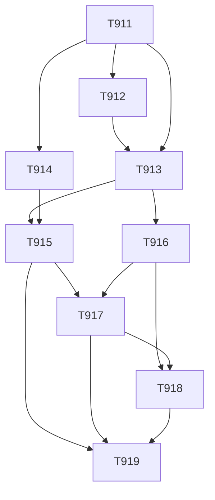

# Round 1 Review — Solution Architect

```yaml
reviewId: REV-PLAN-WSC9-R1-solution-architect
planId: PLAN-WSC-9.1
round: 1
role: solutionArchitect
snapshotIdAtReview: SNAP-WSC-009
actorInstance: solution-architect-wsc-012-r1
decision: APPROVE
summary: |
  对照 SNAP-WSC-009（status=APPROVED）与 PLAN-WSC-9.1 Round 1 候选稿：后端包路径严格遵守按类型分层
  （controller/order、service/order 等），无业务域顶层包；TASK-WSC-911 独占 contracts/** + frontend/src/api/**
  契约增量且四头同步验收完备；TASK-WSC-912 独占 Flyway 迁移（t_order_* 含审计四件套 + del_flag，无跨表外键）；
  写集互斥经字面 scope-check 验证：允许的并行对（912∥914、913∥914）路径不相交，禁止的并行对（913∥916、914∥915、
  915∥917）均有串行 dependsOn 保障；DAG 无环；911 一次性冻结全部写状态端点避免二次 bump；913/916 mock 上链隔离
  明确禁止接真链；订单列表分页（10/20/50/100）与 PO 锁定一致；预落地对账（§0.2）对 contracts/VERSION 2.3.3 与
  当前工作树的对齐策略清晰。未发现阻断级架构缺陷。记录 4 条非阻塞备註供修订参考。
```

## 评审范围与方法

| 维度 | 方法 | 结论 |
|---|---|---|
| 后端包结构 vs CLAUDE.md 按类型分层 | 逐任务 writeSet 路径审阅 | **通过** — controller/order、service/order、entity、repository、model、common/port 均在类型顶层包下；无 order/ 业务域顶层包 |
| 契约唯一写（911） | VERSION bump 逻辑 + 四头同步验收 + 冻结范围 | **通过** — 911 独占 contracts/** + api/**；一次性冻结 Wave A/B/C 全部写端点；禁止他任务 bump VERSION |
| Flyway 唯一写（912） | t_order_* 表设计 vs CLAUDE.md 数据库规则 | **通过** — 审计四件套 + del_flag；无 FOREIGN KEY；t_ 前缀单数；utf8mb4/InnoDB；幂等 CREATE TABLE IF NOT EXISTS |
| 写集互斥 + DAG | 字面路径交叉检查 + 有向图无环验证 | **通过** — 允许并行对路径不相交；禁止并行对均有串行 dependsOn；DAG 无环 |
| 微服务边界 | 订单/目录/上链端口隔离审阅 | **通过** — 913/916 controller/order 与 controller/catalog deny 互斥；ChainAttestationPort 端口模式隔离 |
| mock 上链隔离（913/916） | acceptance + riskTags 审阅 | **通过** — "禁止接真链""不以真链成败阻断状态"明确写入 |
| 规模/性能 | 分页策略 + 订单表增长预估 | **通过** — 仅分页（jumper + pageSize，档位 10/20/50/100）与 PO 锁定一致；新模块从零起步无即时规模压力 |
| 数据迁移/回滚 | Flyway 版本策略 + 幂等性 | **通过** — V10 起；追加更高版本回滚；已发布脚本不可变 |
| 预落地对账（§0.2） | 工作树现状 vs 计划声明 | **通过** — contracts/VERSION 2.3.3 对齐、订单占位 navClosed 对账、Flyway 最高 V9、useCanWrite 无订单键 |

## 架构抽查（证据）

### 后端包路径与按类型分层

- TASK-WSC-913 writeSet：`controller/order/**`、`service/order/**`、`entity/**`（仅订单相关）、`repository/**`（仅订单相关）、`model/**`（仅订单 DTO/枚举）— 全部在类型顶层包下。
- TASK-WSC-916 writeSet：同上路径 + `common/port/**`（新增 `OrderAttachmentScanPort`）— common 至少两模块共享（订单 + 未来可扩展），放置合理。
- TASK-WSC-912 writeSet：仅 `sql/migration/**` — 纯 DDL，不碰 Java。
- **无** `order/`、`chain/`、`catalog/` 等业务域顶层包 — 符合 CLAUDE.md §包结构铁律。

### 契约一次性冻结（911）

- 911 §3.1 冻结内容覆盖：`GET /orders`、`POST /orders`、`GET /orders/{orderId}`、`POST /orders/{orderId}/confirm`、`POST /orders/{orderId}/contract`、`POST /orders/{orderId}/contract/confirm`、`POST /orders/{orderId}/cancel`、`GET /orders/notices/current`、`GET /orders/{orderId}/attachment` — Wave B/C 全部写端点形状已包含。
- RBAC 矩阵字面表（§3.1）8 个订单能力键逐 cell 定义；V1.6 单元格"保持 2.3.3 原文"。
- 四头同步验收：`contracts/VERSION`、`rbac/matrix.yaml` version、`openapi.yaml` info.version、`ui/state-matrix.md` 版本头 — 同一 semver。
- 911 denyModify 明确禁止 `backend/**`、`frontend/src/features/**`、`tests/e2e/**` — 契约边界清晰。

### Flyway 迁移设计（912）

- 建议 V10（工作树最高 V9）；§3.2 建议表：`t_order_header`、`t_order_line`、`t_order_event`、`t_order_chain_log`、`t_order_attachment`、`t_order_contract_version`。
- 每张表：`create_time`/`create_by`/`update_time`/`update_by`/`del_flag` — 审计四件套 + 逻辑删除。
- 无 `FOREIGN KEY` 子句 — 关联用业务列（订单号、用户 ID 字符串、enterprise_id 字符串）。
- 产品表增量：`allow_simple_order TINYINT NOT NULL DEFAULT 1` — 既有行默认允许链内订购（实现假设 §1.2，已标注）。
- 912 denyModify 明确禁止 `backend/**/java/**` — 实体映射归 913，DDL 与代码分离。

### 写集互斥字面验证

| 并行对 | 911 后 | 路径交集 | 结论 |
|---|---|---|---|
| 912 ∥ 914 | 是 | `sql/migration/**` vs `layouts/` + `auth/composables/` + `router/` + `shell/**` | **无交集，允许** |
| 913 ∥ 914 | 是 | `controller/order/**` + `service/order/**` + `entity/**` + `repository/**` + `model/**` + `common/security/*` vs `layouts/` + `auth/composables/` + `router/` + `shell/**` | **无交集，允许** |
| 913 ∥ 916 | — | 同路径 `controller/order/**`、`service/order/**`、`entity/**`、`repository/**`、`model/**`、`RbacMatrix`、`WriteAuthorizationInterceptor`、`test/.../order/**` | **禁止并行；916 dependsOn 913，串行保障** |
| 914 ∥ 915 | — | `routes.ts`（914 先建 /orders 列表路由；915 后增 subscribe/detail 路由） | **禁止并行；915 dependsOn 914** |
| 915 ∥ 917 | — | `features/order/**`（915 列表/订购/只读详情；917 扩动作/确认页） | **禁止并行；917 dependsOn 915+916** |
| 917 ∥ 918 | — | `features/order/**`（917 动作/确认；918 版本/跳转/脱敏） | **禁止并行；918 dependsOn 916+917** |

### DAG 验证



无环。最长路径：911→912→913→916→917→918→919（7 步串行链）。关键路径瓶颈在 913→916 串行（订单 BE 写交接），可接受。

### 微服务边界

- 订单服务（`controller/order/**`、`service/order/**`）与目录服务（`controller/catalog/**`、`service/catalog/**`）通过 denyModify 互斥。
- 913/916 `readSet` 含"既有产品实体/仓储（只读）"但 `denyModify` 禁止 `controller/catalog/**`、`service/catalog/**` — 只读引用允许，写操作禁止。
- `ChainAttestationPort` 端口接口 + `SimulatedChainAttestationPort` 适配器 — 913/916 复用既有 mock 端口；916 新增 `OrderAttachmentScanPort`（默认同步白名单通过），可替换为真实引擎。
- 913 acceptance 明确："mock 失败不得阻断建单...不以真链成败为门禁" — 上链隔离完备。

### 产品快照与 `allow_simple_order` 推导

- 913 acceptance："详情产品为快照 JSON"、"快照不随产品改名漂移" — 产品快照冻结在订单创建时。
- `providerEnterpriseId` 推导规则（§1.2）：产品 `create_by` 对应用户的 `sys_user.enterprise_id` — 与 V1.6 本企业推导同源，join 逻辑可接受。
- 912 新增 `allow_simple_order` 列；913 读取该列判断是否允许链内建单 — DDL/代码分离正确。

## 异议

**无阻断级异议。** 以下均为非阻塞备註（P2/P3），可在 Round 1 修订中参考，不构成 REQUEST_CHANGES 或 BLOCK 条件。

## 非阻塞备註

| id | severity | 说明 | 建议 |
|---|---|---|---|
| NOTE-SA-R1-001 | P3 | TASK-WSC-913/916 `writeSet` 含 `model/**`（注释限定"仅订单 DTO/枚举"）。字面 glob 覆盖全部 model（含 `CatalogProduct` 等目录 DTO）。913 denyModify 已排除 `controller/catalog/**`、`service/catalog/**` 但 model 未显式 deny 目录 DTO。串行执行下实际风险低（913→916 交接），但 Orchestrator 字面 scope-check 时 `model/**` 可能误判为合法修改目录 model。 | 修订时可考虑将 913/916 `model/**` 改为显式文件列表（如 `OrderCreateRequest`、`OrderListResponse`、`OrderDetailResponse`、`OrderStatus` 等），或在 `denyModify` 列出 `model/catalog/**`。非阻塞，因串行执行已提供保护。 |
| NOTE-SA-R1-002 | P3 | PLAN 元数据 `contractsTarget: wsc-contracts@2.3.2` 与 §0.2 工作树实际 `contracts/VERSION = 2.3.3` 存在表面不一致。§0.2 已明确说明对账策略（在 2.3.3 上合并增量，默认不再升 semver），但元数据可能被自动化工具误读。 | 修订时可考虑将 `contractsTarget` 更新为 `wsc-contracts@2.3.3`（当前工作树），或在元数据旁加注"语义基线 2.3.2；工作树 2.3.3；见 §0.2"。非阻塞，因 §0.2 叙述已足够清晰。 |
| NOTE-SA-R1-003 | P3 | §3.2 建议 6 张 `t_order_*` 表但未显式列出索引策略。`t_order_header` 按订单号/状态/需求方用户/提供方企业查询频繁（列表 API），建议至少在 Flyway 脚本中包含：`idx_t_order_header_order_no`（唯一）、`idx_t_order_header_demand_user`、`idx_t_order_header_provider_enterprise`、`idx_t_order_header_status`。 | 912 实现时在迁移脚本中补充索引；或在 912 acceptance 增加"列表查询关键列有索引"检查项。非阻塞，因 912 migrationReviewer 可在实现时补齐。 |
| NOTE-SA-R1-004 | P3 | 913/916/918 三个任务共享 `test/java/com/shdata/datachain/order/**` 路径。串行执行（913→916→918）下无实际冲突，但测试文件归属可能在 code review 时引起混淆（916 是否可修改 913 写的测试？）。 | 修订时可考虑将测试路径细分（如 913 写 `order/create/`、916 写 `order/state/`、918 写 `order/version/`），或在 acceptance 中明确"后续任务可扩展但不得删除前序任务测试"。非阻塞，因串行模式已提供时序保障。 |

## 决策

`APPROVE` — 从解决方案架构维度，PLAN-WSC-9.1 Round 1 候选稿在以下关键架构决策上均通过：

1. **包结构合规**：后端 writeSet 全部落在按类型分层路径下（controller/service/repository/entity/model/config/common），无业务域顶层包。
2. **契约唯一写**：911 独占 contracts/** + frontend/src/api/**；一次性冻结 Wave A/B/C 全部写端点形状；四头同步验收完备。
3. **Flyway 唯一写**：912 独占 sql/migration/**；t_order_* 表设计符合审计四件套 + del_flag + 无跨表外键规范。
4. **写集互斥**：允许并行对（912∥914、913∥914）字面路径无交集；禁止并行对（913∥916、914∥915、915∥917、917∥918）均有串行 dependsOn 保障。
5. **DAG 无环**：9 个任务、4 个波次、依赖关系无循环。
6. **mock 上链隔离**：913/916 明确禁止接真链；"不以真链成败阻断状态"写入 acceptance。
7. **预落地对账**：§0.2 对 contracts/VERSION 2.3.3、订单占位 navClosed、Flyway 最高 V9、useCanWrite 无订单键的对账策略清晰。

4 条非阻塞备註（NOTE-SA-R1-001..004）均为 P3 级实现细节建议，可在修订或实现阶段参考，不构成阻断条件。

本文件仅代表 `solutionArchitect` / `solution-architect-wsc-012-r1`；**不**代写其他委员会角色结论，**不**伪造他角色 APPROVE；**不**修改 plan / state / events。
